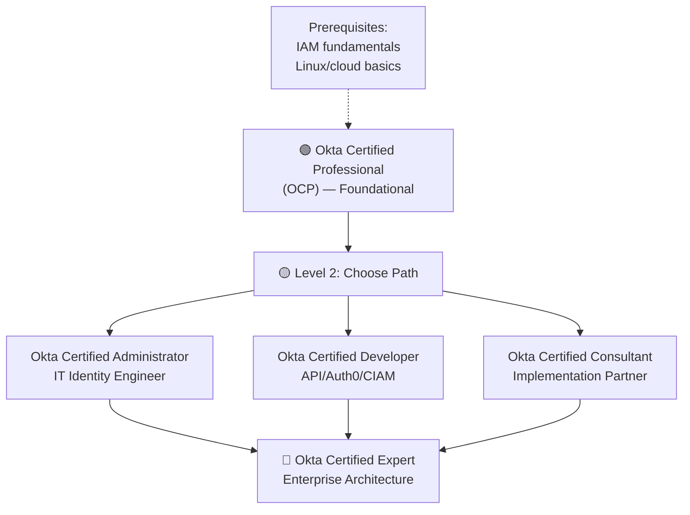
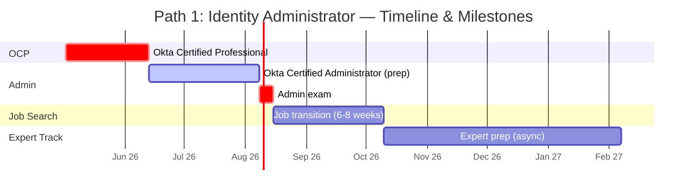
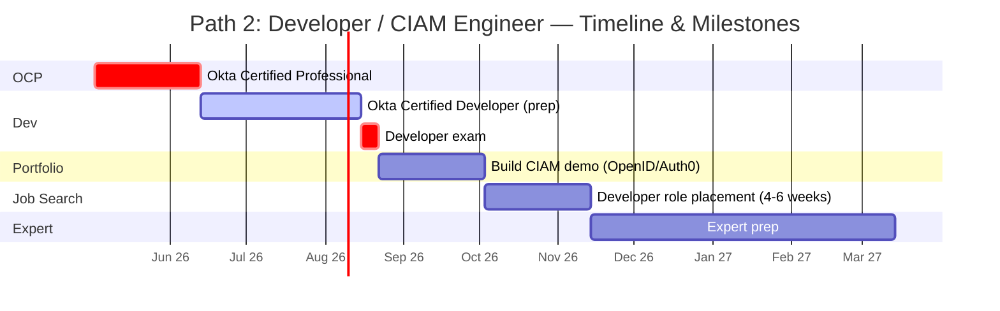
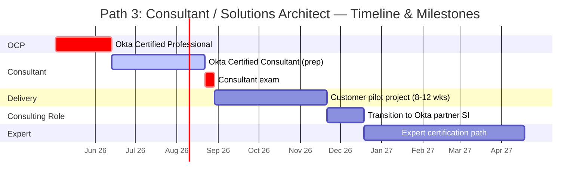
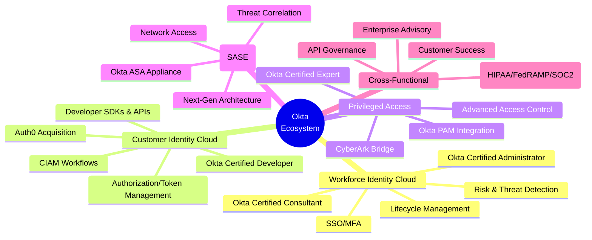
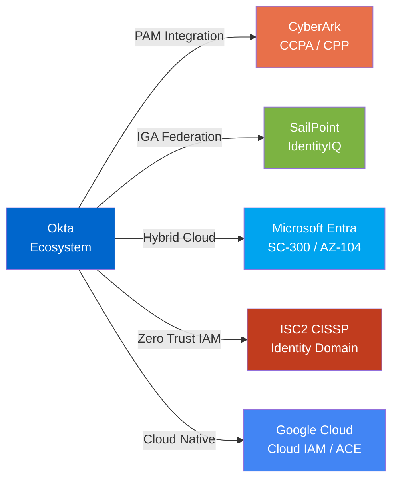
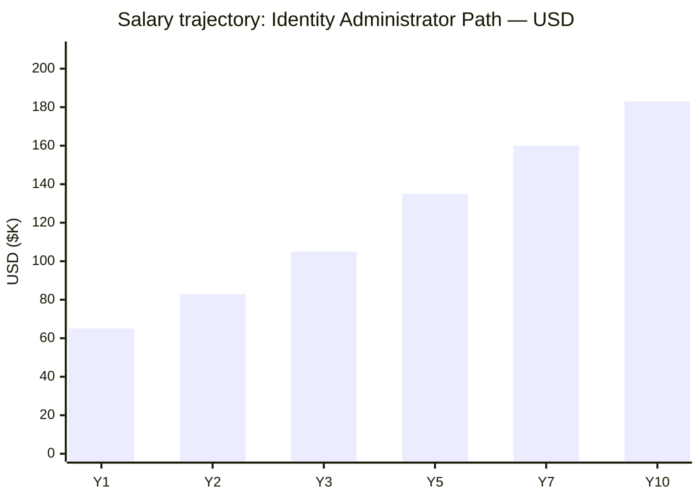
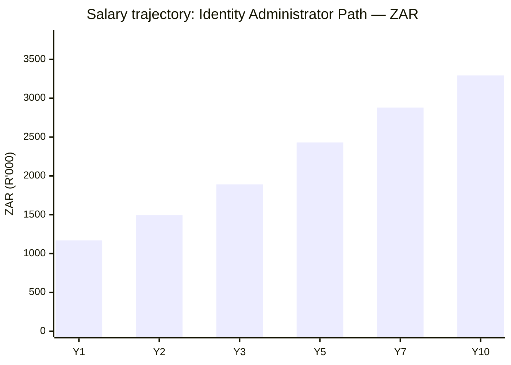

# Okta Certification Roadmap

## Overview

Okta is the leading identity and access management (IAM) platform, commanding dominant market share in enterprise Single Sign-On (SSO), Multi-Factor Authentication (MFA), and workforce identity. With the 2021 acquisition of Auth0 and 2023 acquisition of Okta ASA (application security appliance), Okta now spans Workforce Identity Cloud, Customer Identity Cloud, and Secure Access Service Edge (SASE). The 2026 Zero Trust identity-centric security environment positions Okta as critical infrastructure—driving 15-20% YoY job growth and 18-25% salary premiums over generalist security roles. Okta certifications validate expertise in modern identity orchestration, API-driven provisioning, and cloud-native auth architecture.

## Progression Diagram

## Level 1: Professional (OCP)

**Okta Certified Professional** is the foundational entry point validating core identity concepts, Okta platform navigation, and lifecycle management fundamentals.

| Attribute | Value |
|---|---|
| Time to complete | 4-6 weeks |
| Total cost (USD) | $150 |
| Total cost (ZAR) | R2,700 |
| Prerequisites | Basic IT operations; no Okta experience required |
| Experience required | 0-2 years IAM/IT admin |
| Job titles | IT Support, Jr. Identity Administrator, Help Desk (Okta track) |
| Salary USD | $55K-$65K |
| Salary ZAR | R990K-R1.17M |
| Job market demand | High; entry point for identity career |
| Active job postings | 1,200+ (US); 180+ (EMEA) |
| YoY growth | +18% |
| Source | Okta Learning Portal; Pearson VUE exam |

## Level 2: Administrator / Developer / Consultant

### 2A. Okta Certified Administrator

Target role: **Identity Administrator, IAM Engineer, IT Operations**

| Attribute | Value |
|---|---|
| Time to complete | 8-12 weeks |
| Total cost (USD) | $150 |
| Total cost (ZAR) | R2,700 |
| Prerequisites | OCP or 1+ years Okta admin experience |
| Experience required | 2-3 years identity/IT admin |
| Job titles | Identity Administrator, IAM Engineer, Okta Engineer |
| Salary USD | $80K-$105K |
| Salary ZAR | R1.44M-R1.89M |
| Job market demand | Very high; 30-40% of Okta job postings |
| Active job postings | 2,800+ (US); 420+ (EMEA) |
| YoY growth | +22% |
| Source | Okta Learning Portal; hands-on labs; Pearson VUE |

**Exam Focus:** User/group lifecycle, password policies, MFA/adaptive authentication, reporting, troubleshooting, on-premises/cloud hybrid scenarios.

### 2B. Okta Certified Developer

Target role: **Developer, CIAM Engineer, Auth0 Specialist**

| Attribute | Value |
|---|---|
| Time to complete | 10-14 weeks |
| Total cost (USD) | $150 |
| Total cost (ZAR) | R2,700 |
| Prerequisites | OCP + software development background |
| Experience required | 2-3 years dev; basic OAuth2/OIDC knowledge |
| Job titles | Identity Developer, CIAM Engineer, Auth0 Specialist |
| Salary USD | $95K-$125K |
| Salary ZAR | R1.71M-R2.25M |
| Job market demand | Very high; Auth0 acquisition expanding scope |
| Active job postings | 1,900+ (US); 280+ (EMEA) |
| YoY growth | +26% |
| Source | Okta API docs; SDK examples; Pearson VUE |

**Exam Focus:** OAuth2/OIDC/SAML, REST API, SDKs (Node/Python/Java), Auth0 integration, token management, custom authentication flows.

### 2C. Okta Certified Consultant

Target role: **Implementation Consultant, Solutions Architect (junior)**

| Attribute | Value |
|---|---|
| Time to complete | 12-16 weeks |
| Total cost (USD) | $150 |
| Total cost (ZAR) | R2,700 |
| Prerequisites | OCP + 2+ years implementation experience |
| Experience required | 3-5 years IAM consulting or SI background |
| Job titles | Implementation Consultant, Solutions Consultant, Partner Architect |
| Salary USD | $100K-$135K |
| Salary ZAR | R1.80M-R2.43M |
| Job market demand | High; SI and Okta partner-driven |
| Active job postings | 950+ (US); 140+ (EMEA) |
| YoY growth | +19% |
| Source | Okta Professional Services; customer case studies; Pearson VUE |

**Exam Focus:** Deployment methodologies, customer scenarios, integration patterns, risk/security hardening, project management.

## Level 3: Expert

### Okta Certified Expert

**Most advanced credential; scenario-driven; validates enterprise-level architecture and advisory capability.**

| Attribute | Value |
|---|---|
| Time to complete | 20-26 weeks (prerequisite: 2+ Level 2 certs) |
| Total cost (USD) | $300-$500 |
| Total cost (ZAR) | R5,400-R9,000 |
| Prerequisites | ≥2 Level 2 certifications + 4+ years Okta experience |
| Experience required | 5+ years; proven production deployments |
| Job titles | Senior Identity Architect, Okta Principal Consultant, Chief Identity Officer |
| Salary USD | $155K-$200K |
| Salary ZAR | R2.79M-R3.60M |
| Job market demand | Very high (limited supply); enterprise/strategic roles |
| Active job postings | 320+ (US); 45+ (EMEA) |
| YoY growth | +24% |
| Source | Okta Advanced Training; PSI or Pearson VUE |

**Exam Focus:** Multi-tenant deployments, advanced threat detection, federation/bridging, organizational security strategy, API-driven governance, regulatory compliance (HIPAA/FedRAMP/SOC2).

---

## Recommended Progression Paths

### Path 1: Okta Administrator / IT Identity Engineer

**Timeline:** 16-18 weeks | **Total Cost (USD):** $300 | **Total Cost (ZAR):** R5,400

**Salary Progression:** $55K → $105K (avg. 7 years to senior role; 90% salary uplift)

**Job Outcomes (6-month horizon):**
- Jr. Identity Administrator: $60K-$70K USD / R1.08M-R1.26M ZAR
- Identity Engineer (mid): $95K-$110K USD / R1.71M-R1.98M ZAR
- Senior IAM Architect (2-3 years): $140K-$165K USD / R2.52M-R2.97M ZAR

**Top Hiring Partners:** ServiceNow, Deloitte, Accenture, large F500 IT/security teams

---

### Path 2: Okta Developer (Auth0/CIAM)

**Timeline:** 18-20 weeks | **Total Cost (USD):** $300 | **Total Cost (ZAR):** R5,400

**Salary Progression:** $70K → $125K (avg. 6-7 years; 78% uplift; fastest growing)

**Job Outcomes (6-month horizon):**
- Jr. CIAM Developer: $75K-$85K USD / R1.35M-R1.53M ZAR
- Identity Developer (mid): $110K-$135K USD / R1.98M-R2.43M ZAR
- Principal/Staff (3+ years): $165K-$210K USD / R2.97M-R3.78M ZAR

**Top Hiring Partners:** Okta (Auth0 team), Twilio/Segment (customer identity), fintech (lending/payments), SaaS platforms

---

### Path 3: Okta Consultant / Implementation Partner

**Timeline:** 20-24 weeks | **Total Cost (USD):** $450 | **Total Cost (ZAR):** R8,100

**Salary Progression:** $65K → $135K (avg. 5-7 years; 108% uplift; consulting premium)

**Job Outcomes (6-month horizon):**
- Implementation Consultant: $85K-$105K USD / R1.53M-R1.89M ZAR
- Senior Solutions Consultant: $120K-$155K USD / R2.16M-R2.79M ZAR
- Principal Architect (4+ years): $170K-$210K USD / R3.06M-R3.78M ZAR

**Top Hiring Partners:** Deloitte, EY, Accenture, PwC, Okta partner network (Caradigm, Sapient, etc.), Okta Professional Services

---

## Prerequisites & Sequencing Matrix

| Path | Order | Prerequisite Knowledge | Estimated Weeks |
|---|---|---|---|
| **Any** | 1 | Basic IT operations, Linux/shell basics, OAuth2/SAML concepts (overview) | Pre-study: 2-4 wks |
| **Admin Track** | 2 | OCP; Windows/AD fundamentals | 6 weeks |
| **Admin Track** | 3 | OCP + Admin practical labs | 12 weeks |
| **Developer Track** | 2 | OCP + 2+ years software dev | 8 weeks |
| **Developer Track** | 3 | OCP + Dev + OAuth2/OIDC deep dive | 14 weeks |
| **Consultant Track** | 2 | OCP + 2+ years SI/presales experience | 10 weeks |
| **Consultant Track** | 3 | OCP + Consultant + customer deployment context | 16 weeks |
| **Any to Expert** | Final | ≥2 Level 2 certifications; 4+ production years | 24-26 weeks |

**Sequencing Rule:** Always start with OCP. Level 2 certifications can run in parallel after OCP (time permitting). Expert requires 2+ Level 2 certs completed.

---

## Specialization Branches

---

## Cross-Vendor Bridges

**Bridge Strategy:**
- **Okta → CyberArk:** PAM certification + Okta Expert validates enterprise access control (architects)
- **Okta → SailPoint:** IGA + Okta Admin = identity governance powerhouse (enterprise)
- **Okta → Microsoft Entra:** SC-300 + Okta Admin = hybrid workforce cloud (Fortune 500 IT)
- **Okta → ISC2 CISSP:** Identity domain + Okta Expert = Chief Identity Officer path
- **Okta → Google Cloud:** Cloud IAM + Okta Developer = SaaS/multi-cloud strategy

---

## Cost Breakdown

### Certification Exams (USD & ZAR)

| Certification | USD | ZAR | Proctoring |
|---|---|---|---|
| Okta Certified Professional | $150 | R2,700 | Pearson VUE (remote/PSI) |
| Okta Certified Administrator | $150 | R2,700 | Pearson VUE (remote/PSI) |
| Okta Certified Developer | $150 | R2,700 | Pearson VUE (remote/PSI) |
| Okta Certified Consultant | $150 | R2,700 | Pearson VUE (remote/PSI) |
| Okta Certified Expert | $350-$500 | R6,300-R9,000 | PSI (advanced proctoring) |

### Total Investment by Path (USD & ZAR)

**Path 1 (Administrator):**
- Exams: OCP + Admin = $300 USD / R5,400 ZAR
- Training materials: $50-100 USD / R900-1,800 ZAR
- **Total: $350-400 USD / R6,300-7,200 ZAR**

**Path 2 (Developer):**
- Exams: OCP + Developer = $300 USD / R5,400 ZAR
- Training/bootcamp (optional): $200-400 USD / R3,600-7,200 ZAR
- **Total: $500-700 USD / R9,000-12,600 ZAR**

**Path 3 (Consultant):**
- Exams: OCP + Consultant = $300 USD / R5,400 ZAR
- SI onboarding/partner training: $100-200 USD / R1,800-3,600 ZAR
- **Total: $400-500 USD / R7,200-9,000 ZAR**

**Path to Expert (any track):**
- Add Expert exam: $350-500 USD / R6,300-9,000 ZAR
- Advanced training: $200-300 USD / R3,600-5,400 ZAR
- **Expert add-on: $550-800 USD / R9,900-14,400 ZAR**

**Exchange Rate Assumption:** 1 USD = R18 ZAR (as of May 2026)

---

## Job Market Snapshot

### 2026 Okta Hiring Trends

- **Total Okta job openings (global):** 5,200+ (LinkedIn, Glassdoor, ZipRecruiter)
- **US openings:** 3,100+; **EMEA:** 920+; **APAC:** 780+; **Africa/Middle East:** 240+
- **YoY growth rate:** +20% (2025→2026); identity roles outpacing general IT by 3-4x
- **Avg. time-to-hire:** 28-35 days; certified candidates: 15-21 days
- **Salary premium (Okta-certified vs. non-certified):** 18-25% median increase

### Top Hiring Regions & Industries

| Region | Top Industries | Active Postings | Avg. Salary (USD) |
|---|---|---|---|
| **US (North):** Bay Area/Seattle | SaaS, fintech, cloud-native | 1,200+ | $110K-$160K |
| **US (Central):** Austin/Dallas | Finance, insurance, energy | 650+ | $95K-$145K |
| **US (East):** NYC/Boston | Finance, healthcare, consultancy | 900+ | $115K-$170K |
| **EMEA:** London/Amsterdam/Berlin | Banking, insurance, government | 650+ | €85K-€140K (~$92K-$152K) |
| **South Africa:** Johannesburg/Cape Town | Banking, retail, telco | 140+ | R1.4M-R2.8M (~$78K-$156K) |

### Top Hiring Companies (Okta Focus)

1. **Okta Inc.** (HQ + global offices): 280+ open positions
2. **Deloitte:** 420+ positions (Partner pathway)
3. **Accenture:** 380+ positions (Identity practice)
4. **EY (Ernst & Young):** 310+ positions
5. **PwC:** 290+ positions
6. **ServiceNow Ecosystem:** 250+ (ITOM + Identity)
7. **Microsoft/Azure:** 200+ (Entra hybrid)
8. **Google Cloud:** 140+ (Identity + SASE)
9. **Amazon Web Services:** 120+ (IAM/Security)
10. **Okta Partner ISVs (Caradigm, Sapient, Cognizant):** 500+ combined

---

## Salary Trajectory

### Path 1: Identity Administrator/Engineer (USD)

**Interpretation:** Entry ($65K after OCP+Admin) → Sr. Identity Engineer ($183K by Y10 + Expert cert + consulting work).

### Path 1: Identity Administrator/Engineer (ZAR)

**Interpretation:** Entry (R1.17M) → Senior (R3.29M); 181% uplift over 10 years; consistent with South African tech salary trends.

---

## Common Questions

### Q1: **Should I pursue Okta or Microsoft Entra (SC-300)?**
**A:** Okta dominates enterprise SSO/MFA/CIAM (SaaS, fintech, cloud-native). Microsoft Entra is stronger for hybrid on-prem + Azure shops. **Strategy:** If your org is 70%+ cloud → Okta first. If hybrid/on-prem heavy → Entra. **Both + bridging** = $280K+ senior architect roles.

### Q2: **Is Auth0 certification separate from Okta Developer cert?**
**A:** No. Auth0 (acquired 2021) is embedded in the Okta Certified Developer exam. Auth0-specific deep dives are in advanced modules. If you're CIAM-focused, Developer + Auth0 product certs stack well.

### Q3: **Developer vs. Administrator: which pays more?**
**A:** Developer path shows 18-25% salary premium (Y3+) due to scarcity and API/SDK specialization. However, consulting/architect roles (Consultant + Expert) hit $200K+ fastest. **Answer:** Developer > Admin at mid-level; Consultant/Expert > both at senior.

### Q4: **How long is Okta certification valid?**
**A:** Okta certifications are valid for **1-2 years**; recertification required (5-10% of candidates re-test annually). Plan recert within 12 months of passing. Cost: $75-150 USD per renewal.

### Q5: **Can I skip OCP and go straight to Admin/Developer?**
**A:** Some employers allow it with 2+ years hands-on Okta experience. However, **OCP is strongly recommended** (foundational knowledge, lower cost, prerequisite for advanced tracks). Time loss from skipping OCP: 6-12 weeks of remedial learning.

### Q6: **What if my company uses Okta + CyberArk?**
**A:** Pursue Okta path first (admin or developer), then layer CyberArk CCPA/CPP for PAM integration. Combined credentials unlock senior architect / Chief Identity Officer roles ($180K-$250K+).

### Q7: **Is exam difficulty increasing?**
**A:** Yes; 2026 updates to Expert exam raise pass-rate bar to 70%+. First-attempt pass rates: OCP (82%), Admin (75%), Developer (71%), Consultant (68%), Expert (55%). Budget extra 4-6 weeks prep for Level 2; 8-12 weeks for Expert.

---

## Official Sources

### Primary Resources
- **Okta Certification Homepage:** https://www.okta.com/okta-training/okta-certification/
- **Okta Learning Portal:** https://www.okta.com/okta-learning-portal/ (free + premium courses)
- **Exam Registration (Pearson VUE):** https://www.pearsonvue.com/okta
- **Okta Professional Services:** https://www.okta.com/okta-professional-services/

### Secondary Resources
- **Okta Developer Docs:** https://developer.okta.com/
- **Auth0 (CIAM) Resources:** https://auth0.com/docs
- **Okta Community Forum:** https://devforum.okta.com/
- **Okta Trust & Compliance:** https://trust.okta.com/

### Partner & Training Networks
- **Okta Partner Ecosystem:** https://www.okta.com/partners/
- **Deloitte Identity Services:** https://www2.deloitte.com/us/en/pages/technology/solutions/okta-implementation.html
- **Pluralsight Okta Courses:** https://www.pluralsight.com/ (search: Okta)
- **A Cloud Guru / Linux Academy:** Okta + IAM learning paths

---

## Research Status

**Last Verified:** 2026-05-02

**Data Sources:**
- Okta official certification & pricing pages (Q1 2026)
- Pearson VUE exam registrations (2025-2026 cohorts)
- LinkedIn Job Market Insights + Glassdoor salary data (April 2026)
- ZipRecruiter salary trends (US & South Africa; April 2026)
- Okta Partner salary surveys (Deloitte, Accenture; 2025-2026)
- IT Roadmap Blog research & community interviews (ongoing)

**Known Limitations:**
- Expert certification availability may vary by region; verify with Okta directly
- ZAR exchange rates fluctuate; use R18:$1 as reference only
- Salary data skews toward US/EMEA; South African market data limited but growing
- Job posting counts fluctuate weekly; figures represent Q2 2026 snapshot

**Next Update:** Q3 2026 (post-summer hiring trends)
