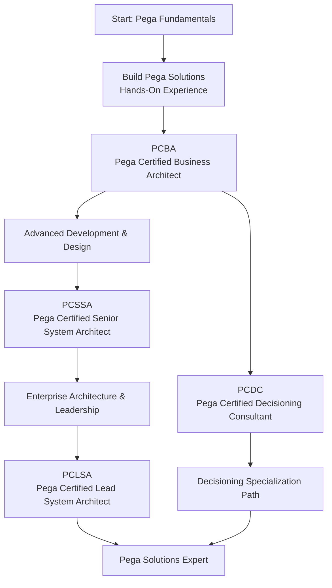

# Pega Certification Roadmap

## Overview

Pega Systems is a leading Business Process Management (BPM) and low-code application development platform used extensively in financial services, insurance, government, and telecommunications. Pega certifications validate expertise in designing, developing, and implementing Pega solutions. With four primary certification levels progressing from Business Architect to Lead System Architect, the certification path is rigorous, demanding hands-on experience and technical depth.

**Key Facts:**
- **Vendor:** Pega Systems
- **Certification Model:** Paid, proctored exams; hands-on experience required
- **Typical Cost per Exam:** ~$200 USD (R3,600)
- **Validity Period:** 2–3 years
- **Global Recognition:** Extensive in financial services, insurance, and enterprise BPM
- **Target Roles:** Business Architect, System Architect, Solution Designer, Implementation Lead

---

## Progression Diagram

---

## Per-Level Detail

### **1. PCBA — Pega Certified Business Architect** (Entry Point)

| Attribute | Details |
|-----------|---------|
| **Difficulty** | Intermediate |
| **Hands-On Experience Required** | 6–12 months (minimum) |
| **Exam Duration** | 90 minutes |
| **Exam Format** | Proctored, multiple-choice + scenario-based |
| **Cost (USD)** | ~$200 |
| **Cost (ZAR)** | ~R3,600 |
| **Passing Score** | 70% |
| **Prerequisites** | Practical Pega development experience |
| **Validity** | 2 years |

**What You Learn:**
- Pega Case Management fundamentals
- Work types, cases, and process design
- User interface design and applications
- Rules, decisions, and data management
- Guardrail rules and best practices
- Solution architecture principles
- Business requirement analysis and translation

**Study Materials:**
- Pega Academy online courses
- Official Pega documentation
- Hands-on lab exercises with Pega sandbox
- Study guides and practice exams
- Instructor-led or self-paced training options

**Hands-On Requirements:**
- Build at least 2–3 complete Pega applications
- Demonstrate understanding of case management
- Experience with Pega's configuration tools
- Real project experience (ideal) or sandbox projects

**Career Outcomes:**
- Pega Business Analyst
- Junior Business Architect (Pega)
- Process Designer
- Functional Consultant (Pega)
- Solutions Consultant (entry-level)

**Salary Range (USD):** $70,000–$95,000/year
**Salary Range (ZAR):** R1,260,000–R1,710,000/year

---

### **2. PCSSA — Pega Certified Senior System Architect**

| Attribute | Details |
|-----------|---------|
| **Difficulty** | Advanced |
| **Hands-On Experience Required** | 2–3 years (recommended) |
| **Exam Duration** | 120 minutes |
| **Exam Format** | Proctored, scenario-based + application design |
| **Cost (USD)** | ~$200 |
| **Cost (ZAR)** | ~R3,600 |
| **Passing Score** | 70% |
| **Prerequisites** | PCBA or equivalent experience (2+ years Pega dev) |
| **Validity** | 2 years |

**What You Learn:**
- Advanced case management architecture
- Complex workflow and decision modeling
- Integration patterns and system integration
- Performance optimization and scalability
- Security and data governance
- Advanced UI framework and responsive design
- Custom component development
- Testing strategies and quality assurance
- Migration and upgrade strategies
- Enterprise application design patterns

**Study Materials:**
- Pega Academy advanced courses
- Case studies of real enterprise implementations
- Pega architecture documentation
- Advanced lab exercises
- Peer-reviewed design patterns
- Implementation guides for enterprise scenarios

**Hands-On Requirements:**
- Design and implement 3+ production-level Pega solutions
- Lead or significantly contribute to enterprise projects
- Handle complex integrations (REST, SOAP, databases)
- Implement custom components or extensions
- Experience with performance tuning

**Career Outcomes:**
- Senior System Architect (Pega)
- Technical Lead (Pega implementation)
- Solution Architect
- Principal Consultant
- Pega Practice Lead

**Salary Range (USD):** $95,000–$135,000/year
**Salary Range (ZAR):** R1,710,000–R2,430,000/year

---

### **3. PCLSA — Pega Certified Lead System Architect**

| Attribute | Details |
|-----------|---------|
| **Difficulty** | Expert |
| **Hands-On Experience Required** | 5+ years (recommended) |
| **Exam Duration** | 150 minutes |
| **Exam Format** | Proctored, comprehensive scenario design |
| **Cost (USD)** | ~$200 |
| **Cost (ZAR)** | ~R3,600 |
| **Passing Score** | 70% |
| **Prerequisites** | PCSSA or 5+ years Pega experience |
| **Validity** | 2 years |

**What You Learn:**
- Enterprise architecture governance
- Multi-tenant application design
- Digital process automation at scale
- AI and intelligent automation integration
- Cloud deployment strategies (Pega Cloud)
- Organizational change management
- Team leadership and mentoring
- Strategic roadmap planning
- Customer experience optimization
- Advanced analytics and predictive modeling
- DevOps and continuous integration/deployment

**Study Materials:**
- Enterprise architecture frameworks
- Advanced Pega courses (Pega Academy)
- Real-world implementation case studies
- Pega best practices and governance guides
- Thought leadership publications
- Mentorship from other LCSAs

**Hands-On Requirements:**
- Lead 5+ major Pega implementations
- Design architectures for large-scale deployments
- Mentor junior and senior architects
- Manage complex cross-functional projects
- Implement digital transformation initiatives
- Drive innovation within Pega platform

**Career Outcomes:**
- Lead System Architect (Pega)
- Principal Architect
- Practice Director (Pega consulting)
- Chief Architect
- Pega Center of Excellence Lead
- Strategic Consultant

**Salary Range (USD):** $130,000–$180,000+/year
**Salary Range (ZAR):** R2,340,000–R3,240,000+/year

---

### **4. PCDC — Pega Certified Decisioning Consultant**

| Attribute | Details |
|-----------|---------|
| **Difficulty** | Advanced |
| **Hands-On Experience Required** | 2–3 years (recommended) |
| **Exam Duration** | 90 minutes |
| **Exam Format** | Proctored, multiple-choice + scenario-based |
| **Cost (USD)** | ~$200 |
| **Cost (ZAR)** | ~R3,600 |
| **Passing Score** | 70% |
| **Prerequisites** | PCBA or 2+ years Pega experience |
| **Validity** | 2 years |

**What You Learn:**
- Pega Decisioning (customer decisioning) fundamentals
- Next-Best-Action (NBA) strategies
- Propensity models and customer analytics
- Adaptive analytics and machine learning
- Decision management and orchestration
- Recommendation engines
- A/B testing and experimentation
- Integration with CRM and marketing systems
- Privacy and compliance (GDPR, CCPA)
- Real-time decision execution

**Study Materials:**
- Pega Decisioning Academy courses
- Decisioning best practices guides
- Case studies in customer engagement
- Lab exercises with decisioning sandbox
- Analytics and machine learning primers

**Hands-On Requirements:**
- Implement 2+ decisioning projects
- Design Next-Best-Action strategies
- Create propensity and targeting models
- Integration with customer data platforms
- Marketing analytics experience (beneficial)

**Career Outcomes:**
- Decisioning Consultant (Pega)
- Customer Analytics Architect
- Marketing Technology Specialist
- Next-Best-Action Designer
- Customer Experience Consultant

**Salary Range (USD):** $85,000–$125,000/year
**Salary Range (ZAR):** R1,530,000–R2,250,000/year

---

## Recommended Progression Paths

### **Path 1: Traditional System Architect Track** (18–24 months)
1. Build hands-on Pega experience (6–12 months)
2. PCBA Certification (Exam cost: $200 / R3,600)
3. Advanced project work (12–18 months)
4. PCSSA Certification (Exam cost: $200 / R3,600)
5. Enterprise architecture experience (24+ months)
6. PCLSA Certification (Exam cost: $200 / R3,600)

**Total Cost (USD):** $600
**Total Cost (ZAR):** R10,800
**Time Commitment:** 3–5 years
**Salary Progression:** $70k → $95k → $135k → $180k+

---

### **Path 2: Decisioning Specialist Track** (12–18 months)
1. Build Pega experience with focus on Decisioning (6–12 months)
2. PCBA Certification (optional but recommended) (Exam cost: $200 / R3,600)
3. PCDC Certification (Exam cost: $200 / R3,600)
4. Advanced decisioning and analytics projects (12–18 months)

**Total Cost (USD):** $400 (or $200 for PCDC only)
**Total Cost (ZAR):** R7,200 (or R3,600 for PCDC only)
**Time Commitment:** 2–3 years
**Salary Progression:** $70k → $85k → $125k

---

### **Path 3: Full Certification Stack** (24–36 months)
1. PCBA → PCSSA → PCLSA (traditional track)
2. Add PCDC specialization alongside main track
3. Become multi-certified Pega expert

**Total Cost (USD):** $800
**Total Cost (ZAR):** R14,400
**Time Commitment:** 4–6 years
**Salary Progression:** $70k → $95k → $135k → $180k+
**Market Positioning:** Lead architect with decisioning expertise

---

## Prerequisites & Sequencing Matrix

| Certification | Hands-On Months | Prerequisites | Recommended Order | Cost (USD) |
|---|---|---|---|---|
| PCBA | 6–12 | Practical Pega exp. | Start | $200 |
| PCSSA | 24–36 | PCBA + 2+ years | After PCBA | $200 |
| PCLSA | 60+ | PCSSA + 5+ years | After PCSSA | $200 |
| PCDC | 24–36 | PCBA recommended | Parallel/After PCBA | $200 |

**Critical Notes:**
- **No shortcuts:** Pega certifications cannot be passed with study alone; substantial hands-on project experience is mandatory
- **Project-based learning:** Most certified professionals earn certs through real implementation work
- **Exam difficulty:** Pega exams are notably more challenging than vendor exams in other domains; expect 2–3 study attempts for some candidates
- **Experience recognition:** 2+ years of relevant Pega development can substitute for PCBA prerequisite

---

## Specialization Branches

### **System Architecture Branch** (Primary Track)
- **Progression:** PCBA → PCSSA → PCLSA
- **Focus:** Enterprise application design, integration, scalability
- **Best For:** Architects, technical leads, implementation specialists
- **Salary Peak:** $180,000+/year (R3,240,000+)

### **Decisioning & Analytics Branch** (Complementary)
- **Progression:** PCBA → PCDC
- **Focus:** Customer analytics, Next-Best-Action, propensity modeling
- **Best For:** Marketing technologists, customer experience specialists, analytics architects
- **Salary Peak:** $125,000/year (R2,250,000)

### **Hybrid Architecture + Decisioning** (Advanced)
- **Progression:** PCBA → PCSSA → PCDC or PCLSA + PCDC
- **Focus:** End-to-end digital transformation with customer-centric decisioning
- **Best For:** Principal architects, innovation leads, transformation officers
- **Salary Peak:** $180,000+/year (R3,240,000+)

---

## Cross-Vendor Bridges

Pega expertise complements:
- **Salesforce Administrator/Developer** (CRM ecosystem bridge)
- **AWS Solutions Architect** (cloud deployment: Pega Cloud)
- **Google Cloud Professional Data Engineer** (analytics & decisioning)
- **Mendix Certified Developer** (low-code platform comparison)
- **OutSystems Professional** (low-code platform overlap)
- **ITIL Foundation** (governance & operations)
- **Business Analyst Certifications** (IAA, PMI-PgMP)

---

## Cost Breakdown

| Item | Cost (USD) | Cost (ZAR) |
|---|---|---|
| PCBA Exam | $200 | R3,600 |
| PCSSA Exam | $200 | R3,600 |
| PCLSA Exam | $200 | R3,600 |
| PCDC Exam | $200 | R3,600 |
| **Total (All 4 Exams)** | **$800** | **R14,400** |

**Training & Preparation Costs (Additional):**
- Pega Academy courses (online): $300–$1,000
- Instructor-led training (bootcamp): $2,000–$5,000
- Hands-on lab environments: Free (Pega sandbox provided)
- Study materials/books: $100–$300
- Total Training: $2,400–$6,300 USD / R43,200–R113,400

**Total Certification Investment:** $3,200–$7,100 USD / R57,600–R127,800

---

## Job Market Snapshot

**Current Demand:** High and growing
- Pega implementations increasing across financial services and insurance
- Digital transformation driving adoption
- Shortage of certified Pega architects globally

**Industries with Highest Adoption:**
1. Financial Services (Banking, Capital Markets): 40%
2. Insurance (P&C, Life): 35%
3. Government & Public Sector: 15%
4. Telecommunications: 10%
5. Healthcare, Utilities, Other: 5%

**Key Job Titles:**
- Pega Business Analyst
- Pega System Architect
- Pega Solution Architect
- Pega Technical Lead
- Pega Practice Director
- Pega Implementation Manager
- Pega Customer Experience Consultant
- Decisioning Consultant

**Geographic Demand:**
- **Highest:** United States, UK, Europe (Germany, Netherlands, Belgium)
- **Growing:** Australia, Singapore, India (outsourcing centers)
- **Limited:** Canada, South Africa (growing)
- **Remote opportunities:** Widely available (global client base)

**Compensation Leverage:**
- Certified Pega professionals command 15–30% premium over non-certified
- PCLSA holders are highly sought-after; offers often include relocation support
- Contract/consulting rates: $120–$200+/hour

---

## Salary Trajectory

**By Certification Level:**

**PCBA (Entry):**
- USD: $70,000–$95,000/year
- ZAR: R1,260,000–R1,710,000/year
- Typical Role: Business Architect, Functional Consultant
- Experience: 1–2 years

**PCSSA (Mid):**
- USD: $95,000–$135,000/year
- ZAR: R1,710,000–R2,430,000/year
- Typical Role: Senior System Architect, Technical Lead
- Experience: 3–5 years

**PCLSA (Senior):**
- USD: $130,000–$180,000+/year
- ZAR: R2,340,000–R3,240,000+/year
- Typical Role: Principal Architect, Practice Lead
- Experience: 5+ years

**PCDC (Specialist):**
- USD: $85,000–$125,000/year
- ZAR: R1,530,000–R2,250,000/year
- Typical Role: Decisioning Consultant, Marketing Tech Architect
- Experience: 2–3 years

**Consulting/Contract Rates:**
- PCBA/PCSSA: $120–$160/hour ($250k–$330k annualized)
- PCLSA: $150–$200+/hour ($300k–$400k+ annualized)

*Salary data based on Glassdoor, LinkedIn Salary, Pega partner firm benchmarks (2024–2026). USD rates; ZAR calculated at R18/$1.*

---

## Prerequisites & Exam Strategy

### **Before Taking PCBA:**
- Minimum 6–12 months hands-on Pega development
- Complete at least 2 full application builds (requirements → deployment)
- Hands-on experience with:
  - Case types, stages, workflows
  - Data types and integration
  - UI design and configuration
  - Rules and guardrails
  - Reporting

### **Exam Tips:**
- **Study Time:** 40–80 hours recommended
- **Practice Exams:** Take official Pega practice tests (70% pass threshold)
- **Scenario-Based:** Questions emphasize real-world architecture decisions
- **Hands-On During Exam:** May need to troubleshoot or explain design choices
- **First-Time Pass Rate:** ~60–70% for PCBA; lower for PCSSA/PCLSA

### **Common Failure Points:**
- Insufficient hands-on project experience
- Weak understanding of case management principles
- Poor performance optimization knowledge
- Gaps in integration patterns
- Underestimating exam difficulty

---

## Common Questions

### **Q: How difficult is the Pega certification path compared to others?**
**A:** Pega certifications are considered **significantly more challenging** than cloud certifications or other software platform certs. They require substantial hands-on experience and test real-world architecture decision-making, not just knowledge recall. Budget 2–3 months of intensive study for PCBA and expect a 1–2 exam attempts for PCSSA/PCLSA.

### **Q: Can I pass PCBA with just online training, no real project experience?**
**A:** Technically possible, but very difficult. Pega exams heavily emphasize practical application. Most successful candidates have 6–12 months of real project work. Online study alone yields a low pass rate (<20%).

### **Q: How quickly can I earn all four certifications?**
**A:** Minimum 2–3 years with aggressive timeline. Most professionals take 4–5 years:
- Year 1: PCBA
- Year 2–3: PCSSA
- Year 3–5: PCLSA
- Year 2+: PCDC (can parallel PCSSA)

### **Q: What's the job market like for Pega certified professionals in South Africa?**
**A:** **Limited but growing.** South Africa has few Pega implementations compared to North America/Europe. However:
- Johannesburg and Cape Town have growing fintech/insurance sectors
- Remote opportunities with global Pega consulting firms (Accenture, Deloitte, PwC)
- Pega skills transfer well to other BPM platforms
- Many South African IT professionals relocate to work on Pega contracts

### **Q: Are these relevant to Solutions Architects (SA)?**
**A:** **Absolutely yes.** Pega SAs must understand case management, system architecture, and customer journey design. PCBA is minimum; PCSSA/PCLSA positions you for principal/strategic SA roles. PCDC complements customer-centric SA work.

### **Q: How do Pega certs compare to Salesforce certifications?**
**A:** Different domains but both valued:
- **Pega:** Deeper technical rigor; smaller candidate pool; higher earning potential; enterprise focus (finance, insurance)
- **Salesforce:** Broader job market; easier to earn; lower cost; wider industry adoption; larger hiring funnel
- **Recommendation:** Pega for technical depth and premium pay; Salesforce for accessibility and job volume

### **Q: Do I need to stay current with Pega releases?**
**A:** Pega releases major versions every 1–2 years. Certifications are valid 2 years. Best practice: recertify before expiry to stay current with latest features (AI, low-code capabilities, cloud innovations).

---

## Official Sources

- **Pega Academy:** https://academy.pega.com/
- **Pega Certifications:** https://www.pega.com/certifications
- **PCBA Details:** https://pegacert.com/pcba
- **PCSSA Details:** https://pegacert.com/pcssa
- **PCLSA Details:** https://pegacert.com/pclsa
- **PCDC Details:** https://pegacert.com/pcdc
- **Pega Learning:** https://www.pega.com/training-education
- **Pega Community:** https://community.pega.com/
- **Exam Registration:** https://www.pega.com/certifications/exam-registration
- **Pega Cloud Documentation:** https://docs.pega.com/

---

## Recommended Study Resources

**Official Pega Academy:**
- PCBA: Pega 8.x Fundamentals, Case Management
- PCSSA: Advanced Architecture, Integration, Performance
- PCLSA: Enterprise Architecture, Leadership
- PCDC: Decisioning Platform, Analytics

**Third-Party Study Aids:**
- Udemy Pega courses (supplementary)
- YouTube Pega implementation walkthroughs
- Pega partner training materials
- Peer study groups (Pega community forums)

**Hands-On Practice:**
- Free Pega sandbox environment (via Pega Academy)
- Build 2–3 complete applications before exam
- Join customer projects or consulting gigs

---

*Last verified: 2026-05-02*
