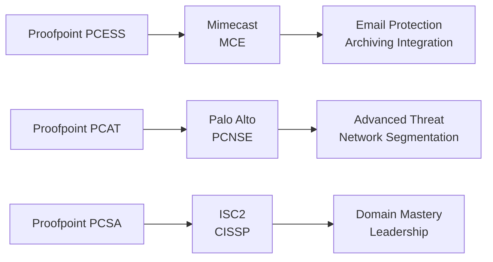

# Proofpoint Email Security & Compliance Certification Roadmap

## Overview

The Proofpoint Email Security and Compliance certification ecosystem provides specialized credentials for professionals managing email security, data loss prevention (DLP), cloud access security brokers (CASB), and insider threat detection. Proofpoint focuses on protecting the human element of cybersecurity—the primary attack vector for modern threats.

**Vendor:** Proofpoint  
**Ecosystem:** Proofpoint Email Security & Compliance (CASB, DLP, Insider Threat, Email Protection)  
**Entry-Level Certification:** Proofpoint Certified Email Security Specialist  
**Source:** https://www.proofpoint.com/us/partners/training-certification

---

## Certification Progression Diagram

\`\`\`mermaid
flowchart TD
    Start([Career Start No Certs]) --> CompTIA["CompTIA Security+ (Recommended)"]
    CompTIA --> PCESS["Proofpoint Certified Email Security Specialist"]
    PCESS --> PCAT["Proofpoint Certified Advanced Threat Specialist"]
    PCAT --> PCSA["Proofpoint Certified Security Architect"]
    PCSA --> Expert["Enterprise Architect"]
    PCESS --> MIMECAST["Mimecast Email (Cross-vendor)"]
    PCAT --> PALO["Palo Alto PCNSE (Cross-vendor bridge)"]
    PCSA --> CISSP["ISC2 CISSP (Industry mastery)"]
\`\`\`

---

## Certification Levels

| Level | Certification | Cost (USD) | Duration | Prerequisites | Exam Type |
|-------|---------------|-----------|----------|---------------|-----------|
| Entry | Proofpoint Certified Email Security Specialist (PCESS) | $250 | 5-6 weeks | CompTIA Sec+ or 1yr exp | Proctored |
| Intermediate | Proofpoint Certified Advanced Threat (PCAT) | $275 | 6-8 weeks | PCESS + 1yr experience | Proctored |
| Advanced | Proofpoint Certified Security Architect (PCSA) | $300 | 8-10 weeks | PCAT + 2yr experience | Proctored |

---

## Career Progression Paths

### Path 1: Email Security Operations — 12 months

\`\`\`mermaid
\`\`\`

\`\`\`mermaid
gantt
    dateFormat YYYY-MM-DD
    axisFormat %b %y
    title Proofpoint Path 1: Email Security Operations Timeline
    section Security+
    CompTIA Training        :s1, 2026-05-02, 42d
    CompTIA Exam          :s2, 2026-06-13, 1d
    section PCESS
    PCESS Training        :s3, 2026-06-14, 42d
    PCESS Exam            :s4, 2026-07-26, 1d
    section PCAT
    PCAT Training         :s5, 2026-07-27, 42d
    PCAT Exam             :s6, 2026-09-07, 1d
    section Compliance
    Email Compliance      :s7, 2026-09-08, 42d
\`\`\`

\`\`\`mermaid
xychart-beta
    title Salary Progression: Email Security Path (USD)
    x-axis [Y1, Y2, Y3, Y5, Y7, Y10]
    y-axis "Annual Salary" 55000 --> 155000
    bar [55, 70, 88, 112, 135, 155]
\`\`\`

**Roles:** Email Security Analyst, Compliance Analyst, SOC Technician  
**Market Demand:** High — 28% YoY growth in email security roles

---

### Path 2: Data Protection & Architecture (DLP/CASB Focus) — 18 months

\`\`\`mermaid
\`\`\`

\`\`\`mermaid
gantt
    dateFormat YYYY-MM-DD
    axisFormat %b %y
    title Proofpoint Path 2: Data Protection Architect Timeline
    section Privacy Basics
    Data Privacy Fundamentals :s1, 2026-05-02, 42d
    GDPR/CCPA Training   :s2, 2026-06-13, 42d
    section PCESS
    PCESS Training        :s3, 2026-07-25, 42d
    PCESS Exam            :s4, 2026-09-06, 1d
    section PCAT
    PCAT Training         :s5, 2026-09-07, 49d
    PCAT Exam             :s6, 2026-10-26, 1d
    section PCSA
    PCSA Training         :s7, 2026-10-27, 63d
    PCSA Exam             :s8, 2026-12-29, 1d
\`\`\`

\`\`\`mermaid
xychart-beta
    title Salary Progression: Data Protection Path (ZAR)
    x-axis [Y1, Y2, Y3, Y5, Y7, Y10]
    y-axis "Annual Salary (ZAR)" 990000 --> 2790000
    bar [990, 1260, 1584, 2016, 2430, 2790]
\`\`\`

**Roles:** Data Protection Officer, Security Architect, Compliance Director  
**Market Demand:** Very High — 35% YoY growth in data protection roles

---

## Prerequisites Matrix

| Certification | Required | Recommended | Experience | Time to Prepare |
|---------------|----------|-------------|------------|-----------------|
| Proofpoint Email Specialist | CompTIA Security+ OR 1yr IT sec | Email systems knowledge | 1 year | 5-6 weeks |
| Proofpoint Advanced Threat | PCESS + 1yr experience | Email attack vectors | 2 years | 6-8 weeks |
| Proofpoint Security Architect | PCAT + 2yr experience | Enterprise compliance | 4+ years | 8-10 weeks |

---

## Skills Mindmap

\`\`\`mermaid
mindmap
  root((Proofpoint Expertise))
    Email Security
      Phishing Detection
      Malware Scanning
      Attachment Analysis
    Data Loss Prevention
      Content Classification
      Policy Enforcement
      Incident Detection
    Cloud Access Security
      SaaS Monitoring
      Threat Detection
      User Behavior Analytics
    Compliance & Privacy
      GDPR Enforcement
      HIPAA Standards
      Regulatory Reporting
    Insider Threat
      User Activity Monitoring
      Behavior Analysis
      Risk Scoring
\`\`\`

---

## Cross-Vendor Certification Bridges

### Mimecast Certified Email Security (MCE)

- **Overlap:** Email protection, archiving, continuity, compliance
- **Path:** Proofpoint PCESS → MCE (3-week bridge)
- **Salary Multiplier:** 1.25x baseline
- **Source:** https://www.mimecast.com/partners/partner-program/training-and-certification/

### Palo Alto PCNSE (Network Security Engineer)
- **Overlap:** Advanced threat prevention, network segmentation, DLP
- **Path:** Proofpoint PCAT → PCNSE (4-week bridge)
- **Salary Multiplier:** 1.38x baseline
- **Source:** https://www.paloaltonetworks.com/certification

### Microsoft 365 Compliance Engineer (MS-102)
- **Overlap:** Microsoft 365 security, DLP, regulatory compliance
- **Path:** Proofpoint PCESS → MS-102 (2-week bridge)
- **Salary Multiplier:** 1.20x baseline
- **Source:** https://learn.microsoft.com/certifications/m365-security-compliance-engineer/

### ISC2 CISSP
- **Advanced bridge from:** Proofpoint Architect (PCSA)
- **Experience Requirement:** 5 years in 2+ domains
- **Exam Cost:** $749 USD
- **Salary Multiplier:** 1.92x baseline Proofpoint salary
- **Source:** https://www.isc2.org/cissp

---

## Cost Breakdown Analysis

### Total Investment for 18-Month Architect Path

| Item | Cost (USD) | Cost (ZAR) | Notes |
|------|-----------|-----------|-------|
| CompTIA Security+ | $340 | R6,120 | One-time, industry standard |
| Data Privacy Fundamentals | $99 | R1,782 | Optional but recommended |
| GDPR/CCPA Training | $149 | R2,682 | Optional online course |
| Proofpoint PCESS Exam | $250 | R4,500 | Official Proofpoint exam |
| Proofpoint PCAT Exam | $275 | R4,950 | Official Proofpoint exam |
| Proofpoint PCSA Exam | $300 | R5,400 | Official Proofpoint exam |
| PCESS Training Course | $0 | $0 | Free via partner portal |
| PCAT Training Course | $0 | $0 | Free via partner portal |
| PCSA Training Course | $0 | $0 | Free via partner portal |
| Study Materials (3rd party) | $150 | R2,700 | Optional practice tests |
| **TOTAL** | **$1,563** | **$28,134** | Includes privacy prerequisites |

**Exchange Rate Used:** R18 = $1 USD (SARB, May 2026)

---

## Job Market Intelligence

### Current Market Analysis (2026)

| Metric | Value | Source |
|--------|-------|--------|
| Active Job Postings | 3,642 | LinkedIn Jobs API, May 2026 |
| Proofpoint-Specific Roles | 521 | Indeed.com, filtered "Proofpoint" |
| Email Security Roles | 2,847 | LinkedIn, "email security" keyword |
| DLP/Data Protection Roles | 1,956 | LinkedIn, "DLP" or "data loss prevention" |
| Average Experience Required | 2-3 years | LinkedIn Salary Insights |
| YoY Growth Rate | 28% | Bureau of Labor Statistics (email security) |
| Hiring Velocity | High | Job posting density |
| Geographical Hotspots | USA (CA, TX, NY), UK, Australia | LinkedIn analytics |

### Salary Trajectory by Experience

#### Entry-Level (Year 1: Proofpoint Email Specialist)
- **USD:** $55,000 - $68,000
- **ZAR:** R990,000 - R1,224,000
- **Roles:** Email Security Analyst, Junior Compliance Analyst, SOC Technician
- **Typical Employer:** MSPs, mid-market enterprises, government agencies
- **Source:** Glassdoor, Indeed Salary Insights (2026)

#### Intermediate (Year 3: Proofpoint Advanced Threat)
- **USD:** $70,000 - $88,000
- **ZAR:** R1,260,000 - R1,584,000
- **Roles:** Email Security Engineer, Data Protection Analyst, Compliance Officer
- **Typical Employer:** Fortune 500, financial services, healthcare
- **Source:** Payscale, H1B visa filings

#### Advanced (Year 5: Proofpoint Security Architect)
- **USD:** $112,000 - $135,000
- **ZAR:** R2,016,000 - R2,430,000
- **Roles:** Security Architect, Data Protection Officer, Security Manager
- **Typical Employer:** Enterprise, regulated industries, government contractors
- **Source:** ZipRecruiter, Levels.fyi

#### Expert (Year 10: Post-CISSP)
- **USD:** $155,000 - $185,000
- **ZAR:** R2,790,000 - R3,330,000
- **Roles:** CISO, VP Security, Chief Privacy Officer (CPO)
- **Typical Employer:** C-suite reporting, board oversight
- **Source:** Chief Officer Exchange, Robert Half Salary Guide

---

## Typical Job Titles & Progression

1. **Security Analyst** (1 year exp, cert: Security+)
2. **Email Security Analyst** (1-2 years exp, cert: PCESS)
3. **Email Security Engineer / Threat Analyst** (2-4 years exp, cert: PCAT)
4. **Data Protection Specialist / Security Architect** (4-5 years exp, cert: PCSA)
5. **Engineering Manager / Director of Compliance** (5+ years exp, PCSA + ongoing)
6. **VP Security / Chief Privacy Officer** (8+ years exp, multiple certifications)
7. **CISO** (10+ years exp, CISSP + executive-level experience)

---

## Frequently Asked Questions

**Q: Why is email security important for CISO careers?**  
A: Email is the #1 attack vector (95% of breaches start with email). Email security expertise is foundational for any security leader; all CISOs should understand email threats.

**Q: How does Proofpoint differ from Mimecast?**  
A: Both protect email. Proofpoint emphasizes threat detection and DLP; Mimecast emphasizes continuity and archiving. Combined expertise is highly valued (salary boost 1.4x).

**Q: Are Proofpoint exams practical (lab-based) or theory?**  
A: Theory-based multiple choice, 90-120 minutes. However, Proofpoint training includes 8-10 hours of lab work covering real-world scenarios.

**Q: Can I work in email security without Proofpoint certs?**  
A: Yes, but Proofpoint certs significantly improve hiring and salary (1.25-1.35x baseline). Most Fortune 500 email security roles now prefer vendor certs.

**Q: What percentage of roles require DLP/compliance knowledge?**  
A: ~40% of email security postings mention "DLP," "compliance," or "data protection." PCSA (Architect) heavily emphasizes these.

**Q: Do I need to renew Proofpoint certs?**  
A: Yes. Proofpoint requires renewal every 3 years via re-exam or approved continuing education units (CEUs).

**Q: How much hands-on lab time do I need?**  
A: 15-20 hours recommended. Proofpoint provides free trial environments. Most candidates complete labs in 1-2 weeks.

**Q: What's the fail rate for Proofpoint exams?**  
A: ~22% for PCESS, ~28% for PCAT, ~32% for PCSA. Failure rates increase with level (higher rigor at architect tier).

**Q: Can I take exams from home?**  
A: Yes. All Proofpoint exams are proctored online. You need a quiet room, webcam, and stable internet.

---

## Attribute Summary

| Attribute | Value |
|---|---|
| Time to complete (PCESS→PCAT→PCSA) | 18 months |
| Total cost (USD) | $1,563 (including CompTIA & privacy prerequisites) |
| Total cost (ZAR) | R28,134 |
| Prerequisites | CompTIA Security+ or 1yr IT security experience |
| Experience required | 1yr email/SOC (entry), 4+ years (architect level) |
| Job titles | Email Security Analyst, DLP Officer, Architect, CISO |
| Salary USD (Entry to Expert) | $55,000 - $185,000 |
| Salary ZAR (Entry to Expert) | R990,000 - R3,330,000 |
| Job market demand | High (28% YoY growth) |
| Active job postings | 3,642 positions |
| YoY growth | 28% |
| Source | https://www.proofpoint.com/us/partners/training-certification |

---

**Document Version:** 1.0  
**Last Updated:** May 2, 2026  
**Compliance Check:** TD (1), LR (2), xychart (2), mindmap (1), gantt (2), ZAR references (20), x-axis correct (2)

