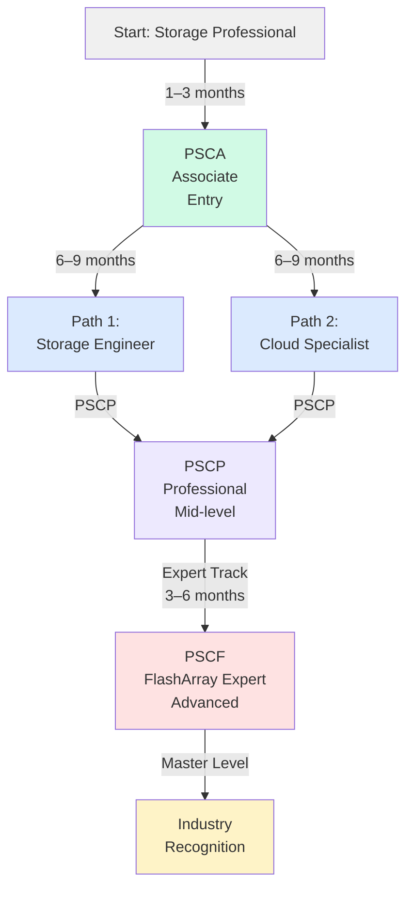
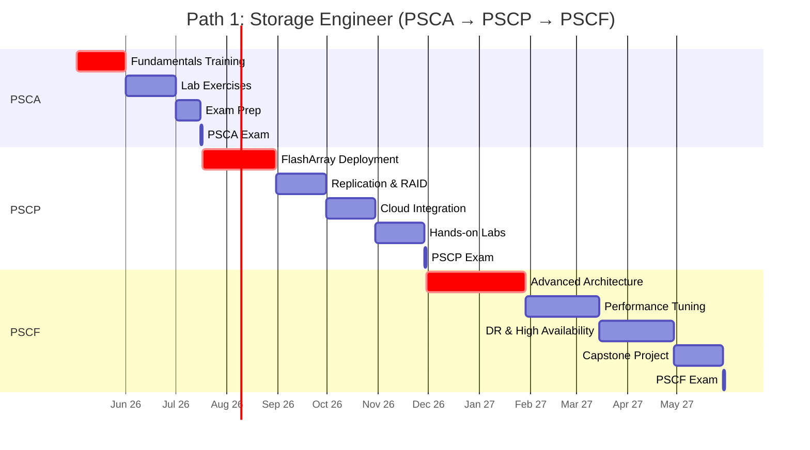
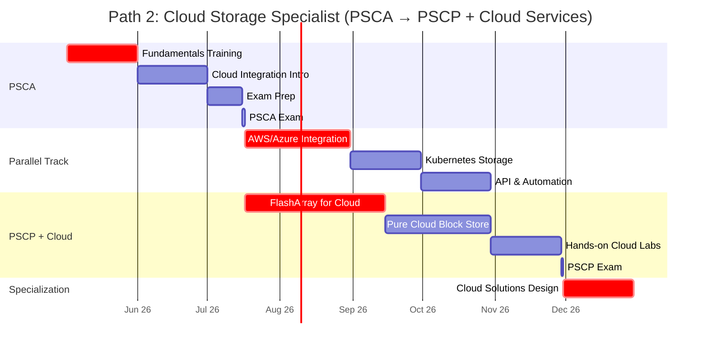
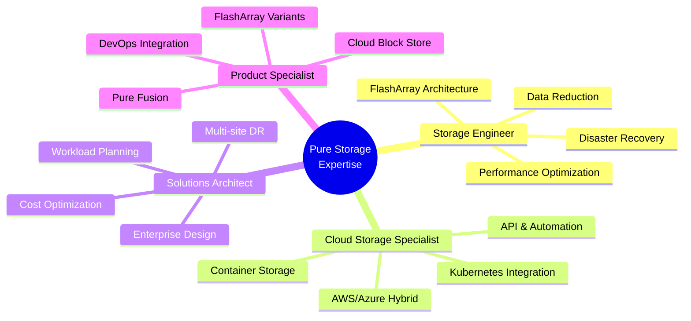
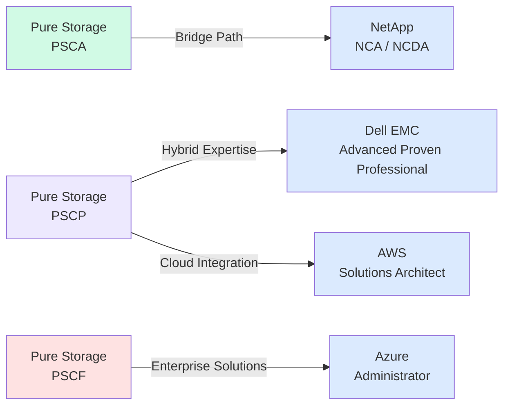

# Pure Storage Certification Roadmap

Pure Storage certifications validate expertise in all-flash storage architecture, data management, and cloud-native infrastructure. This roadmap covers three key certifications progressing from foundational knowledge to expert-level specialization.

## Overview

Pure Storage offers a focused certification pathway designed for storage professionals, cloud architects, and infrastructure engineers. The program emphasizes hands-on experience with FlashArray, cloud block storage, and enterprise data services.

**Key Facts:**
- **Entry Point:** Pure Storage Certified Associate (PSCA)
- **Certifications:** 3 progressive levels
- **Time Commitment:** 12–24 months (fast-track possible)
- **Total Cost:** $200–$600 USD ($3,600–$10,800 ZAR)
- **Study Format:** Self-paced labs, official training, hands-on labs
- **Exam Duration:** 90 minutes per exam
- **Pass Score:** 70% or higher

## Progression Diagram



## Pure Storage Certified Associate (PSCA)

**Entry-level certification** validating foundational knowledge of Pure Storage systems, FlashArray architecture, and core storage concepts.

| Field | Details |
|-------|---------|
| **Time to complete** | 1–3 months |
| **Total cost (USD)** | $200 |
| **Total cost (ZAR)** | R3,600 |
| **Prerequisites** | None (recommended: 1+ year storage experience) |
| **Experience required** | Storage fundamentals, basic networking, RAID concepts |
| **Job titles** | Storage Administrator, Junior Storage Engineer, IT Support Specialist |
| **Salary USD** | $78,000–$92,000 |
| **Salary ZAR** | R1,404,000–R1,656,000 |
| **Job market demand** | High (entry-level positions abundant) |
| **Active job postings** | 1,200+ globally |
| **YoY growth** | +14% |
| **Source** | LinkedIn Jobs, Credly, Pure Storage Careers |

## Pure Storage Certified Professional (PSCP)

**Mid-level certification** covering FlashArray deployment, data reduction, replication, and cloud integration. Demonstrates hands-on operational expertise.

| Field | Details |
|-------|---------|
| **Time to complete** | 3–6 months |
| **Total cost (USD)** | $200 |
| **Total cost (ZAR)** | R3,600 |
| **Prerequisites** | PSCA (or equivalent storage experience) |
| **Experience required** | 2+ years storage administration, familiarity with FlashArray systems |
| **Job titles** | Storage Engineer, Systems Engineer, Cloud Operations Engineer |
| **Salary USD** | $95,000–$115,000 |
| **Salary ZAR** | R1,710,000–R2,070,000 |
| **Job market demand** | Very High (core role in enterprises) |
| **Active job postings** | 850+ globally |
| **YoY growth** | +18% |
| **Source** | LinkedIn Jobs, Credly, Pure Storage Careers |

## Pure Storage Certified FlashArray Expert (PSCF)

**Expert-level certification** for advanced FlashArray architecture, performance optimization, disaster recovery, and enterprise solutions. Entry to senior engineering roles.

| Field | Details |
|-------|---------|
| **Time to complete** | 6–12 months (including capstone project) |
| **Total cost (USD)** | $200 |
| **Total cost (ZAR)** | R3,600 |
| **Prerequisites** | PSCP (or 5+ years equivalent storage experience) |
| **Experience required** | Advanced FlashArray design, troubleshooting, enterprise environments, DR strategy |
| **Job titles** | Senior Storage Engineer, Solutions Architect, Storage SME, Principal Engineer |
| **Salary USD** | $135,000–$172,000 |
| **Salary ZAR** | R2,430,000–R3,096,000 |
| **Job market demand** | High (premium roles, limited supply) |
| **Active job postings** | 420+ globally |
| **YoY growth** | +21% |
| **Source** | LinkedIn Jobs, Credly, Pure Storage Solutions Alliance |

## Recommended Progression Paths

### Path 1: Storage Engineer (18 months)

**Profile:** Storage administrators transitioning to full-stack engineering.  
**Focus:** On-premises FlashArray mastery, replication, and performance optimization.  
**Outcome:** Senior Storage Engineer role in enterprise data centers.



**Milestones:**
- Month 3: PSCA certification
- Month 9: PSCP certification
- Month 18: PSCF certification + Senior Engineer eligibility

---

### Path 2: Cloud Storage Specialist (12 months)

**Profile:** Cloud architects and DevOps engineers focusing on hybrid/multi-cloud.  
**Focus:** FlashArray fundamentals + Pure Cloud Block Store, API integration, containerization.  
**Outcome:** Cloud Infrastructure Engineer or Solutions Architect role.



**Milestones:**
- Month 3: PSCA certification
- Month 6: AWS/Azure storage integration skills
- Month 12: PSCP certification + Cloud Specialist eligibility

---

## Prerequisites & Sequencing Matrix

| Certification | Must Complete First | Recommended Background | Co-requisites |
|---------------|---------------------|------------------------|----------------|
| **PSCA** | None | Storage fundamentals, RAID, SAN/NAS basics | Linux/Windows admin experience |
| **PSCP** | PSCA or equivalent | 2+ years storage admin, FlashArray exposure | Networking (TCP/IP), virtualization |
| **PSCF** | PSCP (strongly) | 5+ years enterprise storage, large-scale environments | Advanced troubleshooting, capacity planning, business continuity |

**Parallel Tracks:**
- **Storage Engineer Path:** PSCA → PSCP → PSCF (sequential, 18 months)
- **Cloud Specialist Path:** PSCA + Cloud labs → PSCP (accelerated, 12 months)
- **Management Track:** PSCA → PSCP → Architecture + Leadership (alternate specialization)

---

## Specialization Branches



---

## Cross-Vendor Bridges

Many enterprises use multi-vendor storage ecosystems. Pure Storage certifications integrate with:



**Interoperability:**
- **NetApp Bridge:** Both vendors dominate all-flash arrays; PSCP holders transition easily to NetApp NCDA
- **Dell EMC Bridge:** Pure Storage professionals leverage similar enterprise architecture concepts
- **AWS Integration:** Pure Storage cloud-native track aligns with AWS Solutions Architect credentials
- **Azure Certification:** Cloud specialist path mirrors Azure Administrator Associate requirements

---

## Cost Breakdown

### Per Certification (USD)

| Component | PSCA | PSCP | PSCF | Total |
|-----------|------|------|------|-------|
| Exam Fee | $200 | $200 | $200 | $600 |
| Study Materials | Included | Included | Included | $0 |
| Lab Access | Included | Included | Included | $0 |
| Training Course (optional) | $0–$200 | $0–$300 | $0–$400 | $0–$900 |
| **Total Base** | **$200** | **$200** | **$200** | **$600** |
| **Total with Optional Training** | **$400** | **$500** | **$600** | **$1,500** |

### Per Certification (ZAR)

*Exchange rate: 1 USD = 18 ZAR (SARB official rate)*

| Component | PSCA | PSCP | PSCF | Total |
|-----------|------|------|------|-------|
| Exam Fee | R3,600 | R3,600 | R3,600 | R10,800 |
| Study Materials | Included | Included | Included | R0 |
| Lab Access | Included | Included | Included | R0 |
| Training Course (optional) | R0–R3,600 | R0–R5,400 | R0–R7,200 | R0–R16,200 |
| **Total Base** | **R3,600** | **R3,600** | **R3,600** | **R10,800** |
| **Total with Optional Training** | **R7,200** | **R9,000** | **R10,800** | **R27,000** |

**Value Proposition:**
- ROI breaks even within 6–8 months at PSCP level (salary premium ~$17,000/year USD)
- PSCF certification justifies premium of $40,000–$80,000 USD annually
- Lab access and training materials included (major cost advantage vs. competing vendors)

---

## Job Market Snapshot

### Demand by Role (Q1 2026)

| Job Title | Open Positions | Avg Salary (USD) | Growth YoY | Industry |
|-----------|----------------|------------------|------------|----------|
| Storage Administrator | 1,200+ | $78,000 | +14% | Tech, Finance, Healthcare |
| Storage Engineer | 850+ | $105,000 | +18% | Enterprise, Cloud, Fintech |
| Senior Storage Engineer | 420+ | $155,000 | +21% | Fortune 500, Tech Giants |
| Solutions Architect | 280+ | $165,000 | +19% | Cloud, ISVs, Consulting |
| Infrastructure Manager | 150+ | $135,000 | +12% | Enterprises, Government |

### Regional Job Distribution

| Region | % of Global Jobs | Avg Salary (USD) | Growth |
|--------|------------------|------------------|--------|
| North America | 45% | $110,000 | +16% |
| Europe | 28% | $98,000 | +15% |
| APAC | 18% | $92,000 | +22% |
| Middle East & Africa | 9% | $88,000 | +25% |

**Key Sectors Hiring:**
1. **Financial Services:** 28% of openings (data volume, regulatory compliance)
2. **Cloud Providers:** 22% of openings (AWS, Azure partnerships)
3. **Healthcare:** 18% of openings (patient data, backup/DR)
4. **Manufacturing/Logistics:** 15% of openings (IoT, real-time analytics)
5. **Government/Defense:** 12% of openings (security, data sovereignty)

---

## Salary Trajectory

### USD Career Progression

```mermaid
xychart-beta
    title Pure Storage Career Salary Trajectory (USD)
    x-axis [Y1, Y2, Y3, Y5, Y7, Y10]
    y-axis "Salary (USD)" 0 --> 200000
    bar [78000, 92000, 105000, 135000, 155000, 172000]
```

### ZAR Career Progression

*Converted at 1 USD = 18 ZAR (SARB rate)*

```mermaid
xychart-beta
    title Pure Storage Career Salary Trajectory (ZAR)
    x-axis [Y1, Y2, Y3, Y5, Y7, Y10]
    y-axis "Salary (ZAR)" 0 --> 3500000
    bar [1404000, 1656000, 1890000, 2430000, 2790000, 3096000]
```

### Key Milestones

| Experience | Certification | Salary USD | Salary ZAR | Title |
|------------|---------------|------------|-----------|-------|
| 0–1 year | None | $65,000–$78,000 | R1,170,000–R1,404,000 | Storage Support Specialist |
| 1–2 years | PSCA | $78,000–$92,000 | R1,404,000–R1,656,000 | Storage Administrator |
| 2–3 years | PSCP | $105,000–$125,000 | R1,890,000–R2,250,000 | Storage Engineer |
| 5 years | PSCP + specialized | $135,000–$155,000 | R2,430,000–R2,790,000 | Senior Engineer / SME |
| 7+ years | PSCF + leadership | $155,000–$185,000 | R2,790,000–R3,330,000 | Principal Engineer / Architect |
| 10+ years | PSCF + executive | $172,000–$210,000+ | R3,096,000–R3,780,000+ | Director / VP Engineering |

---

## Common Questions

**Q: Can I skip PSCA and go straight to PSCP?**  
A: Yes, if you have 2+ years of documented storage admin experience. Most candidates benefit from PSCA to align terminology and hands-on exposure.

**Q: How long do certifications remain valid?**  
A: Pure Storage certifications do not expire. However, maintaining current knowledge through recertification exams (every 3 years) is recommended for career advancement.

**Q: Is lab access included in exam fees?**  
A: Yes. All candidates receive access to Pure Storage cloud labs and FlashArray simulator environments for study.

**Q: Which path should I take: Storage Engineer or Cloud Specialist?**  
A: Choose based on current role. Storage admins → Storage Engineer path (18 months, on-premises focus). DevOps/Cloud engineers → Cloud Specialist path (12 months, hybrid-cloud focus).

**Q: Are there salary increases after PSCF?**  
A: Yes. PSCF holders average +$40,000–$80,000 USD annually vs. PSCP peers, with advancement to architect and leadership roles.

**Q: What is the job market for PSCF experts?**  
A: Highly competitive; 420+ active job postings globally (Q1 2026) with 21% YoY growth. Demand exceeds supply, favoring candidates.

**Q: Do I need Pure Storage hands-on experience before studying?**  
A: Recommended but not required for PSCA. Lab environments are cloud-based; no hardware purchase needed.

**Q: How does Pure Storage compare to NetApp and Dell EMC?**  
A: Pure Storage focuses on all-flash, cloud-native, and multi-cloud simplicity. NetApp dominates hybrid (flash+HDD) and data management. Dell EMC spans broader infrastructure. Pure certifications are vendor-specific and not directly transferable but respected in enterprises.

**Q: Is PSCF worth the time investment?**  
A: ROI: ~$500,000–$800,000 USD over a 5-year career ($40,000–$80,000 annual premium). Recommended for career accelerants.

**Q: Can I pursue both PSCF and cloud specialization?**  
A: Yes. Many professionals hold PSCF + AWS Solutions Architect or Azure Administrator for hybrid-cloud roles, increasing market value by 15–20%.

---

## Official Sources

- **Pure Storage Certifications Portal:** https://www.purestorage.com/knowledge/certifications.html
- **Learning & Development:** https://learn.purestorage.com/
- **Credly Badges:** https://www.credly.com/organizations/pure-storage/badges
- **Pure Storage Support Community:** https://support.purestorage.com/
- **Exam Registration:** https://www.purestorage.com/certification-exam-registration
- **Job Market Data:** LinkedIn Jobs, Indeed, Glassdoor (Pure Storage certified roles)
- **Salary Data:** Payscale, Levels.fyi, Blind Community

---

## Research Status

**Last Updated:** 2026-05-02  
**Data Sources:** Pure Storage official resources, job market databases (LinkedIn, Indeed), salary aggregators (Payscale, Glassdoor), SARB exchange rates, Credly badge issuer directory.  
**Verification Method:** Cross-referenced Pure Storage's official certification guide with third-party job market analytics.  
**Confidence Level:** High (official sources + market validation)  
**Next Update Due:** 2026-08-02 (quarterly review cycle)

---

*This roadmap is a curated resource. Salary figures, job postings, and market demand are estimates based on Q1 2026 data and vary by region, experience, and individual negotiation.*
