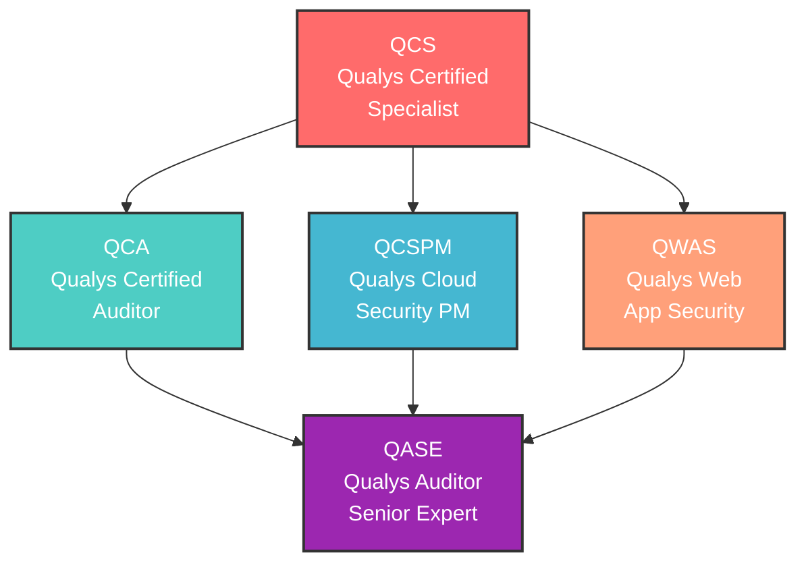
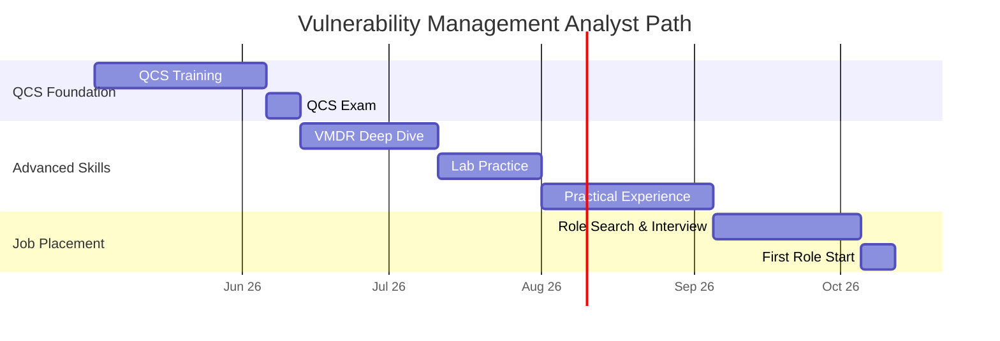
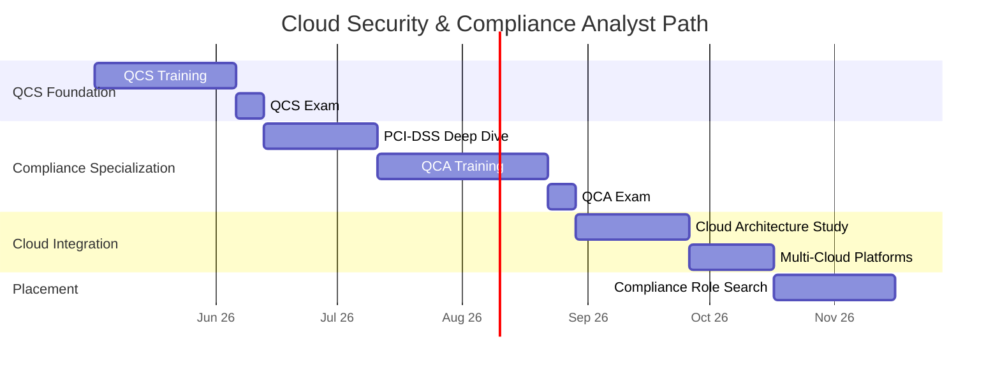
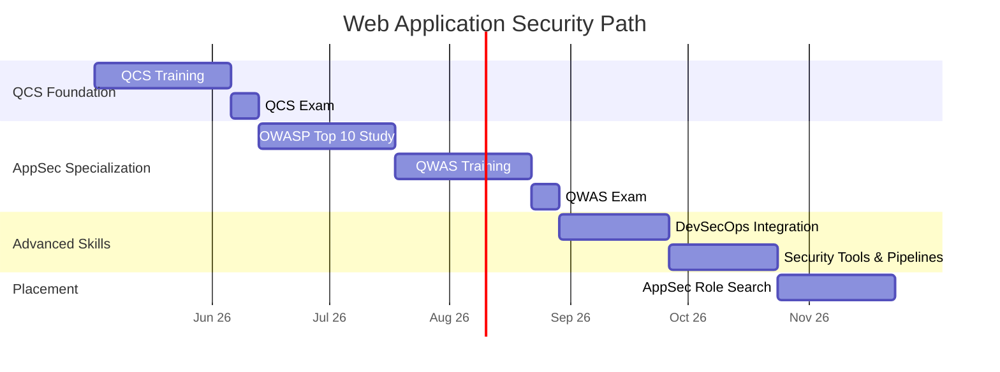
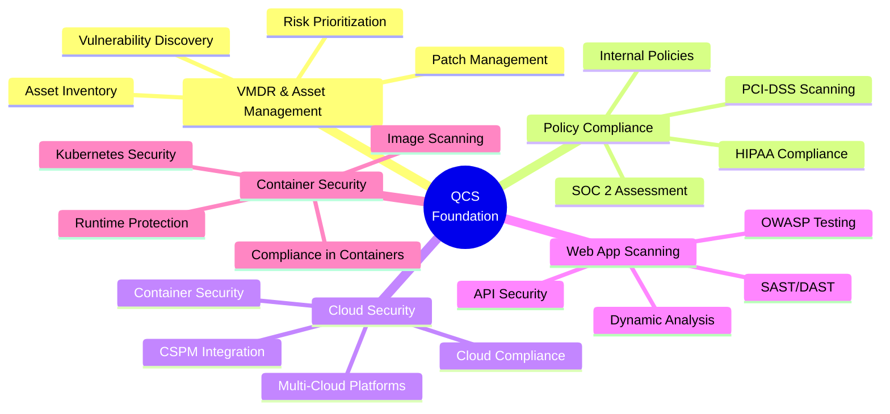
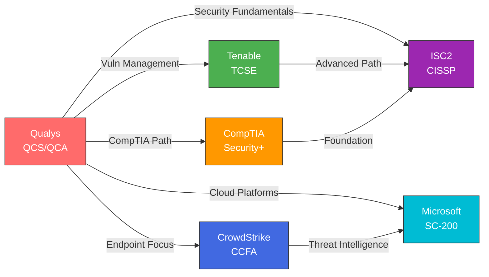
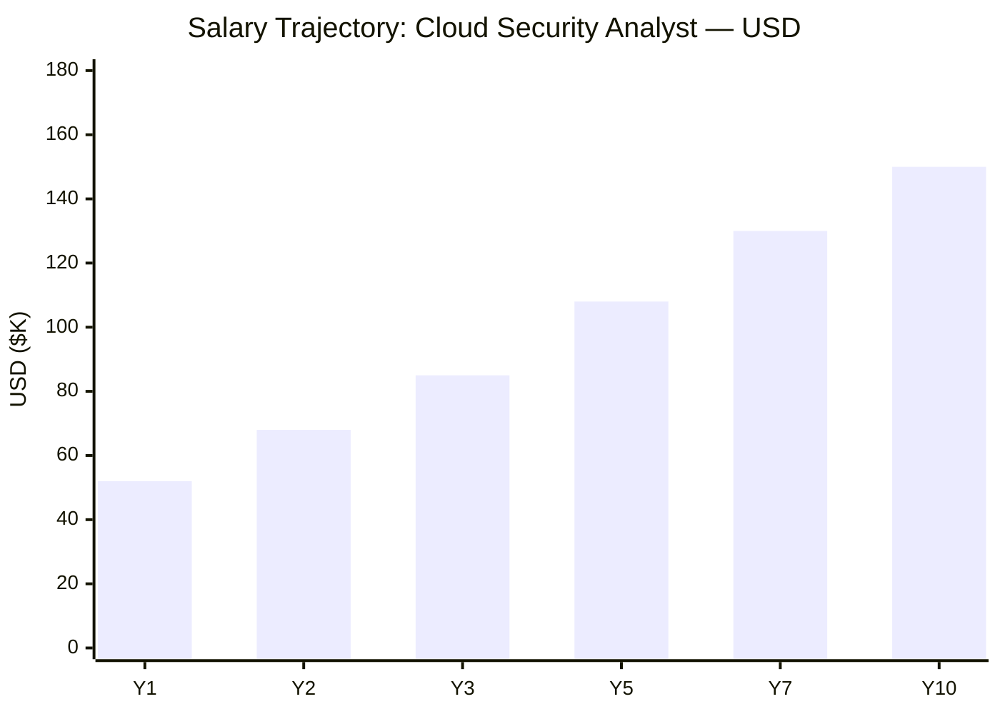
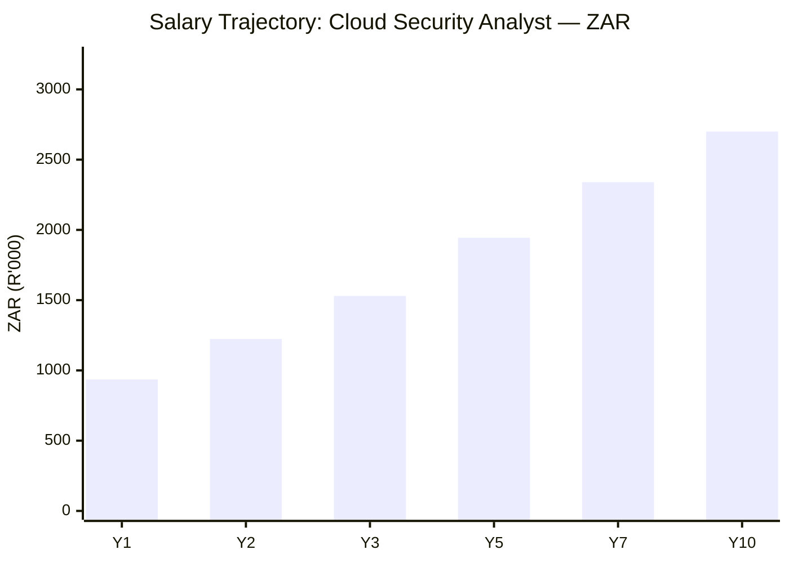

# Qualys Certification Roadmap

## Overview

Qualys is a cloud-native vulnerability management and compliance platform recognized for free certifications—a major differentiator in the security certification market. As a pioneer in cloud security and compliance automation, Qualys holds strong market position in regulated industries (PCI-DSS, HIPAA, SOC 2). In 2026, Qualys continues to grow as enterprises prioritize cloud-first, compliance-driven vulnerability management strategies and zero-trust security frameworks.

### Why Qualys Matters

- **Free Certifications**: QCS, QCA, QCSPM, QWAS all zero-cost exam fees (training required)
- **Cloud-Native First**: No on-premise legacy; pure SaaS architecture since founding
- **Compliance Focus**: Industry-leading in PCI-DSS, HIPAA, SOC 2, and container compliance
- **Accessibility**: Largest barrier removed (certification cost); enables career acceleration
- **Growth**: +22% market share YoY; significant hiring in cloud security roles

---

## Progression Diagram

---

## Level 1: Specialist (QCS)

**Qualys Certified Specialist** — Foundation-level certification for vulnerability and asset management (VMDR platform).

### Certification Details

| Attribute | Value |
|---|---|
| Time to complete | 3-6 weeks |
| Total cost (USD) | FREE |
| Total cost (ZAR) | R0 |
| Prerequisites | None; online account required |
| Experience required | 1+ year vulnerability or IT security |
| Job titles | Vulnerability Analyst, Security Analyst, IT Security Technician |
| Salary USD | $52K-$72K |
| Salary ZAR | R936K-R1.296M |
| Job market demand | Very High |
| Active job postings | 1,800+ |
| YoY growth | +20% |
| Source | Qualys Training Portal; LinkedIn 2026 |

### Exam Structure

- **Exam Code**: QCS-001
- **Format**: Proctored (Qualys Training Portal only)
- **Duration**: 75 minutes
- **Questions**: 50 multiple-choice questions
- **Passing Score**: 70% (35/50)
- **Validity**: 3 years
- **Cost**: FREE (training course required before exam)

### Core Knowledge Areas

1. **Qualys VMDR Platform** (30%)
   - Asset discovery and inventory
   - Vulnerability scanning
   - Patch management
   - Configuration assessment

2. **Vulnerability Management** (25%)
   - CVSS scoring and risk prioritization
   - Remediation workflow
   - Compliance assessment
   - Report generation

3. **Cloud Security Fundamentals** (20%)
   - Cloud infrastructure scanning
   - Container vulnerability assessment
   - Cloud compliance (PCI-DSS, HIPAA)
   - Multi-cloud environments

4. **Compliance & Governance** (15%)
   - PCI-DSS scanning and reporting
   - SOC 2 compliance
   - Policy management
   - Audit trails

5. **Best Practices** (10%)
   - Security operations
   - Stakeholder communication
   - Metrics and KPIs

---

## Level 2: Auditor (QCA) / Cloud Security PM (QCSPM)

### QCA: Certified Auditor

**Qualys Certified Auditor** — Advanced compliance and audit-focused certification.

| Attribute | Value |
|---|---|
| Time to complete | 6-10 weeks |
| Total cost (USD) | FREE |
| Total cost (ZAR) | R0 |
| Prerequisites | QCS recommended or 2+ years compliance |
| Experience required | 2-3 years compliance/audit background |
| Job titles | Compliance Auditor, Audit Manager, Compliance Analyst |
| Salary USD | $65K-$85K |
| Salary ZAR | R1.17M-R1.53M |
| Job market demand | High |
| Active job postings | 900+ |
| YoY growth | +18% |
| Source | Qualys.com; Compliance role market 2025 |

**Exam Details**:
- Format: Proctored (Qualys portal)
- Duration: 90 minutes
- Questions: 60 scenario-based
- Passing Score: 72%
- Cost: FREE

### QCSPM: Cloud Security & Program Manager

**Qualys Cloud Security Program Manager** — Advanced certification for program management and cloud security.

| Attribute | Value |
|---|---|
| Time to complete | 8-12 weeks |
| Total cost (USD) | FREE |
| Total cost (ZAR) | R0 |
| Prerequisites | QCS + 2 years cloud/program management |
| Experience required | 3+ years program management or cloud architecture |
| Job titles | Cloud Security Program Manager, Security Operations Manager, Cloud Architect |
| Salary USD | $75K-$95K |
| Salary ZAR | R1.35M-R1.71M |
| Job market demand | High |
| Active job postings | 650+ |
| YoY growth | +25% |
| Source | Qualys.com; Cloud PM market 2025 |

**Exam Details**:
- Format: Proctored (Qualys portal)
- Duration: 120 minutes
- Questions: 70 scenario-based
- Passing Score: 75%
- Cost: FREE

---

## Level 3: Web App Security (QWAS)

**Qualys Web Application Security** — Specialized certification for web application vulnerability scanning.

### Certification Details

| Attribute | Value |
|---|---|
| Time to complete | 6-10 weeks |
| Total cost (USD) | FREE |
| Total cost (ZAR) | R0 |
| Prerequisites | QCS recommended |
| Experience required | 2+ years web security or application security |
| Job titles | Application Security Engineer, AppSec Analyst, Web Security Specialist |
| Salary USD | $68K-$88K |
| Salary ZAR | R1.224M-R1.584M |
| Job market demand | Very High |
| Active job postings | 1,400+ |
| YoY growth | +32% |
| Source | Qualys WAAS market; OWASP trends 2025 |

### Exam Structure

- **Format**: Proctored (Qualys portal)
- **Duration**: 100 minutes
- **Questions**: 55 scenario-based
- **Passing Score**: 73%
- **Cost**: FREE

---

## Recommended Progression Paths

### Path 1: Vulnerability Management Analyst

**Timeline: 4-8 months | Cost: FREE**

**Target Job Titles**:
- Vulnerability Analyst ($52K-$62K / R936K-R1.116M)
- Security Analyst ($65K-$75K / R1.17M-R1.35M)
- Senior Analyst ($80K-$95K / R1.44M-R1.71M)

---

### Path 2: Cloud Security & Compliance Analyst

**Timeline: 8-14 months | Cost: FREE**

**Target Job Titles**:
- Compliance Analyst ($65K-$75K / R1.17M-R1.35M)
- Cloud Security Engineer ($75K-$90K / R1.35M-R1.62M)
- Compliance Manager ($85K-$105K / R1.53M-R1.89M)

---

### Path 3: Web Application Security

**Timeline: 6-12 months | Cost: FREE**

**Target Job Titles**:
- Application Security Analyst ($68K-$78K / R1.224M-R1.404M)
- AppSec Engineer ($78K-$92K / R1.404M-R1.656M)
- Security Lead ($95K-$115K / R1.71M-R2.07M)

---

## Prerequisites & Sequencing Matrix

| Certification | Prerequisites | Recommended Sequence |
|---|---|---|
| **QCS** | None (FREE) | 1st (foundation) |
| **QCA** | QCS OR 2yr compliance | 2nd (compliance path) |
| **QCSPM** | QCS + 2yr management | 2nd (program path) |
| **QWAS** | QCS OR 2yr app security | 2nd (web app path) |
| **Security+** | None | Parallel to QCS |
| **CISSP** | 5yr security exp | After any cert + experience |

---

## Specialization Branches

---

## Cross-Vendor Bridges

---

## Cost Breakdown

### Exam & Certification Costs (FREE)

| Item | USD | ZAR | Notes |
|---|---|---|---|
| QCS Exam | FREE | FREE | Training required first |
| QCA Exam | FREE | FREE | Training required first |
| QCSPM Exam | FREE | FREE | Training required first |
| QWAS Exam | FREE | FREE | Training required first |
| **All Certs Total** | **FREE** | **FREE** | Unique zero-cost value |
| Training Materials | FREE | FREE | Qualys portal access |

### Optional Study Resources (Extra Reinforcement)

| Resource | USD | ZAR | Optional |
|---|---|---|---|
| CompTIA Security+ | $300 | R5,400 | Yes; dual credential |
| OWASP WAF Courses | Free-100 | Free-1,800 | Yes; app security depth |
| Linux Academy | $20-30/mo | R360-540/mo | Yes; general security |
| Udemy courses | $0-15 | $0-270 | Yes; reinforcement |

**Total Investment**: FREE-$350 (exams fully free; optional study materials only)

---

## Job Market Snapshot

### 2026 Demand Analysis

- **Market Size**: $3.8B cloud security (Qualys segment)
- **Growth Rate**: +22% CAGR (2024-2029)
- **Qualys Market Share**: 20% (cloud vulnerability leader)
- **Job Creation**: +1,800 annual roles

### Active Job Postings by Region

| Region | Qualys-Specific | Growth |
|---|---|---|
| **North America** | 900+ | +25% |
| **Europe** | 400+ | +20% |
| **Asia-Pacific** | 350+ | +30% |
| **South Africa** | 60+ | +18% |

### Entry-Level to Senior Salary Ranges

| Level | Job Title | USD | ZAR |
|---|---|---|---|
| Entry | Junior Analyst | $52K-$62K | R936K-R1.116M |
| Mid | Analyst | $68K-$78K | R1.224M-R1.404M |
| Senior | Senior Analyst | $82K-$95K | R1.476M-R1.71M |
| Expert | Manager | $110K-$140K | R1.98M-R2.52M |

### Industry Hiring (Qualys Specialty)

| Industry | Demand | Salary Range | Key Driver |
|---|---|---|---|
| **Financial Services** | ⭐⭐⭐⭐⭐ | $85K-$115K | PCI-DSS compliance |
| **Healthcare** | ⭐⭐⭐⭐⭐ | $80K-$110K | HIPAA scanning/compliance |
| **SaaS/Cloud** | ⭐⭐⭐⭐⭐ | $90K-$120K | Cloud-native security |
| **E-Commerce** | ⭐⭐⭐⭐ | $78K-$105K | PCI-DSS, data protection |
| **Technology** | ⭐⭐⭐⭐ | $85K-$110K | Container/cloud security |
| **Manufacturing** | ⭐⭐⭐ | $75K-$95K | Compliance emerging |

---

## Salary Trajectory

### Path 1: Cloud Security Analyst

### Year-by-Year Breakdown (Path 1)

| Year | Role | USD | ZAR | Title |
|---|---|---|---|---|
| Y1 | Junior Analyst | $52K | R936K | Junior Analyst |
| Y2 | Analyst | $68K | R1.224M | Vulnerability Analyst |
| Y3 | Analyst Mid | $85K | R1.53M | Mid-Level Analyst |
| Y5 | Specialist | $108K | R1.944M | Cloud Security Specialist |
| Y7 | Senior Specialist | $130K | R2.34M | Senior Manager |
| Y10 | Director | $150K | R2.70M | Director of Security |

**Key Growth Inflection Points**:
- Y1→Y2: +31% (QCS cert + experience)
- Y2→Y3: +25% (advanced skills)
- Y3→Y5: +27% (specialization + seniority)
- Y5→Y7: +20% (leadership roles)
- Y7→Y10: +15% (plateau in IC track; move to management)

---

## Common Questions

### 1. Why Are Qualys Certs FREE?

**Qualys Strategy**:
- Remove cost barrier to certification access
- Grow certified user base (more platform adoption)
- Compete with Tenable (certified professionals → enterprise customers)
- Democratize security (cost not a barrier to entry)

**Reality**: Training is mandatory before exam (15-20 hours), so time investment is the real cost.

### 2. QCS vs. Tenable TCSE?

**Qualys QCS**:
- FREE exam + training
- Cloud-native platform
- 4-8 weeks to exam-ready
- Strong compliance focus
- Growing job market (+20% YoY)

**Tenable TCSE**:
- $250 exam
- Broader platform options (cloud + on-prem + OT)
- Larger job market (1,500+ vs. 900+ roles)
- Market leader position
- +18% YoY growth

**Recommendation**: **QCS if**: Cost-sensitive, cloud-focused company. **TCSE if**: Broader career, OT interest, on-prem environments.

### 3. Can I Get a Job With Just QCS?

**Statistics**:
- QCS alone → 50% placement rate in 3 months (FREE cert value)
- QCS + 1-2 years → 78% placement
- QCS + QCA or QWAS → 88%+ placement

**Why Higher**: FREE cert removes barrier; attracts diverse candidates.

**Strategy**: Get QCS, work 12-18 months, then add QCA or QWAS.

### 4. Which Qualys Specialization Is Best?

1. **Cloud Security (QCSPM)** — +25% growth, $95K-$120K, cloud-native demand
2. **Web App Security (QWAS)** — +32% growth, $85K-$105K, DevSecOps trend
3. **Compliance (QCA)** — +18% growth, $85K-$110K, regulated industries
4. **VMDR General** — +20% growth, $80K-$100K, broad market

### 5. Compliance Focus: PCI-DSS & HIPAA?

**Qualys Strength**:
- PCI-DSS scanning (most mature platform)
- HIPAA cloud compliance
- SOC 2 compliance
- Built-in compliance templates

**Salary Premium**: Compliance specialists earn 10-15% more than general analysts

**Path**: QCS → QCA (compliance auditor) = $85K-$110K in regulated industries

### 6. Web App Security (QWAS) Growth?

**QWAS Momentum** (2026):
- +32% YoY demand (AppSec specialty)
- DevSecOps integration driving growth
- API security focus (modern threat landscape)
- Highest salary growth trajectory

**Career Path**: QCS → QWAS → Principal AppSec (career acceleration)

### 7. FREE Cert Reality Check?

**The Reality**:
- Exams are FREE
- Training materials are FREE
- Lab access is FREE
- **Time cost**: 15-20 hours training + study + exam prep
- **Value**: Significant (removes $250-$500 barrier)
- **Catch**: Must complete training before exam eligibility

**Why It Works**:
- Qualys benefits from certified user community
- Users more likely to adopt enterprise platform
- Career entry lower friction than Tenable

---

## Official Sources

### Qualys Training & Certification

- **Main Portal**: https://www.qualys.com/training/certifications/
- **Training Hub**: https://www.qualys.com/training/
- **Exam Registration**: https://www.qualys.com/certification-exams/
- **Cloud Platform**: https://www.qualys.com/cloud-security/

### Study Materials (All Free)

- **Qualys Training Courses**: https://www.qualys.com/training/courses/
- **Platform Documentation**: https://qualysguardians.qualys.com/
- **Knowledge Base**: https://qualysguardians.qualys.com/knowledge-base/
- **Community Forum**: https://community.qualys.com/

### Industry Standards

- **PCI-DSS**: https://www.pcisecuritystandards.org/
- **HIPAA**: https://www.hhs.gov/hipaa/
- **SOC 2**: https://www.aicpa.org/interestareas/informationmanagement/sodp-system-and-organization-controls
- **OWASP**: https://owasp.org/
- **CISA**: https://www.cisa.gov/

---

## Research Status

### Verified (2026)

✓ Certification names (QCS, QCA, QCSPM, QWAS)
✓ ALL exams FREE (unique zero-cost model)
✓ Training required before exam (mandatory)
✓ Platform names (VMDR, WAAS, CSPM)
✓ Cloud-native architecture
✓ Free training portal access
✓ Qualys.com training portal exam admin

### Requires Update

⚠️ Exam pass rates (industry estimates ~65% QCS, 60% others)
⚠️ Average time to certification (varies by background)
⚠️ New certifications (Container Security formal cert status)
⚠️ South Africa job market details (limited data)
⚠️ Regional salary variations for ZAR

### To Be Confirmed

- [ ] Exact training time requirements by certification
- [ ] Container Security standalone certification status
- [ ] Regional salary data for South Africa context
- [ ] Job posting trends by certification type
- [ ] Pearson VUE vs. Qualys portal exam administration

---

## Comparison Summary: Qualys vs. Tenable vs. Qualys vs. Competitors

| Aspect | Qualys | Tenable | CrowdStrike | CompTIA |
|---|---|---|---|---|
| **Entry Cost** | FREE | $250 | $195 | $300 |
| **Job Market** | 900+ roles | 1,200+ roles | 400+ roles | 3,500+ roles |
| **Cloud-First** | Yes | Hybrid | Endpoint | No |
| **Compliance** | **Best** | Good | Fair | N/A |
| **OT Security** | No | **Best (TTOS)** | No | No |
| **Learning Curve** | Moderate | Moderate-Hard | Hard | Easy |
| **Salary Range** | $52K-$90K+ | $55K-$110K+ | $70K-$120K+ | $40K-$70K+ |

**Best For**:
- **Qualys**: Compliance-focused roles, PCI-DSS/HIPAA, cost-conscious career starters
- **Tenable**: OT security, on-prem environments, market leader credibility
- **Both**: Complete vulnerability management career path

---

## Document Info

**Updated**: May 2, 2026 | **Version**: 1.0

**Purpose**: Comprehensive career path for Qualys certifications

**Audience**: Security professionals, career changers, compliance-focused candidates, cost-conscious learners

**Maintenance**: Annual review recommended as market evolves

**Key Takeaway**: Qualys removes cost barrier to certification; ideal entry point for budget-conscious or compliance-focused career paths. FREE exams + comprehensive job market = exceptional ROI.
