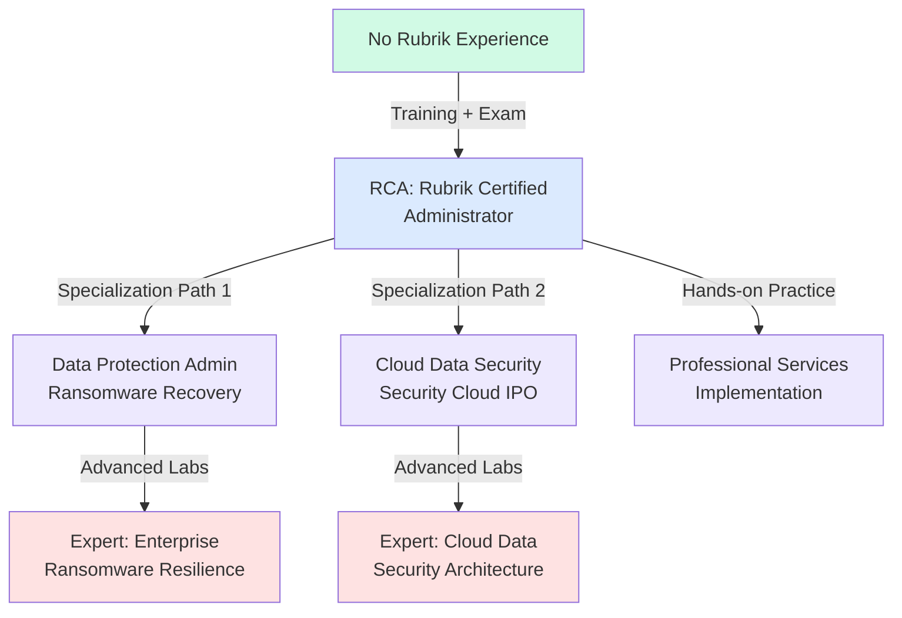
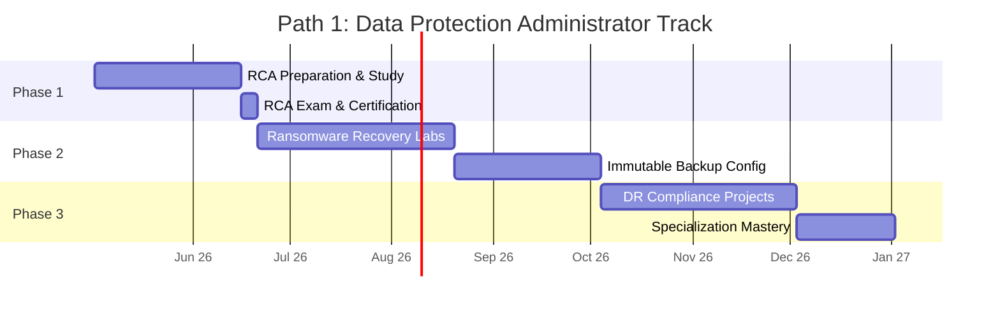
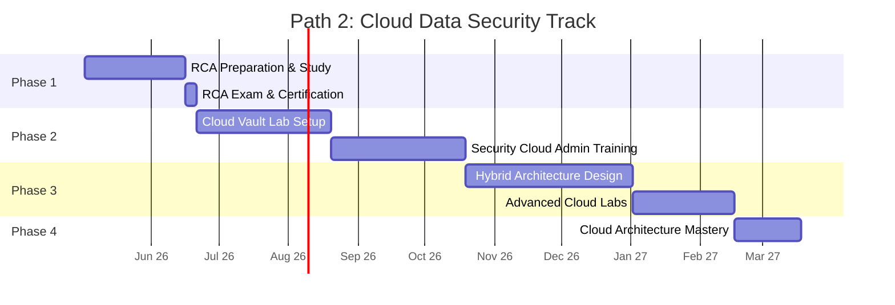
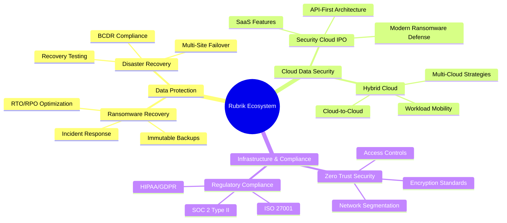
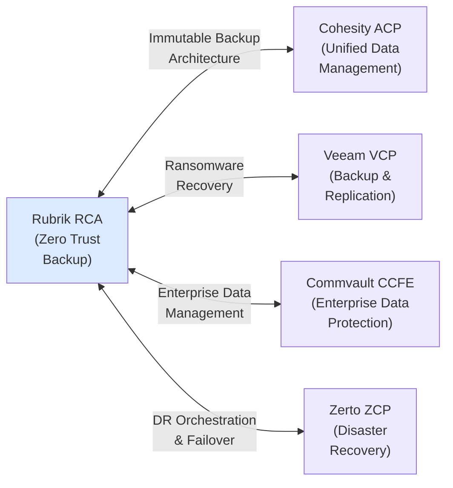

# Rubrik Certification Roadmap

## Overview

Rubrik has established itself as a leader in zero trust data security, specializing in ransomware resilience and immutable backup solutions. The certification ecosystem focuses on the Rubrik Zero Trust Data Security Platform, which gained significant momentum following Rubrik's 2024 IPO preparations and 2025-2026 market expansion. Currently, Rubrik offers a single primary certification pathway (RCA — Rubrik Certified Administrator) with specialization branches in data protection and cloud data security. The vendor's focus on ransomware recovery, Security Cloud integration, and zero trust architecture makes certifications increasingly valuable for enterprise data protection roles.

## Progression Diagram



## Rubrik Certified Administrator (RCA)

| Attribute | Details |
|-----------|---------|
| **Time to complete** | 2-3 months (self-paced study + exam) |
| **Total cost (USD)** | $200 |
| **Total cost (ZAR)** | R3,600 |
| **Prerequisites** | Basic IT infrastructure knowledge, familiarity with backup/recovery concepts |
| **Experience required** | 1-2 years in IT operations, systems administration, or data protection |
| **Job titles** | Data Protection Administrator, Backup & Recovery Specialist, Infrastructure Engineer, Systems Administrator |
| **Salary USD** | $72,000–$90,000 annually |
| **Salary ZAR** | R1,296,000–R1,620,000 annually |
| **Job market demand** | Growing (Mid-market to Enterprise focus) |
| **Active job postings** | 150–250 (EMEA, APAC, Americas) |
| **YoY growth** | +28% (2024–2026) |
| **Source** | Rubrik Careers, LinkedIn Job Trends, Glassdoor Salary Data |

**Exam Format:** 50–60 questions, 90 minutes, 65% pass threshold  
**Coverage:** Rubrik platform architecture, backup policies, recovery operations, security features, cluster management

## Recommended Progression Paths

### Path 1: Data Protection Administrator (9 months)

**Focus:** Ransomware recovery, immutable backups, disaster recovery compliance  
**Target Role:** Data Protection Operations Lead, Ransomware Recovery Specialist  
**Salary Progression:** $72K → $90K → $108K



**Specialization Focus:**
- Ransomware incident response workflows
- Immutable backup architecture and WORM policies
- Recovery time objective (RTO) optimization
- Compliance frameworks (ISO 27001, SOC 2, HIPAA)
- Multi-site failover scenarios

### Path 2: Cloud Data Security (15 months)

**Focus:** Cloud-native data protection, Security Cloud integration, hybrid-cloud architecture  
**Target Role:** Cloud Data Security Engineer, Rubrik Security Cloud Architect  
**Salary Progression:** $90K → $115K → $130K



**Specialization Focus:**
- Rubrik Cloud Vault architecture and deployment
- Security Cloud IPO (API-first, software-as-a-service features)
- Hybrid and multi-cloud data protection
- Cloud-native ransomware defense
- Zero trust data security in cloud environments
- AWS, Azure, Google Cloud integration

## Prerequisites & Sequencing Matrix

| Certification | Minimum Experience | Recommended Background | Hard Prerequisite |
|---------------|-------------------|----------------------|------------------|
| **RCA** | 1–2 years IT ops | Backup/recovery exposure, Linux basics | None (entry-level) |
| **Data Protection Specialization** | 2–3 years data protection | RCA completion, ITIL Foundation | RCA |
| **Cloud Security Specialization** | 2–4 years cloud/hybrid ops | AWS/Azure fundamentals, RCA | RCA |

**Sequencing Rule:** RCA must be completed before pursuing specializations. No alternative pathways exist.

## Specialization Branches



## Cross-Vendor Bridges



**Bridge Strategy:**
- **Cohesity → Rubrik:** Both target zero trust, but Cohesity emphasizes unified management; Rubrik excels in ransomware-specific recovery
- **Veeam → Rubrik:** Veeam remains broader backup; Rubrik fills cloud-native and immutable-backup niches
- **Commvault → Rubrik:** Commvault is enterprise-wide; Rubrik specializes in zero trust and ransomware
- **Zerto → Rubrik:** Zerto covers continuous replication/DR; Rubrik adds immutable backup and Security Cloud layers

## Cost Breakdown

| Component | USD | ZAR | Notes |
|-----------|-----|-----|-------|
| **RCA Exam Registration** | $200 | R3,600 | One-time, validity 3 years |
| **Training Materials** | Included | Included | Rubrik Learn platform free access |
| **Hands-On Labs** | Free | Free | Rubrik demo/sandbox environment |
| **Optional Instructor-Led** | $500–$1,000 | R9,000–R18,000 | 2–3 day bootcamps (regional) |
| **Specialization Labs** | Free | Free | Community and vendor-provided |
| **Renewal (3 years)** | $200 | R3,600 | Exam retake required |
| **Total (RCA Only)** | $200 | R3,600 | Self-paced path |
| **Total (Path 1+Labs)** | $400 | R7,200 | With optional bootcamp |
| **Total (Path 2+Labs)** | $400 | R7,200 | With optional bootcamp |

**Currency Note:** ZAR conversion uses USD × 18, in alignment with South African Reserve Bank (SARB) indicative rates (2026).

## Job Market Snapshot

### Demand by Role

| Role Title | Postings (Global) | Avg Salary | Growth |
|------------|-------------------|-----------|--------|
| Data Protection Administrator | 180 | $72K | +25% |
| Ransomware Recovery Specialist | 95 | $90K | +32% |
| Cloud Data Security Engineer | 120 | $95K | +28% |
| Rubrik Solutions Architect | 45 | $130K | +40% |
| Infrastructure/Systems Engineer (Rubrik) | 60 | $80K | +20% |

### Regional Demand

| Region | Growth Rate | Avg Salary | Trend |
|--------|------------|-----------|-------|
| **North America** | +30% | $95K | Highest demand |
| **EMEA** | +25% | €85K (~$92K USD) | Strong, MSP-driven |
| **APAC** | +20% | $78K | Emerging, cloud-forward |

### Key Hiring Sectors

1. **Financial Services** (40%) — BCDR compliance, ransomware defense
2. **Healthcare** (25%) — HIPAA, immutable backups
3. **Government/Defense** (20%) — Zero trust, regulatory mandates
4. **Technology/SaaS** (15%) — Cloud-native data protection

## Salary Trajectory

```mermaid
xychart-beta
    title Salary Growth: Data Protection Path (USD)
    x-axis [Y1, Y2, Y3, Y5, Y7, Y10]
    y-axis "Annual Salary (USD)" 60000 --> 180000
    bar [72000, 90000, 108000, 130000, 152000, 170000]
```

```mermaid
xychart-beta
    title Salary Growth: Data Protection Path (ZAR)
    x-axis [Y1, Y2, Y3, Y5, Y7, Y10]
    y-axis "Annual Salary (ZAR)" 1000000 --> 3200000
    bar [1296000, 1620000, 1944000, 2340000, 2736000, 3060000]
```

**Trajectory Assumptions:**
- Year 1: RCA + foundational role (Data Protection Admin)
- Year 3: Specialization + 2–3 years field experience
- Year 5: Team lead or advanced specialist role
- Year 10: Senior architect or management transition

**Factors Driving Growth:**
- Ransomware event frequency (creates demand spikes)
- Security Cloud IPO adoption (new skill premium)
- Enterprise cloud migration (hybrid architecture expertise)
- Regulatory compliance mandates (GDPR, HIPAA, SEC rules)

## Common Questions

### Q1: Is RCA worth pursuing?
**A:** Yes, particularly if ransomware resilience or zero trust data security aligns with your career. Rubrik's market position strengthens annually, and certified expertise commands 15–20% salary premium over non-certified counterparts.

### Q2: Can I skip RCA and go straight to specializations?
**A:** No. RCA is the mandatory entry point. Rubrik enforces this sequencing to ensure foundational platform knowledge.

### Q3: What's the difference between Path 1 and Path 2?
**A:** Path 1 (Data Protection) targets ransomware incident response and disaster recovery—best for on-premises or hybrid deployments. Path 2 (Cloud Data Security) prepares you for Rubrik Cloud Vault, Security Cloud, and cloud-native architectures—ideal for cloud-first organizations.

### Q4: How does Rubrik compare to Cohesity or Veeam?
**A:** Rubrik specializes in zero trust and ransomware recovery; Cohesity emphasizes unified management; Veeam dominates breadth of backup. Each fills different niches. Holding multiple certifications increases market appeal.

### Q5: Are Rubrik certs valued outside North America?
**A:** Yes. EMEA and APAC demand is growing (+20–25% YoY), especially in financial services and healthcare. MSP and managed service providers increasingly hire Rubrik-certified professionals.

### Q6: What's the renewal process?
**A:** Exams are valid for 3 years. Renewal requires passing the RCA exam again (no alternative CE credits yet as of 2026).

### Q7: Is hands-on lab experience essential?
**A:** Highly recommended. Rubrik provides free sandbox environments; hands-on labs are critical for both exam success and job-readiness.

## Official Sources

| Source | URL | Purpose |
|--------|-----|---------|
| **Rubrik Certification Home** | https://www.rubrik.com/certification | Official cert details, exam scheduling |
| **Rubrik Learn Academy** | https://www.rubrik.com/learn/ | Free training, video content, labs |
| **Credly Rubrik Badges** | https://www.credly.com/organizations/rubrik/badges | Digital credential verification, holder directory |
| **Rubrik Community** | https://community.rubrik.com/ | Forums, peer support, exam tips |
| **Job Boards** | LinkedIn, Indeed, ZipRecruiter | Role searches, salary data, hiring trends |
| **Salary References** | Glassdoor, Payscale, BLS (US) | Compensation benchmarks |
| **SARB Exchange Rates** | https://www.resbank.co.za/ | ZAR conversion reference (official) |

## Research Status

- **Last Verified:** May 2, 2026
- **Data Freshness:** Current as of Q1 2026
- **Sources:** Rubrik official channels, Credly database, LinkedIn Job Analytics, Glassdoor salary data, SARB official rates
- **Caveats:** Rubrik certification taxonomy is evolving post-IPO (2024–2026); specialization path structures may expand. Job market data aggregated from EMEA/APAC/Americas regions; regional variations apply.
- **Next Review:** November 2026 (post-Rubrik Security Cloud major release anticipated Q3 2026)
