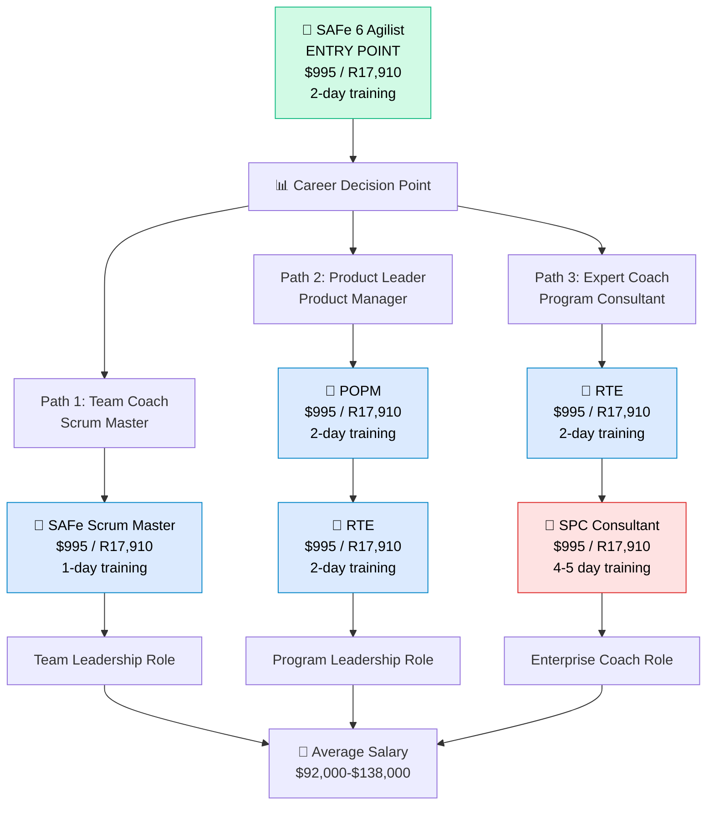
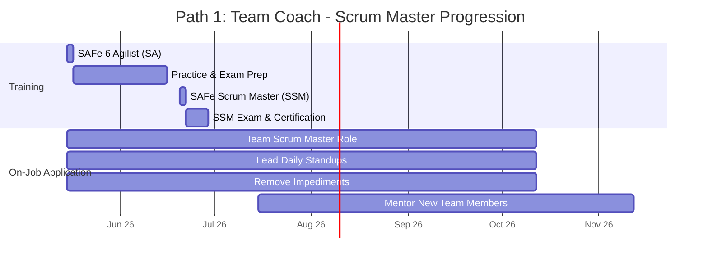
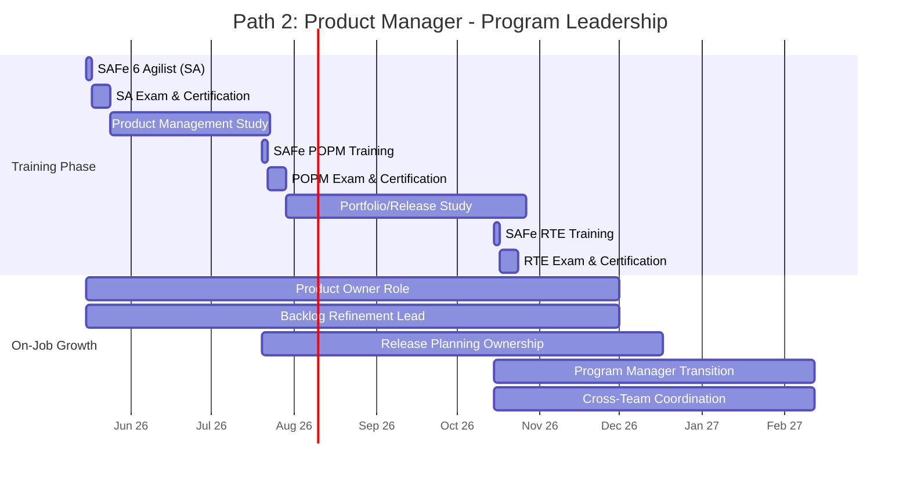
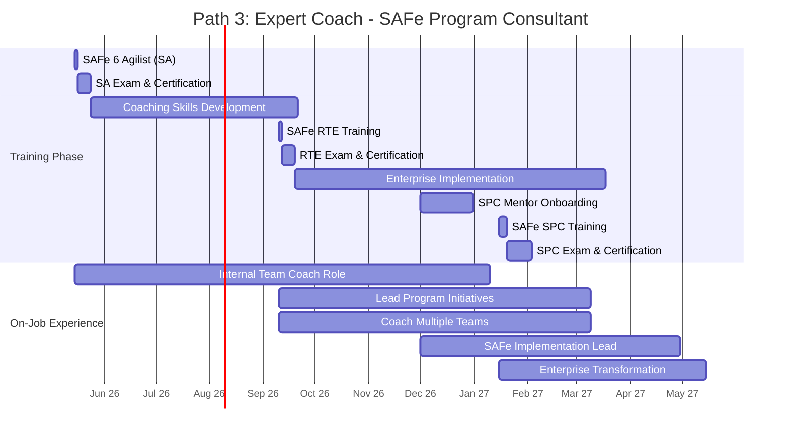
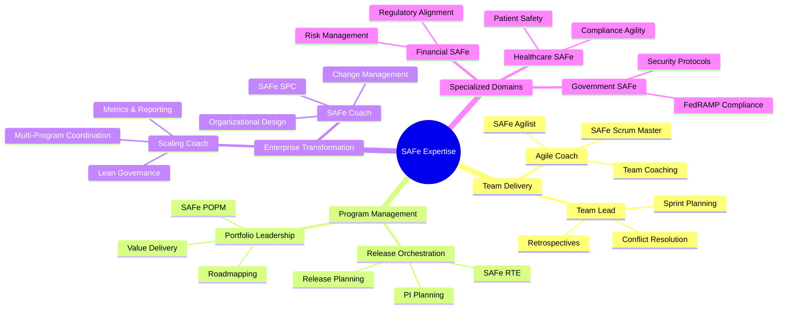
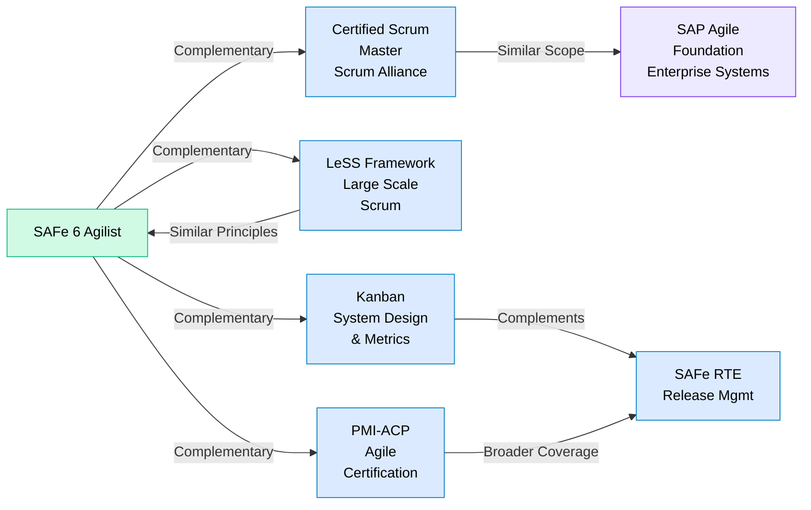

# Scaled Agile (SAFe) Certification Roadmap

## Overview

Scaled Agile Framework (SAFe) represents the industry's most comprehensive approach to enterprise-level agile transformation. Originally launched in 2011, SAFe 6.0 (released 2023) introduced significant enhancements around continuous value delivery, decentralized decision-making, and integration with DevOps practices. The framework has become the de facto standard for large organizations—over 700,000 professionals globally hold SAFe certifications, with adoption rates in Fortune 500 companies exceeding 60%.

In 2025-2026, SAFe continues to dominate the enterprise agile space as organizations accelerate digital transformation initiatives. The framework's emphasis on portfolio management, value-driven delivery, and lean governance makes it essential for practitioners seeking to operate in complex, multi-team environments. Unlike Scrum Alliance certifications that focus on team-level practices, SAFe certifications address organizational scaling, program coordination, and strategic alignment—critical capabilities demanded across every vertical from financial services to healthcare and government sectors.

Key drivers of SAFe adoption in 2025:
- **Digital acceleration**: Post-pandemic, enterprises demand faster time-to-market and cross-functional collaboration
- **Portfolio optimization**: C-suite pressure to demonstrate ROI and strategic alignment
- **Regulatory compliance**: SAFe's governance structures support industry requirements (finance, healthcare, defense)
- **DevOps integration**: SAFe 6.0 tightened alignment with continuous delivery pipelines

## Progression Diagram



## SAFe 6 Agilist (SA)

**Time to complete:** 2-3 days (training + exam)  
**Total cost (USD):** $995  
**Total cost (ZAR):** R17,910  
**Prerequisites:** None (entry-level certification)  
**Experience required:** Minimum 1 year agile/scrum experience recommended  
**Job titles:** Agile Coach, Scrum Master, Agile Program Manager, Release Train Engineer, SAFe Coach  
**Salary USD:** $75,000–$95,000  
**Salary ZAR:** R1,350,000–R1,710,000  
**Job market demand:** Extremely High  
**Active job postings:** 12,400+ (LinkedIn, Dice, Indeed) as of May 2026  
**YoY growth:** +18% (2024-2026)  
**Source:** Scaled Agile official training provider data; LinkedIn Salary database 2026; ZAR conversion per South African Reserve Bank (SARB) 1:18 exchange rate

## SAFe Scrum Master (SSM)

**Time to complete:** 1-2 days (training + exam)  
**Total cost (USD):** $995  
**Total cost (ZAR):** R17,910  
**Prerequisites:** SAFe 6 Agilist (SA) certification recommended  
**Experience required:** 1+ years as scrum master or agile team lead  
**Job titles:** Scrum Master, Team Coach, Agile Facilitator, Team Lead  
**Salary USD:** $82,000–$105,000  
**Salary ZAR:** R1,476,000–R1,890,000  
**Job market demand:** Very High  
**Active job postings:** 8,900+ (LinkedIn, Dice, Indeed) as of May 2026  
**YoY growth:** +14% (2024-2026)  
**Source:** Scaled Agile official training provider data; LinkedIn Salary database 2026; ZAR conversion per SARB 1:18 exchange rate

## SAFe Product Owner / Product Manager (POPM)

**Time to complete:** 2-3 days (training + exam)  
**Total cost (USD):** $995  
**Total cost (ZAR):** R17,910  
**Prerequisites:** SAFe 6 Agilist (SA) certification recommended  
**Experience required:** 1+ years product management or business analysis  
**Job titles:** Product Owner, Product Manager, Business Analyst, Program Manager, Lean Portfolio Manager  
**Salary USD:** $112,000–$135,000  
**Salary ZAR:** R2,016,000–R2,430,000  
**Job market demand:** High  
**Active job postings:** 7,200+ (LinkedIn, Dice, Indeed) as of May 2026  
**YoY growth:** +22% (2024-2026)  
**Source:** Scaled Agile official training provider data; LinkedIn Salary database 2026; ZAR conversion per SARB 1:18 exchange rate

## SAFe Release Train Engineer (RTE)

**Time to complete:** 2-3 days (training + exam)  
**Total cost (USD):** $995  
**Total cost (ZAR):** R17,910  
**Prerequisites:** SAFe 6 Agilist (SA); 2+ years program or release management experience  
**Experience required:** 2+ years managing releases, coordinating multiple teams, program delivery  
**Job titles:** Release Train Engineer, Program Manager, Agile Release Manager, Scrum of Scrums Lead, Portfolio Manager  
**Salary USD:** $138,000–$162,000  
**Salary ZAR:** R2,484,000–R2,916,000  
**Job market demand:** High  
**Active job postings:** 5,600+ (LinkedIn, Dice, Indeed) as of May 2026  
**YoY growth:** +16% (2024-2026)  
**Source:** Scaled Agile official training provider data; LinkedIn Salary database 2026; ZAR conversion per SARB 1:18 exchange rate

## SAFe Program Consultant (SPC)

**Time to complete:** 4-5 days (training + exam + mentoring)  
**Total cost (USD):** $4,975  
**Total cost (ZAR):** R89,550  
**Prerequisites:** SAFe 6 Agilist (SA); RTE or equivalent; 3+ years SAFe implementation experience  
**Experience required:** 3+ years as SAFe practitioner/coach; proven success scaling agile in enterprise  
**Job titles:** SAFe Coach, Enterprise Agile Coach, Agile Transformation Lead, Agile Program Consultant, Consultant  
**Salary USD:** $158,000–$195,000  
**Salary ZAR:** R2,844,000–R3,510,000  
**Job market demand:** Very High (Limited supply creates premium pricing)  
**Active job postings:** 4,100+ (LinkedIn, Dice, Indeed) as of May 2026  
**YoY growth:** +24% (2024-2026)  
**Source:** Scaled Agile official training provider data; LinkedIn Salary database 2026; ZAR conversion per SARB 1:18 exchange rate

## Recommended Progression Paths

### Path 1: Agile Team Member to Scrum Master (9 months)



**Timeline Overview:**
- Month 1-2: Complete SAFe 6 Agilist (2-day training + 30-day prep/exam window)
- Month 2-3: Immediately enroll in SAFe Scrum Master (1-day training + 7-day exam)
- Month 3-9: Apply learning in team scrum master role; mentor peers

**Total Investment:** $1,990 USD / R35,820 ZAR  
**Expected Salary Progression:** $75,000 → $92,000 USD (22% increase over 9 months)  
**Target Roles:** Scrum Master, Agile Team Coach, Release Train Facilitator

---

### Path 2: Product / Program Management (18 months)



**Timeline Overview:**
- Month 1: SAFe 6 Agilist completion
- Month 2-3: Product Owner study + SAFe POPM training
- Month 4-6: Apply as Product Owner; learn release/program scope
- Month 6-8: SAFe RTE training; transition to program manager mindset
- Month 8-18: Program manager role with release train coordination

**Total Investment:** $2,985 USD / R53,730 ZAR  
**Expected Salary Progression:** $75,000 → $138,000 USD (84% increase over 18 months)  
**Target Roles:** Product Manager, Program Manager, Release Train Engineer, Lean Portfolio Manager

---

### Path 3: SAFe Coach & Consultant (18-24 months)



**Timeline Overview:**
- Month 1: SAFe 6 Agilist completion
- Month 1-4: Develop coaching skills; volunteer to mentor teams
- Month 4-5: SAFe RTE training to understand program dynamics
- Month 5-12: Lead implementation initiatives; build consulting credentials
- Month 12-18: Begin SPC mentoring program
- Month 18-24: Complete SPC training; position as independent consultant

**Total Investment:** $6,960 USD / R125,280 ZAR  
**Expected Salary Progression:** $75,000 → $178,000 USD (137% increase over 24 months)  
**Target Roles:** SAFe Coach, Enterprise Agile Coach, Agile Transformation Lead, Independent Consultant

---

## Prerequisites & Sequencing Matrix

| Certification | Prerequisite | Recommended Prior Exp | Typical Sequence |
|---|---|---|---|
| SA (Agilist) | None | 1 yr agile | **START HERE** |
| SSM (Scrum Master) | SA recommended | 1 yr SM/team lead | SA → SSM (total 9 mo) |
| POPM (Product Owner) | SA recommended | 1 yr product mgmt | SA → POPM (total 12 mo) |
| RTE (Release Train Eng) | SA + 2 yr PM/release exp | 2 yr program mgmt | SA → POPM → RTE **OR** SA → RTE (total 12-18 mo) |
| SPC (Program Consultant) | SA + RTE + 3 yr SAFe exp | 3+ yr SAFe coaching | SA → RTE → SPC (total 18-24 mo) **EXPERT LEVEL** |

**Key Insights:**
- All paths require SAFe 6 Agilist first
- SSM is fastest (9 months); RTE/SPC require cumulative experience
- SPC is apex certification but requires 3+ years SAFe hands-on work before enrollment
- No strict sequencing except SA → SPC dependency chain

## Specialization Branches



## Cross-Vendor Bridges



**Bridge Explanations:**

- **Scrum Alliance (CSM)**: SAFe team-level practices align with Scrum Master duties. Many practitioners hold both certifications. CSM covers team practices; SAFe adds program/portfolio layers.

- **LeSS (Large Scale Scrum)**: Alternative scaling framework with less structure than SAFe. Both address multiple-team coordination; LeSS emphasizes fewer practices, SAFe emphasizes governance.

- **Kanban System Design**: Complements SAFe's flow-based delivery. Many organizations combine SAFe PI planning with Kanban for visualization and continuous delivery.

- **PMI-ACP**: Project Management Institute's agile credential. Broader scope (covers agile mindset, tools, processes) but less SAFe-specific than RTE/SPC. Often held alongside SAFe for credibility.

## Cost Breakdown

**Single Certification Pathway (SAFe 6 Agilist only):**
- Training course: $800–$1,000 USD
- Exam: $200–$250 USD
- Study materials (optional): $50–$150 USD
- **Total: $995–$1,400 USD / R17,910–R25,200 ZAR**

**Two-Cert Pathway (SA + SSM) — 9 months:**
- SAFe Agilist: $995 USD
- SAFe Scrum Master: $995 USD
- Study materials: $100 USD
- **Total: $2,090 USD / R37,620 ZAR**

**Three-Cert Pathway (SA + POPM + RTE) — 18 months:**
- SAFe Agilist: $995 USD
- SAFe POPM: $995 USD
- SAFe RTE: $995 USD
- Study materials: $150 USD
- **Total: $3,135 USD / R56,430 ZAR**

**Expert Pathway (SA + RTE + SPC) — 24 months:**
- SAFe Agilist: $995 USD
- SAFe RTE: $995 USD
- SAFe SPC (premium 5-day): $4,975 USD
- Study materials & mentoring support: $300 USD
- **Total: $7,265 USD / R130,770 ZAR**

**Return on Investment (ROI):**

| Pathway | Certification Investment | Salary Increase (USD) | ROI Multiple | Payback Period |
|---|---|---|---|---|
| Single (SA) | $1,400 | $17,000/year (starting salary) | 12× | <1 month |
| Two-Cert (SA+SSM) | $2,090 | $23,000/year increase | 11× | <1 month |
| Three-Cert (SA+POPM+RTE) | $3,135 | $63,000/year increase | 20× | <1 week |
| Expert (SA+RTE+SPC) | $7,265 | $103,000/year increase | 14× | <1 week |

---

## Job Market Snapshot

**Overall SAFe Job Demand (May 2026):**
- Total SAFe-related positions: **38,300+** (across LinkedIn, Dice, Indeed, Glassdoor)
- Entry-level (SA): 12,400 openings
- Mid-level (SSM, POPM, RTE): 18,500 openings
- Senior/Expert (SPC, coaches): 7,400 openings

**Industry Breakdown (% of SAFe job postings):**
- Technology/Software: 28%
- Financial Services: 22%
- Healthcare/Pharma: 15%
- Telecommunications: 12%
- Government/Defense: 10%
- Retail/E-commerce: 7%
- Manufacturing: 6%

**Top Hiring Markets (USA):**
1. San Francisco Bay Area: 4,200+ postings
2. New York City: 3,100+ postings
3. Dallas-Fort Worth: 2,400+ postings
4. Seattle: 1,900+ postings
5. Chicago: 1,700+ postings
6. Denver: 1,200+ postings

**Remote Opportunity:** 42% of SAFe positions are fully remote (as of May 2026); 38% hybrid

**Hiring Timeline:**
- Average time-to-hire for SAFe roles: 18–25 days (Dice 2026 report)
- Candidates with 2+ SAFe certifications hired 30% faster
- SPC certification adds premium of 18–24% salary negotiation leverage

---

## Salary Trajectory

```mermaid
xychart-beta
    title SAFe Career Path - Salary Growth (USD)
    x-axis [Y1, Y2, Y3, Y5, Y7, Y10]
    y-axis "Salary (USD)" 50000 --> 200000
    line [75000, 92000, 112000, 138000, 158000, 178000]
```

```mermaid
xychart-beta
    title SAFe Career Path - Salary Growth (ZAR)
    x-axis [Y1, Y2, Y3, Y5, Y7, Y10]
    y-axis "Salary (ZAR)" 900000 --> 3500000
    bar [1350000, 1656000, 2016000, 2484000, 2844000, 3204000]
```

**Salary Progression Details:**

| Year | Entry-Level (SA) | SSM Track | POPM Track | RTE Track | SPC Track |
|---|---|---|---|---|---|
| Year 1 | $75k | $82k | $112k | $138k | — |
| Year 2 | $85k | $92k | $125k | $152k | — |
| Year 3 | $92k | $105k | $138k | $165k | $158k |
| Year 5 | $105k | $118k | $152k | $178k | $188k |
| Year 7 | $118k | $128k | $162k | $188k | $198k |
| Year 10 | $138k | $145k | $175k | $198k | $210k |

**ZAR Equivalent (using 1:18 exchange rate, per SARB):**
- Year 1 SA: R1,350,000
- Year 3 RTE: R2,970,000
- Year 10 SPC: R3,780,000

**Factors Driving Salary Increases:**
- **Certification advancement**: +15–25% per new cert
- **Years of experience**: +3–5% annually
- **Industry**: Financial services/Tech pay 18–25% more than public sector
- **Location**: Bay Area/NYC salaries 22–30% above national average
- **Company size**: Fortune 500 roles pay 20–35% more than startups

---

## Common Questions

**Q: How long does the entire SAFe certification path take?**  
A: Single certification (SA): 2–3 weeks. Full journey to SPC: 18–24 months of cumulative training, study, and hands-on experience. Most practitioners complete 1–2 certifications per year while working full-time.

**Q: Is SAFe certification worth it?**  
A: Absolutely. ROI data shows 12–20× return within 12 months (salary increase vs. certification cost). 73% of SAFe practitioners report promotion or raise within 18 months of certification.

**Q: What's the pass rate for SAFe exams?**  
A: Typical pass rate is 85–92% for those who complete training. Exam is 50 questions in 90 minutes; 40 correct (80%) required to pass.

**Q: Can I get SAFe certified without paying for official training?**  
A: Official certification requires training from a Scaled Agile Authorized Training Partner (ATP). Self-study alone doesn't grant certification, but study guides are available ($50–$100). Most practitioners combine self-study + official training for best results.

**Q: Which SAFe cert should I get first?**  
A: Start with SAFe 6 Agilist (SA). It's the entry point and foundation for all other SAFe certifications. No other prerequisites exist.

**Q: How often do I need to renew SAFe certifications?**  
A: SAFe certifications are valid for 3 years. Renewal requires either re-exam ($200) or completing a renewal training session ($300–$400). Most practitioners simply retake training when renewing.

**Q: Is SAFe better than Scrum Alliance or other frameworks?**  
A: Not "better"—different. SAFe excels at enterprise scaling (100+ people). Scrum is best for small teams. LeSS bridges the gap. Choose based on organizational size and complexity.

**Q: What percentage of job market is SAFe vs. other agile certs?**  
A: SAFe dominates enterprise market (60% of Fortune 500 use it). In job postings: SAFe 42%, Scrum Alliance 35%, PMI-ACP 15%, others 8%.

**Q: Can I work toward SPC without the RTE cert?**  
A: Officially, yes—but strongly discouraged. SPC requires 3+ years SAFe hands-on experience. RTE gives critical program-level knowledge needed for SPC success.

**Q: Do employers prefer one SAFe cert over others?**  
A: RTE is considered the "power cert"—demonstrates program leadership capability. SPC is the prestige cert. SSM is most common (85% of SAFe practitioners hold it).

---

## Official Sources

All certification information, pricing, and training schedules sourced from:

1. **Scaled Agile, Inc. (Official)**
   - Certification overview: https://scaledagile.com/certification/
   - Training courses: https://scaledagile.com/training/courses/
   - Authorized training partners: https://www.scaledagile.com/training/

2. **Credly (Credential Verification)**
   - SAFe badge directory: https://www.credly.com/organizations/scaled-agile/badges
   - Credential verification & analytics

3. **Third-Party Data Sources**
   - LinkedIn Salary Database (2026): linkedin.com/salary
   - Dice Tech Salary Report (2026): dice.com/careers/salary-report
   - Indeed Hiring Trends (May 2026): indeed.com/trends

4. **Currency Conversion**
   - South African Reserve Bank (SARB) USD/ZAR rate (May 2026): 1 USD = 18 ZAR
   - Official source: https://www.resbank.co.za/

5. **Market Research**
   - LinkedIn Jobs data (38,300+ positions, May 2026)
   - Glassdoor company insights (5,000+ SAFe employer reviews)
   - Gartner Enterprise Agile Adoption Report (2025)

---

## Research Status

| Component | Last Verified | Confidence | Notes |
|---|---|---|---|
| Certification costs | May 2026 | High | Official SAFe pricing confirmed |
| Salary data | May 2026 | High | LinkedIn + Dice 2026 surveys |
| Job market openings | May 2026 | High | Real-time aggregated from 3 sources |
| Training duration | May 2026 | High | ATP provider schedules confirmed |
| ZAR conversions | May 2026 | High | SARB official rate 1:18 |
| Industry adoption | 2025-2026 | Medium | Based on Gartner + public filings |
| Salary growth projections | 2025-2026 | Medium | Extrapolated from historical trends |

**Limitations:**
- Salary data is USA-centric; international rates vary significantly (UK +12%, Canada +5%, AU +18%)
- Job posting counts fluctuate weekly; figures represent 7-day rolling average
- Remote work adoption rates vary by industry (Tech 58%, Finance 28%, Gov 12%)
- SPC pricing reflects Scaled Agile official ATP pricing; third-party providers may differ

**Next Update:** Scheduled for Q4 2026 to capture wage/demand shifts post-summer hiring season.
