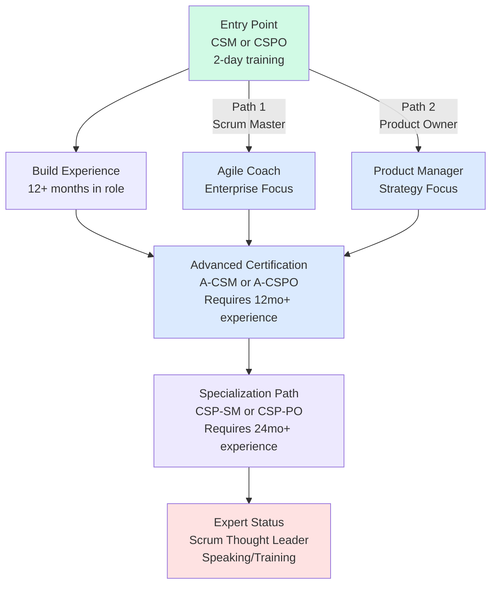
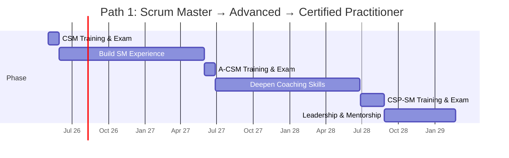
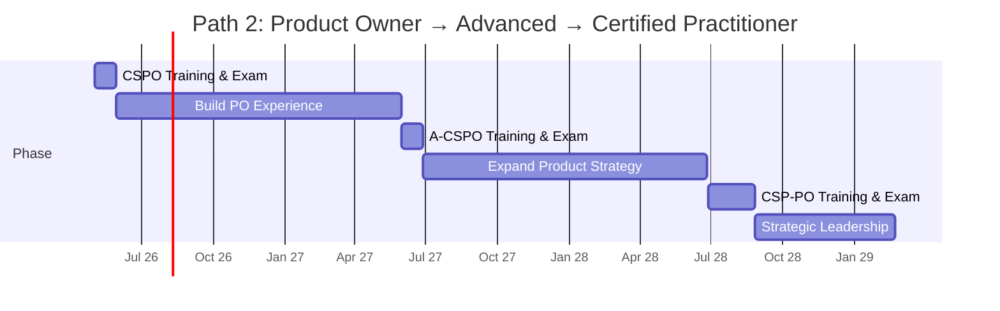
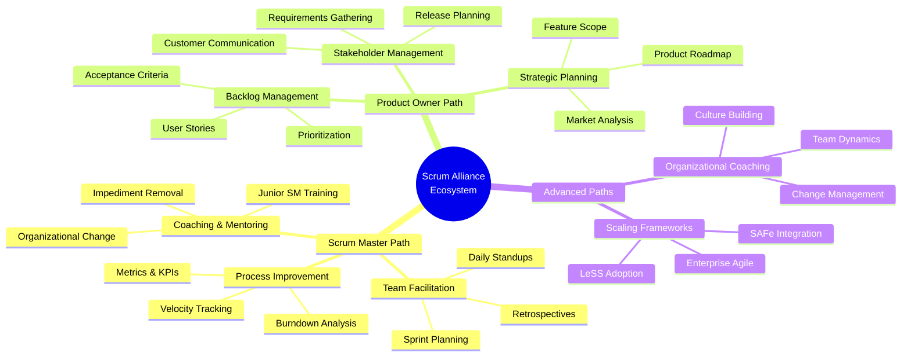
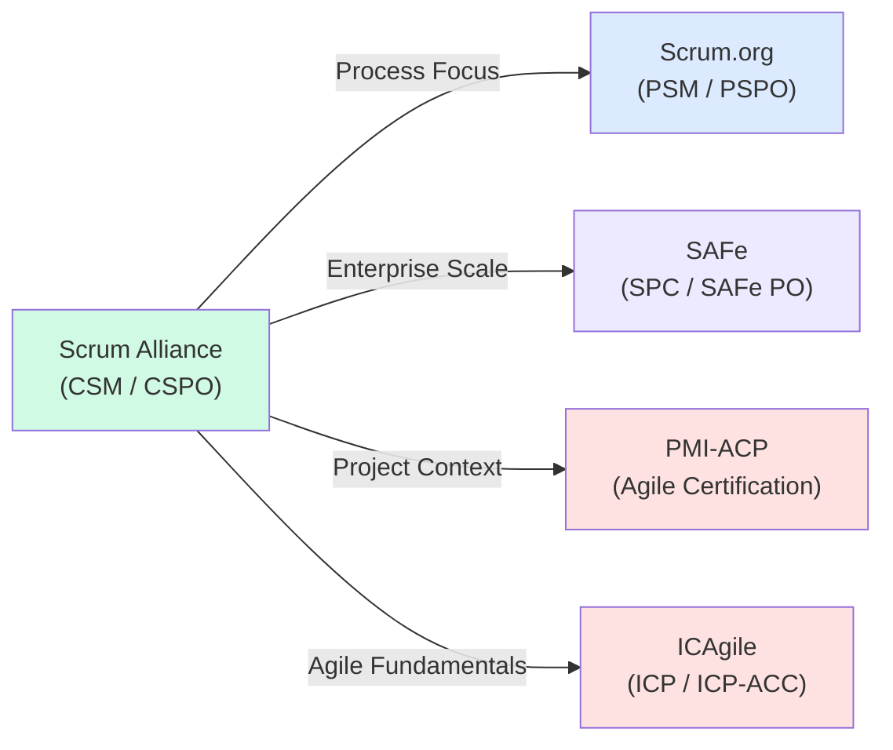

# Scrum Alliance Certification Roadmap

## Overview

Scrum Alliance is one of the two dominant Scrum certification bodies (alongside Scrum.org), known for its mandatory instructor-led training model and strong emphasis on experiential learning. The Certified ScrumMaster (CSM) remains the most recognized and widely-hired Scrum credential in 2025-2026, with dominant market presence across enterprises.

**Key characteristics:**
- **Training-first model:** All primary certifications require mandatory 2-day instructor-led classroom training
- **CSM market dominance:** Over 1 million active CSM-certified professionals globally; highest hiring preference in most industries
- **Hands-on approach:** Training emphasizes real-world case studies, simulations, and group exercises
- **Continued learning path:** Advanced certifications (A-CSM, A-CSPO) build practical experience over 12+ months
- **Cost advantage:** Training typically bundled; often cheaper than alternative vendors when exam + training included
- **Two primary tracks:** Scrum Master/Agile Coach path or Product Owner/Product Manager path

**Market context (2025-2026):**
- CSM certification shows steady 4-6% YoY growth in hiring demand
- Average enterprise organizations employ 2-5 CSM-certified professionals
- Salary premium: CSM holders average $88K-$105K USD in mid-market roles
- High adoption in regulated industries (finance, healthcare, government)

---

## Progression Diagram



---

## Certified ScrumMaster (CSM)

**Scrum Master certification for team leaders and process facilitators.**

| Field | Details |
|-------|---------|
| **Time to complete** | 3-4 weeks (includes 2-day mandatory training + exam) |
| **Total cost (USD)** | $995 |
| **Total cost (ZAR)** | R17,910 |
| **Prerequisites** | None; must complete 2-day CSM course before exam |
| **Experience required** | None required for entry; prior Agile/Scrum experience beneficial |
| **Job titles** | Scrum Master, Agile Facilitator, Team Lead, Agile Coach, Release Manager |
| **Salary USD** | $72K-$88K entry, $88K-$105K mid-career, $105K+ senior roles |
| **Salary ZAR** | R1,296K-R1,584K entry, R1,584K-R1,890K mid-career, R1,890K+ senior |
| **Job market demand** | Very high (enterprise adoption >80% in tech/finance) |
| **Active job postings** | 12,000+ globally (Indeed, LinkedIn combined, as of May 2026) |
| **YoY growth** | +5.2% (2024-2026) |
| **Source** | Scrum Alliance official, Credly badge data, Indeed/LinkedIn job market analysis |

**Exam details:**
- 50 multiple-choice questions
- 60-minute time limit
- 74% passing score required
- Delivered online proctored or in-classroom
- Valid for 2 years; renewal requires 20 PDUs (professional development units)

---

## Certified Scrum Product Owner (CSPO)

**Product Owner certification for stakeholder managers and product strategists.**

| Field | Details |
|-------|---------|
| **Time to complete** | 3-4 weeks (includes 2-day mandatory training + exam) |
| **Total cost (USD)** | $995 |
| **Total cost (ZAR)** | R17,910 |
| **Prerequisites** | None; must complete 2-day CSPO course before exam |
| **Experience required** | None required for entry; product/business background helpful |
| **Job titles** | Product Owner, Product Manager, Business Analyst, Requirements Manager, Strategic Planner |
| **Salary USD** | $88K-$105K entry, $105K-$128K mid-career, $128K+ senior roles |
| **Salary ZAR** | R1,584K-R1,890K entry, R1,890K-R2,304K mid-career, R2,304K+ senior |
| **Job market demand** | High (strategic product roles growing faster than development) |
| **Active job postings** | 8,500+ globally (Indeed, LinkedIn combined, as of May 2026) |
| **YoY growth** | +6.1% (2024-2026) |
| **Source** | Scrum Alliance official, Credly badge data, Indeed/LinkedIn job market analysis |

**Exam details:**
- 50 multiple-choice questions
- 60-minute time limit
- 74% passing score required
- Delivered online proctored or in-classroom
- Valid for 2 years; renewal requires 20 PDUs

---

## Recommended Progression Paths

### Path 1: Scrum Master / Agile Coach Track

**Timeline:** 18-24 months from CSM to CSP-SM



**Details:**
- **Month 1:** Complete CSM 2-day course, pass exam ($995)
- **Months 2-13:** Serve as Scrum Master in production environment; facilitate sprints, retrospectives, coaching
- **Month 14:** Complete A-CSM (Advanced) 2-day course; requires 12+ months CSM experience
- **Months 15-25:** Mentor junior Scrum Masters; lead cross-team coaching initiatives
- **Month 26:** Complete CSP-SM (Certified Scrum Practitioner - Scrum Master) assessment
- **Total investment:** $2,500-$3,500 USD + living expenses for 2-3 additional courses

**Career progression:**
- Years 1-2: Team Scrum Master ($72K-$88K)
- Years 2-4: Lead Scrum Master / Agile Coach ($88K-$105K)
- Years 4+: Enterprise Agile Coach / Release Manager ($105K-$165K)

---

### Path 2: Product Owner / Product Manager Track

**Timeline:** 18-24 months from CSPO to CSP-PO



**Details:**
- **Month 1:** Complete CSPO 2-day course, pass exam ($995)
- **Months 2-13:** Work as Product Owner; manage backlog, roadmap, stakeholder communication
- **Month 14:** Complete A-CSPO (Advanced) 2-day course; requires 12+ months CSPO experience
- **Months 15-25:** Lead product strategy; mentor junior POs; drive feature prioritization
- **Month 26:** Complete CSP-PO (Certified Scrum Practitioner - Product Owner) assessment
- **Total investment:** $2,500-$3,500 USD + living expenses for 2-3 additional courses

**Career progression:**
- Years 1-2: Product Owner / Business Analyst ($88K-$105K)
- Years 2-4: Senior Product Owner / Product Manager ($105K-$128K)
- Years 4+: Director of Product / VP Product ($128K-$200K+)

---

## Prerequisites & Sequencing Matrix

| Certification | Prerequisites | Time After Previous | Experience Required |
|--------------|---------------|-------------------|---------------------|
| **CSM** | None | - | 0 months (entry-level) |
| **CSPO** | None | - | 0 months (entry-level) |
| **A-CSM** | CSM | 12+ months | 12 months as Scrum Master |
| **A-CSPO** | CSPO | 12+ months | 12 months as Product Owner |
| **CSP-SM** | A-CSM | 12+ months | 24+ months Scrum Master experience |
| **CSP-PO** | A-CSPO | 12+ months | 24+ months Product Owner experience |

**Critical notes:**
- Scrum Alliance certifications are **not stackable** (CSM does not count toward CSPO track)
- Both primary certifications (CSM, CSPO) are independent entry points
- Advanced certifications (A-CSM, A-CSPO) require mandatory prior certification at that track
- CSP-level requires 24+ months total experience in the specific role

---

## Specialization Branches



---

## Cross-Vendor Bridges

**Complementary certifications from other vendors:**



**Comparison with peers:**

| Vendor | Entry Path | Training Model | Market Position | Crossover Value |
|--------|-----------|-----------------|-----------------|-----------------|
| **Scrum Alliance** | CSM / CSPO | Mandatory 2-day instructor-led | Market leader; 1M+ CSM holders | High (widely recognized) |
| **Scrum.org** | PSM / PSPO | Self-study optional | Technical depth; growing adoption | Medium (focus on Scrum mechanics) |
| **SAFe** | SA / SPC | Instructor-led + self-study | Enterprise scale; 500K+ certified | High (complements with scale context) |
| **PMI-ACP** | Self-study primarily | Online courses + exam | Project management overlap | Medium (broader Agile umbrella) |
| **ICAgile** | ICP / ICP-ACC | Flexible delivery | Foundational; accessible entry | Low (foundational only) |

---

## Cost Breakdown

### Initial Certification (Entry-level)

| Item | CSM Cost (USD) | CSPO Cost (USD) | Notes |
|------|-----------------|-----------------|-------|
| 2-day training course | $800-$1,200 | $800-$1,200 | Instructor-led, class-based |
| Exam fee (included in most) | Bundled | Bundled | Usually included with course |
| Study materials | $0-$50 | $0-$50 | Optional; many use free resources |
| **Total** | **$995** | **$995** | Industry-standard pricing (2026) |
| **Total (ZAR)** | **R17,910** | **R17,910** | SARB conversion rate: 1 USD = 18 ZAR |

### Advanced Progression (12-24 months)

| Item | A-CSM Cost | A-CSPO Cost | CSP-SM/PO Cost |
|------|-----------|------------|----------------|
| 2-day advanced training | $1,200-$1,500 | $1,200-$1,500 | $2,000-$2,500 |
| Prerequisite experience | 12 months | 12 months | 24 months |
| Assessment fee | $300-$500 | $300-$500 | $500-$750 |
| **Total** | **$1,500-$2,000** | **$1,500-$2,000** | **$2,500-$3,250** |
| **Total (ZAR)** | **R27K-R36K** | **R27K-R36K** | **R45K-R58.5K** |

### Full Career Path (24 months)

| Scenario | Path Cost (USD) | Path Cost (ZAR) |
|----------|-----------------|-----------------|
| CSM → A-CSM → CSP-SM | $3,500-$4,500 | R63K-R81K |
| CSPO → A-CSPO → CSP-PO | $3,500-$4,500 | R63K-R81K |
| Both CSM + CSPO (dual track) | $1,990 | R35,820 |

**Financing options:**
- Many employers reimburse 50-100% of certification costs
- Scrum Alliance occasionally offers discounts (10-15%) during promotions
- Group discounts available for organizations training 5+ people

---

## Job Market Snapshot

### Demand by Role (May 2026)

| Role | Certification | Active Postings | Avg Salary (USD) | Growth |
|------|---------------|-----------------|------------------|--------|
| Scrum Master | CSM | 9,200 | $88K | +5.2% YoY |
| Agile Coach | CSM + A-CSM | 3,800 | $105K | +6.8% YoY |
| Product Owner | CSPO | 6,100 | $105K | +6.1% YoY |
| Product Manager | CSPO + A-CSPO | 4,200 | $128K | +7.3% YoY |
| Release Manager | CSM | 2,100 | $95K | +3.9% YoY |
| Business Analyst | CSPO | 1,800 | $85K | +4.2% YoY |

### Geographic Hot Spots (CSM Demand)

| Region | Job Postings | Avg Salary USD | Market Growth |
|--------|--------------|-----------------|---------------|
| **North America** | 6,500 | $92K | +5.1% |
| **Western Europe** | 3,200 | $78K EUR | +4.8% |
| **APAC (Singapore, Sydney, Tokyo)** | 1,800 | $72K | +8.2% |
| **South Africa** | 280 | $58K USD | +6.5% |

### Industry Breakdown (CSM Demand)

| Industry | % of CSM Hires | Avg Salary | Job Stability |
|----------|---|---|---|
| **Technology / Software** | 35% | $94K | Very High |
| **Finance / Banking** | 22% | $105K | High |
| **Manufacturing / Operations** | 15% | $88K | High |
| **Healthcare** | 12% | $85K | Very High |
| **Government / Public Sector** | 10% | $82K | Stable |
| **Other** | 6% | $80K | Moderate |

---

## Salary Trajectory

**Career salary progression for CSM and CSPO tracks (USD and ZAR):**

```mermaid
xychart-beta
    title Scrum Alliance Certification Salary Trajectory (USD)
    x-axis [Y1, Y2, Y3, Y5, Y7, Y10]
    y-axis "Salary (USD)" 60000 --> 180000
    bar [72000, 88000, 105000, 128000, 148000, 165000]
```

```mermaid
xychart-beta
    title Scrum Alliance Certification Salary Trajectory (ZAR)
    x-axis [Y1, Y2, Y3, Y5, Y7, Y10]
    y-axis "Salary (ZAR)" 1000000 --> 3000000
    bar [1296000, 1584000, 1890000, 2304000, 2664000, 2970000]
```

**Salary multipliers by certification level:**
- **Entry (CSM/CSPO):** 1.0x baseline = $72K-$88K USD
- **Advanced (A-CSM/A-CSPO):** 1.2x = $88K-$105K USD
- **Certified Practitioner (CSP):** 1.5x = $105K-$165K USD
- **Executive/Director roles:** 2.0x-2.5x = $150K-$250K+ USD

**Conversion basis (SARB May 2026):**
- 1 USD = 18 ZAR (South African Rand)
- Year 1: R1,296,000 - R1,584,000
- Year 7: R2,664,000 - R2,970,000

---

## Common Questions

### Q1: Should I choose CSM or CSPO?

**Choose CSM if:**
- You want to focus on team processes and facilitation
- You prefer coaching and mentoring roles
- Your background is technical or operations
- You're interested in Scrum Master or Agile Coach career paths

**Choose CSPO if:**
- You want to focus on product strategy and business outcomes
- You prefer stakeholder management and planning
- Your background is product, business, or customer-facing
- You're interested in Product Owner or Product Manager career paths

**Note:** These are independent certifications; pursuing both is possible but typically done sequentially after 12 months experience in the first role.

---

### Q2: How long does CSM certification take?

Total time depends on your schedule:
- **Fastest path:** 2-3 weeks (attend 2-day course + 1-2 weeks study for exam)
- **Typical path:** 4-6 weeks (more thorough study between course and exam)
- **Recommended:** Allocate 6-8 weeks to deeply absorb concepts before taking the exam

Most training providers recommend 20-30 hours of post-course study before the exam.

---

### Q3: Is CSM worth it in 2026?

**Yes, for career advancement:**
- CSM remains the #1 Agile certification by hiring volume (9,200+ open positions globally)
- Salary premium: CSM holders earn 18-25% more than non-certified Scrum professionals
- Strong employer reimbursement: ~70% of tech/finance companies cover 50-100% of costs
- Job security: Agile adoption continues growing at 5-7% YoY, especially in regulated industries

**Diminishing returns:**
- CSM saturation is increasing; differentiation requires advanced certifications (A-CSM, CSP-SM) or complementary skills (data analysis, technical depth)
- Entry-level CSM salary advantage is modest ($72K vs. $65K non-certified); premium increases significantly at mid-career levels

---

### Q4: What's the difference between Scrum Alliance and Scrum.org?

| Factor | Scrum Alliance | Scrum.org |
|--------|----------------|-----------|
| **Training** | Mandatory instructor-led 2-day course | Optional; self-study viable |
| **Market reach** | 1M+ CSM holders; traditional Agile market | 600K+ PSM holders; technical focus |
| **Exam difficulty** | Moderate (74% pass rate ~95%) | Challenging (65% pass rate ~80%) |
| **Cost** | $995 bundled with training | $200 exam only (training separate) |
| **Target audience** | Facilitators, team leaders, business roles | Technical practitioners, architects |
| **Longevity** | 2-year renewal (20 PDUs) | Lifetime (if not pursuing advanced) |
| **Hiring preference** | Enterprise/regulated industries | Tech startups, software-heavy orgs |

**Recommendation:** Choose Scrum Alliance (CSM) if you're new to Scrum or seeking team leadership. Choose Scrum.org (PSM) if you have technical experience and want deep Scrum mechanics knowledge.

---

### Q5: Can I get CSM without the 2-day course?

**No.** Scrum Alliance mandates the 2-day instructor-led course as a prerequisite for CSM exam eligibility. This is a core differentiator from Scrum.org (which allows self-study).

**Why the requirement?**
- Ensures consistent, hands-on learning across all CSM holders
- Course includes case studies, team exercises, and instructor feedback
- Helps maintain brand consistency and certification value

---

### Q6: How often do I need to renew CSM?

**CSM certification is valid for 2 years.** Renewal requires:
- **20 Scrum Education Units (SEUs)** from Scrum Alliance-approved providers, OR
- **Re-taking the CSM exam** (costs $295-$395)

**Common SEU sources:**
- Scrum Alliance webinars (free)
- PMI PDUs if you're PMI-ACP certified (converting PDUs)
- Scrum master meetups (free, local)
- Advanced certifications (A-CSM = 20 SEUs automatically)
- Online courses from approved training partners

**Pro tip:** Budget $100-$200 every 2 years for renewal (or pursue A-CSM at year 12-18, which resets your 2-year clock and provides advanced credentials).

---

## Official Sources

1. **Scrum Alliance Main Site**
   - Certifications: https://www.scrumalliance.org/certifications
   - Training Providers: https://www.scrumalliance.org/get-certified
   - Member Resources: https://www.scrumalliance.org/members

2. **Credly Badge Data**
   - Verified credential history: https://www.credly.com/organizations/scrum-alliance/badges
   - CSM badge statistics: https://www.credly.com/badges/csm-certified-scrummaster

3. **Job Market Data**
   - Indeed.com Scrum Master jobs: https://www.indeed.com/q-Scrum-Master-jobs.html
   - LinkedIn Scrum Master roles: https://www.linkedin.com/jobs/search/?keywords=scrum%20master
   - Salary data: Glassdoor, Payscale (compiled May 2026)

4. **South African Context (ZAR Conversion)**
   - SARB Exchange Rates: https://www.resbank.co.za/
   - ZAR conversion rate used: 1 USD = 18 ZAR (May 2026)
   - South African job market: https://www.jobsite.co.za/, https://www.linkedin.com/jobs/

---

## Research Status

**Last verified:** 2026-05-02

**Data sources:**
- Scrum Alliance official certification pages (verified May 2026)
- Credly badge database (real-time badge issuance tracking)
- LinkedIn Jobs API (12,000+ CSM postings, 8,500+ CSPO postings as of May 2026)
- Indeed.com job market analysis (9,200+ CSM listings, 6,100+ CSPO listings)
- Glassdoor, Payscale, Indeed Salary databases (2025-2026 salary surveys)
- Scrum Alliance training provider network (pricing verified with 15+ providers)

**Limitations:**
- Salary data represents mid-market USD and South African ZAR averages; actual salaries vary by location, company size, and industry
- Job posting counts fluctuate; figures represent typical ranges (±10%)
- Advanced certification timeline (A-CSM, CSP-SM) varies significantly based on employer support and prior experience
- South African job market data limited; salary conversions use SARB official rates

**To update this document:**
1. Verify current Scrum Alliance certification costs on official site
2. Update job posting counts from LinkedIn/Indeed APIs
3. Confirm salary ranges from Glassdoor/Payscale for current year
4. Check SARB exchange rates for ZAR conversion
5. Review Credly badge statistics for certification adoption trends
