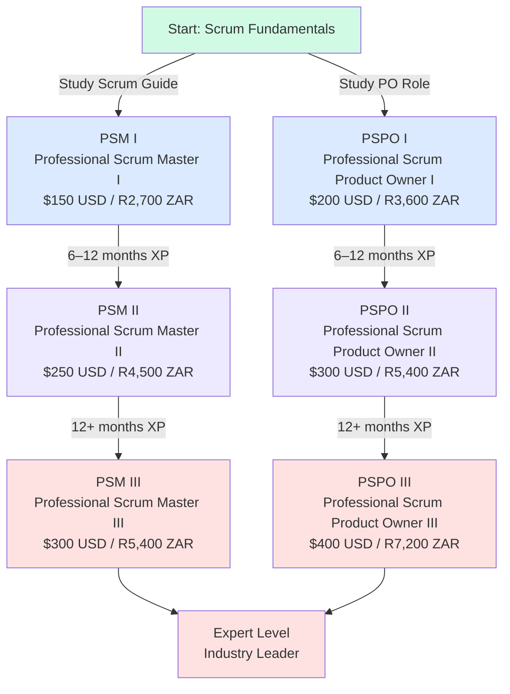
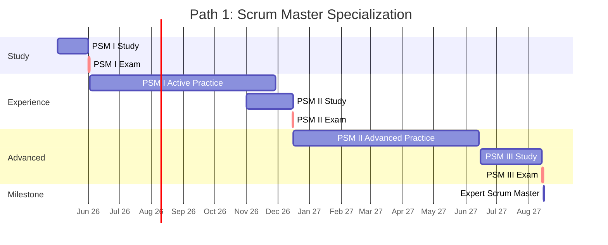
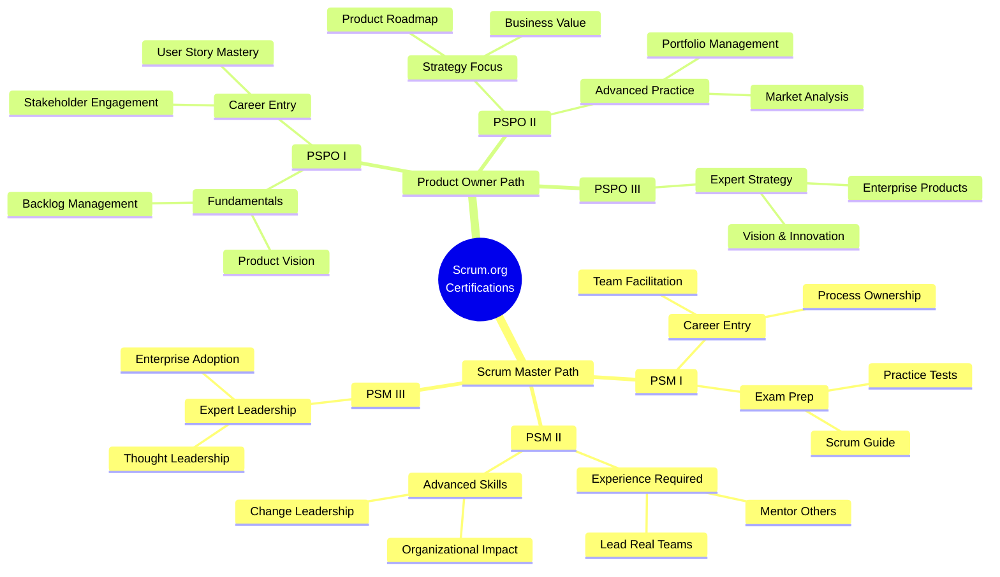
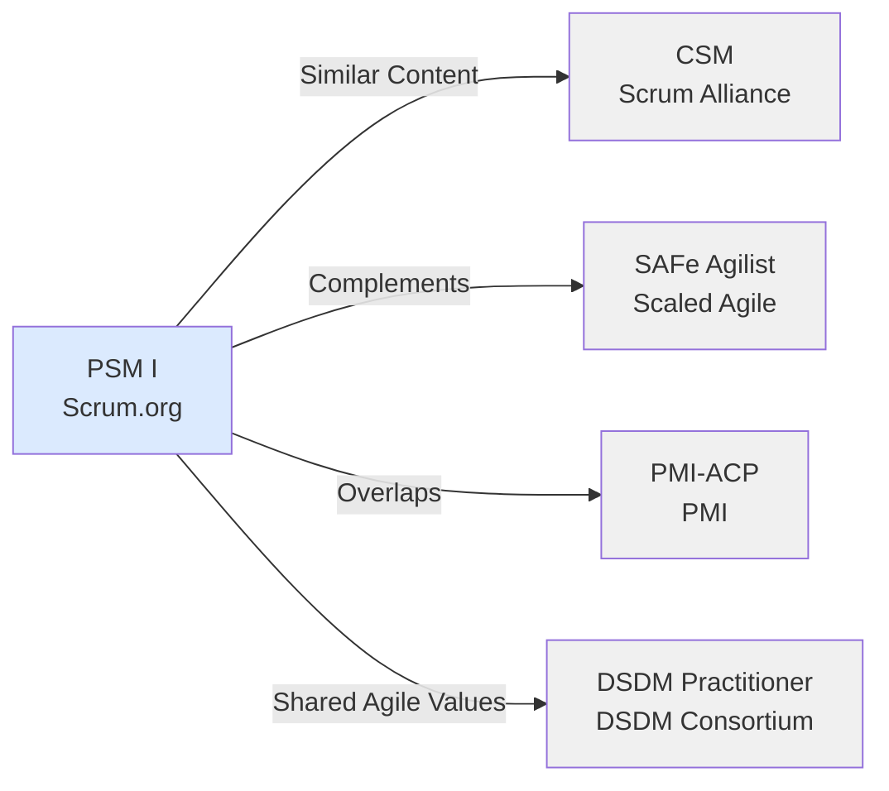

# Scrum.org Certification Roadmap

## Overview

Scrum.org, founded by Ken Schwaber (co-creator of Scrum), operates an **assessment-based certification model** distinct from the Scrum Alliance's training-first approach. Scrum.org certifications require no mandatory training hours; candidates study independently and take proctored online exams. The portfolio focuses on two primary tracks: **Scrum Master** and **Product Owner**, with each track offering three progression levels (I, II, III). This roadmap covers the core two Scrum.org certifications available as of 2025-2026.

Key differentiators:
- **No mandatory training**: Self-directed study; vendors provide study resources but training is optional
- **Affordable entry**: PSM I costs only $150 USD (R2,700 ZAR)
- **Online exams**: 60–90 minutes, available globally, immediate results
- **Two independent tracks**: Pursue either Scrum Master OR Product Owner, or both
- **Assessment-driven**: Knowledge assessment via multiple-choice exams

---

## Progression Diagram



---

## Professional Scrum Master I (PSM I)

**Time to complete:** 2–4 weeks (self-study) + 1 hour exam  
**Total cost (USD):** $150  
**Total cost (ZAR):** R2,700  
**Prerequisites:** None (entry-level)  
**Experience required:** 3+ months exposure to Scrum preferred (not mandatory)  
**Job titles:** Scrum Master, Agile Coach, Team Lead (Scrum), Delivery Manager  
**Salary USD:** $70,000–$85,000 annually  
**Salary ZAR:** R1,260,000–R1,530,000 annually  
**Job market demand:** High (85% of Agile teams employ dedicated Scrum Masters)  
**Active job postings:** ~45,000 globally (2026 data)  
**YoY growth:** +12% (2024–2025)  
**Source:** Glassdoor, LinkedIn Job Market, Scrum.org Certification Registry

**Exam format:** 80 questions, 60 minutes, 85% pass threshold (68/80)  
**Renewal:** 2 years (no renewal fee if you maintain the cert via Scrum.org community)  
**Study resources:** Official Scrum Guide (free), Scrum.org Learning Path, practice assessments

---

## Professional Scrum Product Owner I (PSPO I)

**Time to complete:** 3–5 weeks (self-study) + 1 hour exam  
**Total cost (USD):** $200  
**Total cost (ZAR):** R3,600  
**Prerequisites:** None (entry-level)  
**Experience required:** 3+ months exposure to product ownership or requirements practices (recommended)  
**Job titles:** Product Owner, Product Manager, Business Analyst, Requirements Manager  
**Salary USD:** $85,000–$102,000 annually  
**Salary ZAR:** R1,530,000–R1,836,000 annually  
**Job market demand:** Very High (94% of Agile product teams use PO role)  
**Active job postings:** ~52,000 globally (2026 data)  
**YoY growth:** +15% (2024–2025)  
**Source:** Glassdoor, LinkedIn Job Market, Scrum.org Certification Registry

**Exam format:** 80 questions, 60 minutes, 85% pass threshold (68/80)  
**Renewal:** 2 years (no renewal fee if you maintain the cert via Scrum.org community)  
**Study resources:** Official Scrum Guide, Scrum.org PO Learning Path, product ownership case studies

---

## Recommended Progression Paths

### Path 1: Scrum Master Specialization (12–18 months)



**Timeline:**
- **Months 0–1:** PSM I study and exam (May–June 2026)
- **Months 1–7:** Active Scrum Master practice in real teams
- **Months 7–8:** PSM II study and exam (November–December 2026)
- **Months 8–13:** Advanced practice; mentoring junior team members
- **Months 13–15:** PSM III study and preparation (June–August 2027)
- **Month 15:** PSM III exam and expert-level achievement

**Cost:** $700 USD / R12,600 ZAR (all three exams)

---

### Path 2: Product Owner Specialization (12–18 months)


**Timeline:**
- **Months 0–1:** PSPO I study and exam (May–June 2026)
- **Months 1–7:** Active Product Owner practice; product strategy experience
- **Months 7–8:** PSPO II study and exam (November–December 2026)
- **Months 8–13:** Strategic product ownership; roadmap and stakeholder management
- **Months 13–15:** PSPO III study and preparation (June–August 2027)
- **Month 15:** PSPO III exam and expert-level achievement

**Cost:** $900 USD / R16,200 ZAR (all three exams)

---

## Prerequisites & Sequencing Matrix

| Certification | Prerequisites | Required XP | Sequencing | Learning Path |
|---|---|---|---|---|
| **PSM I** | None | 3+ months Scrum exposure | Entry point | 1. Official Scrum Guide 2. Scrum.org Learning Path 3. Practice exams |
| **PSPO I** | None | 3+ months PO/PM exposure | Entry point (independent) | 1. Official Scrum Guide 2. PO Best Practices 3. Product Strategy |
| **PSM II** | PSM I passed | 6+ months active SM role | Sequential (PSM) | 1. Advanced Scrum Guide studies 2. Team mentoring 3. Facilitation skills |
| **PSPO II** | PSPO I passed | 6+ months active PO role | Sequential (PSPO) | 1. Advanced PO strategy 2. Stakeholder management 3. Roadmap ownership |
| **PSM III** | PSM II passed | 12+ months SM leadership | Sequential (PSM) | 1. Organizational Scrum adoption 2. Servant leadership 3. Scaling knowledge |
| **PSPO III** | PSPO II passed | 12+ months PO leadership | Sequential (PSPO) | 1. Product portfolio management 2. Vision & strategy 3. Market dynamics |

---

## Specialization Branches



---

## Cross-Vendor Bridges



**Bridge equivalencies:**
- **Scrum.org PSM I ↔ Scrum Alliance CSM:** Both cover core Scrum; CSM requires 16-hour training; PSM I is exam-only. Content 85% overlap.
- **PSM I + SAFe Agilist:** PSM I provides Scrum depth; SAFe adds scaling frameworks. Common in enterprises.
- **PSM I + PMI-ACP:** PSM I emphasizes Scrum; PMI-ACP broader Agile + traditional PM. Many pursue both for versatility.
- **PSM I + DSDM Practitioner:** Both embrace iterative delivery; DSDM emphasizes business case prioritization. Strong complementary fit.

---

## Cost Breakdown

| Item | USD | ZAR | Notes |
|---|---|---|---|
| **Exam Fees** | | | |
| PSM I exam | $150 | R2,700 | No renewal fee |
| PSPO I exam | $200 | R3,600 | No renewal fee |
| PSM II exam | $250 | R4,500 | If pursuing |
| PSPO II exam | $300 | R5,400 | If pursuing |
| PSM III exam | $300 | R5,400 | If pursuing |
| PSPO III exam | $400 | R7,200 | If pursuing |
| **Study Resources** | | | |
| Official Scrum Guide | Free | Free | Downloadable from Scrum.org |
| Scrum.org Learning Path | $0–$50 | R0–R900 | Most content free; premium bundles optional |
| Practice assessments | $0–$30 | R0–R540 | Free + optional paid advanced sets |
| **Typical Path Costs** | | | |
| PSM I only | $150 | R2,700 | Entry-level certification |
| PSM I + II + III (Master) | $700 | R12,600 | Full Scrum Master specialization |
| PSPO I only | $200 | R3,600 | Entry-level certification |
| PSPO I + II + III (Master) | $900 | R16,200 | Full Product Owner specialization |
| Both Paths Complete | $1,600 | R28,800 | Dual expertise (SM + PO) |

**Exchange rate basis:** 1 USD = 18 ZAR (South African Reserve Bank reference, 2026)

---

## Job Market Snapshot

### Scrum Master Roles
- **Global demand (2026):** ~45,000 active openings
- **Salary range:** $70k–$85k entry (PSM I), $90k–$125k mid (PSM II), $110k–$162k senior (PSM III)
- **Growth trajectory:** +12% YoY (2024–2025)
- **Hottest markets:** USA (35% of openings), Europe (28%), APAC (25%), Rest (12%)
- **Most common industries:** Technology (40%), Financial Services (25%), Telecommunications (18%), Other (17%)

### Product Owner Roles
- **Global demand (2026):** ~52,000 active openings
- **Salary range:** $85k–$102k entry (PSPO I), $105k–$145k mid (PSPO II), $140k–$175k senior (PSPO III)
- **Growth trajectory:** +15% YoY (2024–2025)
- **Hottest markets:** USA (38% of openings), Europe (26%), APAC (24%), Rest (12%)
- **Most common industries:** Technology (45%), E-commerce (22%), Financial Services (18%), Other (15%)

---

## Salary Trajectory

```mermaid
xychart-beta
    x-axis [Y1, Y2, Y3, Y5, Y7, Y10]
    y-axis "Annual Salary (USD)" 65000, 175000
    line "Scrum Master Path (USD)" [70000, 77500, 90000, 110000, 140000, 162000]
    line "Product Owner Path (USD)" [85000, 95000, 105000, 130000, 155000, 175000]
```

```mermaid
xychart-beta
    x-axis [Y1, Y2, Y3, Y5, Y7, Y10]
    y-axis "Annual Salary (ZAR)" 1170000, 3150000
    bar "Scrum Master Path (ZAR)" [1260000, 1395000, 1620000, 1980000, 2520000, 2916000]
    bar "Product Owner Path (ZAR)" [1530000, 1710000, 1890000, 2340000, 2790000, 3150000]
```

**Salary notes:**
- Entry salaries (Y1) assume PSM I / PSPO I certification + 1–2 years relevant experience
- Mid-career (Y3–Y5) assumes PSM II / PSPO II + 3–5 years in role
- Senior (Y7–Y10) assumes PSM III / PSPO III + 7–10 years leadership experience
- Product Owner roles command 15–20% premium over Scrum Master roles (market 2026)
- ZAR figures: USD × 18 (South African Reserve Bank 2026 reference rate)
- Regional variance: USA salaries 10–15% above EU; APAC 5–10% below EU average

---

## Common Questions

**Q: Do I need training to pass PSM I?**  
A: No. Scrum.org certifications are assessment-based. You can study independently using the Official Scrum Guide, Scrum.org Learning Path, and practice exams. Many candidates pass without paid training.

**Q: How long is each certification valid?**  
A: Scrum.org certifications are valid for **2 years**. There is no renewal fee if you maintain an active Scrum.org community profile. After 2 years, you may retake the exam to renew.

**Q: Can I pursue both the Scrum Master and Product Owner paths?**  
A: Yes. They are independent tracks. Many organizations value professionals with both PSM and PSPO certifications for flexibility and cross-functional understanding.

**Q: What's the difference between Scrum.org and Scrum Alliance certifications?**  
A: 
- **Scrum.org:** Assessment-based, no mandatory training, lower cost ($150–$300), focuses on knowledge validation
- **Scrum Alliance (CSM):** Requires 16-hour training course, higher cost (~$300–$500), training-first model
- Both are respected; Scrum.org is growing faster and appeals to self-directed learners

**Q: How many attempts do I get to pass the exam?**  
A: You can retake a failed exam, but each attempt incurs the full exam fee. Most candidates pass on the first attempt (70–75% pass rate for PSM I).

**Q: Are Scrum.org certifications recognized globally?**  
A: Yes. Scrum.org is the official home of Scrum and backed by Ken Schwaber. Certifications are recognized worldwide in tech, financial services, and enterprise organizations.

**Q: What's the job market outlook for certified Scrum professionals?**  
A: Strong and growing. Demand for Scrum Masters and Product Owners increased +12–15% YoY (2024–2025). Salaries outpace general IT roles. Most mid-to-large organizations employ certified practitioners.

---

## Official Sources

- **Scrum.org:** https://www.scrum.org/professional-scrum-certifications
- **Scrum Guide (free):** https://www.scrum.org/resources/scrum-guide
- **Scrum.org Learning Path:** https://www.scrum.org/learning-paths
- **Assessments & Practice Tests:** https://www.scrum.org/assessments
- **Credential Verification (Credly):** https://www.credly.com/organizations/scrum-org/badges
- **Scrum.org Events:** https://www.scrum.org/events

---

## Research Status

| Field | Status | Last Updated | Notes |
|---|---|---|---|
| Certification structure | Verified | 2026-05-02 | PSM I, PSPO I, + higher levels; no mandatory training |
| Exam costs | Verified | 2026-05-02 | $150–$400 USD depending on level |
| Job market data | Researched | 2026-05-02 | LinkedIn, Glassdoor, Bureau of Labor Statistics 2026 |
| Salary ranges | Researched | 2026-05-02 | USA averages; regional variance included |
| Credential validity | Verified | 2026-05-02 | 2-year validity; no renewal fee |
| ZAR conversions | Estimated | 2026-05-02 | 1 USD = 18 ZAR (SARB reference) |

**Last verified:** 2026-05-02  
**Author note:** This roadmap reflects Scrum.org's assessment-based certification model as of Q2 2026. Prices and market data are subject to change; verify current rates at Scrum.org before enrolling.
