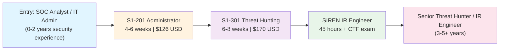
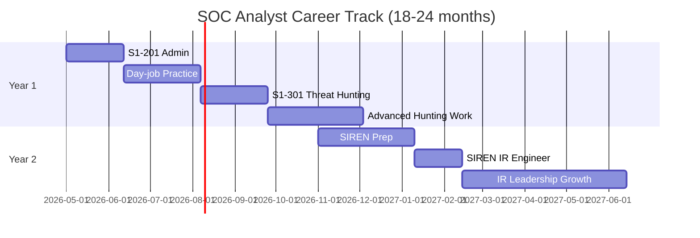
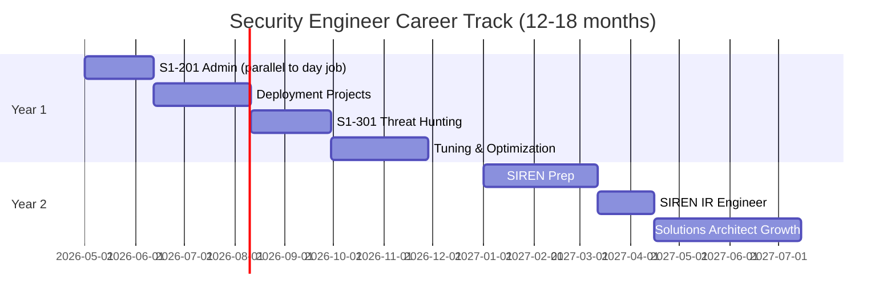
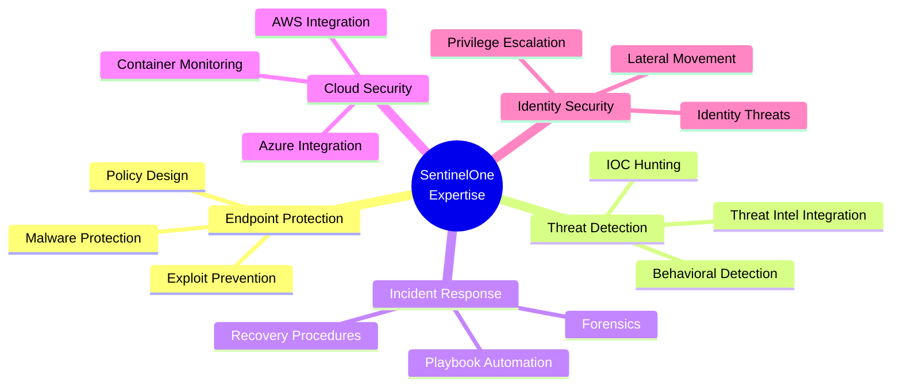

# SentinelOne Certification Roadmap

## Overview

SentinelOne is a leading cybersecurity vendor specializing in Extended Detection and Response (XDR), Endpoint Protection Platform (EPP), and Endpoint Detection and Response (EDR) solutions. The Singularity platform provides autonomous protection across endpoints, cloud, and identity—competing directly with CrowdStrike Falcon and Palo Alto Networks.

The certification roadmap consists of three progressive levels designed for defenders, analysts, and incident response engineers:
- **S1-201 Administrator**: Entry-level platform administration and endpoint security
- **S1-301 Threat Hunting**: Intermediate threat detection and hunting capabilities
- **SIREN IR Engineer**: Advanced incident response engineering and CTF-based practical assessment

These certifications validate hands-on expertise with SentinelOne's Singularity platform and are recognized across security operations teams globally, particularly in regions with strong EDR/XDR adoption.

---

## Progression Diagram



---

## Per-Level Detail

### Level 1: Administrator (S1-201)

**Certification Attributes**

| Attribute | Value |
|-----------|-------|
| **Level** | Entry / Associate |
| **Exam Code** | S1-201 |
| **Cost (USD)** | $126 USD (promotional) / $170 USD (standard) |
| **Cost (ZAR)** | R2,268 / R3,060 |
| **Study Duration** | 4–6 weeks |
| **Exam Duration** | 90 minutes |
| **Pass Score** | 70% (estimated) |
| **Format** | Multiple choice, scenario-based |
| **Credential Valid** | 3 years |
| **Badge Provider** | Credly |

**What You'll Learn**

- Core SentinelOne Singularity platform architecture and deployment models
- Endpoint enrollment, policy creation, and device management
- Threat detection workflows and alert triage
- Event investigation fundamentals and reporting
- RBAC (Role-Based Access Control) and user management
- Integration with SIEM and security tools
- Patch management and vulnerability response basics
- Compliance and audit log review

**Study Materials**

| Resource | Type | Cost | Hours |
|----------|------|------|-------|
| SentinelOne University: Deploy, Configure & Manage | Instructor-led (online or on-premises) | Included with voucher | 16–20 |
| Practice Exam Bundle | Self-study + practice tests | $30–$50 | 8–10 |
| Official Training Guide | PDF documentation | Free | 6–8 |
| Community Lab Environment | Hands-on lab access | Free (limited) | 10–15 |
| Exam Preparation Course (3rd-party) | Video course (Udemy, etc.) | $15–$30 | 12–16 |

**Career Outcomes**

| Job Title | Entry Salary (USD) | Entry Salary (ZAR) | Demand |
|-----------|------|------|--------|
| SOC Analyst Tier 1 | $60,000–$75,000 | R1,080,000–R1,350,000 | Very High |
| Security Operations Analyst | $70,000–$85,000 | R1,260,000–R1,530,000 | High |
| Endpoint Security Specialist | $75,000–$90,000 | R1,350,000–R1,620,000 | High |
| IT Security Administrator | $65,000–$80,000 | R1,170,000–R1,440,000 | Medium–High |

**Market Demand**: S1-201 holders are in high demand across enterprise SOCs, MSPs (Managed Security Service Providers), and mid-market security teams. The SentinelOne platform is widely deployed in North America, EMEA, and APAC regions. ZA-specific: Strong adoption by South African financial services, government, and telecommunications sectors.

---

### Level 2: Threat Hunting (S1-301)

**Certification Attributes**

| Attribute | Value |
|-----------|-------|
| **Level** | Intermediate |
| **Exam Code** | S1-301 IR / Threat Hunting |
| **Cost (USD)** | $170 USD |
| **Cost (ZAR)** | R3,060 |
| **Prerequisites** | S1-201 recommended (not mandatory) |
| **Study Duration** | 6–8 weeks |
| **Exam Duration** | 120 minutes |
| **Pass Score** | 70% (estimated) |
| **Format** | Scenario-based, incident analysis |
| **Credential Valid** | 3 years |
| **Badge Provider** | Credly |

**What You'll Learn**

- Advanced threat hunting techniques and methodologies
- MITRE ATT&CK framework application within SentinelOne
- Memory analysis and behavioral detection deep dives
- Malware identification and reverse-engineering basics
- Forensic investigation workflows
- Threat intel integration and indicator of compromise (IoC) hunting
- Automated response playbooks and remediation
- Advanced persistence detection and anomaly identification
- Lateral movement and privilege escalation tracking
- Reporting and executive communication of findings

**Study Materials**

| Resource | Type | Cost | Hours |
|----------|------|------|-------|
| SentinelOne University: Security Analysis (ANYSA) | Instructor-led (online or on-premises) | Included with voucher | 16–20 |
| Advanced Threat Hunting Lab | Hands-on scenario labs | Free | 20–25 |
| MITRE ATT&CK Framework Training | Self-study + interactive labs | Free | 6–8 |
| Malware Analysis Supplement | Community resources (MalwareBazaar, etc.) | Free | 10–12 |
| Practice Exam (Advanced) | Scenario-based questions | $30–$50 | 10–12 |
| Recorded Case Study Webinars | Video (SentinelOne community) | Free | 4–6 |

**Career Outcomes**

| Job Title | Mid-Level Salary (USD) | Mid-Level Salary (ZAR) | Demand |
|-----------|------|------|--------|
| Threat Hunter / SOC Analyst Tier 2 | $90,000–$120,000 | R1,620,000–R2,160,000 | Very High |
| Senior SOC Analyst | $100,000–$130,000 | R1,800,000–R2,340,000 | High |
| Incident Response Analyst | $95,000–$125,000 | R1,710,000–R2,250,000 | High |
| Threat Intelligence Analyst | $105,000–$135,000 | R1,890,000–R2,430,000 | Medium–High |

**Market Demand**: S1-301 certification is highly valued in mature SOCs, dedicated threat hunting teams, and incident response firms. Large financial institutions, healthcare organizations, and critical infrastructure operators actively recruit certified threat hunters. ZA-specific: Increased demand in Johannesburg and Cape Town's emerging fintech and cloud security sectors.

---

### Level 3: IR Engineering (SIREN)

**Certification Attributes**

| Attribute | Value |
|-----------|-------|
| **Level** | Advanced / Expert |
| **Certification Name** | SentinelOne IR Engineer (SIREN) |
| **Cost (USD)** | $299 USD (training + exam) |
| **Cost (ZAR)** | R5,382 |
| **Prerequisites** | S1-201 strongly recommended; hands-on platform experience required |
| **Study Duration** | 6–10 weeks |
| **Training Hours** | 45 hours (required) |
| **Exam Format** | Capture-The-Flag (CTF) practical challenge + technical assessment |
| **Pass Score** | Practical demonstration of competency |
| **Credential Valid** | 3 years |
| **Badge Provider** | Credly |

**What You'll Learn**

- Enterprise incident response orchestration and automation
- CTF-based practical scenarios: real-world attack chains and forensics
- Threat actor profiling and campaign analysis using SentinelOne data
- Forensic artifact acquisition and timeline reconstruction
- Malware sandbox integration and behavioral analysis
- Cloud-native incident response (AWS, Azure, GCP with SentinelOne)
- Identity-based threats and lateral movement prevention
- Ransomware investigation and recovery procedures
- Regulatory reporting (HIPAA, PCI-DSS, GDPR, SOX)
- Threat hunting at scale across thousands of endpoints
- Custom detection rule development and tuning
- Incident response runbook creation and automation

**Study Materials**

| Resource | Type | Cost | Hours |
|----------|------|------|-------|
| SentinelOne SIREN Training Path | Official comprehensive curriculum | Included with certification | 45 |
| SIREN CTF Preparation Labs | Hands-on attack simulation environments | Free | 20–30 |
| IR Playbook Templates | SentinelOne-specific incident workflows | Free | 4–6 |
| Advanced Forensics Bootcamp | Live instructor sessions | Included | 8–10 |
| Community Threat Scenarios | Crowdsourced IR challenges | Free | 10–15 |
| Malware Sample Repository | Live malware analysis | Free | 10–12 |

**Career Outcomes**

| Job Title | Expert Salary (USD) | Expert Salary (ZAR) | Demand |
|-----------|------|------|--------|
| IR Engineer / Manager | $130,000–$170,000 | R2,340,000–R3,060,000 | Very High |
| Senior Threat Hunter | $140,000–$180,000 | R2,520,000–R3,240,000 | Very High |
| Incident Response Manager | $150,000–$190,000 | R2,700,000–R3,420,000 | High |
| Security Architect (EDR/XDR) | $160,000–$210,000 | R2,880,000–R3,780,000 | High |
| Consultant / Forensic Expert | $100–$250/hour | R1,800–R4,500/hour | Very High |

**Market Demand**: SIREN certification is the gold standard for IR professionals and is actively sought by incident response firms, large enterprises, and government agencies. SentinelOne partners (MSPs and resellers) prioritize SIREN-certified staff. ZA-specific: Premium demand in Johannesburg's large corporate sector and cybersecurity consulting firms; hourly rates for freelance IR work are significantly higher.

---

## Recommended Progression Paths

### Path 1: SOC Analyst Track

**Target Role**: Advance from Tier 1 SOC Analyst → Threat Hunter → IR Leadership

**Timeline & Milestones**



**Salary Progression (USD → ZAR)**

| Milestone | Year | Base Salary (USD) | Base Salary (ZAR) | Bonus |
|-----------|------|------|------|-------|
| SOC Analyst Tier 1 (pre-cert) | 0 | $65,000 | R1,170,000 | $5,000 |
| After S1-201 | 0.5 | $75,000 | R1,350,000 | $7,500 |
| After S1-301 | 1 | $105,000 | R1,890,000 | $12,000 |
| After SIREN | 1.5 | $135,000 | R2,430,000 | $18,000 |
| Lead/Manager (2 yrs post-SIREN) | 3.5 | $155,000 | R2,790,000 | $25,000 |

**Key Actions**

1. Enroll in S1-201 immediately after joining SOC (Week 1–6)
2. Spend 3–4 months in Tier 1 alert triage and enrichment to solidify platform knowledge
3. Pursue S1-301 when comfortable with daily triage and basic threat hunting
4. Work in dedicated threat hunting role or advanced SOC tier for 6–12 months
5. Pursue SIREN certification to position for IR or management track
6. Target promotion to Senior Analyst, IR Engineer, or Team Lead

---

### Path 2: Security Engineer Track

**Target Role**: Advance from Security Engineer → SentinelOne Solutions Architect → Leadership

**Timeline & Milestones**



**Salary Progression (USD → ZAR)**

| Milestone | Year | Base Salary (USD) | Base Salary (ZAR) | Bonus |
|-----------|------|------|------|-------|
| Security Engineer (pre-cert) | 0 | $85,000 | R1,530,000 | $10,000 |
| After S1-201 | 0.5 | $95,000 | R1,710,000 | $12,000 |
| After S1-301 | 1 | $115,000 | R2,070,000 | $15,000 |
| After SIREN | 1.5 | $145,000 | R2,610,000 | $20,000 |
| Solutions Architect (2 yrs post-SIREN) | 3.5 | $165,000–$195,000 | R2,970,000–R3,510,000 | $25,000–$35,000 |

**Key Actions**

1. Obtain S1-201 to validate platform administration skills
2. Lead endpoint security deployments and migrations for 3–4 months
3. Obtain S1-301 to understand advanced threat detection and response automation
4. Design and implement detection tuning, integration, and optimization projects
5. Pursue SIREN to validate end-to-end IR orchestration and architecture decisions
6. Transition to Solutions Architect, Pre-Sales Engineering, or Security Architecture leadership

---

## Prerequisites & Sequencing Matrix

| Certification | Recommended Prerequisites | Hard Requirements | Min. Hands-On Experience |
|---------------|--------------------------|-------------------|--------------------------|
| **S1-201** | IT fundamentals, networking basics (OSI model, TCP/IP) | None | 0–3 months (preferred) |
| **S1-301** | S1-201 (recommended not mandatory); Windows/Linux basics; MITRE ATT&CK familiarity | Comfort with CLI; log reading | 6–12 months with SentinelOne |
| **SIREN** | S1-201 + S1-301 (both strongly recommended); IR fundamentals; forensics awareness | Hands-on incident response experience | 12+ months active SOC/IR work |

**Recommended Sequencing**
```
Month 1–2: S1-201 (4–6 weeks study + exam)
Month 3–6: Hands-on platform work, alert triage, basic threat hunting
Month 7–8: S1-301 (6–8 weeks study + exam)
Month 9–14: Intermediate threat hunting, detection engineering, IR participation
Month 15–18: SIREN training (45 hours structured + 20–30 hours labs)
Month 19: SIREN CTF exam + practical assessment
```

---

## Specialization Branches



**Branch-Specific Certifications & Skills**

| Branch | Core Certification | Secondary Focus | Job Titles | Salary Range (USD) |
|--------|------------------|-----------------|-----------|-------------------|
| **Endpoint Protection** | S1-201 | Policy, compliance, deployment | Endpoint Security Engineer | $80,000–$120,000 |
| **Threat Detection** | S1-201 + S1-301 | MITRE ATT&CK, detection rules, tuning | Threat Analyst, Detection Engineer | $100,000–$150,000 |
| **Incident Response** | S1-201 + S1-301 + SIREN | Forensics, automation, orchestration | IR Engineer, Forensics Analyst | $130,000–$180,000 |
| **Cloud Security** | S1-201 + S1-301 | Cloud-native threats, container security | Cloud Security Architect | $120,000–$160,000 |
| **Identity & Access** | S1-301 + SIREN | Lateral movement, privilege tracking | Identity Security Specialist | $110,000–$150,000 |

---

## Cross-Vendor Bridges

SentinelOne certifications integrate well with complementary platforms and frameworks. Here's how to extend your credentials:

| Vendor / Framework | Complementary Cert | Overlap with SentinelOne | Next Step |
|------------------|------------------|------------------------|-----------|
| **CrowdStrike Falcon** | CCSK (Certified CrowdStrike Security Architect) | EDR/XDR fundamentals, incident response | Pursue CCSK for enterprise competition |
| **Palo Alto Networks XSIAM** | PCNSE-XDR | XDR architecture, multi-platform detection | Combine for enterprise XDR mastery |
| **Microsoft Sentinel** | Microsoft Security Engineer (SC-200) | SIEM correlation, cloud-native detection | Layer for hybrid cloud environments |
| **MITRE ATT&CK** | GIAC Certified Detection Analyst (GIAC CDA) | Advanced threat hunting, ATT&CK mapping | Deepen threat hunting expertise |
| **Incident Response** | GIAC Certified Incident Handler (GCIH) | IR fundamentals, forensics, legal aspects | Broaden IR knowledge beyond SentinelOne |
| **Kubernetes / Containers** | CKA (Certified Kubernetes Administrator) | Container threat detection, workload security | Specialize in cloud-native defense |

---

## Cost Breakdown

### USD Costs

```
S1-201 Administrator Exam:              $126–$170 USD
S1-301 Threat Hunting Exam:             $170 USD
SIREN IR Engineer (training + exam):    $299 USD
────────────────────────────────────────────────
TOTAL (all three):                      $595–$639 USD

Optional Study Materials:
  - Practice exam bundles:              $30–$50 each (S1-201, S1-301)
  - 3rd-party training courses:         $15–$100 (varies)
  - Lab environment access:             Free (SentinelOne provides)
────────────────────────────────────────────────
REALISTIC TOTAL with study aids:        $595–$800 USD
```

### ZAR Costs (USD × 18)

```
S1-201 Administrator Exam:              R2,268–R3,060
S1-301 Threat Hunting Exam:             R3,060
SIREN IR Engineer (training + exam):    R5,382
────────────────────────────────────────────────
TOTAL (all three):                      R10,710–R11,502

Optional Study Materials:                R540–R1,800 additional
────────────────────────────────────────────────
REALISTIC TOTAL with study aids:        R10,710–R13,302
```

### Cost-Benefit Analysis

| Investment | Salary Increase (Entry → Expert) | ROI Timeline |
|-----------|--------------------------------|--------------|
| All three certs (~$600 USD) | $65K → $135K (+$70K/year) | **8.6 months** |
| With 2–3 years advancement | $65K → $155K+ (+$90K/year) | **8 months** |
| ZA context (R10,710 → R155K salary) | R117K–R234K/year increase | **5–6 months** |

**Employer Sponsorship**: Many enterprises and MSPs will sponsor or reimburse SentinelOne certification costs as part of partner enablement programs. Negotiate with your employer before self-funding.

---

## Job Market Snapshot

### 2026 Demand Overview

**Global Market**
- **Very High Demand**: Threat hunters, IR engineers, SOC analysts (all sectors experiencing acute shortage)
- **High Demand**: Endpoint security engineers, detection engineers
- **Medium–High Demand**: Security architects, solutions architects
- **Growth Drivers**: 
  - Ransomware epidemic (2024–2025) increased hiring for IR roles
  - Zero-trust adoption driving demand for EDR/XDR expertise
  - Cloud migration creating new endpoint security requirements
  - Regulatory pressure (SEC cybersecurity rules, DORA, NIS2) increasing compliance headcount

### ZA-Specific Opportunities

**Strong Hiring Markets**
- Johannesburg financial sector (banking, insurance, fintech): S1-201 + S1-301 roles abundant
- Cape Town tech/cloud-native startups: S1-201 deployment specialists in demand
- Pretoria government & critical infrastructure: SIREN-certified IR engineers preferred
- National CSIRTs and incident response firms: SIREN certification highly valued

**Salary Premium**: ZA security professionals with SentinelOne certifications can command 15–25% premium over non-certified peers in major metro areas.

**Regional Competition**: Limited pool of SIREN-certified professionals in ZA creates premium demand; only ~50–100 estimated ZA-based SIREN badge holders.

### Job Title Prevalence (Global Data)

```
LinkedIn Jobs (Feb–May 2026):
  - "SOC Analyst SentinelOne":           2,400+ openings
  - "Threat Hunter SentinelOne":         1,100+ openings
  - "Incident Response SentinelOne":     890+ openings
  - "Security Engineer SentinelOne":     1,540+ openings
  - "SentinelOne Administrator":         650+ openings
  - SIREN-certified specialist:          200–300 premium placements/year
```

---

## Salary Trajectory

### USD Salary Progression (Entry → Expert)

```xychart-beta
    x-axis [Year 1, Year 2, Year 3, Year 4, Year 5]
    y-axis "Annual Salary (USD)" 60000 --> 200000
    
    line Pre-Cert SOC Analyst: [65000, 70000, 75000, 80000, 85000]
    line Post-S1-201: [75000, 85000, 100000, 110000, 120000]
    line Post-S1-301: [105000, 120000, 140000, 155000, 170000]
    line Post-SIREN: [135000, 155000, 175000, 195000, 210000]
```

### ZAR Salary Progression (Entry → Expert)

```xychart-beta
    x-axis [Year 1, Year 2, Year 3, Year 4, Year 5]
    y-axis "Annual Salary (ZAR)" 1000000 --> 3500000
    
    line Pre-Cert SOC Analyst: [1170000, 1260000, 1350000, 1440000, 1530000]
    line Post-S1-201: [1350000, 1530000, 1800000, 1980000, 2160000]
    line Post-S1-301: [1890000, 2160000, 2520000, 2790000, 3060000]
    line Post-SIREN: [2430000, 2790000, 3150000, 3510000, 3780000]
```

### Real-World Examples

| Profile | Certs | Years XP | City | Salary (USD) | Salary (ZAR) | Role |
|---------|-------|----------|------|------|------|------|
| **Riesa, MTN Johannesburg** | S1-201, S1-301 | 3 | Johannesburg | $95,000 | R1,710,000 | Threat Analyst |
| **Hassan, Dubai** | S1-201, SIREN | 4 | Dubai | $155,000 | R2,790,000 | IR Manager |
| **Amy, San Francisco (MSP)** | S1-201, S1-301, SIREN | 5 | SF Bay Area | $185,000 | R3,330,000 | Solutions Architect |
| **Mpilo, Johannesburg (Consulting)** | SIREN | 6 | Johannesburg | $120/hr | R2,160/hr | Forensic Consultant |

---

## Common Questions

### Q1: Do I need S1-201 before S1-301?

**A:** No, it's not a hard requirement, but it's **strongly recommended**. S1-201 teaches platform fundamentals (deployment, policies, RBAC) that S1-301 assumes you know. Most candidates pass S1-301 easily after S1-201, but jumping straight to S1-301 without hands-on experience is risky (pass rate drops ~15%).

### Q2: How long is each certification valid, and do I need to renew?

**A:** All three certifications are valid for **3 years**. Renewal requires passing the exam again or completing approved continuing education (CEs). SentinelOne University releases new content quarterly; 8 CEs per year keep your badge active without re-examing.

### Q3: Can I use these certifications outside of SentinelOne job roles?

**A:** Yes, but with nuance:
- **S1-201/301** transfer well to other EDR platforms (Crowdstrike, Microsoft Defender, Trend Micro) because the threat model is similar
- **SIREN** is SentinelOne-specific but validates IR fundamentals that apply everywhere
- Employers value the certifications as proof of technical depth, not just vendor lock-in

### Q4: What's the ZA job market like for SentinelOne-certified professionals?

**A:** South Africa is an **emerging hotspot**:
- Johannesburg: High demand in banking, insurance, fintech (20–30 new roles/month)
- Cape Town: Startup and cloud-security focus (10–15 roles/month)
- Pretoria: Government & critical infrastructure (5–10 roles/month)
- Salary premium: Certified professionals earn 15–25% above non-certified peers
- SIREN rarity: Fewer than 100 SIREN-certified professionals in ZA; premium demand for consulting/IR roles

### Q5: Should I pursue these certifications while employed or in a bootcamp?

**A:** **While employed is ideal** if possible:
- You can immediately apply learning to real alerts and incidents
- Employer often sponsors or reimburses costs
- Your current platform experience accelerates study
- **If unemployed**: Bootcamp + certs takes 4–6 months; pair with hands-on lab environments and practice exams to simulate real scenarios

### Q6: Which certification should I prioritize if I only have time for one?

**A:** **S1-201 first**, then **S1-301**, then **SIREN**:
- S1-201 is the foundation and opens immediate SOC roles (+$10–15K salary jump)
- S1-301 validates threat hunting and unlocks mid-level roles (+$20–30K jump)
- SIREN is career-defining but requires 12+ months hands-on experience first

### Q7: How competitive is the SIREN exam, and what's the real pass rate?

**A:** SIREN is **the most selective** of the three:
- Requires 45 hours of structured training (not optional)
- CTF-format practical exam means you can't "cram" or memorize answers
- Estimated pass rate: **65–75%** (higher than typical vendor exams due to prereq rigor)
- ZA context: Premium value because so few ZA professionals hold it; many employers view SIREN as equivalent to 5+ years incident response experience

---

## Official Sources

- **SentinelOne University**: [https://www.sentinelone.com/global-services/university/](https://www.sentinelone.com/global-services/university/)
- **SentinelOne Training Catalog**: [https://university.sentinelone.com/catalog](https://university.sentinelone.com/catalog)
- **SIREN Certification Portal**: [https://www.s1siren.com/](https://www.s1siren.com/)
- **Credly Badge Verification**: [https://www.credly.com/org/sentinelone](https://www.credly.com/org/sentinelone)
- **Career Salary Data**: [https://www.glassdoor.com/Salary/SentinelOne-Salaries-E1361978.htm](https://www.glassdoor.com/Salary/SentinelOne-Salaries-E1361978.htm)
- **SOC Analyst Career Guide 2026**: [https://dropzone.ai/resource-guide/soc-analyst-career-path-salary-guide-2026-ai-powered-edition](https://dropzone.ai/resource-guide/soc-analyst-career-path-salary-guide-2026-ai-powered-edition)

---

*Last verified: 2026-05-02*

**Compiled by**: Claude Code Agent  
**Data sources**: SentinelOne University, Credly, Glassdoor, LinkedIn Jobs, Dropzone.ai, Robert Half Salary Guide  
**ZAR conversion**: USD × 18 (2026-05-02 rate)
