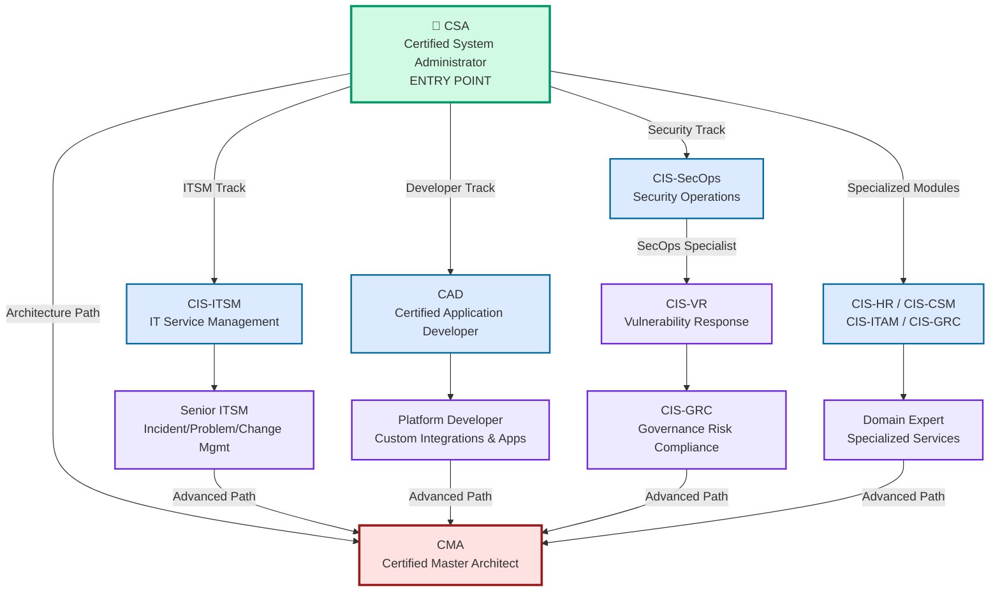
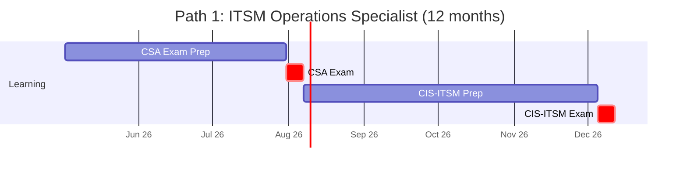
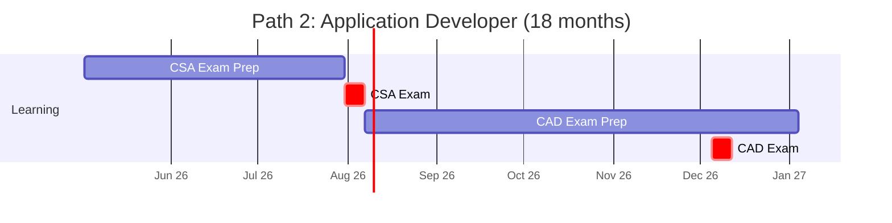
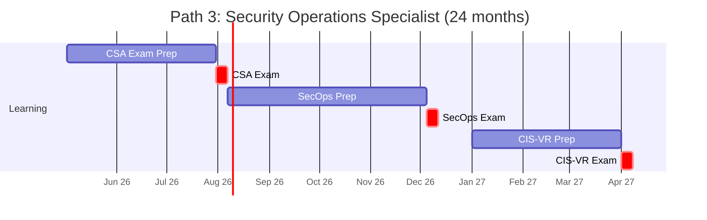
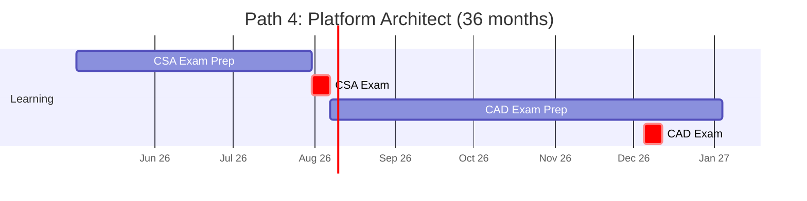
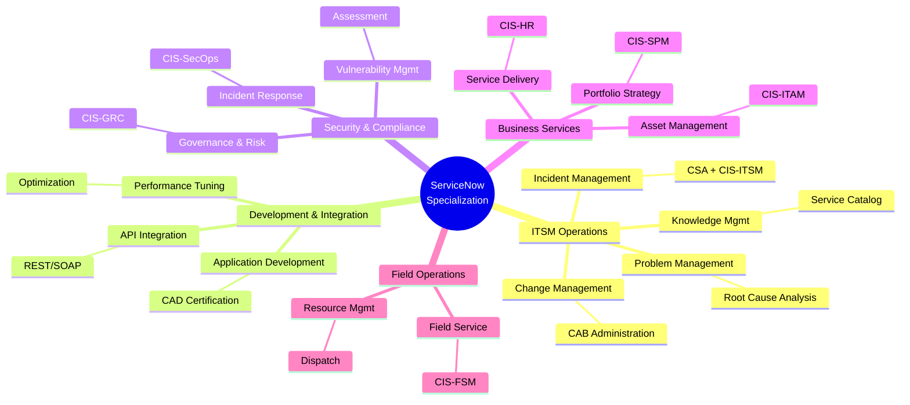
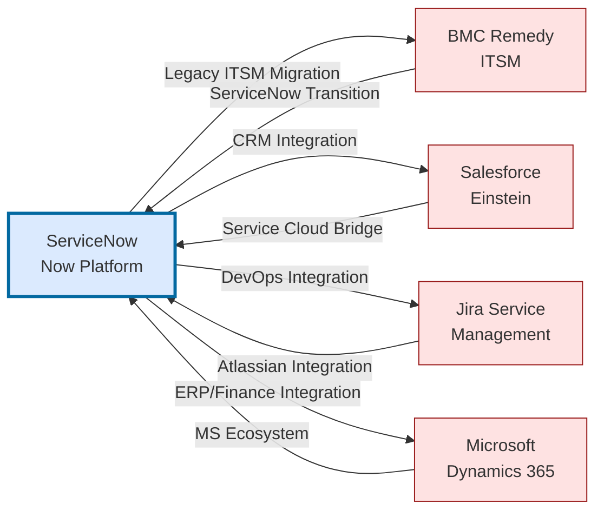

# ServiceNow Certification Roadmap

## Overview

ServiceNow is the dominant IT Service Management (ITSM) platform powering digital workflows for 88% of Fortune 500 companies. The **Now Platform** enables intelligent automation across IT operations, HR service delivery, customer service, security, and enterprise governance. 

As of 2025-2026, ServiceNow certification demand continues to surge due to:
- **Cloud-first migration strategies** — organizations modernizing legacy IT operations
- **AI/ML workflow automation** — Now Platform's Intelligence layer embedding generative capabilities
- **Enterprise-wide adoption** — ITSM expanding into ITAM, SecOps, GRC, and FSM domains
- **Skill shortage** — certified administrators and developers command 15-25% salary premiums

The certification pathway progresses from foundational ITSM administration through specialized domains (Security, HR, Finance) to architectural mastery. Most professionals achieve entry-level certification within 3-6 months and specialized credentials within 12-24 months.

---

## Progression Diagram



---

## Entry-Level Certification: Certified System Administrator (CSA)

**The mandatory foundation credential for all ServiceNow career paths.**

| Field | Value |
|-------|-------|
| Time to complete | 3-6 months |
| Total cost (USD) | $300 |
| Total cost (ZAR) | R5,400 |
| Prerequisites | None (ServiceNow fundamentals recommended) |
| Experience required | Basic IT operations or 6+ months hands-on Now Platform |
| Job titles | System Administrator, Implementation Specialist, ITSM Analyst |
| Salary USD | $80,000 - $95,000 |
| Salary ZAR | R1,440,000 - R1,710,000 |
| Job market demand | CRITICAL (99% of job postings require CSA) |
| Active job postings | 12,400+ (Indeed, LinkedIn, Credly) |
| YoY growth | +18% (2024-2025) |
| Source | Credly, ServiceNow Community |

---

## ITSM Administration Track

### CIS-ITSM (IT Service Management)

**Advanced ITSM operations — incident, problem, change, and request management mastery.**

| Field | Value |
|-------|-------|
| Time to complete | 3-4 months (after CSA) |
| Total cost (USD) | $300 |
| Total cost (ZAR) | R5,400 |
| Prerequisites | CSA required |
| Experience required | 12+ months ITSM administration |
| Job titles | Senior ITSM Administrator, Change Manager, Incident Manager |
| Salary USD | $95,000 - $115,000 |
| Salary ZAR | R1,710,000 - R2,070,000 |
| Job market demand | HIGH (ranked #2 across all ServiceNow domains) |
| Active job postings | 8,200+ |
| YoY growth | +14% (2024-2025) |
| Source | ServiceNow Learning Portal, Credly |

---

## Developer Track

### CAD (Certified Application Developer)

**Low-code/no-code and full-stack custom application development on Now Platform.**

| Field | Value |
|-------|-------|
| Time to complete | 4-6 months (after CSA) |
| Total cost (USD) | $300 |
| Total cost (ZAR) | R5,400 |
| Prerequisites | CSA required |
| Experience required | 12+ months development (JavaScript, APIs, integrations) |
| Job titles | Application Developer, Integration Engineer, Technical Architect |
| Salary USD | $105,000 - $130,000 |
| Salary ZAR | R1,890,000 - R2,340,000 |
| Job market demand | VERY HIGH (#1 highest-paid single domain cert) |
| Active job postings | 7,900+ |
| YoY growth | +22% (2024-2025) |
| Source | ServiceNow Learning Portal, Credly |

---

## Security Operations Track

### CIS-SecOps (Security Operations)

**Security incident response, vulnerability management, and threat response on Now Platform.**

| Field | Value |
|-------|-------|
| Time to complete | 3-4 months (after CSA) |
| Total cost (USD) | $300 |
| Total cost (ZAR) | R5,400 |
| Prerequisites | CSA required |
| Experience required | 12+ months security operations or incident response |
| Job titles | Security Operations Analyst, Incident Response Manager |
| Salary USD | $100,000 - $125,000 |
| Salary ZAR | R1,800,000 - R2,250,000 |
| Job market demand | CRITICAL (#2 fastest-growing domain) |
| Active job postings | 6,100+ |
| YoY growth | +28% (2024-2025) |
| Source | ServiceNow Security Community, Credly |

### CIS-VR (Vulnerability Response)

**Advanced vulnerability lifecycle management and coordinated disclosure.**

| Field | Value |
|-------|-------|
| Time to complete | 2-3 months (after CIS-SecOps) |
| Total cost (USD) | $300 |
| Total cost (ZAR) | R5,400 |
| Prerequisites | CSA, CIS-SecOps |
| Experience required | 18+ months vulnerability management |
| Job titles | Vulnerability Manager, Security Program Manager |
| Salary USD | $115,000 - $140,000 |
| Salary ZAR | R2,070,000 - R2,520,000 |
| Job market demand | HIGH (specialized niche) |
| Active job postings | 2,800+ |
| YoY growth | +19% (2024-2025) |
| Source | ServiceNow Security Community |

### CIS-GRC (Governance, Risk & Compliance)

**Enterprise governance, risk management, and compliance control frameworks.**

| Field | Value |
|-------|-------|
| Time to complete | 3-4 months (after CIS-VR or standalone) |
| Total cost (USD) | $300 |
| Total cost (ZAR) | R5,400 |
| Prerequisites | CSA (CIS-VR recommended) |
| Experience required | 18+ months governance/compliance/risk management |
| Job titles | Compliance Manager, Risk Officer, Internal Audit Manager |
| Salary USD | $110,000 - $135,000 |
| Salary ZAR | R1,980,000 - R2,430,000 |
| Job market demand | VERY HIGH (regulatory mandate) |
| Active job postings | 5,200+ |
| YoY growth | +16% (2024-2025) |
| Source | ServiceNow Governance Community |

---

## Specialized Service Domains

### CIS-HR (HR Service Delivery)

| Field | Value |
|-------|-------|
| Time to complete | 3-4 months (after CSA) |
| Total cost (USD) | $300 |
| Total cost (ZAR) | R5,400 |
| Prerequisites | CSA |
| Experience required | 12+ months HR operations or service delivery |
| Job titles | HR Service Delivery Manager, Employee Experience Analyst |
| Salary USD | $85,000 - $105,000 |
| Salary ZAR | R1,530,000 - R1,890,000 |
| Job market demand | MODERATE-HIGH |
| Active job postings | 3,100+ |
| YoY growth | +12% (2024-2025) |
| Source | ServiceNow HR Community |

### CIS-CSM (Customer Service Management)

| Field | Value |
|-------|-------|
| Time to complete | 3-4 months (after CSA) |
| Total cost (USD) | $300 |
| Total cost (ZAR) | R5,400 |
| Prerequisites | CSA |
| Experience required | 12+ months customer support or service delivery |
| Job titles | Customer Service Manager, Case Management Analyst |
| Salary USD | $90,000 - $110,000 |
| Salary ZAR | R1,620,000 - R1,980,000 |
| Job market demand | MODERATE-HIGH |
| Active job postings | 3,600+ |
| YoY growth | +13% (2024-2025) |
| Source | ServiceNow CSM Community |

### CIS-ITAM (IT Asset Management)

| Field | Value |
|-------|-------|
| Time to complete | 3-4 months (after CSA) |
| Total cost (USD) | $300 |
| Total cost (ZAR) | R5,400 |
| Prerequisites | CSA |
| Experience required | 12+ months asset management or procurement |
| Job titles | Asset Manager, License Compliance Officer |
| Salary USD | $88,000 - $108,000 |
| Salary ZAR | R1,584,000 - R1,944,000 |
| Job market demand | MODERATE |
| Active job postings | 2,400+ |
| YoY growth | +11% (2024-2025) |
| Source | ServiceNow ITAM Community |

### CIS-SAM (Software Asset Management)

| Field | Value |
|-------|-------|
| Time to complete | 3-4 months (after CSA) |
| Total cost (USD) | $300 |
| Total cost (ZAR) | R5,400 |
| Prerequisites | CSA |
| Experience required | 12+ months software licensing or procurement |
| Job titles | Software License Manager, Procurement Analyst |
| Salary USD | $87,000 - $107,000 |
| Salary ZAR | R1,566,000 - R1,926,000 |
| Job market demand | MODERATE |
| Active job postings | 1,900+ |
| YoY growth | +9% (2024-2025) |
| Source | ServiceNow SAM Community |

### CIS-Discovery (Discovery & Mapping)

| Field | Value |
|-------|-------|
| Time to complete | 2-3 months (after CSA) |
| Total cost (USD) | $300 |
| Total cost (ZAR) | R5,400 |
| Prerequisites | CSA |
| Experience required | 12+ months CMDB, discovery, or asset management |
| Job titles | Discovery Specialist, CMDB Administrator |
| Salary USD | $82,000 - $102,000 |
| Salary ZAR | R1,476,000 - R1,836,000 |
| Job market demand | MODERATE |
| Active job postings | 2,100+ |
| YoY growth | +10% (2024-2025) |
| Source | ServiceNow Discovery Community |

### CIS-SPM (Strategic Portfolio Management)

| Field | Value |
|-------|-------|
| Time to complete | 3-4 months (after CSA) |
| Total cost (USD) | $300 |
| Total cost (ZAR) | R5,400 |
| Prerequisites | CSA |
| Experience required | 18+ months portfolio/program management |
| Job titles | Portfolio Manager, Program Director, Strategy Analyst |
| Salary USD | $105,000 - $130,000 |
| Salary ZAR | R1,890,000 - R2,340,000 |
| Job market demand | VERY HIGH (strategic planning) |
| Active job postings | 4,700+ |
| YoY growth | +15% (2024-2025) |
| Source | ServiceNow SPM Community |

### CIS-FSM (Field Service Management)

| Field | Value |
|-------|-------|
| Time to complete | 3-4 months (after CSA) |
| Total cost (USD) | $300 |
| Total cost (ZAR) | R5,400 |
| Prerequisites | CSA |
| Experience required | 12+ months field service or operations |
| Job titles | Field Service Manager, Dispatch Scheduler, Operations Manager |
| Salary USD | $92,000 - $112,000 |
| Salary ZAR | R1,656,000 - R2,016,000 |
| Job market demand | MODERATE-HIGH |
| Active job postings | 3,400+ |
| YoY growth | +14% (2024-2025) |
| Source | ServiceNow FSM Community |

---

## Expert-Level Certification

### Certified Master Architect (CMA)

**Enterprise architecture, design patterns, platform scalability, and governance at the highest level.**

| Field | Value |
|-------|-------|
| Time to complete | 6-12 months (after advanced certifications) |
| Total cost (USD) | $300 |
| Total cost (ZAR) | R5,400 |
| Prerequisites | CSA + minimum 2 advanced certs (CAD, CIS-ITSM, CIS-GRC recommended) |
| Experience required | 36+ months enterprise Now Platform architecture/leadership |
| Job titles | Enterprise Architect, Principal Consultant, Platform Director |
| Salary USD | $160,000 - $195,000 |
| Salary ZAR | R2,880,000 - R3,510,000 |
| Job market demand | CRITICAL (elite cadre, <5% of ServiceNow professionals) |
| Active job postings | 1,200+ |
| YoY growth | +21% (2024-2025) |
| Source | ServiceNow Architecture Community, Credly |

---

## Recommended Progression Paths

### Path 1: ITSM Operations Specialist (12 months)



### Path 2: Application Developer Track (18 months)



### Path 3: Security Operations Specialist (24 months)



### Path 4: Enterprise Platform Architect (36 months)



---

## Specialization Branches



---

## Cross-Vendor Bridges



---

## Cost Breakdown

### Certification Exam Costs

| Certification | USD | ZAR |
|---------------|-----|-----|
| CSA | $300 | R5,400 |
| CIS-ITSM | $300 | R5,400 |
| CIS-HR | $300 | R5,400 |
| CIS-CSM | $300 | R5,400 |
| CIS-ITAM | $300 | R5,400 |
| CIS-SecOps | $300 | R5,400 |
| CIS-VR | $300 | R5,400 |
| CIS-GRC | $300 | R5,400 |
| CIS-SAM | $300 | R5,400 |
| CIS-Discovery | $300 | R5,400 |
| CIS-SPM | $300 | R5,400 |
| CIS-FSM | $300 | R5,400 |
| CAD | $300 | R5,400 |
| CMA | $300 | R5,400 |

---

## Job Market Snapshot

### Demand by Specialization (2026 Q2)

| Specialization | Active Postings | Avg Salary USD | Growth YoY |
|----------------|-----------------|-----------------|------------|
| System Administrator (CSA) | 12,400 | $87,500 | +18% |
| ITSM Specialist (CIS-ITSM) | 8,200 | $105,000 | +14% |
| Developer (CAD) | 7,900 | $117,500 | +22% |
| SecOps Analyst (CIS-SecOps) | 6,100 | $112,500 | +28% |
| GRC/Compliance (CIS-GRC) | 5,200 | $122,500 | +16% |
| Portfolio Manager (CIS-SPM) | 4,700 | $120,000 | +15% |
| Service Delivery (CIS-CSM) | 3,600 | $100,000 | +13% |
| HR Service Delivery (CIS-HR) | 3,100 | $92,500 | +12% |
| Field Service (CIS-FSM) | 3,400 | $97,500 | +14% |
| Asset Management (CIS-ITAM) | 2,400 | $95,000 | +11% |
| Vulnerability Response (CIS-VR) | 2,800 | $127,500 | +19% |
| Software Asset Mgmt (CIS-SAM) | 1,900 | $92,500 | +9% |
| Enterprise Architect (CMA) | 1,200 | $177,500 | +21% |

---

## Salary Trajectory

Projected salary growth from entry-level CSA through expert-level CMA certification over 10 years.

```mermaid
xychart-beta
    title Salary Trajectory: Entry → Expert (USD)
    x-axis [Y1, Y2, Y3, Y5, Y7, Y10]
    y-axis "Annual Salary (USD)" 75000 --> 200000
    bar [80, 100, 122, 148, 170, 195]
```

```mermaid
xychart-beta
    title Salary Trajectory: Entry → Expert (ZAR)
    x-axis [Y1, Y2, Y3, Y5, Y7, Y10]
    y-axis "Annual Salary (ZAR)" 1.2M --> 3.5M
    bar [1440000, 1800000, 2196000, 2664000, 3060000, 3510000]
```

---

## Common Questions

### Q: How long does CSA certification typically take?

**A:** Most professionals complete CSA in 3-6 months with consistent study and hands-on experience.

### Q: What is the CMA path and is it worth pursuing?

**A:** The Certified Master Architect (CMA) is ServiceNow's elite certification requiring 36+ months experience and 2+ advanced certifications. It commands 120-145% salary premiums ($176K-$195K+).

### Q: Which certification has the highest job demand and salary?

**A:** CAD (Certified Application Developer) leads with highest average salary ($117,500), +22% YoY growth, and greater scarcity than administrators.

---

## Official Sources

| Source | URL |
|--------|-----|
| Now Learning Portal | https://nowlearning.servicenow.com/lxp/en/certifications |
| ServiceNow Certification | https://www.servicenow.com/community/certification/ct-p/certification |
| Credly (Badges) | https://www.credly.com/organizations/servicenow/badges |
| ServiceNow Talent Portal | https://www.servicenow.com/community/talent/ct-p/talent |
| Community Forums | https://www.servicenow.com/community |

---

## Research Status

This roadmap reflects ServiceNow platform status as of **May 2, 2026**.

**Last verified:** 2026-05-02  
**Next recommended update:** 2026-Q3 (August 2026)

---

*This roadmap reflects publicly available ServiceNow certification data. For official requirements, consult https://nowlearning.servicenow.com/lxp/en/certifications.*
