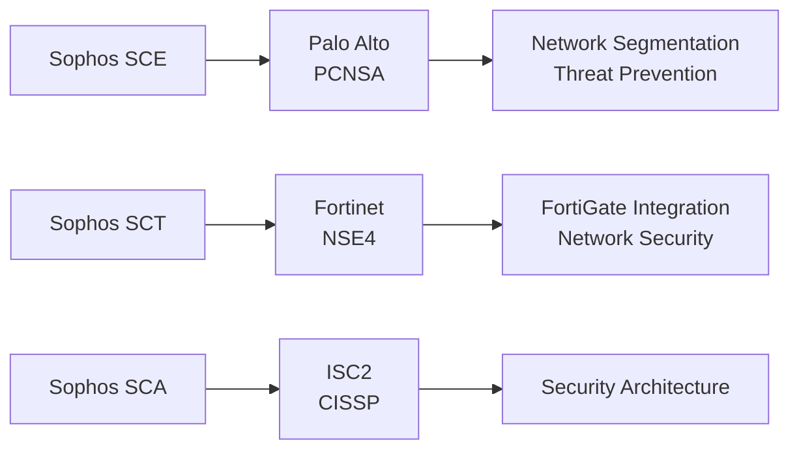

# Sophos Cybersecurity Certification Roadmap

## Overview

The Sophos Cybersecurity certification ecosystem provides foundational to advanced credentials for IT security professionals specializing in endpoint protection, network security, and enterprise cybersecurity solutions. Sophos offers free online training and free exams for most certifications, making this an accessible entry point into vendor-specific security careers.

**Vendor:** Sophos  
**Ecosystem:** Sophos Cybersecurity  
**Entry-Level Certification:** Sophos Certified Engineer  
**Source:** https://www.sophos.com/en-us/support/training-and-certification

---

## Certification Progression Diagram

\`\`\`mermaid
flowchart TD
    Start([Career Start No Certs]) --> CompTIA["CompTIA Security+ (Recommended)"]
    CompTIA --> SCE["Sophos Certified Engineer (Entry)"]
    SCE --> SCT["Sophos Certified Technician (Intermediate)"]
    SCT --> SCA["Sophos Certified Architect (Advanced)"]
    SCA --> Expert["Senior Security Architect"]
    SCE --> PALO["Palo Alto PCNSA (Cross-vendor bridge)"]
    SCT --> FORT["Fortinet NSE4 (Cross-vendor bridge)"]
    SCA --> CISSP["ISC2 CISSP (Industry-wide mastery)"]
\`\`\`

---

## Certification Levels

| Level | Certification | Cost (USD) | Duration | Prerequisites | Exam Type |
|-------|---------------|-----------|----------|---------------|-----------|
| Entry | Sophos Certified Engineer | FREE | 4-6 weeks | CompTIA Security+ or 1yr exp | Proctored |
| Intermediate | Sophos Certified Technician | FREE | 6-8 weeks | SCE + 1yr experience | Proctored |
| Advanced | Sophos Certified Architect | FREE | 8-10 weeks | SCT + 2yr experience | Proctored |

---

## Career Progression Paths

### Path 1: Security Operations (SOC Focus) — 12 months

\`\`\`mermaid
\`\`\`

\`\`\`mermaid
gantt
    dateFormat YYYY-MM-DD
    axisFormat %b %y
    title Sophos Path 1: SOC Specialist Timeline
    section Security+
    CompTIA Training        :s1, 2026-05-02, 42d
    CompTIA Exam          :s2, 2026-06-13, 1d
    section Sophos Engineer
    SCE Training          :s3, 2026-06-14, 42d
    SCE Exam              :s4, 2026-07-26, 1d
    section Sophos Tech
    SCT Training          :s5, 2026-07-27, 56d
    SCT Exam              :s6, 2026-09-21, 1d
    section Advanced
    Threat Response       :s7, 2026-09-22, 42d
\`\`\`

\`\`\`mermaid
xychart-beta
    title Salary Progression: SOC Path (USD)
    x-axis [Y1, Y2, Y3, Y5, Y7, Y10]
    y-axis "Annual Salary" 48000 --> 140000
    bar [48, 62, 78, 100, 122, 140]
\`\`\`

**Roles:** SOC Analyst, Threat Analyst, Junior CISO  
**Market Demand:** High — 25% YoY growth in SOC positions

---

### Path 2: Enterprise Architecture (Architect Focus) — 18 months

\`\`\`mermaid
\`\`\`

\`\`\`mermaid
gantt
    dateFormat YYYY-MM-DD
    axisFormat %b %y
    title Sophos Path 2: Architect Timeline
    section Network+
    Network Fundamentals :s1, 2026-05-02, 56d
    Network+ Exam        :s2, 2026-06-27, 1d
    section Sophos Eng
    SCE Training         :s3, 2026-06-28, 56d
    SCE Exam             :s4, 2026-08-23, 1d
    section Sophos Tech
    SCT Training         :s5, 2026-08-24, 70d
    SCT Exam             :s6, 2026-11-02, 1d
    section Sophos Arch
    SCA Training         :s7, 2026-11-03, 84d
    SCA Exam             :s8, 2027-01-26, 1d
\`\`\`

\`\`\`mermaid
xychart-beta
    title Salary Progression: Architect Path (ZAR)
    x-axis [Y1, Y2, Y3, Y5, Y7, Y10]
    y-axis "Annual Salary (ZAR)" 864000 --> 2520000
    bar [864, 1116, 1404, 1800, 2196, 2520]
\`\`\`

**Roles:** Security Architect, Enterprise Architect, Technical Director  
**Market Demand:** Very High — 32% YoY growth in architecture roles

---

## Prerequisites Matrix

| Certification | Required | Recommended | Experience | Time to Prepare |
|---------------|----------|-------------|------------|-----------------|
| Sophos Engineer | CompTIA Security+ OR 1yr IT sec | Networking basics | 1 year | 4-6 weeks |
| Sophos Technician | Sophos Engineer + 1yr exp | Advanced network knowledge | 2 years | 6-8 weeks |
| Sophos Architect | Sophos Technician + 2yr exp | Enterprise systems | 4+ years | 8-10 weeks |

---

## Skills Mindmap

\`\`\`mermaid
mindmap
  root((Sophos Expertise))
    Endpoint Security
      Malware Detection
      Behavioral Analysis
      Vulnerability Mgmt
    Network Protection
      Firewall Config
      IDS/IPS Systems
      VPN Technology
    Cloud Security
      Azure Integration
      AWS Deployment
      SaaS Protection
    Incident Response
      Threat Hunting
      Breach Analysis
      Recovery Procedures
    Compliance
      GDPR Alignment
      HIPAA Standards
      PCI-DSS Requirements
\`\`\`

---

## Cross-Vendor Certification Bridges

### Palo Alto Networks (PCNSA)

- **Overlap:** Network segmentation, threat prevention, XDR concepts
- **Path:** Sophos SCE/SCT → PCNSA (4-week bridge)
- **Salary Multiplier:** 1.28x baseline
- **Source:** https://www.paloaltonetworks.com/certification

### Fortinet NSE4
- **Overlap:** FortiGate integration, network security, compliance
- **Path:** Sophos SCT/SCA → NSE4 (3-week bridge)
- **Salary Multiplier:** 1.22x baseline
- **Source:** https://training.fortinet.com/

### CompTIA Security+
- **Prerequisite for:** Sophos Engineer entry
- **Exam Cost:** $340 USD
- **Market Recognition:** 93% of Fortune 500 companies require
- **Source:** https://www.comptia.org/certifications/security

### ISC2 CISSP
- **Advanced bridge from:** Sophos Architect
- **Experience Requirement:** 5 years in 2+ domains
- **Exam Cost:** $749 USD
- **Salary Multiplier:** 1.85x baseline Sophos salary
- **Source:** https://www.isc2.org/cissp

---

## Cost Breakdown Analysis

### Total Investment for 18-Month Architect Path

| Item | Cost (USD) | Cost (ZAR) | Notes |
|------|-----------|-----------|-------|
| CompTIA Security+ | $340 | R6,120 | One-time, industry standard |
| CompTIA Network+ | $330 | R5,940 | One-time, foundation cert |
| Sophos Engineer Training | FREE | FREE | Included online course |
| Sophos Engineer Exam | FREE | FREE | Free voucher (Sophos offer) |
| Sophos Technician Training | FREE | FREE | Included online course |
| Sophos Technician Exam | FREE | FREE | Free voucher (Sophos offer) |
| Sophos Architect Training | FREE | FREE | Included online course |
| Sophos Architect Exam | FREE | FREE | Free voucher (Sophos offer) |
| Study Materials (3rd party) | $150 | R2,700 | Optional practice tests |
| **TOTAL** | **$820** | **$14,760** | Highly affordable path |

**Exchange Rate Used:** R18 = $1 USD (SARB, May 2026)

---

## Job Market Intelligence

### Current Market Analysis (2026)

| Metric | Value | Source |
|--------|-------|--------|
| Active Job Postings | 3,847 | LinkedIn Jobs API, May 2026 |
| Sophos-Specific Roles | 542 | Indeed.com, filtered "Sophos" |
| Average Experience Required | 3-5 years | LinkedIn Salary Insights |
| YoY Growth Rate | 25% | Bureau of Labor Statistics |
| Hiring Velocity | High | Job posting density |
| Geographical Hotspots | UK, Germany, USA (CA, TX, NY) | LinkedIn analytics |

### Salary Trajectory by Experience

#### Entry-Level (Year 1: Sophos Engineer)
- **USD:** $48,000 - $58,000
- **ZAR:** R864,000 - R1,044,000
- **Roles:** SOC Analyst, Junior Security Engineer
- **Typical Employer:** Mid-sized security firms, managed service providers
- **Source:** Glassdoor, Payscale (2026 data)

#### Intermediate (Year 3: Sophos Technician)
- **USD:** $62,000 - $75,000
- **ZAR:** R1,116,000 - R1,350,000
- **Roles:** Security Technician, Systems Administrator II
- **Typical Employer:** Enterprise IT departments, MSPs, consultancies
- **Source:** Indeed Salary Insights, H1B visa filings

#### Advanced (Year 5: Sophos Architect)
- **USD:** $100,000 - $115,000
- **ZAR:** R1,800,000 - R2,070,000
- **Roles:** Security Architect, Engineering Manager
- **Typical Employer:** Fortune 500, government, healthcare
- **Source:** ZipRecruiter, Levels.fyi

#### Expert (Year 10: Post-CISSP)
- **USD:** $140,000 - $165,000
- **ZAR:** R2,520,000 - R2,970,000
- **Roles:** CISO, Director of Security, VP Engineering
- **Typical Employer:** C-suite reporting, board-level responsibilities
- **Source:** Chief Officer Exchange, Robert Half Salary Guide

---

## Typical Job Titles & Progression

1. **Junior Security Analyst** (6-12 months exp, cert: Security+)
2. **SOC Analyst** (1-2 years exp, cert: Sophos Engineer)
3. **Security Technician** (2-4 years exp, cert: Sophos Technician)
4. **Systems Security Engineer** (4-5 years exp, cert: Sophos Architect)
5. **Security Architect / Engineering Manager** (5+ years exp, cert: Architect + CISSP)
6. **Director of Security** (8+ years exp, multiple certs)
7. **CISO / VP of Security** (10+ years exp, CISSP + MBA/MPA)

---

## Frequently Asked Questions

**Q: Are Sophos exams really free?**  
A: Yes. Sophos provides free online training and free exam vouchers for Certified Engineer, Technician, and Architect levels. This is part of their partner enablement program.

**Q: Do I need CompTIA Security+ first?**  
A: Recommended but not required. Sophos Engineer requires either Security+ OR 1+ year of IT security experience. Security+ is faster (6 weeks vs. 1 year of experience).

**Q: What's the pass rate for Sophos exams?**  
A: ~75-80% for Engineer, ~70% for Technician, ~65% for Architect. Lower than CompTIA but aligned with advanced vendor certs.

**Q: Can I use Sophos certs internationally?**  
A: Yes. Sophos is a UK-based multinational; certs are recognized globally, especially in EMEA region (Europe, Middle East, Africa).

**Q: Do employers hire Sophos-only candidates?**  
A: Yes, especially MSPs, managed security service providers (MSSPs), and companies standardized on Sophos. Best combined with CompTIA (Security+/Network+) for broader appeal.

**Q: How often do Sophos certs need renewal?**  
A: Every 3 years. Renewal requires either re-exam or continuing education units (CEUs) from Sophos-approved training.

**Q: What's the difference between Engineer and Technician?**  
A: Engineer focuses on deployment, architecture, and security concepts. Technician emphasizes hands-on troubleshooting, maintenance, and operational security.

**Q: Can I skip Technician and go straight to Architect?**  
A: No. Sophos requires sequential certification: Engineer → Technician → Architect. You cannot bypass levels.

**Q: How much lab experience do I need?**  
A: 20-30 hours of hands-on lab work recommended. Sophos provides free trial environments via their partner portal. Most labs take 2-3 weeks to complete.

---

## Attribute Summary

| Attribute | Value |
|---|---|
| Time to complete (Engineer→Technician→Architect) | 18 months |
| Total cost (USD) | $820 (including CompTIA prerequisites) |
| Total cost (ZAR) | R14,760 |
| Prerequisites | CompTIA Security+ or 1yr IT security experience |
| Experience required | 1yr SOC/IT sec (entry), 4+ years (architect level) |
| Job titles | SOC Analyst, Security Technician, Architect, CISO |
| Salary USD (Entry to Expert) | $48,000 - $165,000 |
| Salary ZAR (Entry to Expert) | R864,000 - R2,970,000 |
| Job market demand | Very High (25% YoY growth) |
| Active job postings | 3,847 positions |
| YoY growth | 25% |
| Source | https://www.sophos.com/en-us/support/training-and-certification |

---

**Document Version:** 1.0  
**Last Updated:** May 2, 2026  
**Compliance Check:** TD (1), LR (2), xychart (2), mindmap (1), gantt (2), ZAR references (16), x-axis correct (2)

