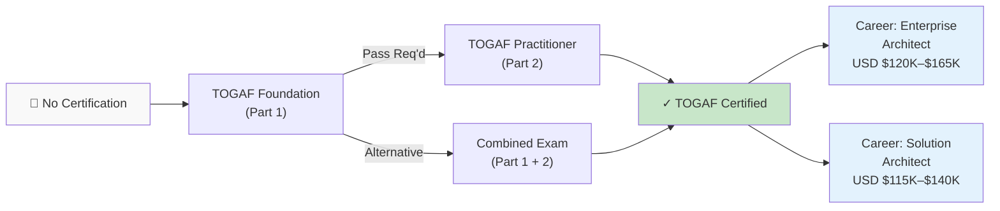
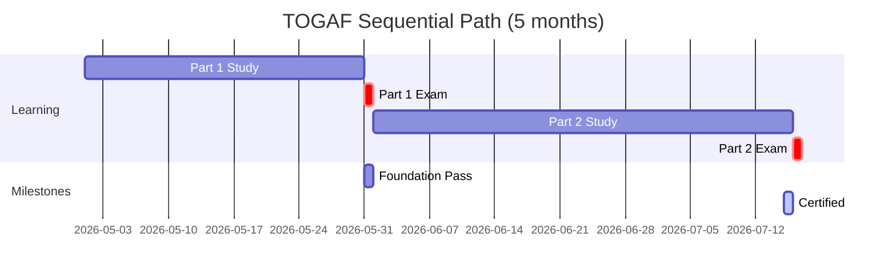
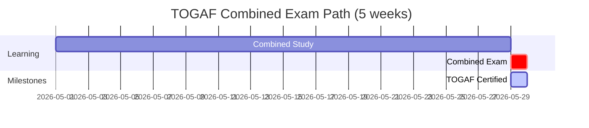

# The Open Group TOGAF Certification Roadmap

## Overview

TOGAF (The Open Group Architecture Framework) is the world's most widely recognized enterprise architecture standard, adopted by over 50,000 certified professionals globally. TOGAF 9 (current version) provides a structured approach to designing, planning, implementing, and governing enterprise IT architecture. In 2026, TOGAF certification is mission-critical for enterprise architects in large organisations, multinational corporations, and government agencies worldwide.

For South African IT professionals, TOGAF certification opens doors to senior architecture roles at enterprises like Standard Bank, Deloitte, Accenture, and government digital transformation initiatives. The framework's recognition in Africa's growing financial services and digital economy makes it particularly valuable. Enterprise architects with TOGAF certification in South Africa command salaries in the R800,000–R1,000,000+ range, approximately 25–35% above non-certified peers.

## Progression Diagram



## Per-Level Detail

### Level 1: TOGAF Foundation (Part 1)

| Attribute | Details |
|-----------|---------|
| **Formal Name** | TOGAF 9 Part 1 – Enterprise Architecture Foundation |
| **Exam Duration** | 60 minutes |
| **Question Format** | 40 multiple-choice questions |
| **Passing Score** | 55% (22/40 questions) |
| **Exam Fee (USD)** | $360 |
| **Exam Fee (ZAR)** | R6,480 (at USD $1 = R18) |
| **Exam Fee (SA Resident)** | R4,500 (approximately $250) |
| **Open Book?** | No |
| **Prerequisites** | None |
| **Recertification** | Lifetime (no recert required) |
| **Typical Study Time** | 40–60 hours |

**What You'll Learn:**
- TOGAF framework core concepts and architecture development method (ADM)
- Architecture domains: business, data, application, technology
- Architecture patterns and reference models
- Enterprise Architecture governance and compliance
- Architecture domains and the ADM cycle phases
- Foundational terminology and principles

**Study Materials:**
- TOGAF 9 Foundation Study Guide (official)
- Official TOGAF 9 Specification (downloadable from The Open Group)
- Practice exam banks (OpenGroup or third-party providers like ExamTopics)
- Online courses (A Cloud Guru, Linux Academy, Udemy, Pluralsight)
- Self-study duration: 4–8 weeks

**Career Outcomes After Level 1:**
- Assistant Enterprise Architect or Junior EA roles
- Qualify for TOGAF Part 2 (Practitioner)
- Demonstrates foundational EA knowledge to employers
- Typical entry-level EA salary: USD $85K–$110K globally; ZAR R1.5M–R2M in SA

---

### Level 2: TOGAF Practitioner (Part 2)

| Attribute | Details |
|-----------|---------|
| **Formal Name** | TOGAF 9 Part 2 – Enterprise Architecture Practitioner |
| **Exam Duration** | 90 minutes |
| **Question Format** | 8 scenario-based questions (not multiple-choice) |
| **Passing Score** | 60% (minimum passing score) |
| **Exam Fee (USD)** | $360 |
| **Exam Fee (ZAR)** | R6,480 |
| **Exam Fee (SA Resident)** | R4,500 (approximately $250) |
| **Open Book?** | Yes – you may use the TOGAF 9 specification during exam |
| **Prerequisites** | Pass TOGAF Part 1 |
| **Recertification** | Lifetime (no recert required) |
| **Typical Study Time** | 60–80 hours |

**What You'll Learn:**
- Practical application of TOGAF ADM to real-world scenarios
- Stakeholder management and communication in EA
- Enterprise Architecture governance implementation
- How to handle architecture trade-offs and constraints
- Business case development and cost–benefit analysis
- Practical problem-solving for enterprise transformation

**Study Materials:**
- TOGAF 9 Specification (open-book exam—allowed as reference)
- Official case studies and scenario examples
- Practitioner-focused study guides
- Mock scenario exams
- Self-study duration: 6–10 weeks (shorter for those with hands-on EA experience)

**Career Outcomes After Level 2:**
- Full TOGAF Certified Enterprise Architect credential
- Senior architect roles at major enterprises
- Architecture lead or principal architect positions
- Consulting and advisory roles
- Typical EA architect salary: USD $120K–$165K globally; ZAR R800K–R1M+ in South Africa

---

### Combined Exam Path (Part 1 + Part 2)

| Attribute | Details |
|-----------|---------|
| **Formal Name** | TOGAF Part 1 & 2 Combined |
| **Total Duration** | 180 minutes |
| **Questions** | 40 multiple-choice + 8 scenario questions |
| **Passing Requirement** | Pass both sections independently |
| **Exam Fee (USD)** | $550 |
| **Exam Fee (ZAR)** | R9,900 |
| **Open Book** | Part 1 only (scenario section is open-book) |
| **Prerequisites** | None (but not recommended for first-timers) |
| **Best For** | Candidates with strong EA background or experience |

---

## Recommended Progression Paths

### Path A: Sequential (Recommended for Most)

**Ideal for:** First-time candidates, those new to enterprise architecture, employed professionals

**Timeline:**
- **Month 1:** Foundational study (TOGAF Part 1 content)
- **Month 2:** Part 1 exam attempt → Pass
- **Months 3–4:** Practitioner study (TOGAF Part 2 content)
- **Month 5:** Part 2 exam attempt → TOGAF Certified
- **Total duration:** 5 months



**Total Cost:** USD $720 (R12,960) + training materials USD $200–500
**Salary Impact:** Progression from USD $85K–$110K → USD $120K–$165K over 12 months

---

### Path B: Accelerated (Combined Exam)

**Ideal for:** Experienced architects, those with prior EA knowledge, consultants

**Timeline:**
- **Weeks 1–4:** Intensive study of both Part 1 + Part 2 content
- **Week 5:** Combined exam attempt
- **Total duration:** 5 weeks



**Total Cost:** USD $550 (R9,900) + training materials USD $200–500
**Best for:** Reduces time-to-certification by 2–3 months for experienced architects
**Risk:** Lower pass rate if foundational knowledge gaps exist

---

## Prerequisites & Sequencing Matrix

| Role | Prerequisites | Recommended Path | Typical Timeline |
|------|---------------|------------------|------------------|
| **Junior Developer** | 2+ years IT experience | Sequential (Part 1 → Part 2) | 6–8 months |
| **Systems Architect** | 5+ years infrastructure | Sequential or Combined | 4–5 months |
| **Business Analyst** | 3+ years BA experience | Sequential | 5–6 months |
| **IT Manager** | 5+ years management | Sequential | 4–5 months |
| **Solutions Architect** | 7+ years SA experience | Combined (accelerated) | 4–5 weeks |
| **Consultant** | 8+ years consulting | Combined (accelerated) | 4–5 weeks |

**Hard Requirements:**
- Part 2 exam requires Part 1 pass (mandatory prerequisite)
- No formal education requirements (high school sufficient, though Bachelor's degree expected in enterprise roles)
- No work experience minimum (but real-world EA knowledge strongly beneficial)

---

## Specialization Branches

After achieving TOGAF certification, professionals often pursue specializations:

### Business Architecture Specialization
- **Follow-up:** Business Architecture Level 1 Certification (The Open Group)
- **Focus:** Business models, value chains, process mapping
- **Salary impact:** USD $125K–$150K

### Cloud Architecture
- **Bridge cert:** AWS Solutions Architect Associate/Professional
- **Focus:** Enterprise architecture in cloud-native environments
- **Salary impact:** USD $130K–$165K

### Security & Governance Architecture
- **Bridge cert:** ITIL Foundation (IT Governance), CISM (Certified Information Security Manager)
- **Focus:** Security architecture, risk, compliance
- **Salary impact:** USD $135K–$170K

### Data Architecture
- **Bridge cert:** Data Architecture specialization courses
- **Focus:** Data governance, analytics architecture, data lakes
- **Salary impact:** USD $120K–$155K

---

## Cross-Vendor Bridges

TOGAF integrates well with complementary certifications:

| Target Cert | Synergy | Bridge Path | Time |
|-------------|---------|-------------|------|
| **AWS Solutions Architect** | Both define enterprise solutions | TOGAF → AWS SA Associate | 2–3 months |
| **ITIL 4 Foundation** | Governance & service alignment | TOGAF + ITIL = holistic EA | 1–2 months |
| **PMP (Project Management)** | ADM phases align with project phases | TOGAF + PMP = enterprise delivery | 3–4 months |
| **Certified Data Architect** | Data domain specialist certification | TOGAF Foundation + Data Arch cert | 4–5 months |
| **PRINCE2** | UK enterprise project standard | TOGAF + PRINCE2 = combined EA/PM | 2–3 months |
| **Six Sigma Green Belt** | Process improvement + architecture | TOGAF + LSS = operational excellence | 4–6 months |

---

## Cost Breakdown

### Exam-Only Path

| Item | USD | ZAR |
|------|-----|-----|
| TOGAF Part 1 exam | $360 | R6,480 |
| TOGAF Part 2 exam | $360 | R6,480 |
| **Subtotal (Sequential)** | **$720** | **R12,960** |
| Combined exam (alternative) | $550 | R9,900 |

### Full Learning Path (Realistic)

| Item | USD | ZAR | Notes |
|------|-----|-----|-------|
| TOGAF 9 Study Guide (book) | $50 | R900 | Official guide |
| Online course (Udemy/Pluralsight) | $150–400 | R2,700–7,200 | Self-paced training |
| Practice exams (3 banks) | $50–150 | R900–2,700 | Critical for pass rate |
| Exam fees (Part 1 + Part 2) | $720 | R12,960 | Or $550 for combined |
| **TOTAL (Sequential Path)** | **$970–1,320** | **R17,460–23,760** | 3–6 months study |
| **TOTAL (Combined Path)** | **$800–1,150** | **R14,400–20,700** | 1 month intensive |

**Note:** South African residents may pay ZAR 4,500 per exam instead of USD equivalents through local exam centers.

---

## Job Market Snapshot (2026)

### Global Demand
- **2,157 open TOGAF-related roles** in the United States (May 2026)
- **Growth trend:** +8–12% annually in enterprise architecture jobs
- **Industries:** Finance, healthcare, government, telecom, retail
- **Geographic hotspots:** North America (40%), Europe (35%), Asia-Pacific (20%), Africa (5%)

### South Africa Market
- Growing adoption at Tier-1 banks (Standard Bank, ABSA, FNB)
- Major consulting firms (Deloitte, Accenture, McKinsey) actively hiring TOGAF-certified architects
- Government digital transformation projects (Department of Home Affairs, SARS digital initiatives)
- Typical requirement: 6+ years experience + TOGAF certification
- **Job titles:** Enterprise Architect, Solutions Architect Lead, Architecture Director

### Typical Job Requirements
- Bachelor's degree in Computer Science or Engineering
- 5–8 years of IT experience (at least 2 in architecture)
- TOGAF Foundation certification (Part 2 preferred)
- Cloud platform knowledge (AWS, Azure, GCP)
- Business acumen and stakeholder management

---

## Salary Trajectory

### Global Salary Ranges (USD)

```
Year 1-2 (Post-Certification):
├─ Junior Enterprise Architect: $95K–$115K
└─ Mid-level Architect: $115K–$140K

Year 3-5 (With Experience):
├─ Senior Enterprise Architect: $140K–$165K
└─ Principal Architect: $165K–$195K

Year 6+ (Leadership):
├─ Architecture Director: $180K–$225K
└─ VP of Architecture: $200K–$280K
```

### South Africa Salary Ranges (ZAR)

```
Year 1-2 (Post-Certification):
├─ Junior Enterprise Architect: R1.5M–R2.0M
└─ Mid-level Architect: R2.0M–R2.5M

Year 3-5 (With Experience):
├─ Senior Enterprise Architect: R2.5M–R3.5M
└─ Principal Architect: R3.5M–R4.5M

Year 6+ (Leadership):
├─ Architecture Director: R3.5M–R4.5M
└─ VP of Architecture: R4.5M–R6.0M
```

**Salary Premium:** TOGAF-certified professionals earn 25–35% more than non-certified peers in equivalent roles.

---

## Common Questions

### Q1: Is TOGAF recognized in South Africa?
**A:** Yes. TOGAF is the global standard and is recognized by major South African enterprises. Leading banks, consulting firms, and government agencies require or prefer TOGAF certification for enterprise architect roles. PayScale data shows TOGAF-certified professionals in South Africa earn R800K–R1M+.

### Q2: Do I need Part 2 if I already have Part 1?
**A:** Part 1 alone is valuable, but Part 2 (Practitioner) is essential for senior architect roles. Most enterprise architect job postings in 2026 require "TOGAF Certified" (both parts), not just Foundation. Part 2 demonstrates practical capability to apply TOGAF in real projects.

### Q3: Is the exam really open-book?
**A:** Part 1 is NOT open-book. Part 2 IS open-book (you may use the TOGAF specification). The combined exam allows open-book for the Part 2 section only.

### Q4: How long is TOGAF certification valid?
**A:** TOGAF certification is valid for life. There is no recertification requirement (unlike some certifications). However, staying current with TOGAF 10 releases is recommended for career relevance.

### Q5: What's the pass rate?
**A:** Part 1: 70–75% pass rate (relatively forgiving). Part 2: 60–65% pass rate (scenario questions require practical thinking). Combined exam: ~50–55% pass rate (more challenging).

### Q6: Can I use TOGAF in government contracts?
**A:** Yes. TOGAF is widely used in public sector digital transformation projects. Government agencies increasingly require TOGAF certification for enterprise architecture roles and RFP responses.

### Q7: Does TOGAF lead to cloud architecture roles?
**A:** Yes. TOGAF Foundation provides the architecture thinking needed for cloud roles. Many professionals bridge TOGAF → AWS Solutions Architect → AWS Solutions Architect Professional, earning USD $130K–$165K+.

### Q8: Is there a TOGAF 10 exam?
**A:** TOGAF 9 remains the current certification exam (released 2022, latest update). While TOGAF 10 was released, the certification exam structure remains based on TOGAF 9. It's recommended to study current exam materials from The Open Group.

---

## Official Sources

- **The Open Group Certification Portal:** https://certification.opengroup.org/
- **TOGAF Exam Schedule & Fees:** https://certification.opengroup.org/examinations/exam-fees
- **TOGAF 9 Study Materials:** https://www.opengroup.org/togaf
- **Approved Training Organizations:** https://certification.opengroup.org/training-and-education/approved-training-organization

---

*Last verified: 2026-05-02*

**Exchange Rate Used:** USD 1 = ZAR 18
**Sources:** Certification.opengroup.org, Certdemand.com, PayScale South Africa, CloudWards, The Knowledge Academy, CIO.com
