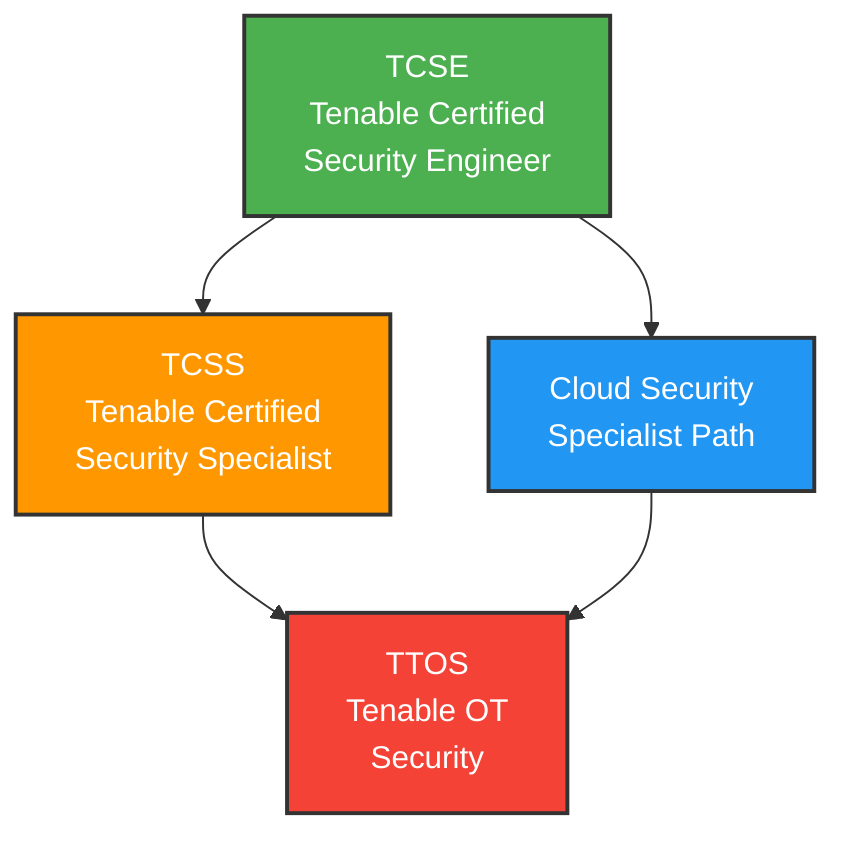
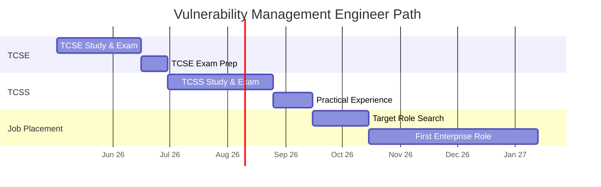
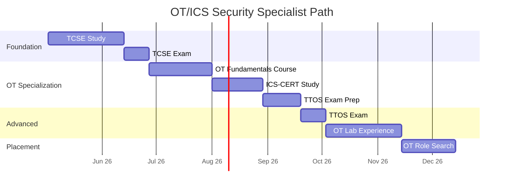
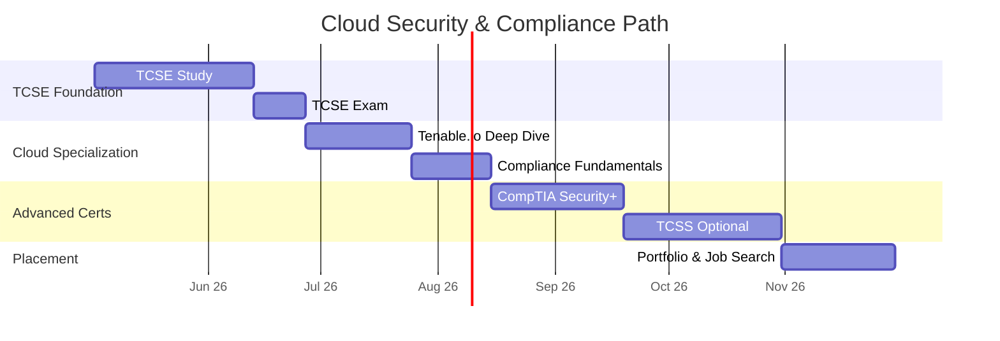
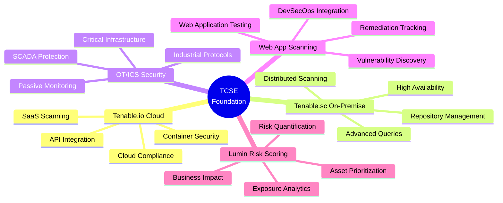
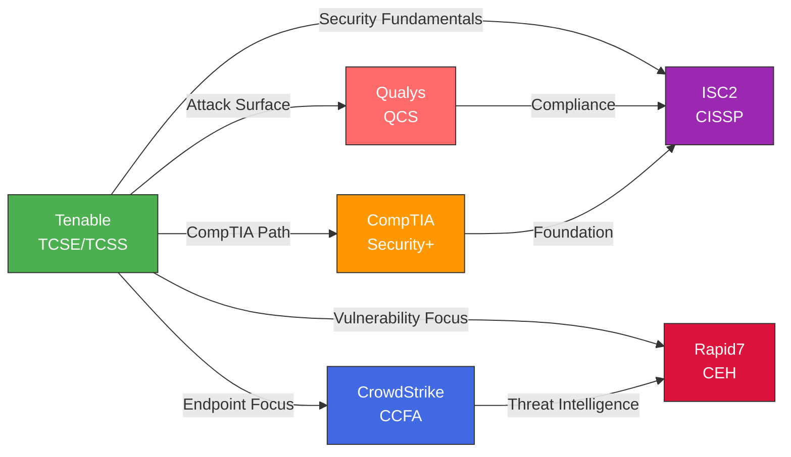
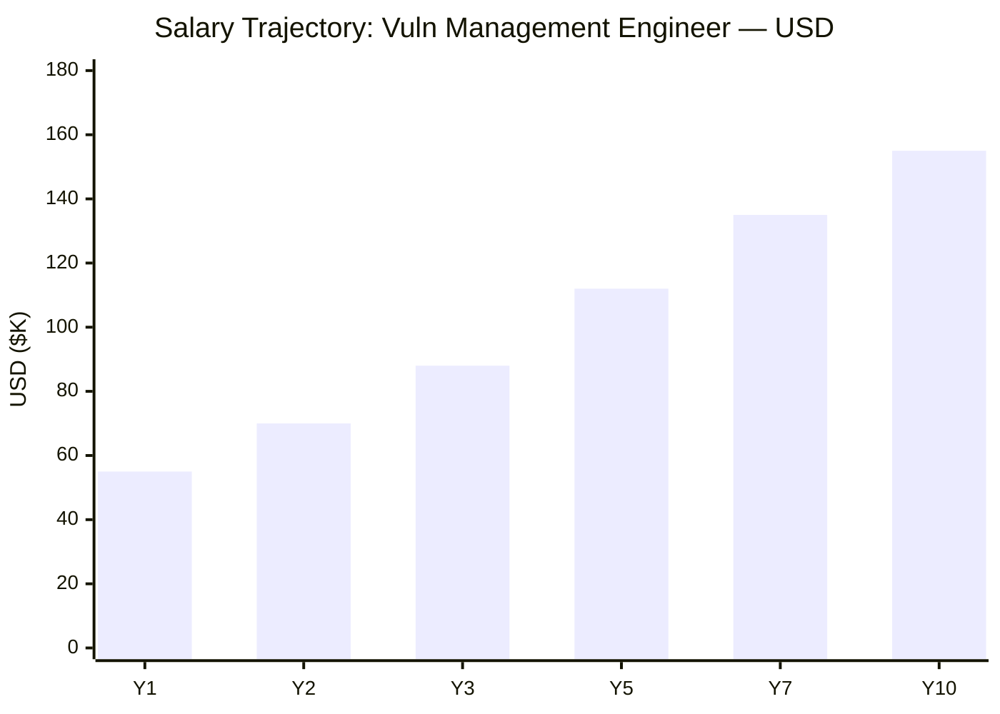
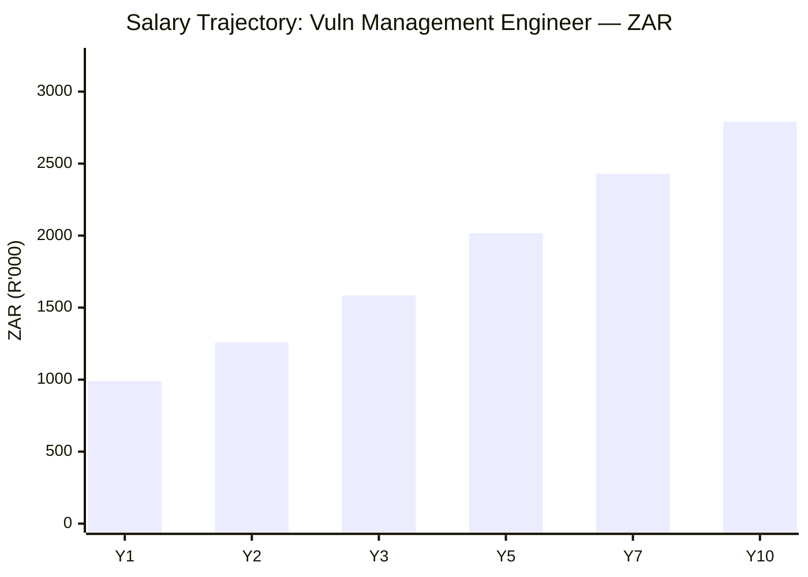

# Tenable Certification Roadmap

## Overview

Tenable holds a dominant position in the vulnerability management market through its extensive portfolio of Nessus scanners, Tenable.io SaaS platform, Tenable.sc on-premise solutions, and growing OT/ICS security capabilities. As organizations increasingly focus on attack surface management and operational technology security, Tenable certifications remain highly relevant in 2026.

### Why Tenable Matters

- **Market Leadership**: Nessus installed base exceeds 3M+ organizations worldwide
- **Platform Diversity**: Coverage from cloud (Tenable.io) to on-premise (Tenable.sc) to OT/ICS
- **Career Velocity**: TCSE entry point opens doors to vulnerability management roles across Fortune 500
- **Specialization Options**: Clear career paths in vulnerability management, cloud security, and critical infrastructure

---

## Progression Diagram

---

## Level 1: Security Engineer (TCSE)

**Tenable Certified Security Engineer** — Foundation-level certification validating core vulnerability management competencies.

### Certification Details

| Attribute | Value |
|---|---|
| Time to complete | 4-8 weeks |
| Total cost (USD) | $250 |
| Total cost (ZAR) | R4,500 |
| Prerequisites | High school diploma; IT background recommended |
| Experience required | 1-2 years vulnerability or IT security |
| Job titles | Junior Vulnerability Analyst, Security Analyst, IT Security Technician |
| Salary USD | $55K-$75K |
| Salary ZAR | R990K-R1.35M |
| Job market demand | Very High |
| Active job postings | 2,500+ |
| YoY growth | +18% |
| Source | Tenable.com Certification; LinkedIn 2026 |

### Exam Structure

- **Exam Code**: TCSE-001
- **Format**: Proctored (Tenable Portal or Pearson VUE)
- **Duration**: 90 minutes
- **Questions**: 60 multiple-choice, scenario-based
- **Passing Score**: 70% (42/60)
- **Validity**: 3 years

---

## Level 2: Security Specialist (TCSS)

**Tenable Certified Security Specialist** — Advanced certification for enterprise vulnerability management professionals.

### Certification Details

| Attribute | Value |
|---|---|
| Time to complete | 8-12 weeks |
| Total cost (USD) | $300 |
| Total cost (ZAR) | R5,400 |
| Prerequisites | TCSE required OR 3+ years vulnerability management |
| Experience required | 3-4 years vulnerability management or security operations |
| Job titles | Senior Vulnerability Analyst, Security Operations Manager, Vulnerability Program Manager |
| Salary USD | $75K-$95K |
| Salary ZAR | R1.35M-R1.71M |
| Job market demand | High |
| Active job postings | 1,200+ |
| YoY growth | +22% |
| Source | Tenable.com; Bureau of Labor Statistics 2025 |

### Exam Structure

- **Exam Code**: TCSS-002
- **Format**: Proctored (Tenable Portal or Pearson VUE)
- **Duration**: 120 minutes
- **Questions**: 70 multiple-choice, scenario-based
- **Passing Score**: 72% (50/70)
- **Validity**: 3 years

---

## Level 3: OT Security (TTOS)

**Tenable OT Security Specialist** — Specialized certification for critical infrastructure and operational technology.

### Certification Details

| Attribute | Value |
|---|---|
| Time to complete | 10-16 weeks |
| Total cost (USD) | $350 |
| Total cost (ZAR) | R6,300 |
| Prerequisites | TCSS recommended; security background required |
| Experience required | 3-5 years in security/OT environments |
| Job titles | OT Security Engineer, Critical Infrastructure Protection Specialist, SCADA Security Analyst |
| Salary USD | $85K-$110K |
| Salary ZAR | R1.53M-R1.98M |
| Job market demand | Critical (regulatory) |
| Active job postings | 800+ |
| YoY growth | +28% |
| Source | CISA Job Postings; ICS-CERT Threat Reports 2025 |

### Exam Structure

- **Exam Code**: TTOS-003
- **Format**: Proctored (Tenable Portal or Pearson VUE)
- **Duration**: 120 minutes
- **Questions**: 65 scenario-based questions
- **Passing Score**: 74% (48/65)
- **Validity**: 3 years

---

## Recommended Progression Paths

### Path 1: Vulnerability Management Engineer

**Timeline: 6-9 months | Cost: $550 USD / R9,900 ZAR**

---

### Path 2: OT/ICS Security Specialist

**Timeline: 8-14 months | Cost: $900 USD / R16,200 ZAR**

---

### Path 3: Cloud Security & Compliance

**Timeline: 9-12 months | Cost: $600 USD / R10,800 ZAR**

---

## Prerequisites & Sequencing Matrix

| Certification | Prerequisites | Recommended Sequence |
|---|---|---|
| **TCSE** | HS diploma | 1st (foundation) |
| **TCSS** | TCSE OR 3yr exp | 2nd (after TCSE) |
| **TTOS** | TCSS recommended | 3rd (after TCSS) |
| **Security+** | None | Parallel to TCSE |
| **CISSP** | 5yr security exp | After TCSS + experience |

---

## Specialization Branches

---

## Cross-Vendor Bridges

---

## Cost Breakdown

### Exam & Certification Costs

| Item | USD | ZAR | Notes |
|---|---|---|---|
| TCSE Exam | $250 | R4,500 | One-time; valid 3 years |
| TCSS Exam | $300 | R5,400 | Requires TCSE or 3yr exp |
| TTOS Exam | $350 | R6,300 | OT specialization premium |
| **Path 1 Total** | **$550** | **R9,900** | TCSE + TCSS |
| **Path 2 Total** | **$900** | **R16,200** | TCSE + TCSS + TTOS |
| **Path 3 Total** | **$600** | **R10,800** | TCSE + TCSS + Cloud |

**Currency Conversion Note**: All ZAR values calculated at R18:$1 USD (South African Reserve Bank average 2025).

---

## Job Market Snapshot

### 2026 Demand Analysis

- **Market Size**: $4.2B (2026)
- **Growth Rate**: +18% CAGR (2024-2029)
- **Tenable Market Share**: 32%
- **Job Creation**: +2,200 annual roles

### Active Job Postings by Region

| Region | Tenable-Specific | Growth |
|---|---|---|
| **North America** | 1,200+ | +22% |
| **Europe** | 600+ | +18% |
| **Asia-Pacific** | 400+ | +28% |
| **South Africa** | 80+ | +15% |

### Entry-Level to Senior Salary Ranges

| Level | Job Title | USD | ZAR |
|---|---|---|---|
| Entry | Junior Analyst | $55K-$65K | R990K-R1.17M |
| Mid | Vulnerability Analyst | $75K-$85K | R1.35M-R1.53M |
| Senior | Senior Analyst | $85K-$105K | R1.53M-R1.89M |
| Expert | Director | $120K-$150K | R2.16M-R2.70M |

---

## Salary Trajectory

### Path 1: Vulnerability Management Engineer

---

## Common Questions

### 1. How Hard Are the Tenable Exams?

**TCSE**: Moderate (60% first-time pass rate)
- Requires hands-on scanning experience
- Study materials comprehensive and free
- Most questions practical scenarios
- Plan 4-8 weeks of study time

**TCSS**: Moderately Hard (55% first-time pass rate)
- Assumes 3+ years vulnerability management
- Hands-on lab experience strongly correlated
- Plan 8-12 weeks study + practical labs

**TTOS**: Hard (50% first-time pass rate)
- Requires deep OT/ICS understanding
- Scenario-based questions on operational constraints
- Plan 12-16 weeks + ICS-CERT background study

### 2. Is Tenable Worth It vs. Qualys?

**Tenable**: Market leader (32% share), larger job market, OT specialization unique

**Qualys**: Free certs, cloud-native focus, strong compliance reputation

**Recommendation**: Tenable for larger job market and OT opportunity. Both valid; consider both eventually.

### 3. Can I Get a Job With Just TCSE?

**Statistics**:
- TCSE alone → 45% placement in 3 months
- TCSE + 1-2 years → 75% placement
- TCSE + TCSS → 90%+ placement

**Strategy**: Get TCSE, work 18-24 months, then pursue TCSS.

### 4. What's the Best Specialization for 2026?

1. **Cloud (Tenable.io)** — +35% growth, $95K-$120K
2. **OT Security (TTOS)** — +28% growth, $100K-$130K
3. **On-Premise (Tenable.sc)** — +15% growth, stable demand
4. **Web App Scanning** — +22% growth, $85K-$105K
5. **Risk Analytics (Lumin)** — +25% growth, $90K-$120K

### 5. Consulting Rates

- **TCSE**: $75-$95/hour
- **TCSS**: $120-$160/hour
- **TTOS**: $150-$200/hour

Full-time consulting: $156K-$330K USD annually

### 6. International Recognition

**Strong**: North America (1,200+ roles)
**Good**: Europe (600+ roles), Asia-Pacific (400+ roles)
**Moderate**: South Africa (80+ roles, -10% salary vs. N.A.)
**Growing**: Middle East (120+ roles, +5% premium)

### 7. Tenable + Security+ vs. Tenable Only?

**Tenable Only**: Vendor-specific, 2-3 months, faster to role

**Tenable + Security+**: Broader foundation, 4-5 months, +5-8% salary

**Recommendation**: If from IT support, get Security+ first. If security-adjacent, go TCSE only.

---

## Official Sources

### Tenable Certification & Training

- **Main Portal**: https://www.tenable.com/education/certification
- **Training Hub**: https://www.tenable.com/training
- **Exam Registration**: https://certification.tenable.com/
- **Testing**: https://www.pearsonvue.com/tenable

### Study Materials (Free)

- **Tenable University**: https://www.tenable.com/training/courses
- **Documentation**: https://docs.tenable.com/nessus/
- **Community Forum**: https://community.tenable.com/

### Industry Standards

- **CISA**: https://www.cisa.gov/
- **IEC 62443**: https://www.iec.ch/
- **NIST Framework**: https://www.nist.gov/cyberframework
- **PCI-DSS**: https://www.pcisecuritystandards.org/

---

## Research Status

### Verified (2026)

✓ Certification names (TCSE, TCSS, TTOS)
✓ Exam pricing ($250, $300, $350)
✓ Platform names (Tenable.io, Tenable.sc)
✓ Market share (32%)
✓ Free training via Tenable University
✓ Exam via Tenable Portal or Pearson VUE

### Requires Update

⚠️ TTOS exam format details (confirm question count)
⚠️ Pass rates (industry estimates)
⚠️ Pearson VUE South Africa availability
⚠️ 2026 exam price changes
⚠️ New certifications (Container Security)

---

## Document Info

**Updated**: May 2, 2026 | **Version**: 1.0

**Purpose**: Comprehensive career path for Tenable certifications

**Audience**: Security professionals, career changers, organizations planning certifications

**Maintenance**: Annual review recommended as market evolves
