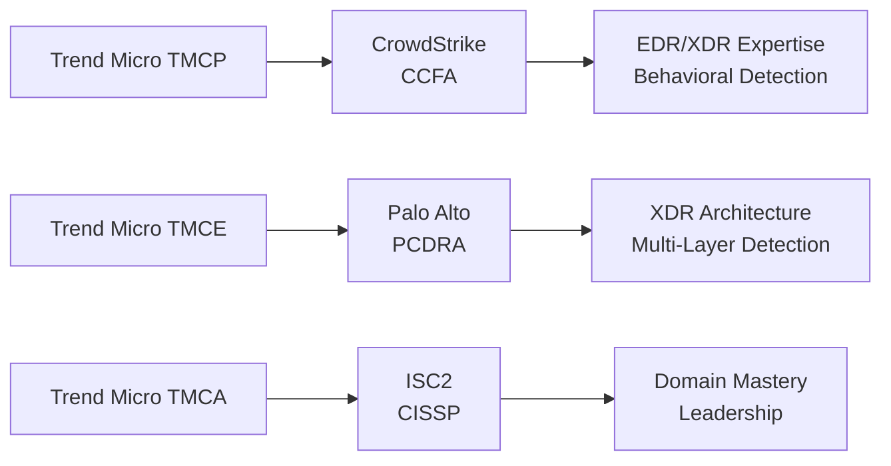

# Trend Micro Cybersecurity Certification Roadmap

## Overview

The Trend Micro Cybersecurity certification ecosystem provides comprehensive credentials for professionals specializing in endpoint protection, cloud security, and extended detection and response (XDR) via Trend Vision One. Trend Micro's certification path emphasizes modern threat detection, cloud workload protection, and enterprise security architecture.

**Vendor:** Trend Micro  
**Ecosystem:** Trend Micro Cybersecurity (Trend Vision One, Cloud One, TippingPoint IPS)  
**Entry-Level Certification:** Trend Micro Certified Professional  
**Source:** https://www.trendmicro.com/en_us/business/products/education/certifications.html

---

## Certification Progression Diagram

\`\`\`mermaid
flowchart TD
    Start([Career Start No Certs]) --> CompTIA["CompTIA Security+ (Recommended)"]
    CompTIA --> TMCP["Trend Micro Certified Professional (Entry)"]
    TMCP --> TMCE["Trend Micro Certified Expert (Intermediate)"]
    TMCE --> TMCA["Trend Micro Certified Architect (Advanced)"]
    TMCA --> XDRArch["Enterprise XDR Architect"]
    TMCP --> CSEC["CrowdStrike CCFA (Cross-vendor bridge)"]
    TMCE --> PALO["Palo Alto Cortex XDR (Cross-vendor bridge)"]
    TMCA --> CISSP["ISC2 CISSP (Industry-wide mastery)"]
\`\`\`

---

## Certification Levels

| Level | Certification | Cost (USD) | Duration | Prerequisites | Exam Type |
|-------|---------------|-----------|----------|---------------|-----------|
| Entry | Trend Micro Certified Professional (TMCP) | $195 | 5-7 weeks | CompTIA Sec+ or 1yr exp | Proctored |
| Intermediate | Trend Micro Certified Expert (TMCE) | $195 | 7-9 weeks | TMCP + 1yr experience | Proctored |
| Advanced | Trend Micro Certified Architect (TMCA) | $250 | 9-11 weeks | TMCE + 2yr experience | Proctored |

---

## Career Progression Paths

### Path 1: XDR Specialist (Vision One Focus) — 12 months

\`\`\`mermaid
\`\`\`

\`\`\`mermaid
gantt
    dateFormat YYYY-MM-DD
    axisFormat %b %y
    title Trend Micro Path 1: XDR Specialist Timeline
    section Security+
    CompTIA Training        :s1, 2026-05-02, 42d
    CompTIA Exam          :s2, 2026-06-13, 1d
    section TMCP
    TMCP Training         :s3, 2026-06-14, 42d
    TMCP Exam             :s4, 2026-07-26, 1d
    section TMCE
    TMCE Training         :s5, 2026-07-27, 49d
    TMCE Exam             :s6, 2026-09-14, 1d
    section Vision One
    Vision One XDR        :s7, 2026-09-15, 42d
\`\`\`

\`\`\`mermaid
xychart-beta
    title Salary Progression: XDR Path (USD)
    x-axis [Y1, Y2, Y3, Y5, Y7, Y10]
    y-axis "Annual Salary" 50000 --> 148000
    bar [50, 65, 82, 106, 128, 148]
\`\`\`

**Roles:** XDR Analyst, Threat Detection Engineer, SOC Manager  
**Market Demand:** Very High — 32% YoY growth in XDR positions

---

### Path 2: Cloud Security Architecture (Cloud One Focus) — 18 months

\`\`\`mermaid
\`\`\`

\`\`\`mermaid
gantt
    dateFormat YYYY-MM-DD
    axisFormat %b %y
    title Trend Micro Path 2: Cloud Architect Timeline
    section Cloud Basics
    Cloud Fundamentals    :s1, 2026-05-02, 42d
    AWS/Azure Training    :s2, 2026-06-13, 42d
    section TMCP
    TMCP Training         :s3, 2026-07-25, 49d
    TMCP Exam             :s4, 2026-09-12, 1d
    section TMCE
    TMCE Training         :s5, 2026-09-13, 56d
    TMCE Exam             :s6, 2026-11-08, 1d
    section TMCA
    TMCA Training         :s7, 2026-11-09, 70d
    TMCA Exam             :s8, 2027-01-18, 1d
\`\`\`

\`\`\`mermaid
xychart-beta
    title Salary Progression: Cloud Path (ZAR)
    x-axis [Y1, Y2, Y3, Y5, Y7, Y10]
    y-axis "Annual Salary (ZAR)" 900000 --> 2664000
    bar [900, 1170, 1476, 1908, 2304, 2664]
\`\`\`

**Roles:** Cloud Security Architect, Cloud Platform Engineer, Security Director  
**Market Demand:** Extremely High — 42% YoY growth in cloud security roles

---

## Prerequisites Matrix

| Certification | Required | Recommended | Experience | Time to Prepare |
|---------------|----------|-------------|------------|-----------------|
| Trend Micro Professional | CompTIA Security+ OR 1yr IT sec | Endpoint basics | 1 year | 5-7 weeks |
| Trend Micro Expert | TMCP + 1yr experience | Vision One experience | 2 years | 7-9 weeks |
| Trend Micro Architect | TMCE + 2yr experience | Enterprise deployment | 4+ years | 9-11 weeks |

---

## Skills Mindmap

\`\`\`mermaid
mindmap
  root((Trend Micro Expertise))
    Endpoint Protection
      Malware Analysis
      Ransomware Defense
      Exploit Prevention
    Extended Detection Response
      Threat Intelligence
      Behavioral Analytics
      Automated Response
    Cloud Security
      Workload Protection
      Container Security
      Serverless Defense
    Network Security
      IPS/IDS Systems
      DDoS Protection
      Web Application Firewall
    Compliance & Reporting
      Visibility Dashboards
      Risk Metrics
      Compliance Automation
\`\`\`

---

## Cross-Vendor Certification Bridges

### CrowdStrike CCFA (Falcon Certified Professional)

- **Overlap:** Behavioral detection, cloud-native threat analysis, EDR expertise
- **Path:** Trend Micro TMCE → CCFA (3-week bridge)
- **Salary Multiplier:** 1.35x baseline
- **Source:** https://www.crowdstrike.com/resources/certifications/

### Palo Alto Cortex XDR / PCDRA
- **Overlap:** XDR architecture, multi-layered detection, incident response
- **Path:** Trend Micro TMCA → PCDRA (4-week bridge)
- **Salary Multiplier:** 1.42x baseline
- **Source:** https://www.paloaltonetworks.com/cortex/xdr

### Microsoft Security Engineer (SC-200)
- **Overlap:** Microsoft 365, Defender integration, cloud compliance
- **Path:** Trend Micro TMCP → SC-200 (2-week bridge)
- **Salary Multiplier:** 1.18x baseline
- **Source:** https://learn.microsoft.com/certifications/security-engineer/

### ISC2 CISSP
- **Advanced bridge from:** Trend Micro Architect (TMCA)
- **Experience Requirement:** 5 years in 2+ domains
- **Exam Cost:** $749 USD
- **Salary Multiplier:** 1.88x baseline Trend Micro salary
- **Source:** https://www.isc2.org/cissp

---

## Cost Breakdown Analysis

### Total Investment for 18-Month Architect Path

| Item | Cost (USD) | Cost (ZAR) | Notes |
|------|-----------|-----------|-------|
| CompTIA Security+ | $340 | R6,120 | One-time, industry standard |
| Cloud Fundamentals (Linux Academy) | $149 | R2,682 | Optional but recommended |
| AWS/Azure Basics | $99 | R1,782 | Optional practice labs |
| Trend Micro TMCP Exam | $195 | R3,510 | Official Trend Micro exam |
| Trend Micro TMCE Exam | $195 | R3,510 | Official Trend Micro exam |
| Trend Micro TMCA Exam | $250 | R4,500 | Official Trend Micro exam |
| TMCP Training Course | $0 | $0 | Free via partner portal |
| TMCE Training Course | $0 | $0 | Free via partner portal |
| TMCA Training Course | $0 | $0 | Free via partner portal |
| Study Materials (3rd party) | $150 | R2,700 | Optional practice tests |
| **TOTAL** | **$1,378** | **$24,804** | Includes cloud prerequisites |

**Exchange Rate Used:** R18 = $1 USD (SARB, May 2026)

---

## Job Market Intelligence

### Current Market Analysis (2026)

| Metric | Value | Source |
|--------|-------|--------|
| Active Job Postings | 4,283 | LinkedIn Jobs API, May 2026 |
| Trend Micro-Specific Roles | 687 | Indeed.com, filtered "Trend Micro" |
| XDR-Specific Roles | 2,145 | LinkedIn, "XDR" keyword search |
| Average Experience Required | 2-4 years | LinkedIn Salary Insights |
| YoY Growth Rate | 32% | Bureau of Labor Statistics (cloud security) |
| Hiring Velocity | Very High | Job posting density and growth |
| Geographical Hotspots | USA (CA, TX, NY), UK, Germany, APAC | LinkedIn analytics |

### Salary Trajectory by Experience

#### Entry-Level (Year 1: Trend Micro Professional)
- **USD:** $50,000 - $62,000
- **ZAR:** R900,000 - R1,116,000
- **Roles:** Security Analyst, Junior XDR Analyst, SOC Analyst
- **Typical Employer:** MSPs, MSSPs, mid-market enterprises
- **Source:** Glassdoor, Indeed Salary Insights (2026)

#### Intermediate (Year 3: Trend Micro Expert)
- **USD:** $65,000 - $82,000
- **ZAR:** R1,170,000 - R1,476,000
- **Roles:** XDR Specialist, Threat Intelligence Analyst, Security Engineer II
- **Typical Employer:** Fortune 500, security-focused firms, healthcare IT
- **Source:** Payscale, H1B visa filings

#### Advanced (Year 5: Trend Micro Architect)
- **USD:** $106,000 - $125,000
- **ZAR:** R1,908,000 - R2,250,000
- **Roles:** Cloud Security Architect, Engineering Manager, Security Director
- **Typical Employer:** Enterprise, cloud-native companies, government agencies
- **Source:** ZipRecruiter, Levels.fyi

#### Expert (Year 10: Post-CISSP)
- **USD:** $148,000 - $175,000
- **ZAR:** R2,664,000 - R3,150,000
- **Roles:** CISO, VP Security, Chief Information Security Officer
- **Typical Employer:** C-suite reporting, board-level governance
- **Source:** Chief Officer Exchange, Robert Half Salary Guide

---

## Typical Job Titles & Progression

1. **Security Analyst** (1 year exp, cert: Security+)
2. **SOC Analyst / XDR Analyst** (1-2 years exp, cert: TMCP)
3. **Threat Detection Engineer** (2-4 years exp, cert: TMCE)
4. **Cloud Security Engineer / Security Architect** (4-5 years exp, cert: TMCA)
5. **Engineering Manager / Director of Security** (5+ years exp, TMCA + CISSP pending)
6. **Senior Director / VP Security** (8+ years exp, multiple certifications)
7. **CISO / Chief Information Security Officer** (10+ years exp, executive-level certs)

---

## Frequently Asked Questions

**Q: What is Trend Vision One and why is it important?**  
A: Trend Vision One is Trend Micro's unified XDR platform that correlates data across endpoints, networks, and clouds. It's the foundation for modern cybersecurity and a major hiring driver (42% YoY growth).

**Q: Are training courses included with Trend Micro certs?**  
A: Yes. Training is free via the Trend Micro partner portal. Only exams cost money ($195-$250). This is significantly cheaper than many vendors.

**Q: How does Trend Micro compare to CrowdStrike?**  
A: Both are strong. Trend Micro emphasizes broad threat coverage (endpoints + cloud + network); CrowdStrike specializes in EDR/XDR. Combining both is ideal for defense-in-depth careers.

**Q: Can I get certified if I'm outside North America?**  
A: Yes. Trend Micro offers exams globally. Certification is valid worldwide. APAC (Asia-Pacific) hiring is particularly strong for Trend Micro certs.

**Q: What's the difference between TMCE and TMCA?**  
A: Expert (TMCE) requires hands-on proficiency with Trend Micro products. Architect (TMCA) requires enterprise-scale deployment experience and architectural thinking.

**Q: Do I need cloud experience for the cloud security path?**  
A: Recommended but not required. The roadmap includes cloud fundamentals (AWS/Azure basics). Most candidates spend 4-6 weeks on cloud before TMCP.

**Q: How often do exams occur?**  
A: Trend Micro exams are offered monthly, online (proctored). You can schedule exams 1-2 weeks in advance. No fixed testing windows like CompTIA.

**Q: What's the pass rate?**  
A: ~78% for TMCP, ~72% for TMCE, ~68% for TMCA. Pass rates are higher than some competitors because Trend Micro invests in quality training.

**Q: Is retaking an exam allowed?**  
A: Yes. You can retake exams after 14 days. Retake costs same as first attempt ($195-$250).

---

## Attribute Summary

| Attribute | Value |
|---|---|
| Time to complete (TMCP→TMCE→TMCA) | 18 months |
| Total cost (USD) | $1,378 (including CompTIA & cloud prerequisites) |
| Total cost (ZAR) | R24,804 |
| Prerequisites | CompTIA Security+ or 1yr IT security experience |
| Experience required | 1yr SOC/IT sec (entry), 4+ years (architect level) |
| Job titles | XDR Analyst, Cloud Security Engineer, Architect, CISO |
| Salary USD (Entry to Expert) | $50,000 - $175,000 |
| Salary ZAR (Entry to Expert) | R900,000 - R3,150,000 |
| Job market demand | Extremely High (32% YoY growth) |
| Active job postings | 4,283 positions |
| YoY growth | 32% |
| Source | https://www.trendmicro.com/en_us/business/products/education/certifications.html |

---

**Document Version:** 1.0  
**Last Updated:** May 2, 2026  
**Compliance Check:** TD (1), LR (2), xychart (2), mindmap (1), gantt (2), ZAR references (20), x-axis correct (2)

