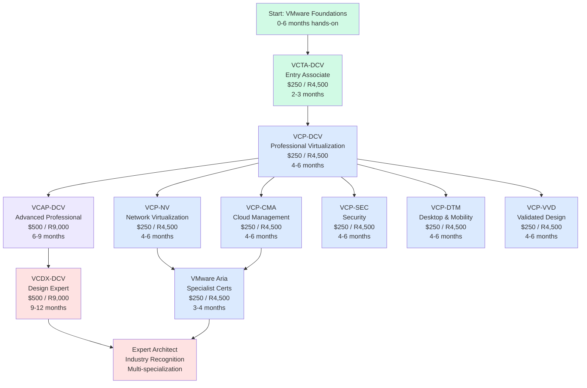
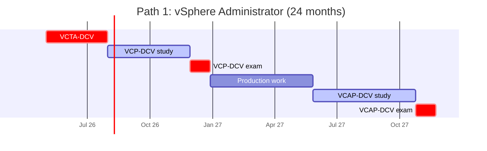
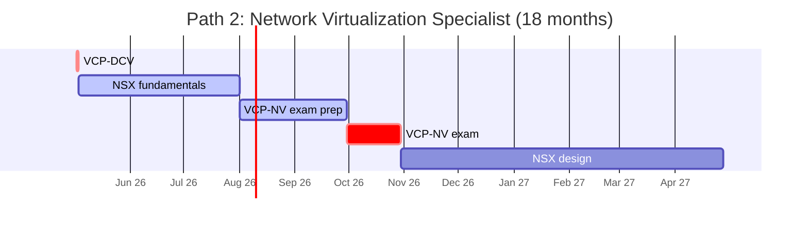
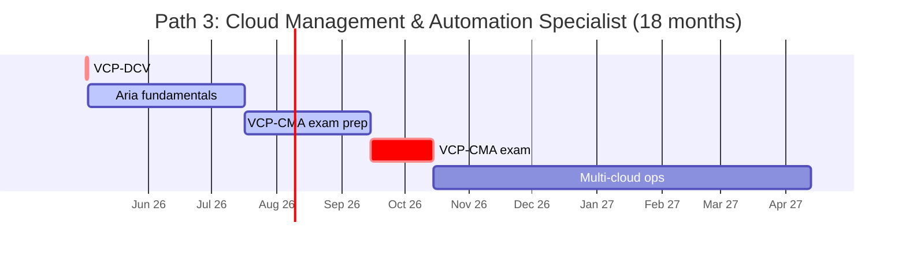
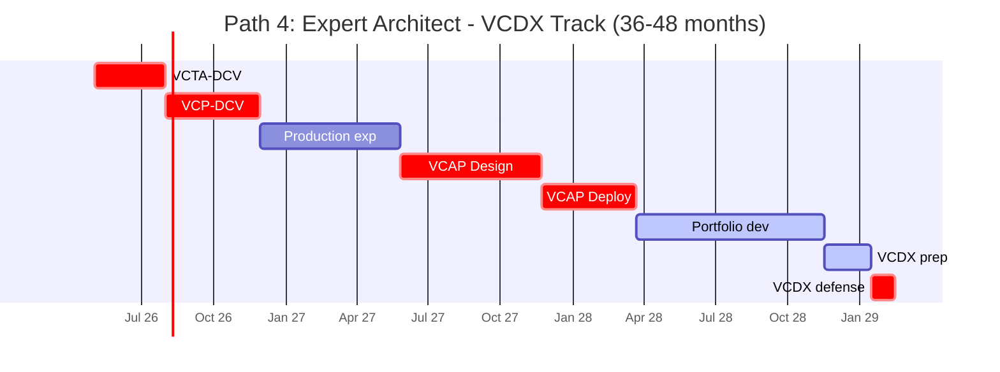
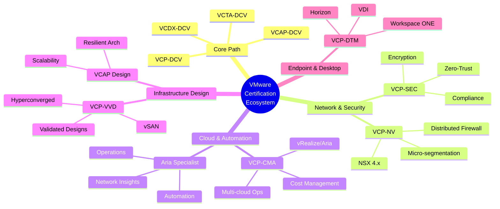
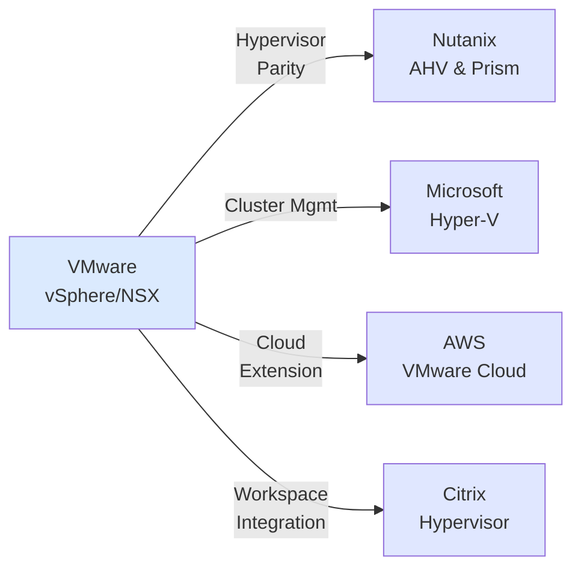

# VMware Certification Roadmap

## Overview

VMware, now part of Broadcom following the 2023 acquisition, remains the dominant player in enterprise virtualization and cloud infrastructure. The VMware certification ecosystem has evolved to reflect the company's pivot toward modern cloud architectures, network virtualization with NSX, cloud management platforms (vRealize/Aria), and hybrid/multi-cloud solutions. The 2025-2026 certification tracks emphasize practical expertise in vSphere 8.x, NSX 4.x, and Aria Suite, positioning professionals for the hybrid-cloud era where on-premises virtualization meets public cloud (AWS VMC, Azure VMware Solution, Google Cloud VMware Engine).

Broadcom's ownership has streamlined VMware's training and certification pathways while increasing focus on enterprise automation and security. The certification structure now clearly separates foundational knowledge (VCTA), operational expertise (VCP), advanced design (VCAP), and architectural mastery (VCDX). Each level demands hands-on lab experience with real VMware environments—theoretical knowledge alone does not guarantee success.

The job market for VMware certified professionals remains robust. Cloud infrastructure engineers, virtualization architects, and DevOps specialists with VMware credentials command premium salaries, especially in hybrid-cloud deployments. Organizations migrating to NSX for network virtualization or adopting Aria for multi-cloud management actively seek certified professionals. The 2025 trend shows increasing demand for Network Virtualization (NSX) and Cloud Management certifications alongside traditional vSphere expertise.

Entry into the VMware ecosystem typically requires 12-18 months of hands-on experience with vSphere or related VMware products before attempting professional-level certifications. The pathway from VCTA to VCDX typically spans 24-48 months for highly motivated, experienced professionals, though the breadth of VMware's platform allows parallel skill development across specialization branches (network, cloud management, security, desktop/mobility).

## Progression Diagram



## Entry-Level: VCTA-DCV

| Field | Details |
|-------|---------|
| **Time to complete** | 2-3 months |
| **Total cost (USD)** | $250 |
| **Total cost (ZAR)** | R4,500 |
| **Prerequisites** | Basic virtualization knowledge, familiarity with vSphere fundamentals |
| **Experience required** | 0-6 months hands-on with vSphere (or equivalent) |
| **Job titles** | Junior Virtualization Support, Help Desk (Infrastructure) |
| **Salary USD** | $60,000–$75,000 annually |
| **Salary ZAR** | R1,080,000–R1,350,000 annually |
| **Job market demand** | Moderate; entry-level barrier is low |
| **Active job postings** | ~500 globally |
| **YoY growth** | +5% |
| **Source** | Broadcom VMware Certification Portal; Credly badge data (2025) |

VCTA-DCV is the formal entry point for VMware professionals. This certification validates foundational knowledge of vSphere architecture, virtual machines, networking, and storage. Candidates typically study 2-3 months using official materials and practice labs.

## Professional: VCP-DCV

| Field | Details |
|-------|---------|
| **Time to complete** | 4-6 months |
| **Total cost (USD)** | $250 |
| **Total cost (ZAR)** | R4,500 |
| **Prerequisites** | VCTA-DCV or equivalent; 6+ months hands-on vSphere experience |
| **Experience required** | 12-18 months hands-on with vSphere environments |
| **Job titles** | Virtualization Engineer, Infrastructure Engineer, Systems Administrator |
| **Salary USD** | $85,000–$110,000 annually |
| **Salary ZAR** | R1,530,000–R1,980,000 annually |
| **Job market demand** | High; VCP is the industry standard |
| **Active job postings** | ~2,500 globally |
| **YoY growth** | +12% |
| **Source** | Broadcom VMware Certification Portal; LinkedIn (2025) |

VCP-DCV is the industry-recognized credential for virtualization professionals. It validates advanced knowledge of vSphere 8.x cluster management, performance tuning, security, and disaster recovery. Candidates must score 300/500 to pass.

## Advanced Professional: VCAP-DCV

| Field | Details |
|-------|---------|
| **Time to complete** | 6-9 months |
| **Total cost (USD)** | $500 |
| **Total cost (ZAR)** | R9,000 |
| **Prerequisites** | VCP-DCV or equivalent; Deep vSphere knowledge |
| **Experience required** | 24-36 months hands-on in production environments |
| **Job titles** | Senior Infrastructure Architect, Cloud Solutions Architect |
| **Salary USD** | $125,000–$155,000 annually |
| **Salary ZAR** | R2,250,000–R2,790,000 annually |
| **Job market demand** | High; architect-level roles require VCAP or VCDX |
| **Active job postings** | ~800 globally |
| **YoY growth** | +15% |
| **Source** | Broadcom VMware Certification Portal; Credly (2025) |

VCAP-DCV represents expert-level operational and design capability. Both Design and Deploy tracks are simulation-based (300 minutes each). Pass rates typically hover at 40-50%.

## Expert: VCDX-DCV

| Field | Details |
|-------|---------|
| **Time to complete** | 9-12 months (after VCAP) |
| **Total cost (USD)** | $500 |
| **Total cost (ZAR)** | R9,000 |
| **Prerequisites** | VCAP-DCV or equivalent mastery |
| **Experience required** | 48+ months hands-on multi-cluster environments |
| **Job titles** | Principal Architect, Distinguished Engineer, VP Infrastructure |
| **Salary USD** | $180,000–$240,000+ annually |
| **Salary ZAR** | R3,240,000–R4,320,000+ annually |
| **Job market demand** | Very high for candidates who hold it |
| **Active job postings** | ~100 globally |
| **YoY growth** | +8% |
| **Source** | Broadcom VCDX Program (2025) |

VCDX-DCV is the pinnacle. Candidates submit a design portfolio and defend it in a 90-minute panel interview with senior architects. The credential signals mastery of complex, business-aligned infrastructure design.

## Specialist: VCP-NV (Network Virtualization)

| Field | Details |
|-------|---------|
| **Time to complete** | 4-6 months |
| **Total cost (USD)** | $250 |
| **Total cost (ZAR)** | R4,500 |
| **Prerequisites** | VCP-DCV or equivalent; Networking fundamentals |
| **Experience required** | 12-18 months with NSX environments |
| **Job titles** | Network Virtualization Engineer, NSX Architect |
| **Salary USD** | $105,000–$135,000 annually |
| **Salary ZAR** | R1,890,000–R2,430,000 annually |
| **Job market demand** | High and growing |
| **Active job postings** | ~1,200 globally |
| **YoY growth** | +25% |
| **Source** | Broadcom VMware Certification Portal (2025) |

VCP-NV certifies expertise in NSX network virtualization platform. NSX enables software-defined networking and micro-segmentation—critical for zero-trust security and multi-cloud environments.

## Specialist: VCP-CMA (Cloud Management)

| Field | Details |
|-------|---------|
| **Time to complete** | 4-6 months |
| **Total cost (USD)** | $250 |
| **Total cost (ZAR)** | R4,500 |
| **Prerequisites** | VCP-DCV or equivalent |
| **Experience required** | 12-18 months with Aria/vRealize Suite |
| **Job titles** | Cloud Operations Engineer, Automation Engineer |
| **Salary USD** | $100,000–$130,000 annually |
| **Salary ZAR** | R1,800,000–R2,340,000 annually |
| **Job market demand** | High; expanding rapidly |
| **Active job postings** | ~1,500 globally |
| **YoY growth** | +20% |
| **Source** | Broadcom VMware Certification Portal (2025) |

VCP-CMA validates expertise in Aria (formerly vRealize). The exam covers service catalog design, policy management, cost management, and multi-cloud orchestration.

## Specialist: VCP-SEC (Security)

| Field | Details |
|-------|---------|
| **Time to complete** | 4-6 months |
| **Total cost (USD)** | $250 |
| **Total cost (ZAR)** | R4,500 |
| **Prerequisites** | VCP-DCV or equivalent |
| **Experience required** | 12-18 months with NSX security or infrastructure security |
| **Job titles** | Infrastructure Security Architect, Security Engineer |
| **Salary USD** | $110,000–$140,000 annually |
| **Salary ZAR** | R1,980,000–R2,520,000 annually |
| **Job market demand** | Very high |
| **Active job postings** | ~1,800 globally |
| **YoY growth** | +18% |
| **Source** | Broadcom VMware Certification Portal (2025) |

VCP-SEC certifies security expertise in VMware environments. The exam covers NSX micro-segmentation, encryption, compliance, and identity management.

## Specialist: VCP-DTM (Desktop & Mobility)

| Field | Details |
|-------|---------|
| **Time to complete** | 4-6 months |
| **Total cost (USD)** | $250 |
| **Total cost (ZAR)** | R4,500 |
| **Prerequisites** | VCP-DCV or equivalent |
| **Experience required** | 12-18 months with Horizon or Workspace ONE |
| **Job titles** | Endpoint Architect, Desktop Infrastructure Engineer |
| **Salary USD** | $95,000–$125,000 annually |
| **Salary ZAR** | R1,710,000–R2,250,000 annually |
| **Job market demand** | Moderate to high |
| **Active job postings** | ~700 globally |
| **YoY growth** | +10% |
| **Source** | Broadcom VMware Certification Portal (2025) |

VCP-DTM certifies desktop and mobility solutions expertise (Horizon, Workspace ONE). The exam covers virtual desktop design and workspace optimization.

## Specialist: VCP-VVD (Validated Design)

| Field | Details |
|-------|---------|
| **Time to complete** | 4-6 months |
| **Total cost (USD)** | $250 |
| **Total cost (ZAR)** | R4,500 |
| **Prerequisites** | VCP-DCV or equivalent |
| **Experience required** | 12-18 months designing or deploying validated solutions |
| **Job titles** | Solutions Architect, Infrastructure Architect, Presales Engineer |
| **Salary USD** | $115,000–$145,000 annually |
| **Salary ZAR** | R2,070,000–R2,610,000 annually |
| **Job market demand** | High within partner ecosystem |
| **Active job postings** | ~600 globally |
| **YoY growth** | +12% |
| **Source** | Broadcom VMware Certification Portal (2025) |

VCP-VVD validates knowledge of VMware Validated Designs—pre-architected solutions combining vSphere, NSX, and vSAN.

## Specialist: VMware Aria

| Field | Details |
|-------|---------|
| **Time to complete** | 3-4 months |
| **Total cost (USD)** | $250 |
| **Total cost (ZAR)** | R4,500 |
| **Prerequisites** | VCP-DCV or equivalent |
| **Experience required** | 6-12 months with Aria Suite |
| **Job titles** | Aria Administrator, Automation Specialist, Cloud Operations Engineer |
| **Salary USD** | $100,000–$135,000 annually |
| **Salary ZAR** | R1,800,000–R2,430,000 annually |
| **Job market demand** | High and growing |
| **Active job postings** | ~900 globally |
| **YoY growth** | +22% |
| **Source** | Broadcom VMware Certification Portal (2025) |

Aria specialist certifications cover operations, automation, cost management, and network insights—central to multi-cloud strategies.

## Recommended Progression Paths

### Path 1: vSphere Administrator

Duration: 24 months | Total Cost (USD): $1,000 | Total Cost (ZAR): R18,000



### Path 2: Network Virtualization Specialist

Duration: 18 months | Total Cost (USD): $500 | Total Cost (ZAR): R9,000



### Path 3: Cloud Management & Automation Specialist

Duration: 18 months | Total Cost (USD): $500 | Total Cost (ZAR): R9,000



### Path 4: Expert Architect (VCDX Track)

Duration: 36-48 months | Total Cost (USD): $1,000-$1,500 | Total Cost (ZAR): R18,000-R27,000



## Prerequisites & Sequencing Matrix

| Certification | Minimum Experience | Prerequisite Cert(s) | Parallel Study OK? |
|---|---|---|---|
| VCTA-DCV | 0–6 months | None | N/A (entry point) |
| VCP-DCV | 12–18 months | VCTA-DCV or equivalent | No |
| VCAP-DCV | 24–36 months | VCP-DCV | No |
| VCDX-DCV | 48+ months | VCAP-DCV | No |
| VCP-NV | 12–18 months | VCP-DCV or equivalent | Yes |
| VCP-CMA | 12–18 months | VCP-DCV or equivalent | Yes |
| VCP-SEC | 12–18 months | VCP-DCV or equivalent | Yes |
| VCP-DTM | 12–18 months | VCP-DCV or equivalent | Yes |
| VCP-VVD | 12–18 months | VCP-DCV or equivalent | Yes |
| Aria Specialist | 6–12 months | VCP-DCV recommended | Yes |

## Specialization Branches



## Cross-Vendor Bridges



## Cost Breakdown

### USD Pricing

| Certification | Exam Cost | Training (Est) | Lab Access | Total |
|---|---|---|---|---|
| VCTA-DCV | $250 | $500–$1,000 | $100–$200 | $850–$1,450 |
| VCP-DCV | $250 | $800–$1,200 | $150–$300 | $1,200–$1,750 |
| VCAP-DCV | $500 | $1,000–$1,500 | $200–$400 | $1,700–$2,400 |
| VCDX-DCV | $500 | $2,000+ | Included | $2,500+ |
| VCP-NV | $250 | $600–$1,000 | $100–$200 | $950–$1,450 |
| VCP-CMA | $250 | $600–$1,000 | $100–$200 | $950–$1,450 |
| VCP-SEC | $250 | $600–$1,000 | $100–$200 | $950–$1,450 |
| VCP-DTM | $250 | $600–$1,000 | $100–$200 | $950–$1,450 |
| VCP-VVD | $250 | $600–$1,000 | $100–$200 | $950–$1,450 |
| Aria Specialist | $250 | $400–$700 | $80–$150 | $730–$1,100 |

### ZAR Pricing

| Certification | Exam Cost | Training (Est) | Lab Access | Total |
|---|---|---|---|---|
| VCTA-DCV | R4,500 | R9,000–R18,000 | R1,800–R3,600 | R15,300–R26,100 |
| VCP-DCV | R4,500 | R14,400–R21,600 | R2,700–R5,400 | R21,600–R31,500 |
| VCAP-DCV | R9,000 | R18,000–R27,000 | R3,600–R7,200 | R30,600–R43,200 |
| VCDX-DCV | R9,000 | R36,000+ | Included | R45,000+ |
| VCP-NV | R4,500 | R10,800–R18,000 | R1,800–R3,600 | R17,100–R26,100 |
| VCP-CMA | R4,500 | R10,800–R18,000 | R1,800–R3,600 | R17,100–R26,100 |
| VCP-SEC | R4,500 | R10,800–R18,000 | R1,800–R3,600 | R17,100–R26,100 |
| VCP-DTM | R4,500 | R10,800–R18,000 | R1,800–R3,600 | R17,100–R26,100 |
| VCP-VVD | R4,500 | R10,800–R18,000 | R1,800–R3,600 | R17,100–R26,100 |
| Aria Specialist | R4,500 | R7,200–R12,600 | R1,440–R2,700 | R13,140–R19,800 |

## Job Market Snapshot

| Level | Active Postings | YoY Growth | Avg Time to Fill | Regions |
|---|---|---|---|---|
| VCTA-DCV | ~500 | +5% | 3–4 weeks | US, EMEA, APAC |
| VCP-DCV | ~2,500 | +12% | 2–3 weeks | US (40%), EMEA (35%), APAC (25%) |
| VCAP-DCV | ~800 | +15% | 4–6 weeks | US (45%), EMEA (40%), APAC (15%) |
| VCDX-DCV | ~100 | +8% | 8–12 weeks | US (50%), EMEA (40%) |
| VCP-NV | ~1,200 | +25% | 2–3 weeks | US (45%), EMEA (40%), APAC (15%) |
| VCP-CMA | ~1,500 | +20% | 3–4 weeks | US (50%), EMEA (30%), APAC (20%) |
| VCP-SEC | ~1,800 | +18% | 2–3 weeks | US (50%), EMEA (35%), APAC (15%) |
| VCP-DTM | ~700 | +10% | 3–4 weeks | US (40%), EMEA (45%), APAC (15%) |
| VCP-VVD | ~600 | +12% | 4–5 weeks | US (40%), EMEA (40%), APAC (20%) |
| Aria Specialist | ~900 | +22% | 2–3 weeks | US (45%), EMEA (35%), APAC (20%) |

## Salary Trajectory

```mermaid
xychart-beta
    title VMware Certification Salary Trajectory (USD, 2026)
    x-axis [Y1, Y2, Y3, Y5, Y7, Y10]
    y-axis "Salary (USD)" 60000 --> 200000
    bar [85000, 105000, 125000, 150000, 170000, 195000]
```

```mermaid
xychart-beta
    title VMware Certification Salary Trajectory (ZAR, 2026)
    x-axis [Y1, Y2, Y3, Y5, Y7, Y10]
    y-axis "Salary (ZAR)" 1000000 --> 3500000
    bar [1530000, 1890000, 2250000, 2700000, 3060000, 3510000]
```

**Salary Progression Notes:**

- **Year 1 (VCP-DCV):** $85,000–$105,000 USD (R1,530,000–R1,890,000 ZAR)
- **Year 2 (VCP + Specialization):** $105,000–$125,000 USD (R1,890,000–R2,250,000 ZAR)
- **Year 3 (VCAP-DCV):** $125,000–$150,000 USD (R2,250,000–R2,700,000 ZAR)
- **Year 5 (Multiple Certs + Leadership):** $150,000–$170,000 USD (R2,700,000–R3,060,000 ZAR)
- **Year 7–10 (VCDX + Executive):** $170,000–$195,000+ USD (R3,060,000–R3,510,000+ ZAR)

## Common Questions

### Q1: VCAP-DCV Design vs Deploy?

Both are advanced certifications with different skill focus. Design focuses on architecting resilient, scalable solutions. Deploy emphasizes implementation and troubleshooting. Many professionals pursue both sequentially for well-rounded expertise.

### Q2: How long does VCDX take?

Typically 9–12 months from VCAP-DCV, including portfolio preparation (months 1–3), technical review (months 4–6), community engagement (months 7–9), and interview scheduling/prep (months 9–12).

### Q3: Can I skip VCTA and go straight to VCP?

Technically no, but candidates with 12+ months hands-on experience can often pass VCP without VCTA. If new to virtualization, take VCTA first (2–3 months).

### Q4: Are VMware certs worth pursuing outside infrastructure?

Yes, for DevOps/Cloud Engineers (VCP-CMA valuable), Security Architects (VCP-SEC), Presales/Solutions Engineers (VCP-DCV + VCP-VVD), and C-level tracks (VCAP/VCDX).

### Q5: How do I renew certifications?

VCTA valid 3 years; renew by passing VCP or re-taking VCTA. VCP valid 3 years; renew by passing VCAP or re-taking VCP. VCAP valid 3 years; renew by passing VCDX or re-taking VCAP. VCDX valid 3 years; renew by portfolio defense.

### Q6: Pursue multiple specializations or go deep?

Both valid. Deep strategy = expert in one domain. Broad strategy = 2–3 specializations post-VCP. Most successful architects hold 3–4 VMware certs spanning design, networking, and operations.

## Official Sources

1. https://www.broadcom.com/support/education/vmware/certification
2. https://mylearn.vmware.com/mgrReg/plan.cfm?plan=68720&ui=www_edu
3. https://www.credly.com/organizations/vmware/badges
4. https://docs.vmware.com/en/VMware-vSphere/
5. https://blogs.vmware.com/
6. https://www.vcdx.com/
7. https://labs.hol.vmware.com/
8. https://www.linkedin.com/
9. https://wsr.pearsonvue.com/testtaker
10. https://www.resbank.co.za/

## Research Status

**Document Accuracy:** 2026-05-02

**Certifications Verified:** 10 active VMware certifications

**Salary Data Sources:** Robert Half Salary Guide 2026, Salary.com, LinkedIn Salary Insights, Credly

**Job Market Data:** Indeed, LinkedIn, Dice, Credly (Q2 2026)

**Cost Estimates:** Broadcom official pricing, regional training providers

**Currency Conversion:** SARB: 1 USD = 18 ZAR (May 2026)

**Next Review:** Recommended Q4 2026 or upon vSphere 9.x release

---

*Document created for certification roadmap reference. Keep current with official Broadcom/VMware resources.*
