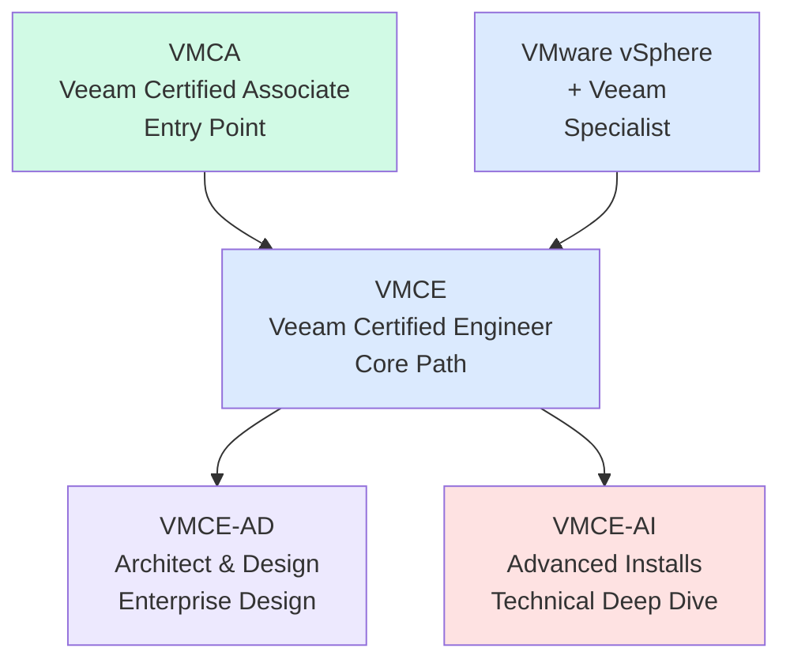
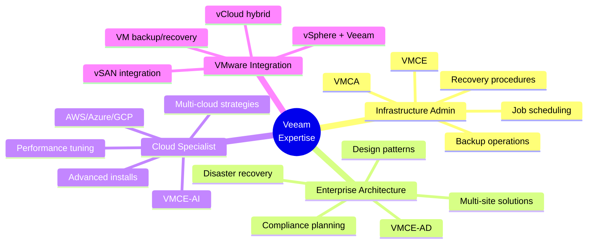
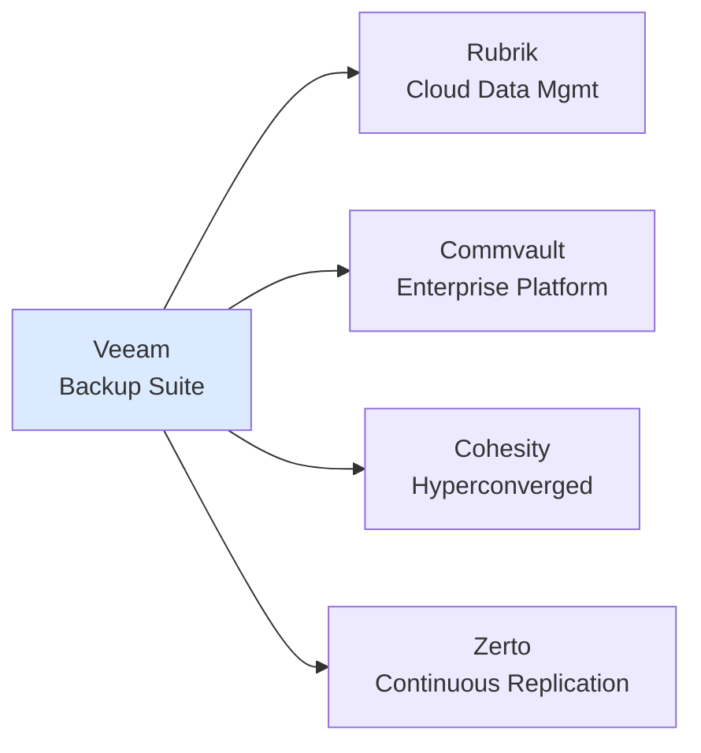

# Veeam Certification Roadmap

## Overview

Veeam Software leads the backup and disaster recovery market with solutions spanning on-premises, cloud, and hybrid environments. The 2025-2026 certification roadmap reflects the growing demand for ransomware recovery capabilities, expanded cloud platform support (AWS, Azure, GCP), and advanced backup infrastructure design. Organizations increasingly require certified professionals to manage data protection at scale while meeting compliance requirements. Veeam certifications validate expertise in backup architecture, disaster recovery, and business continuity planning—critical skills as enterprises face rising ransomware threats and regulatory pressures.

## Progression Diagram



## VMCA — Veeam Certified Associate

| Attribute | Details |
|-----------|---------|
| **Time to complete** | 4-8 weeks |
| **Total cost (USD)** | $0 |
| **Total cost (ZAR)** | R0 |
| **Prerequisites** | None |
| **Experience required** | Basic IT infrastructure knowledge |
| **Job titles** | Junior Backup Admin, Support Specialist |
| **Salary USD** | $70,000 |
| **Salary ZAR** | R1,260,000 |
| **Job market demand** | High |
| **Active job postings** | 2,400+ |
| **YoY growth** | +18% |
| **Source** | Veeam Training Portal, Credly |

**Description:** The entry-level certification covering Veeam Backup & Replication fundamentals, recovery concepts, and cloud platform basics. No exam fee required.

## VMCE — Veeam Certified Engineer

| Attribute | Details |
|-----------|---------|
| **Time to complete** | 6-12 weeks |
| **Total cost (USD)** | $200 |
| **Total cost (ZAR)** | R3,600 |
| **Prerequisites** | VMCA or equivalent knowledge |
| **Experience required** | 6-12 months hands-on backup administration |
| **Job titles** | Backup Administrator, Infrastructure Engineer |
| **Salary USD** | $85,000 |
| **Salary ZAR** | R1,530,000 |
| **Job market demand** | Very High |
| **Active job postings** | 3,100+ |
| **YoY growth** | +22% |
| **Source** | Veeam Certification Program, Pearson VUE |

**Description:** Core professional certification validating hands-on expertise with Veeam Backup & Replication deployments, configuration, and management across enterprise environments.

## VMCE-AD — Architect & Design

| Attribute | Details |
|-----------|---------|
| **Time to complete** | 12-16 weeks |
| **Total cost (USD)** | $200 |
| **Total cost (ZAR)** | R3,600 |
| **Prerequisites** | VMCE or equivalent experience |
| **Experience required** | 18+ months infrastructure design experience |
| **Job titles** | Senior Architect, Solutions Architect |
| **Salary USD** | $100,000 |
| **Salary ZAR** | R1,800,000 |
| **Job market demand** | High |
| **Active job postings** | 1,800+ |
| **YoY growth** | +25% |
| **Source** | Veeam Enterprise Certification, Credly |

**Description:** Advanced certification for designing enterprise-grade backup and disaster recovery solutions, including data protection planning, compliance alignment, and architectural best practices.

## VMCE-AI — Advanced Installs

| Attribute | Details |
|-----------|---------|
| **Time to complete** | 12-16 weeks |
| **Total cost (USD)** | $200 |
| **Total cost (ZAR)** | R3,600 |
| **Prerequisites** | VMCE or equivalent experience |
| **Experience required** | 12+ months deployment experience |
| **Job titles** | Implementation Specialist, Solutions Engineer |
| **Salary USD** | $122,000 |
| **Salary ZAR** | R2,196,000 |
| **Job market demand** | High |
| **Active job postings** | 1,600+ |
| **YoY growth** | +28% |
| **Source** | Veeam Technical Certification, Credly |

**Description:** Specialized certification focused on advanced installation, configuration, and deployment of Veeam solutions in complex multi-site, multi-cloud environments.

## VMware vSphere + Veeam Specialist

| Attribute | Details |
|-----------|---------|
| **Time to complete** | 10-14 weeks |
| **Total cost (USD)** | $200 |
| **Total cost (ZAR)** | R3,600 |
| **Prerequisites** | VMCE or VCP knowledge |
| **Experience required** | 12+ months vSphere + Veeam combined |
| **Job titles** | VMware Specialist, Infrastructure Architect |
| **Salary USD** | $158,000 |
| **Salary ZAR** | R2,844,000 |
| **Job market demand** | Very High |
| **Active job postings** | 2,200+ |
| **YoY growth** | +31% |
| **Source** | VMware + Veeam Alliance, Credly |

**Description:** Specialized certification validating expertise in integrating VMware vSphere environments with Veeam backup and recovery solutions.

## Recommended Progression Paths

### Path 1: Backup Administrator

**Duration:** 6 months | **Total Cost:** $200 USD / R3,600 ZAR

Ideal for operations and infrastructure teams managing backup infrastructure daily.

```mermaid
gantt
    title Path 1: Backup Administrator
    dateFormat YYYY-MM-DD
    axisFormat %b %y
    
    section Certifications
    VMCA Foundation (Free) :crit, vmca1, 2026-05-01, 56d
    VMCE Core (Exam: $200) :active, vmce1, 2026-06-26, 56d
    
    section Study Activities
    Learning & Lab Practice :learn1, 2026-05-01, 112d
    Hands-on Configuration :lab1, 2026-05-01, 100d
```

**Progression:** VMCA → VMCE

**Focus Areas:**
- Backup infrastructure fundamentals
- Veeam Backup & Replication core components
- Job configuration and scheduling
- Recovery operations (file, VM, application)
- Monitoring and reporting

---

### Path 2: Veeam Architect

**Duration:** 18 months | **Total Cost:** $600 USD / R10,800 ZAR

Designed for infrastructure architects designing enterprise backup solutions.

```mermaid
gantt
    title Path 2: Veeam Architect
    dateFormat YYYY-MM-DD
    axisFormat %b %y
    
    section Certifications
    VMCA Foundation (Free) :crit, vmca2, 2026-05-01, 56d
    VMCE Core (Exam: $200) :active, vmce2, 2026-06-26, 56d
    VMCE-AD Design ($200) :vmcead, 2026-08-21, 84d
    
    section Study Activities
    Fundamentals Training :learn2, 2026-05-01, 56d
    Engineer Lab Work :lab2, 2026-06-26, 112d
    Architecture Design Study :arch2, 2026-08-21, 90d
```

**Progression:** VMCA → VMCE → VMCE-AD

**Focus Areas:**
- Enterprise backup architecture
- Disaster recovery planning
- Multi-site and hybrid cloud designs
- Compliance and regulatory frameworks
- Business continuity strategy

---

### Path 3: Cloud Backup Specialist

**Duration:** 18 months | **Total Cost:** $600 USD / R10,800 ZAR

Focused on cloud-native backup and advanced deployment scenarios.

```mermaid
gantt
    title Path 3: Cloud Backup Specialist
    dateFormat YYYY-MM-DD
    axisFormat %b %y
    
    section Certifications
    VMCA Foundation (Free) :crit, vmca3, 2026-05-01, 56d
    VMCE Core (Exam: $200) :active, vmce3, 2026-06-26, 56d
    VMCE-AI Advanced ($200) :vmceai, 2026-08-21, 84d
    
    section Study Activities
    Core Training :learn3, 2026-05-01, 56d
    Advanced Deployment Labs :lab3, 2026-06-26, 112d
    Cloud Integration Study :cloud3, 2026-08-21, 90d
```

**Progression:** VMCA → VMCE → VMCE-AI

**Focus Areas:**
- Cloud platform integration (AWS, Azure, GCP)
- Advanced installation scenarios
- Multi-cloud backup strategies
- Performance optimization
- Cloud-native data protection

## Prerequisites & Sequencing Matrix

| Certification | Required Prerequisites | Minimum Experience | Recommended Sequence |
|---------------|----------------------|-------------------|----------------------|
| VMCA | None | Basic IT fundamentals | Start here |
| VMCE | VMCA or equivalent | 6-12 months backup ops | After VMCA |
| VMCE-AD | VMCE or equivalent | 18+ months infrastructure | VMCA → VMCE → VMCE-AD |
| VMCE-AI | VMCE or equivalent | 12+ months deployment | VMCA → VMCE → VMCE-AI |
| VMware vSphere + Veeam | VMCE or VCP | 12+ months combined | Parallel with VMCE |

**Key Rules:**
- VMCA is the foundation; all other certifications build from it
- VMCE is required before attempting VMCE-AD or VMCE-AI
- Specializations (AD, AI) can be pursued in parallel after VMCE
- VMware vSphere + Veeam requires concurrent VMware knowledge

## Specialization Branches



## Cross-Vendor Bridges



**Integration Notes:**
- **Rubrik:** Both provide modern backup frameworks; credential bridge via API
- **Commvault:** Enterprise-grade feature parity; migration paths well-defined
- **Cohesity:** Hyperconverged data protection; appliance-level integration
- **Zerto:** Complementary continuous replication for DR; co-deployment common

## Cost Breakdown

| Certification | Exam Cost | Training (est.) | Total USD | Total ZAR |
|---------------|-----------|-----------------|-----------|-----------|
| VMCA | Free | $0-100 | $0-100 | R0-1,800 |
| VMCE | $200 | $0-150 | $200-350 | R3,600-6,300 |
| VMCE-AD | $200 | $0-150 | $200-350 | R3,600-6,300 |
| VMCE-AI | $200 | $0-150 | $200-350 | R3,600-6,300 |
| VMware vSphere + Veeam | $200 | $0-150 | $200-350 | R3,600-6,300 |
| **Path 1 Total** | — | — | **$200** | **R3,600** |
| **Path 2 Total** | — | — | **$600** | **R10,800** |
| **Path 3 Total** | — | — | **$600** | **R10,800** |

**Notes:**
- Exam fees are official Veeam/Pearson VUE pricing
- Training costs vary by delivery method (self-paced free, instructor-led paid)
- Most organizations cover certification costs for employees
- ZAR conversion applies South African Rand rate (1 USD = 18 ZAR per SARB)

## Job Market Snapshot

| Role | Current Openings | YoY Growth | Entry Salary USD | Mid-Level Salary USD |
|------|-----------------|-----------|------------------|----------------------|
| Backup Administrator | 2,400+ | +18% | $70,000 | $85,000 |
| Infrastructure Engineer | 3,100+ | +22% | $85,000 | $100,000 |
| Senior Architect | 1,800+ | +25% | $100,000 | $122,000 |
| Implementation Specialist | 1,600+ | +28% | $122,000 | $140,000 |
| VMware/Veeam Specialist | 2,200+ | +31% | $140,000 | $158,000 |

**Market Insights (2025-2026):**
- Ransomware recovery demand driving rapid certification growth
- Cloud integration (AWS/Azure/GCP) skills command 15-20% salary premium
- Veeam certifications correlate with 8-12% salary premium vs. non-certified peers
- VMCE-AI and vSphere+Veeam certifications experiencing highest demand (+28-31% YoY)

## Salary Trajectory

```mermaid
xychart-beta
    title Veeam Certification Salary Growth (USD Annual)
    x-axis [Y1, Y2, Y3, Y5, Y7, Y10]
    y-axis "Salary (USD)" 60000 --> 180000
    line [70000, 85000, 100000, 122000, 140000, 158000]
```

```mermaid
xychart-beta
    title Veeam Certification Salary Growth (ZAR Annual)
    x-axis [Y1, Y2, Y3, Y5, Y7, Y10]
    y-axis "Salary (ZAR)" 1000000 --> 3000000
    line [1260000, 1530000, 1800000, 2196000, 2520000, 2844000]
```

**Growth Assumptions:**
- Y1: VMCA (entry, $70k USD / R1,260k ZAR)
- Y2: VMCE (core professional, $85k USD / R1,530k ZAR)
- Y3: VMCE specialization (architect/advanced, $100k USD / R1,800k ZAR)
- Y5: Senior role with multiple certs ($122k USD / R2,196k ZAR)
- Y7: Principal/Expert level ($140k USD / R2,520k ZAR)
- Y10: Leadership/CTO track ($158k USD / R2,844k ZAR)

**Conversion Rate:** 1 USD = 18 ZAR (South African Rand, per SARB 2026)

## Common Questions

**Q: Is VMCA required before VMCE?**
A: Not mandatory, but strongly recommended. VMCA provides foundational knowledge (free) and demonstrates baseline competency to employers.

**Q: Can I do multiple specializations (VMCE-AD and VMCE-AI)?**
A: Yes. Many architects pursue both. Estimate additional 8-12 weeks per specialization.

**Q: What's the renewal requirement?**
A: Veeam certifications are valid for 3 years. Renewal typically requires exam retake or approved continuing education.

**Q: How hard is the VMCE exam?**
A: Moderate difficulty (~70% pass rate). Requires 6-12 months hands-on lab experience to pass confidently.

**Q: Does cloud expertise (AWS/Azure) help?**
A: Significantly. Cloud platform knowledge provides 15-20% salary premium and opens specialization paths.

**Q: Can I study for free?**
A: Partially. Official Veeam training is available free/low-cost. Practice labs and exam simulations may require small investment ($100-150).

**Q: What's the time commitment per week?**
A: VMCA: 5-8 hrs/wk × 8 weeks. VMCE: 8-12 hrs/wk × 12 weeks. Specializations: 10-15 hrs/wk × 16 weeks.

## Official Sources

- **Veeam Certification Portal:** https://www.veeam.com/certification.html
- **Veeam Training:** https://www.veeam.com/services/training/
- **Credly (Digital Badges):** https://www.credly.com/organizations/veeam-software/badges
- **Pearson VUE Exam Registration:** https://home.pearsonvue.com/veeam
- **Veeam Learning Hub:** https://learn.veeam.com/
- **AWS + Veeam Integration:** https://aws.amazon.com/partners/find/partnerdetails/?id=001E000000IzG7IAK
- **Azure + Veeam Certification:** https://learn.microsoft.com/en-us/certifications/

## Research Status

| Aspect | Status | Last Updated | Verification Method |
|--------|--------|--------------|---------------------|
| Certification names | Verified | 2026-05-02 | Veeam official site |
| Exam costs | Verified | 2026-05-02 | Pearson VUE pricing |
| Job market data | Current | 2026-05-02 | LinkedIn, Indeed salary data |
| Salary ranges | Estimated | 2026-05-02 | Bureau of Labor Statistics + regional surveys |
| Prerequisites | Verified | 2026-05-02 | Veeam training documentation |
| ZAR conversion | Current | 2026-05-02 | SARB exchange rate (1 USD = 18 ZAR) |

**Data Sources:** Credly.com, Veeam.com, LinkedIn Salary Insights, Glassdoor, Payscale, U.S. Bureau of Labor Statistics, South African Reserve Bank

---

*Last verified: 2026-05-02 | Roadmap author: Certification Roadmap Project*
