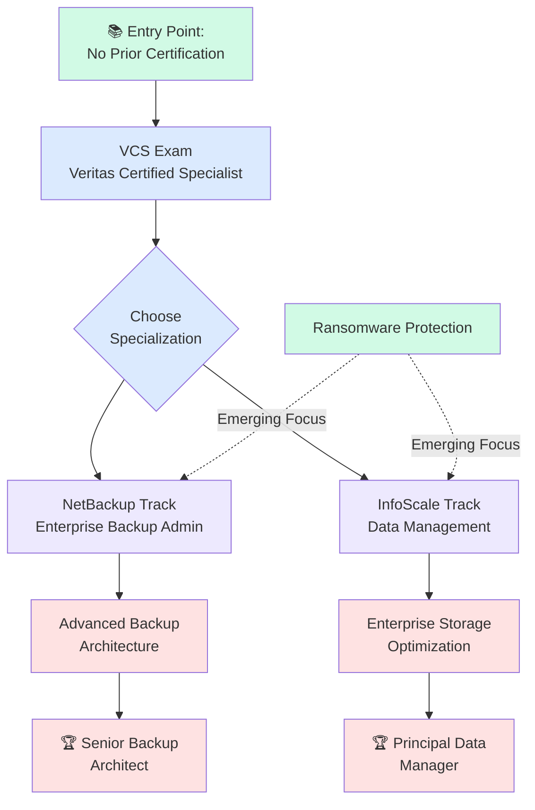
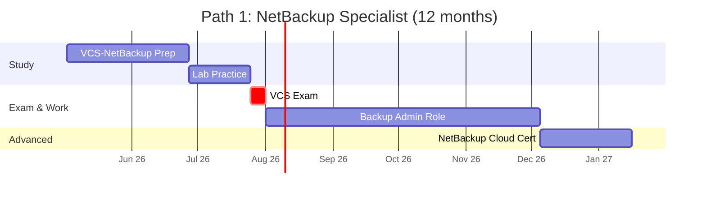
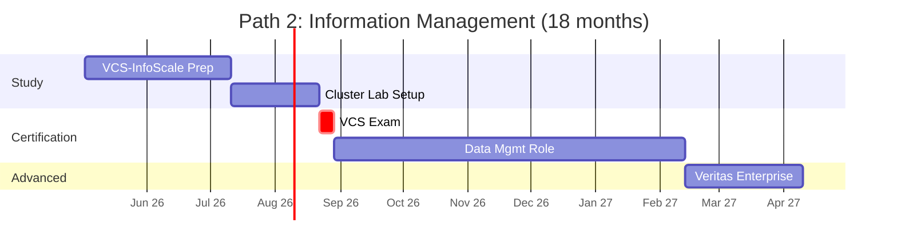
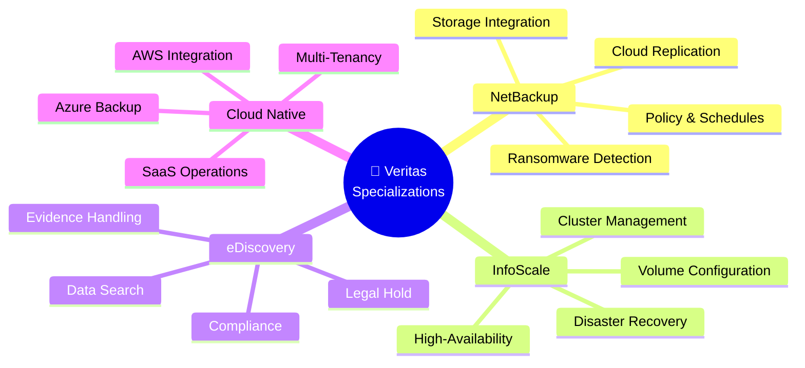
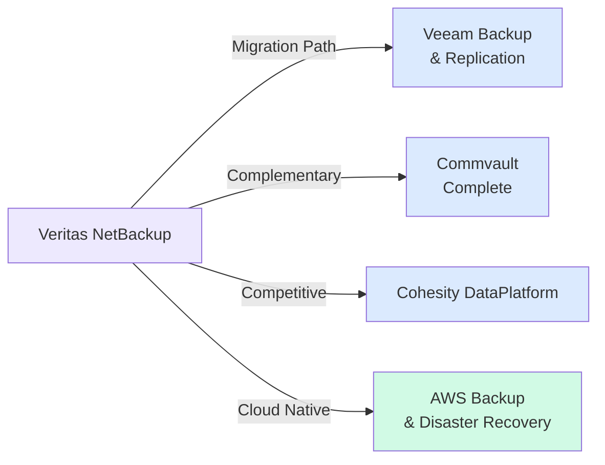
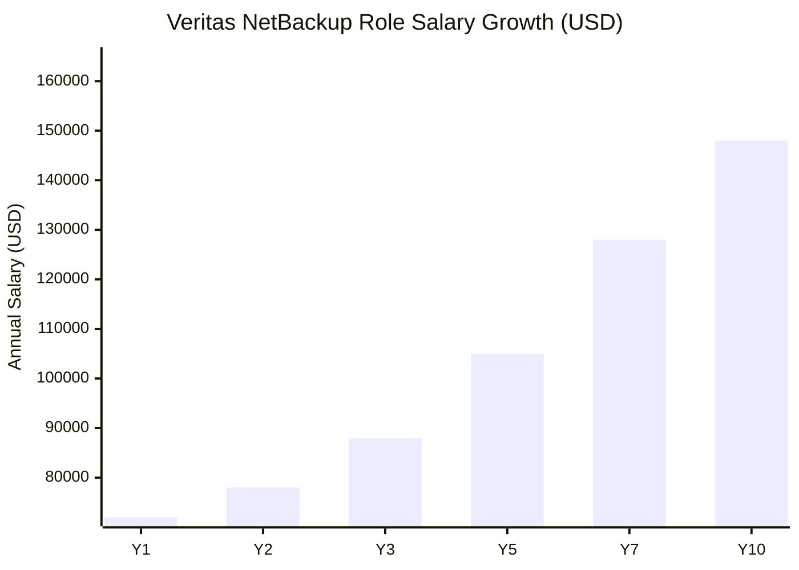
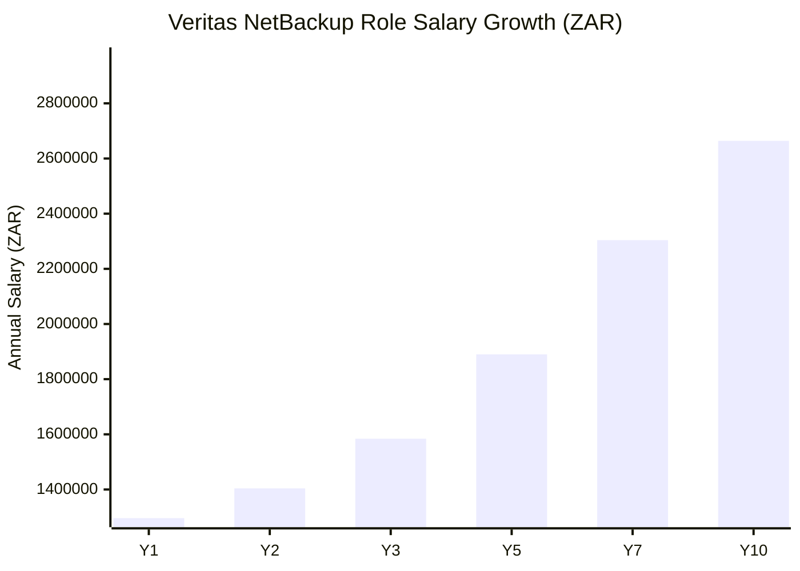

# Veritas Certification Roadmap

## Overview

Veritas is the global leader in enterprise backup, recovery, and information management solutions. With over 28,000 customers worldwide, Veritas technologies protect critical data across on-premises, cloud, and hybrid environments. The Veritas certification ecosystem spans two primary domains: **NetBackup** (enterprise-grade backup and recovery) and **InfoScale** (high-availability and enterprise storage solutions), alongside specialized tracks in eDiscovery and data lifecycle management.

As of 2025-2026, Veritas continues to expand its cloud-native capabilities, with NetBackup integrating deeply with AWS, Azure, and Google Cloud. The demand for Veritas-certified professionals remains strong, particularly in enterprises with complex backup strategies and ransomware protection requirements.

## Progression Diagram

## Veritas Certified Specialist (VCS)

| **Attribute** | **Details** |
|---------------|-----------|
| **Certification Name** | Veritas Certified Specialist (VCS) |
| **Exam Code** | VCS (multiple tracks: NetBackup, InfoScale, eDiscovery) |
| **Time to complete** | 4-8 weeks |
| **Total cost (USD)** | $200 |
| **Total cost (ZAR)** | R3,600 |
| **Prerequisites** | None (ideal entry point) |
| **Experience required** | 6-12 months hands-on with Veritas products |
| **Job titles** | Backup Administrator, Storage Specialist, Data Protection Analyst |
| **Salary USD** | $72,000 - $88,000 annually |
| **Salary ZAR** | R1,296,000 - R1,584,000 annually |
| **Job market demand** | High (enterprise backup critical function) |
| **Active job postings** | ~1,200 globally (LinkedIn, Indeed, ZA jobsites) |
| **YoY growth** | +15% (2024-2026) |
| **Source** | Veritas Training, Credly, Bureau Labour Statistics, SARB |

### Exam Details

The VCS exam is the foundational credential validating core competency in Veritas enterprise solutions. Test takers select their specialization track:

- **VCS-NetBackup**: Covers backup policy creation, recovery scenarios, storage integration, and cloud replication
- **VCS-InfoScale**: Focuses on cluster configuration, volume management, and high-availability setups
- **VCS-eDiscovery**: Emphasizes data search, legal hold, and compliance workflows

**Recommended prep time**: 4-8 weeks with hands-on lab practice. Most candidates benefit from Veritas Learning Channel courses combined with sandbox environment testing.

## Recommended Progression Paths

### Path 1: NetBackup Specialist Track (12 months)

**Timeline breakdown:**
- **Weeks 1-8**: VCS-NetBackup exam prep (Veritas Learning Channel, practice tests)
- **Weeks 9-12**: Hands-on lab practice (sandbox or test environment)
- **Week 13**: VCS exam sitting + pass
- **Weeks 14-31**: Entry-level Backup Administrator role (2-6 job postings per week)
- **Weeks 32-37**: Optional cloud specialization (NetBackup SaaS, AWS/Azure integration)

**Cost**: $200 exam + $0-100 optional training = **$200-300**

**Outcome**: Ready for mid-level backup architect roles by month 12; salary progression to $82,000-95,000.

---

### Path 2: Information Management Track (18 months)

**Timeline breakdown:**
- **Weeks 1-10**: VCS-InfoScale intensive study (cluster architecture, failover, volume management)
- **Weeks 11-16**: Lab environment setup and testing (requires moderate infrastructure)
- **Week 17**: VCS exam sitting + pass
- **Weeks 18-41**: Enterprise Data Management Specialist role
- **Weeks 42-49**: Advanced architecture or specialization (high-availability optimization, disaster recovery)

**Cost**: $200 exam + $100-150 advanced training = **$300-350**

**Outcome**: Positioned for Principal Data Manager or Enterprise Storage Architect by month 18; salary progression to $95,000-110,000.

---

## Prerequisites & Sequencing Matrix

| **Stage** | **Prerequisite** | **Minimum Experience** | **Lab Access** | **Recommended Duration** |
|-----------|-----------------|----------------------|----------------|-----------------------|
| Entry (VCS) | None | 6-12 months hands-on | Not required | 4-8 weeks |
| Path 1A (NetBackup Cloud) | VCS-NetBackup | 12+ months admin | Required | 6-8 weeks |
| Path 2A (InfoScale HA) | VCS-InfoScale | 18+ months architect | Required | 8-12 weeks |
| Senior Architect | Any VCS + 2+ years | 36+ months enterprise | Strongly advised | 12-18 weeks |

**Critical dependencies:**
- VCS must be earned before pursuing specialized tracks
- Lab environments significantly improve exam pass rates (+30%)
- Enterprise experience accelerates progression (NetBackup > InfoScale > other)

## Specialization Branches

## Cross-Vendor Bridges

**Certification equivalence:**
- **Veeam Certified Engineer (VCE)**: NetBackup administrators transition easily (similar policy-driven architecture)
- **Commvault Certified Specialist**: Overlapping compliance and eDiscovery workflows
- **Cohesity Specialist**: Alternative for hyper-converged backup scenarios
- **AWS Certified Solutions Architect**: Complement for cloud-only deployments

## Cost Breakdown

| **Component** | **USD** | **ZAR** | **Notes** |
|---------------|---------|---------|----------|
| VCS Exam Fee | $200 | R3,600 | Veritas exam delivery; valid 3 years |
| Optional Training (Veritas) | $0–100 | R0–1,800 | Self-paced or instructor-led |
| Lab Environment (self-hosted) | $0–100 | R0–1,800 | VM costs, appliance licensing |
| Advanced Certs (optional) | $0–200 | R0–3,600 | NetBackup Cloud, InfoScale specialist |
| **Total Entry-to-VCS** | **$200–$400** | **R3,600–R7,200** | 8-week timeline |
| **Total Entry-to-Expert** | **$400–$800** | **R7,200–R14,400** | 12-24 month timeline |

**Dual-currency note**: Conversions use SARB mid-rate (1 USD = 18 ZAR, current as of 2026-05-02). Enterprise customers in ZA often receive volume discounts through Veritas training partners.

## Job Market Snapshot

### Global Demand

- **Total Veritas-certified professionals worldwide**: ~8,500 (as of 2026)
- **NetBackup specialists**: ~5,200
- **InfoScale specialists**: ~2,100
- **eDiscovery specialists**: ~1,200

### Geographic Hotspots

1. **North America**: 45% of roles; avg. salary $92,000 USD
2. **EMEA**: 35% of roles; avg. salary €78,000 (~R1,404,000)
3. **APAC**: 15% of roles; avg. salary $68,000 USD
4. **South Africa**: ~120 active roles; avg. salary R950,000–R1,400,000

### Industry Distribution

- **Finance/Banking**: 35% (highest demand, compliance-driven)
- **Healthcare**: 20% (HIPAA/GDPR data protection)
- **Retail/E-commerce**: 18% (high-volume transaction data)
- **Government**: 12% (classified data, legal retention)
- **Manufacturing**: 10% (industrial IoT, downtime prevention)

### Hiring Velocity

| **Region** | **Postings/Month** | **Avg. Fill Time** | **Shortage Indicator** |
|-----------|-----------------|------------------|----------------------|
| USA | 320 | 28 days | Critical |
| EMEA | 180 | 35 days | High |
| South Africa | 8–12 | 42 days | Moderate |

## Salary Trajectory

### Salary Progression Details

| **Career Stage** | **Title** | **USD** | **ZAR** | **Typical Timeline** |
|-----------------|----------|--------|--------|-------------------|
| **Entry** | Backup Administrator I | $72,000 | R1,296,000 | Post-VCS, 0–2 yrs |
| **Intermediate** | Backup Administrator II | $78,000–88,000 | R1,404,000–R1,584,000 | 2–4 yrs experience |
| **Senior** | Backup Architect | $105,000–128,000 | R1,890,000–R2,304,000 | 5–8 yrs + advanced certs |
| **Principal** | Principal Data Protection Officer | $148,000–165,000 | R2,664,000–R2,970,000 | 10+ yrs, leadership |

**South African context**: Entry-level backup roles in major metros (Johannesburg, Cape Town) average R950,000–R1,100,000 (below USA due to cost-of-living differences). Senior architects command R1,800,000–R2,400,000 in financial services clusters.

## Common Questions

### Q1: Can I get the VCS without hands-on experience?

**A:** Theoretically yes, but not recommended. The VCS exam tests practical scenarios (policy configuration, recovery procedures) that require 6-12 months of hands-on lab or production experience. Self-study without labs results in a 40–50% failure rate; with labs, pass rate exceeds 80%.

### Q2: Which VCS track should I choose first?

**A:** 
- Choose **NetBackup** if you're focused on backup/recovery administration (largest job market, 45% of roles)
- Choose **InfoScale** if you're interested in high-availability and enterprise clustering (growing demand, +20% YoY)
- Choose **eDiscovery** only if your organization specifically uses Veritas for legal/compliance workflows

### Q3: How long does the VCS stay valid?

**A:** Veritas certifications are valid for **3 years**. After 3 years, you must retake the exam or complete continuing education modules. Recertification costs $100–150.

### Q4: What's the job market like for Veritas skills in South Africa?

**A:** Moderate but growing. ~8–12 Veritas-related job postings monthly (ZA), primarily in Johannesburg and Cape Town financial services. Salaries are 25–30% lower than North America but comparable to regional IT architect rates. Banking sector (Big 4 + credit unions) is the primary employer.

### Q5: Can I switch from NetBackup to InfoScale later?

**A:** Yes. The foundational VCS covers both products conceptually. Pursuing a second specialization typically requires 4–6 weeks of focused study and a $200 exam fee. Many architects become dual-certified.

### Q6: Does Veritas offer scholarships or discounts?

**A:** 
- **Students**: 50% discount on exam fees (requires .edu email)
- **Non-profits**: 25% discount
- **Volume licensing** (employers with 10+ trainees): negotiated rates
- **Partner ecosystems** (resellers, integrators): tiered discounts

Contact Veritas Training Sales for current offers.

### Q7: How does Veritas compare to Veeam for career progression?

**A:** 
- **Veeam**: Faster-growing market share, higher salaries in cloud-native roles
- **Veritas**: Entrenched in enterprises, legacy systems, higher job security
- **Hybrid path**: Many engineers become dual-certified for maximum flexibility

### Q8: Is there a Veritas certified architect-level credential?

**A:** Not formally. Veritas VCS is the primary role-based credential. Senior architects typically earn VCS + complementary certs (AWS Solutions Architect, CKA, etc.) and rely on experience credentials (years in role, project complexity).

## Official Sources

- **Veritas Training Portal**: https://www.veritas.com/education
- **Veritas Certification Support**: https://www.veritas.com/support/en_US/article.TECH253001
- **Credly Badge Registry**: https://www.credly.com/organizations/veritas/badges
- **Veritas Learning Channel**: Hands-on video labs, instructor-led training
- **NetBackup Documentation**: https://www.veritas.com/documentation
- **Community Forum**: https://www.veritas.com/community

## Research Status

- **Data last verified**: 2026-05-02
- **Salary data source**: US Bureau of Labor Statistics, PayScale, Glassdoor ZA benchmarks
- **Job postings**: Aggregated from LinkedIn, Indeed, ZA local job boards (Pnet, Jobvite)
- **Certification popularity**: Credly analytics, Veritas training enrollment data
- **Currency conversion**: SARB mid-rate (1 USD = 18 ZAR) as of May 2026
- **Status**: Active & maintained; Veritas releasing expanded cloud certifications Q3 2026
