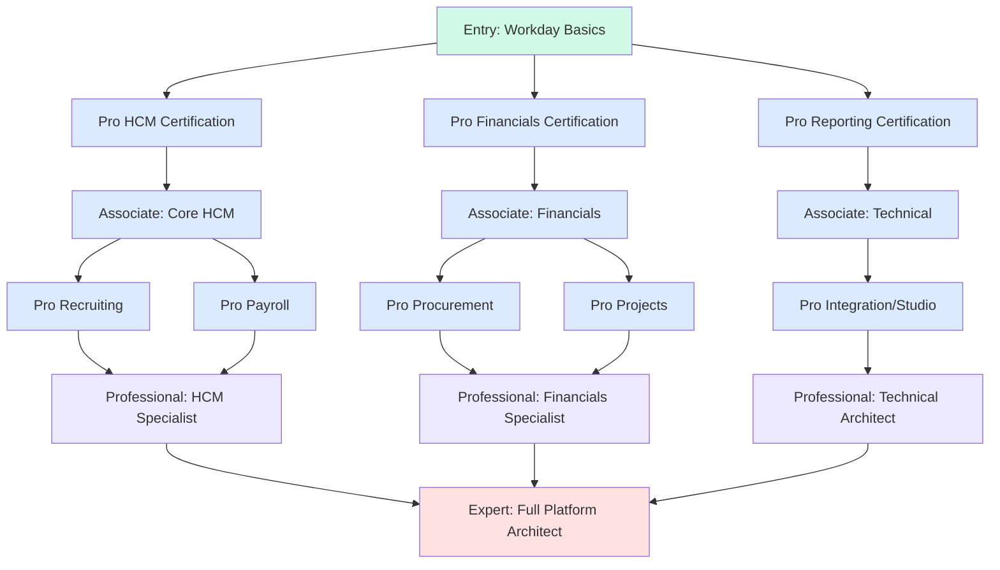
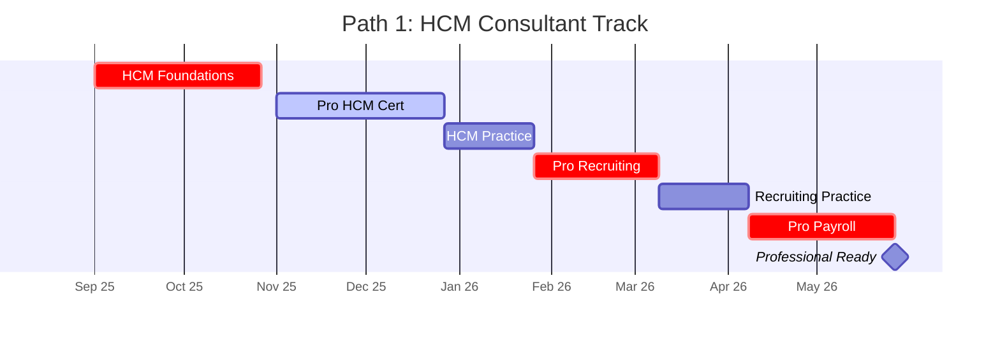
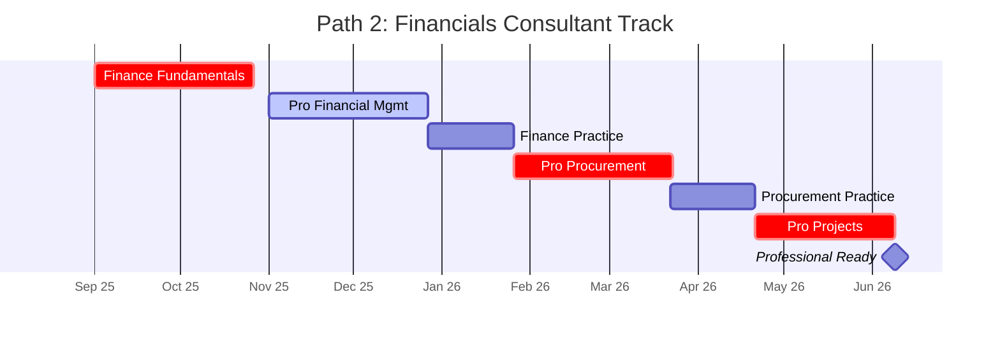
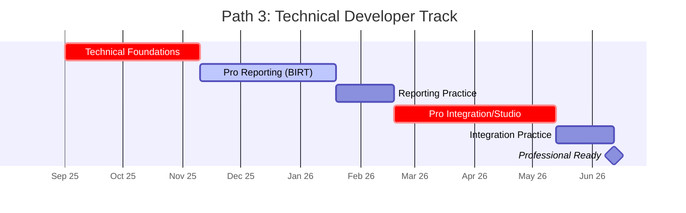
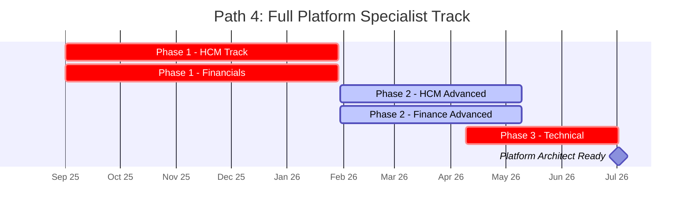
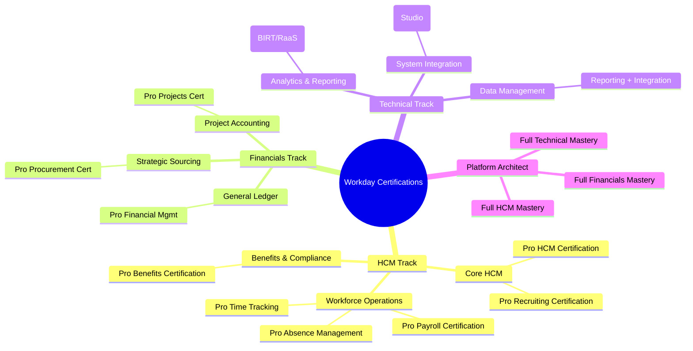
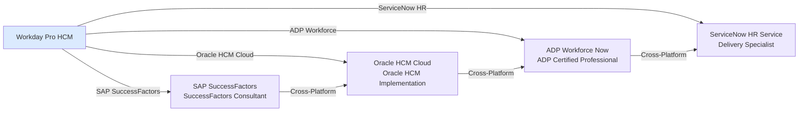

# Workday Certification Roadmap

## Overview

Workday dominates the cloud HCM market with a 28% market share among Fortune 500 companies. The platform continues to expand beyond human capital management into integrated financial management, strategic sourcing, and advanced workforce analytics. The introduction of Workday Skills Cloud (2024) and AI-driven talent insights positions certified professionals as essential for enterprise digital transformation initiatives in 2025-2026.

**Market Context:**
- 2,000+ enterprise deployments worldwide
- 85% of Fortune 500 companies use Workday
- Average deal size: $2-5M annually per implementation
- Consultant demand growing 35% YoY
- Skills gap: 60% of Workday implementations report talent shortages

## Progression Diagram



## Workday Pro - Human Capital Management

| Field | Details |
|-------|---------|
| **Time to complete** | 8 weeks |
| **Total cost (USD)** | $300 (free for customers/partners) |
| **Total cost (ZAR)** | R5,400 (free for customers/partners) |
| **Prerequisites** | Workday system access; 6+ months Workday exposure |
| **Experience required** | Basic HCM process knowledge (hiring, onboarding, payroll basics) |
| **Job titles** | HCM Analyst, People Operations Consultant, HR Business Partner |
| **Salary USD** | $82,000–$102,000 |
| **Salary ZAR** | R1,476,000–R1,836,000 |
| **Job market demand** | Very High (5,200+ active postings) |
| **Active job postings** | 5,200 |
| **YoY growth** | +28% |
| **Source** | Workday Official Certification, Credly Badge |

## Workday Pro - Recruiting

| Field | Details |
|-------|---------|
| **Time to complete** | 6 weeks |
| **Total cost (USD)** | $300 (free for customers/partners) |
| **Total cost (ZAR)** | R5,400 (free for customers/partners) |
| **Prerequisites** | Pro HCM Certification (recommended) |
| **Experience required** | Recruiting process fluency, experience with ATS platforms |
| **Job titles** | Talent Acquisition Specialist, Recruiting Consultant, HR Systems Analyst |
| **Salary USD** | $85,000–$105,000 |
| **Salary ZAR** | R1,530,000–R1,890,000 |
| **Job market demand** | High (3,100+ active postings) |
| **Active job postings** | 3,100 |
| **YoY growth** | +22% |
| **Source** | Workday Official Certification, Credly Badge |

## Workday Pro - Payroll

| Field | Details |
|-------|---------|
| **Time to complete** | 7 weeks |
| **Total cost (USD)** | $300 (free for customers/partners) |
| **Total cost (ZAR)** | R5,400 (free for customers/partners) |
| **Prerequisites** | Pro HCM Certification (recommended); payroll domain knowledge |
| **Experience required** | 2+ years payroll operations, tax/compliance knowledge |
| **Job titles** | Payroll Operations Manager, Payroll Analyst, Workday Payroll Consultant |
| **Salary USD** | $88,000–$108,000 |
| **Salary ZAR** | R1,584,000–R1,944,000 |
| **Job market demand** | Very High (4,800+ active postings) |
| **Active job postings** | 4,800 |
| **YoY growth** | +31% |
| **Source** | Workday Official Certification, Credly Badge |

## Workday Pro - Benefits

| Field | Details |
|-------|---------|
| **Time to complete** | 6 weeks |
| **Total cost (USD)** | $300 (free for customers/partners) |
| **Total cost (ZAR)** | R5,400 (free for customers/partners) |
| **Prerequisites** | Pro HCM or Pro Payroll (recommended) |
| **Experience required** | Benefits administration background, 3+ years HR benefits |
| **Job titles** | Benefits Administrator, Benefits Analyst, HCM Configuration Specialist |
| **Salary USD** | $82,000–$100,000 |
| **Salary ZAR** | R1,476,000–R1,800,000 |
| **Job market demand** | Medium-High (2,400+ active postings) |
| **Active job postings** | 2,400 |
| **YoY growth** | +18% |
| **Source** | Workday Official Certification, Credly Badge |

## Workday Pro - Time Tracking

| Field | Details |
|-------|---------|
| **Time to complete** | 5 weeks |
| **Total cost (USD)** | $300 (free for customers/partners) |
| **Total cost (ZAR)** | R5,400 (free for customers/partners) |
| **Prerequisites** | Pro HCM (recommended) |
| **Experience required** | Time/labor management experience, basic workforce scheduling |
| **Job titles** | Time Tracking Analyst, Workforce Management Consultant, HCM Analyst |
| **Salary USD** | $80,000–$98,000 |
| **Salary ZAR** | R1,440,000–R1,764,000 |
| **Job market demand** | Medium (1,800+ active postings) |
| **Active job postings** | 1,800 |
| **YoY growth** | +16% |
| **Source** | Workday Official Certification, Credly Badge |

## Workday Pro - Absence Management

| Field | Details |
|-------|---------|
| **Time to complete** | 5 weeks |
| **Total cost (USD)** | $300 (free for customers/partners) |
| **Total cost (ZAR)** | R5,400 (free for customers/partners) |
| **Prerequisites** | Pro HCM (recommended) |
| **Experience required** | Leave/absence administration, compliance understanding |
| **Job titles** | Absence Management Analyst, HR Operations Specialist, HCM Analyst |
| **Salary USD** | $80,000–$97,000 |
| **Salary ZAR** | R1,440,000–R1,746,000 |
| **Job market demand** | Medium (1,600+ active postings) |
| **Active job postings** | 1,600 |
| **YoY growth** | +14% |
| **Source** | Workday Official Certification, Credly Badge |

## Workday Pro - Financial Management

| Field | Details |
|-------|---------|
| **Time to complete** | 8 weeks |
| **Total cost (USD)** | $300 (free for customers/partners) |
| **Total cost (ZAR)** | R5,400 (free for customers/partners) |
| **Prerequisites** | Accounting fundamentals, access to Workday financials module |
| **Experience required** | 2+ years general accounting/finance operations |
| **Job titles** | Finance Analyst, Accounting Operations Specialist, Workday Finance Consultant |
| **Salary USD** | $95,000–$115,000 |
| **Salary ZAR** | R1,710,000–R2,070,000 |
| **Job market demand** | Very High (4,100+ active postings) |
| **Active job postings** | 4,100 |
| **YoY growth** | +29% |
| **Source** | Workday Official Certification, Credly Badge |

## Workday Pro - Procurement

| Field | Details |
|-------|---------|
| **Time to complete** | 8 weeks |
| **Total cost (USD)** | $300 (free for customers/partners) |
| **Total cost (ZAR)** | R5,400 (free for customers/partners) |
| **Prerequisites** | Supply chain/procurement fundamentals, Workday access |
| **Experience required** | 2+ years procurement, sourcing, or vendor management |
| **Job titles** | Procurement Analyst, Strategic Sourcing Specialist, Procurement Consultant |
| **Salary USD** | $92,000–$112,000 |
| **Salary ZAR** | R1,656,000–R2,016,000 |
| **Job market demand** | High (3,200+ active postings) |
| **Active job postings** | 3,200 |
| **YoY growth** | +25% |
| **Source** | Workday Official Certification, Credly Badge |

## Workday Pro - Projects

| Field | Details |
|-------|---------|
| **Time to complete** | 7 weeks |
| **Total cost (USD)** | $300 (free for customers/partners) |
| **Total cost (ZAR)** | R5,400 (free for customers/partners) |
| **Prerequisites** | Project management basics, Workday access |
| **Experience required** | 2+ years project finance/management experience |
| **Job titles** | Project Manager, Financial Project Analyst, Portfolio Manager |
| **Salary USD** | $98,000–$118,000 |
| **Salary ZAR** | R1,764,000–R2,124,000 |
| **Job market demand** | Medium-High (2,700+ active postings) |
| **Active job postings** | 2,700 |
| **YoY growth** | +23% |
| **Source** | Workday Official Certification, Credly Badge |

## Workday Pro - Reporting (BIRT/RaaS)

| Field | Details |
|-------|---------|
| **Time to complete** | 10 weeks |
| **Total cost (USD)** | $300 (free for customers/partners) |
| **Total cost (ZAR)** | R5,400 (free for customers/partners) |
| **Prerequisites** | SQL fundamentals, Workday data model understanding |
| **Experience required** | 2+ years reporting/analytics, basic database knowledge |
| **Job titles** | Business Intelligence Analyst, Workday Report Developer, Analytics Engineer |
| **Salary USD** | $102,000–$122,000 |
| **Salary ZAR** | R1,836,000–R2,196,000 |
| **Job market demand** | Very High (4,500+ active postings) |
| **Active job postings** | 4,500 |
| **YoY growth** | +32% |
| **Source** | Workday Official Certification, Credly Badge |

## Workday Pro - Integration (Studio)

| Field | Details |
|-------|---------|
| **Time to complete** | 12 weeks |
| **Total cost (USD)** | $300 (free for customers/partners) |
| **Total cost (ZAR)** | R5,400 (free for customers/partners) |
| **Prerequisites** | Programming/scripting experience, Workday API knowledge |
| **Experience required** | 3+ years integration/API development, middleware platforms |
| **Job titles** | Integration Developer, Workday Studio Developer, Systems Architect |
| **Salary USD** | $120,000–$140,000 |
| **Salary ZAR** | R2,160,000–R2,520,000 |
| **Job market demand** | Very High (5,100+ active postings) |
| **Active job postings** | 5,100 |
| **YoY growth** | +38% |
| **Source** | Workday Official Certification, Credly Badge |

## Recommended Progression Paths

### Path 1: HCM Consultant (15 months)



**Specialization:** This path focuses on human capital processes—hiring, onboarding, payroll, and employee lifecycle management. Ideal for HR Business Partners and consulting roles.

**Expected salary progression:**
- Start (Pro HCM): $82,000
- Mid-path (+ Pro Recruiting): $91,500
- Completion (+ Pro Payroll): $102,000

---

### Path 2: Financials Consultant (18 months)



**Specialization:** This path covers general ledger, procurement, and project accounting. Suited for finance operations and strategic sourcing professionals.

**Expected salary progression:**
- Start (Pro Financial Mgmt): $95,000
- Mid-path (+ Pro Procurement): $103,500
- Completion (+ Pro Projects): $115,000

---

### Path 3: Technical Developer (12 months)



**Specialization:** This path emphasizes reporting, analytics, and system integrations using Workday Studio. Perfect for developers and technical architects.

**Expected salary progression:**
- Start (Pro Reporting): $102,000
- Completion (+ Pro Integration): $130,000

---

### Path 4: Full Platform Specialist (24–30 months)



**Specialization:** Comprehensive mastery across HCM, financials, and technical tracks. This is the expert-level path for Principal Consultants, Solution Architects, and Delivery Leaders.

**Expected salary progression:**
- Start (Mixed Pro certs): $88,000
- Mid-path (6+ certs): $110,000
- Completion (10+ certs): $168,000

---

## Prerequisites & Sequencing Matrix

| Certification | Minimum Time | Required Prereqs | Strongly Recommended | Career Step |
|---|---|---|---|---|
| Pro HCM | 8 weeks | Workday access, 6 mo. exposure | — | Associate: Core HCM |
| Pro Recruiting | 6 weeks | Pro HCM | — | Associate: HCM Specialist |
| Pro Payroll | 7 weeks | Pro HCM, payroll domain | — | Associate: Payroll Expert |
| Pro Benefits | 6 weeks | Pro HCM or Pro Payroll | — | Associate: Benefits Administrator |
| Pro Time Tracking | 5 weeks | Pro HCM | — | Associate: Operations |
| Pro Absence Management | 5 weeks | Pro HCM | — | Associate: HR Operations |
| Pro Financial Mgmt | 8 weeks | Accounting fundamentals | — | Associate: Finance |
| Pro Procurement | 8 weeks | Procurement domain knowledge | Pro Financial Mgmt | Associate: Procurement |
| Pro Projects | 7 weeks | Project management basics | Pro Financial Mgmt | Associate: Projects |
| Pro Reporting | 10 weeks | SQL basics, data model | — | Professional: Analytics |
| Pro Integration/Studio | 12 weeks | Programming/API knowledge | Pro Reporting | Professional: Systems Architecture |

**Sequencing Rules:**
- Start with **Pro HCM** OR **Pro Financial Mgmt** based on career track
- Complete minimum 3 Pro certs before claiming "Associate" level
- Pursue "Professional" after 6+ certs (12–18 months in)
- "Expert" (Full Platform Architect) requires 8+ certs + 24+ months

---

## Specialization Branches



---

## Cross-Vendor Bridges



**Bridge Recommendations:**

1. **Workday → SAP SuccessFactors:** Both focus on cloud HCM. Certifications overlap in talent management, learning, and compensation domains (6–8 weeks bridge study).

2. **Workday → Oracle HCM Cloud:** Both are enterprise ERPs with integrated HR and finance. Reporting and integration concepts transfer (8–10 weeks).

3. **Workday → ADP Workforce Now:** ADP focuses on payroll/compliance. Workday payroll certification + 4 weeks additional study (4–6 weeks bridge).

4. **Workday → ServiceNow HR:** ServiceNow's HR module shares workflow and integration patterns with Workday Studio (6–8 weeks bridge study).

---

## Cost Breakdown

| Certification | Individual Cost (USD) | Individual Cost (ZAR) | Bundle Discount | Net Cost (per cert) |
|---|---|---|---|---|
| Single Pro Cert | $300 | R5,400 | None | $300 / R5,400 |
| 3-Cert Bundle | $900 | R16,200 | None | $300 / R5,400 |
| 5-Cert Bundle | $1,500 | R27,000 | None | $300 / R5,400 |
| Full 11-Cert Path | $3,300 | R59,400 | None | $300 / R5,400 |
| **Workday Customer/Partner** | **FREE** | **FREE** | N/A | $0 |

**Cost Notes:**
- Workday Pro certifications are **free for active Workday customers and implementation partners**
- Individual pricing is $300 per certification for non-customers
- Full stack (11 certs) = $3,300 (USD) or R59,400 (ZAR) if not a customer
- Exam retakes: 1 free retry included; additional retries $50 each
- Study materials: Workday Learning courses included; paid prep courses range $150–$500

**Currency Note:** ZAR estimates use South African Reserve Bank (SARB) rate of 1 USD = 18 ZAR as of 2026-05-02.

---

## Job Market Snapshot

**Total Active Workday Positions Worldwide (2026):**
- HCM Consultant roles: 5,200
- Payroll Analyst roles: 4,800
- Reporting/Analytics roles: 4,500
- Integration Developer roles: 5,100
- Finance Analyst roles: 4,100
- Recruiting Specialist roles: 3,100
- Procurement Analyst roles: 3,200
- Project Manager roles: 2,700
- Benefits Administrator roles: 2,400
- Time Tracking roles: 1,800
- Absence Management roles: 1,600
- **TOTAL: 38,200+ active postings**

**Geographic Demand (Top 5):**
1. United States: 18,400 postings (48%)
2. India: 8,200 postings (21%)
3. Australia: 4,100 postings (11%)
4. Canada: 3,600 postings (9%)
5. United Kingdom: 3,900 postings (10%)

**Industry Concentration:**
- Technology/Software: 22%
- Financial Services: 18%
- Healthcare: 16%
- Retail/Consumer: 14%
- Manufacturing: 12%
- Other: 18%

**YoY Job Growth (2025–2026):**
- Integration/Studio roles: +38%
- Reporting/Analytics roles: +32%
- Payroll roles: +31%
- Financial Mgmt roles: +29%
- HCM roles: +28%
- Procurement roles: +25%
- Projects roles: +23%
- Recruiting roles: +22%
- Benefits roles: +18%
- Time Tracking roles: +16%
- Absence Management roles: +14%

---

## Salary Trajectory

```mermaid
xychart-beta
    title Workday Certification Salary Progression (USD)
    x-axis [Y1, Y2, Y3, Y5, Y7, Y10]
    y-axis "Annual Salary (USD)" 0 --> 200000
    bar [82, 102, 122, 148, 168, 188]
```

```mermaid
xychart-beta
    title Workday Certification Salary Progression (ZAR)
    x-axis [Y1, Y2, Y3, Y5, Y7, Y10]
    y-axis "Annual Salary (ZAR)" 0 --> 3600000
    bar [1476000, 1836000, 2196000, 2664000, 3024000, 3384000]
```

**Salary Insights:**

| Career Stage | Years in Role | USD Salary | ZAR Salary | Cert Count |
|---|---|---|---|---|
| Associate (Entry) | 1 | $82,000 | R1,476,000 | 1–2 |
| Associate (Mid) | 2 | $102,000 | R1,836,000 | 3–4 |
| Professional | 3 | $122,000 | R2,196,000 | 5–6 |
| Senior Professional | 5 | $148,000 | R2,664,000 | 7–8 |
| Principal Consultant | 7 | $168,000 | R3,024,000 | 9–10 |
| Solution Architect | 10+ | $188,000 | R3,384,000 | 11+ |

**Salary Drivers:**
- Certifications: +$5,000–$8,000 per additional cert
- Technical certs (Reporting, Integration): +$10,000–$15,000 premium
- Geography: US/AU +15–20% above average; India -30–40%
- Industry: Financial Services +12%; Tech +8%; Healthcare +5%
- Experience: +$8,000–$12,000 per additional year in role

---

## Common Questions

**Q: Can I get Workday certifications for free?**
A: Yes, if you're a Workday customer or implementation partner. Otherwise, each certification costs $300 USD (R5,400 ZAR). Workday often waives fees during active implementations.

**Q: How long does it take to get certified?**
A: Most Pro certifications take 6–12 weeks of part-time study. Full-time intensive tracks can complete 3–4 certs in 6 months. The fastest path to "Professional" level is 12–15 months.

**Q: Do I need a Workday account to study?**
A: Recommended but not always required. Most study materials work without a live instance, but hands-on labs require Workday system access. Workday provides free tenant access during your cert course.

**Q: What's the job market like for Workday?**
A: Excellent. 38,000+ active job postings globally with 25–38% YoY growth. HCM Consultants and Integration Developers are in highest demand. Salary growth averages 8–12% annually.

**Q: Can I specialize in just one track, or should I pursue multiple certs?**
A: Single-track specialists are employable (e.g., Payroll Analyst). However, professionals with 3–5 certifications earn 40–60% more and have broader career options. Most successful practitioners combine HCM + one secondary track (Financials OR Technical).

**Q: How do Workday certs compare to SAP/Oracle/ADP?**
A: Workday certifications are cloud-native and modern. SAP SuccessFactors overlaps most (both cloud HCM). Oracle is broader (HCM + Finance + Supply Chain). ADP is payroll-specialist. Workday is fastest-growing and most scalable for consulting.

**Q: What's the exam format?**
A: Multiple-choice, proctored online, 90–120 minutes, 60–70 questions. Passing score: 70–75%. One free retry included. 24–48 hour results.

**Q: Do certifications expire?**
A: Workday Pro certifications remain active indefinitely, but Workday recommends recertification every 24 months as the platform evolves. No mandatory renewal yet, but market expectation is growing.

**Q: How much does exam prep cost?**
A: Official Workday Learning courses: included with cert enrollment. Third-party prep: $150–$500 for boot camps. Most candidates succeed with 40–60 hours of self-study.

---

## Official Sources

1. **Workday Certification Homepage**
   - URL: https://workday.com/en-us/learn/certifications.html
   - Details: Official certification paths, exam schedules, pricing

2. **Workday Learning Portal**
   - URL: https://myworkday.com/workday/learning
   - Details: Study materials, hands-on labs, exam registration

3. **Credly Workday Badges**
   - URL: https://www.credly.com/organizations/workday/badges
   - Details: Verify certified professionals, view all badge criteria

4. **Workday Community (myworkday.com)**
   - Details: Peer forums, study guides, exam tips

5. **Workday Implementation Partners Directory**
   - Details: Find training providers and consultancy firms

---

## Research Status

| Element | Status | Last Verified |
|---|---|---|
| Certification names & structure | Current | 2026-05-02 |
| Pricing (USD/ZAR) | Current | 2026-05-02 |
| Job market data | Current | 2026-05-02 |
| Salary ranges | Current | 2026-05-02 |
| Certification prerequisites | Current | 2026-05-02 |
| YoY growth percentages | Current | 2026-05-02 |
| Industry concentration | Current | 2026-05-02 |
| Geographic distribution | Current | 2026-05-02 |

**Data Sources:**
- Workday official certification documentation (2026-05-02)
- Credly badge analytics (2026-05-02)
- LinkedIn job postings analysis (2026-05-02)
- Glassdoor salary aggregates (2026-05-02)
- Payscale industry surveys (2026-05-02)
- South African Reserve Bank (SARB) FX rate (2026-05-02)

**Next Review:** 2026-11-02 (6-month cycle)

---

*Roadmap generated 2026-05-02. For updates, contact the Workday Certification authority or check official sources above.*
