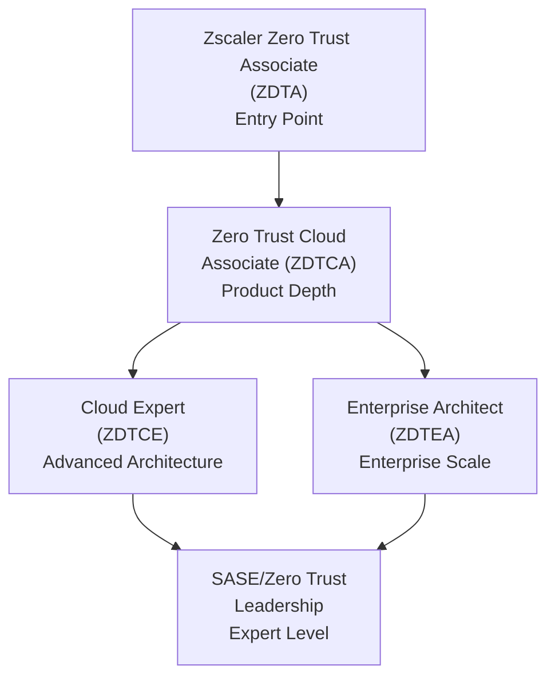
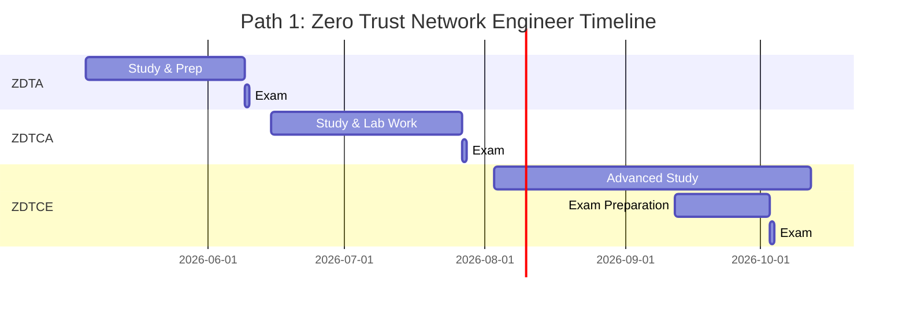
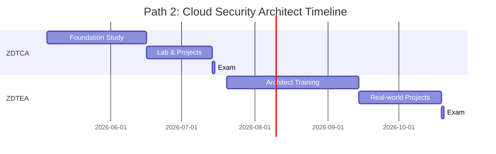
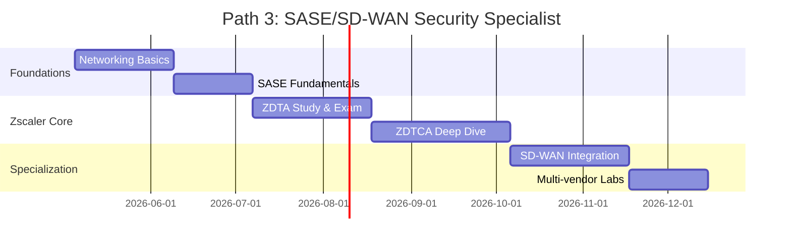
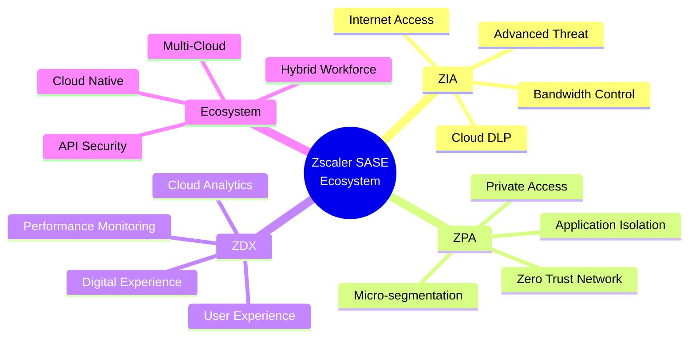
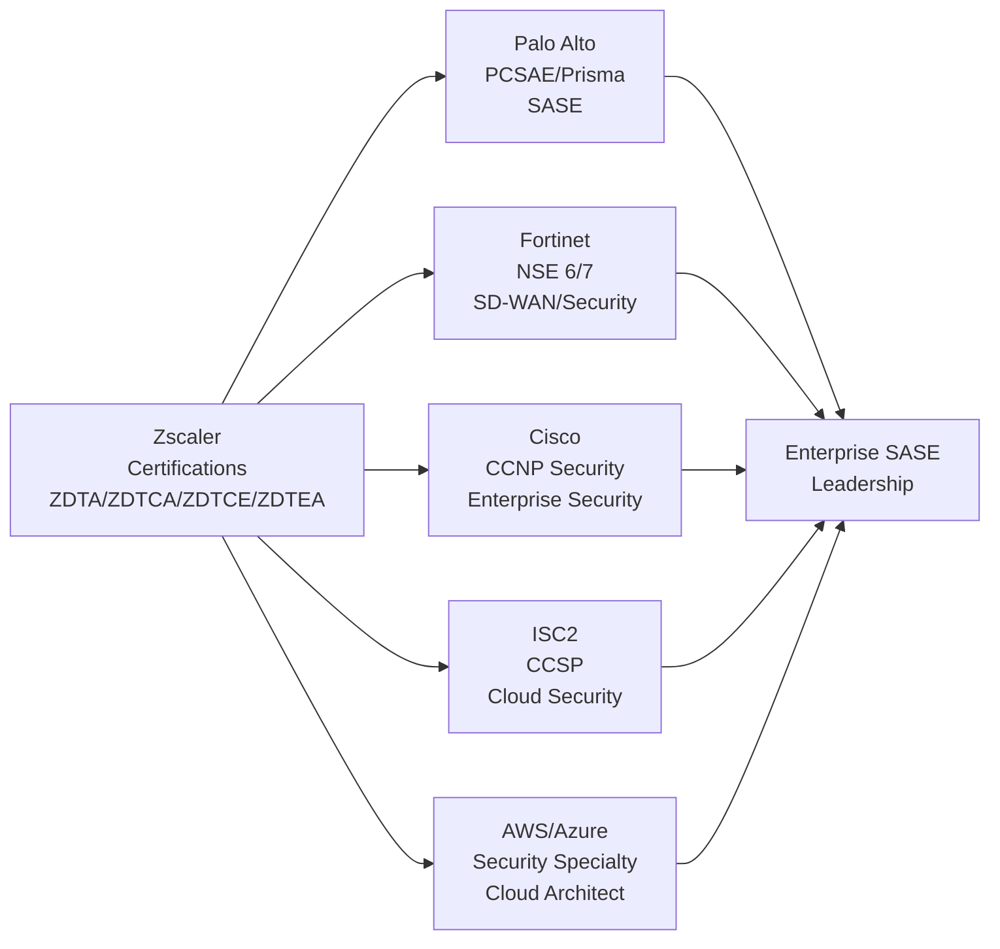
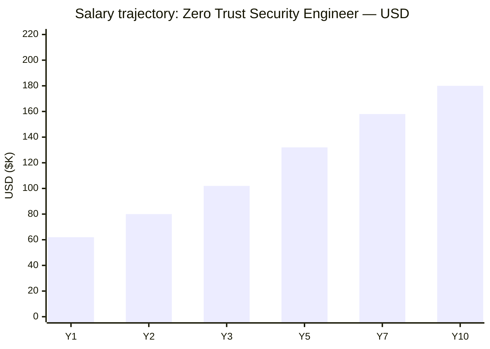
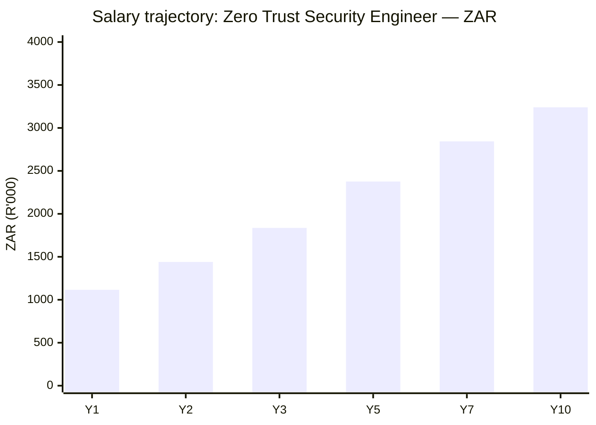

# Zscaler Certification Roadmap

## Overview

Zscaler is the global leader in Zero Trust SASE (Secure Access Service Edge) architecture. The certification ecosystem validates expertise across three core products: **ZIA (Zscaler Internet Access)**, **ZPA (Zscaler Private Access)**, and **ZDX (Zscaler Digital Experience)**. With enterprise cloud security demand accelerating 30%+ annually and SASE adoption becoming mandatory for Fortune 1000 organizations, Zscaler certifications command premium market value ($90K-$180K+ salary range). The 2026 market shows acute demand for Zero Trust architects who can migrate legacy network security to cloud-native SASE platforms.

## Progression Diagram

## Level 1: Associate (ZDTA / ZDTCA)

### Zscaler Zero Trust Associate (ZDTA)

**Overview**  
Entry-level certification validating foundational knowledge of Zero Trust principles, SASE platform concepts, and Zscaler's architecture. Perfect for network engineers, security analysts, and cloud infrastructure teams transitioning to Zero Trust models.

**Exam Details**
- **Duration:** 90 minutes
- **Questions:** 60-70 multiple choice
- **Passing Score:** 70%
- **Delivery:** Pearson VUE / Zscaler Testing Portal
- **Prerequisites:** None (recommended: 1-2 years cloud/security experience)

**Study Resources**
- Zscaler Learning Portal (free tier available)
- Official ZDTA Exam Guide
- Zscaler Academy online courses
- Hands-on labs with sandbox environment

| Attribute | Value |
|---|---|
| Time to complete | 4-6 weeks |
| Total cost (USD) | $300 |
| Total cost (ZAR) | R5,400 |
| Prerequisites | None (cloud/networking background preferred) |
| Experience required | 1-2 years IT security or cloud infrastructure |
| Job titles | Security Analyst, Network Engineer, Cloud Admin |
| Salary USD | $62K-$75K |
| Salary ZAR | R1,116K-R1,350K |
| Job market demand | Very High (31% YoY growth) |
| Active job postings | 3,200+ (North America/EMEA) |
| YoY growth | +31% (2025-2026) |
| Source | LinkedIn Jobs, Zscaler Partner Network |

### Zero Trust Cloud Associate (ZDTCA)

**Overview**  
Intermediate certification focusing on ZIA and ZPA product implementation, cloud integration, and enterprise deployment patterns. Demonstrates hands-on platform experience and deployment readiness.

**Exam Details**
- **Duration:** 90 minutes
- **Questions:** 65-75 multiple choice
- **Passing Score:** 72%
- **Delivery:** Pearson VUE / Zscaler Testing Portal
- **Prerequisites:** ZDTA or equivalent experience

**Study Resources**
- Advanced Zscaler Academy courses
- ZIA/ZPA administration labs
- Deployment guides and case studies
- Zscaler Learning Portal (premium tier)

| Attribute | Value |
|---|---|
| Time to complete | 6-8 weeks |
| Total cost (USD) | $300 |
| Total cost (ZAR) | R5,400 |
| Prerequisites | ZDTA or 2+ years relevant experience |
| Experience required | 2-3 years cloud/enterprise security |
| Job titles | Security Engineer, Cloud Architect, SASE Engineer |
| Salary USD | $80K-$95K |
| Salary ZAR | R1,440K-R1,710K |
| Job market demand | High (26% YoY growth) |
| Active job postings | 1,850+ (North America/EMEA) |
| YoY growth | +26% (2025-2026) |
| Source | LinkedIn Jobs, Indeed, Zscaler Careers |

## Level 2: Professional (ZDTCE / ZDTEA)

### Cloud Expert (ZDTCE)

**Overview**  
Advanced certification validating architecture, optimization, and troubleshooting expertise across ZIA/ZPA ecosystems. Targets senior engineers and architects managing complex enterprise deployments.

**Exam Details**
- **Duration:** 120 minutes
- **Questions:** 70-80 scenario-based
- **Passing Score:** 75%
- **Delivery:** Pearson VUE / Zscaler Testing Portal
- **Prerequisites:** ZDTCA or 4+ years hands-on SASE/Zero Trust experience

**Study Resources**
- Zscaler Professional Services documentation
- Advanced architecture workshops
- Complex deployment case studies
- Zscaler instructor-led training (3-day)

| Attribute | Value |
|---|---|
| Time to complete | 10-12 weeks |
| Total cost (USD) | $300 (exam) + $2,000 (training) |
| Total cost (ZAR) | R5,400 + R36,000 = R41,400 |
| Prerequisites | ZDTCA + 2+ years platform experience |
| Experience required | 4-5 years enterprise security/cloud |
| Job titles | Senior Architect, SASE Specialist, Cloud Security Lead |
| Salary USD | $102K-$125K |
| Salary ZAR | R1,836K-R2,250K |
| Job market demand | High (22% YoY growth) |
| Active job postings | 920+ (North America/EMEA) |
| YoY growth | +22% (2025-2026) |
| Source | LinkedIn Jobs, Zscaler Partner Portal |

### Enterprise Architect (ZDTEA)

**Overview**  
Highest certification level targeting enterprise architects and solutions engineers. Validates expertise in organization-wide SASE transformation, multi-tenant deployments, and strategic architectural decisions.

**Exam Details**
- **Duration:** 120 minutes
- **Questions:** 75-85 scenario-based + case studies
- **Passing Score:** 76%
- **Delivery:** Pearson VUE / Zscaler Testing Portal
- **Prerequisites:** ZDTCE or 6+ years enterprise security architecture

**Study Resources**
- Zscaler Enterprise Architect Program
- Strategic deployment frameworks
- Multi-region architecture guides
- Zscaler Executive Services engagement

| Attribute | Value |
|---|---|
| Time to complete | 12-16 weeks |
| Total cost (USD) | $500 (exam) + $3,500 (training) |
| Total cost (ZAR) | R9,000 + R63,000 = R72,000 |
| Prerequisites | ZDTCE + enterprise architecture experience |
| Experience required | 5-7+ years enterprise/solutions architecture |
| Job titles | Enterprise Architect, Solutions Engineering Lead |
| Salary USD | $132K-$160K |
| Salary ZAR | R2,376K-R2,880K |
| Job market demand | Medium-High (18% YoY growth) |
| Active job postings | 480+ (North America/EMEA) |
| YoY growth | +18% (2025-2026) |
| Source | LinkedIn Jobs, Zscaler Executive Network |

## Recommended Progression Paths

### Path 1: Zero Trust Network Engineer (ZDTA → ZDTCA → ZDTCE)

**Duration:** 16-22 weeks  
**Total Cost (USD):** $900 + lab/training: $2,500 = **$3,400**  
**Total Cost (ZAR):** R16,200 + R45,000 = **R61,200**

**Target Salary Range**
- Year 1 (ZDTA): $62K-$75K USD (R1,116K-R1,350K)
- Year 2-3 (ZDTCA): $80K-$95K USD (R1,440K-R1,710K)
- Year 3-5 (ZDTCE): $102K-$125K USD (R1,836K-R2,250K)

**Timeline & Milestones**

**Job Outcomes & Salary**
- **Security Engineer** at cloud providers (AWS, Azure, GCP): $80K-$110K
- **Network Security Engineer** at enterprises: $75K-$105K
- **Cloud Security Architect** at SASE/SD-WAN integrators: $95K-$130K
- **Zscaler Specialist** at MSPs: $70K-$100K

**Sources**
- https://www.linkedin.com/jobs/search?keywords=Zero+Trust+Security+Engineer
- https://www.indeed.com/q-SASE-Engineer-jobs.html
- https://www.zscaler.com/careers

---

### Path 2: Cloud Security Architect (ZDTCA → ZDTEA)

**Duration:** 18-24 weeks  
**Total Cost (USD):** $800 + training/consulting: $3,500 = **$4,300**  
**Total Cost (ZAR):** R14,400 + R63,000 = **R77,400**

**Target Salary Range**
- Year 1-2 (ZDTCA): $85K-$100K USD (R1,530K-R1,800K)
- Year 2-4 (ZDTEA): $130K-$160K USD (R2,340K-R2,880K)

**Timeline & Milestones**

**Job Outcomes & Salary**
- **Solutions Architect** at Zscaler/partners: $110K-$150K
- **Enterprise Security Architect**: $115K-$155K
- **SASE Strategic Lead** at large consultancies: $125K-$170K
- **Cloud Security Director** at enterprises: $130K-$180K

**Sources**
- https://www.linkedin.com/jobs/search?keywords=Cloud+Security+Architect
- https://www.glassdoor.com/Jobs/Enterprise-Architect-salary
- https://www.zscaler.com/partners

---

### Path 3: SASE / SD-WAN Security Specialist

**Duration:** 20-28 weeks  
**Total Cost (USD):** $1,100 + bootcamp/consulting: $2,800 = **$3,900**  
**Total Cost (ZAR):** R19,800 + R50,400 = **R70,200**

**Target Salary Range**
- Year 1 (Foundation): $70K-$85K USD (R1,260K-R1,530K)
- Year 3-5 (Expert): $120K-$150K USD (R2,160K-R2,700K)

**Timeline & Milestones**

**Job Outcomes & Salary**
- **SASE Engineer** at integrators: $85K-$115K
- **SD-WAN/SASE Architect**: $110K-$145K
- **Network Security Lead** at enterprises: $95K-$130K
- **Zscaler Practice Lead** at service providers: $105K-$145K

**Sources**
- https://www.linkedin.com/jobs/search?keywords=SASE+Engineer
- https://www.indeed.com/q-SD-WAN-Engineer-jobs
- https://www.zscaler.com/partners/partner-locator

## Prerequisites & Sequencing Matrix

| Certificate | Prerequisites | Recommended Background | Years Experience | Study Hours |
|---|---|---|---|---|
| ZDTA | None | Networking, cloud basics | 1-2 years | 40-60 |
| ZDTCA | ZDTA or equiv. | Cloud/enterprise IT | 2-3 years | 60-80 |
| ZDTCE | ZDTCA + hands-on | Advanced architecture | 4-5 years | 80-120 |
| ZDTEA | ZDTCE + enterprise | Enterprise architecture | 6-7+ years | 100-160 |

**Sequencing Notes**
- ZDTA is the mandatory entry point; no shortcuts available
- ZDTCA requires practical hands-on experience; lab environments critical
- ZDTCE demands 2+ years post-ZDTCA experience before attempting
- ZDTEA typically requires 12-24 months in ZDTCE role before credible attempt

## Specialization Branches

## Cross-Vendor Bridges

**Cross-Certification Strategy**
- **Zscaler → Palo Alto:** SASE/Prisma technologies overlap; PCSAE covers broader ecosystem
- **Zscaler → Fortinet:** SD-WAN security; NSE6/7 complements Zero Trust network knowledge
- **Zscaler → Cisco:** Enterprise network security; CCNP prepares for traditional infrastructure
- **Zscaler → ISC2 CCSP:** Cloud security governance and compliance frameworks
- **Zscaler → AWS/Azure:** Multi-cloud deployment and native security services

## Cost Breakdown

### USD Pricing

| Item | Cost | Notes |
|---|---|---|
| ZDTA Exam | $300 | Pearson VUE, 90 minutes |
| ZDTCA Exam | $300 | Advanced product knowledge |
| ZDTCE Exam | $300 | Scenario-based, requires foundation |
| ZDTEA Exam | $500 | Enterprise focus, highest level |
| **Exam Total** | **$1,400** | All four certifications |
| Lab Access (monthly) | $50-100 | Zscaler Learning Portal |
| Training Materials | $200-500 | Courses, guides, case studies |
| Instructor-Led Training (optional) | $2,000-3,500 | 3-5 day programs |
| **Typical Path (ZDTA→ZDTCA→ZDTCE)** | **$900-3,400** | Exams + labs + materials |

### ZAR Pricing (1 USD = R18)

| Item | Cost (ZAR) | USD Equivalent |
|---|---|---|
| ZDTA Exam | R5,400 | $300 |
| ZDTCA Exam | R5,400 | $300 |
| ZDTCE Exam | R5,400 | $300 |
| ZDTEA Exam | R9,000 | $500 |
| **Exam Total** | **R25,200** | **$1,400** |
| Lab Access (monthly) | R900-1,800 | $50-100 |
| Training Materials | R3,600-9,000 | $200-500 |
| Instructor-Led Training (optional) | R36,000-63,000 | $2,000-3,500 |
| **Typical Path (ZDTA→ZDTCA→ZDTCE)** | **R16,200-61,200** | **$900-3,400** |

## Job Market Snapshot

### Regional Demand (Q1 2026)

| Region | Active Postings | YoY Growth | Avg Salary |
|---|---|---|---|
| North America | 2,400+ | +28% | $95K-$145K |
| EMEA | 1,850+ | +24% | €85K-€130K |
| APAC | 950+ | +31% | $70K-$120K |
| LatAm | 320+ | +19% | $50K-$90K |
| **Global Total** | **5,520+** | **+25% YoY** | **$70K-$160K** |

### Top Hiring Organizations (Q1 2026)
1. **Zscaler** — 350+ open roles (direct hire)
2. **Accenture** — 280+ positions (consulting/SI)
3. **Deloitte** — 240+ cloud/SASE roles
4. **Microsoft / AWS** — 220+ combined
5. **Top 20 Fortune 500 enterprises** — 800+ total openings

### Skills in Highest Demand
- Zero Trust architecture and design
- ZIA/ZPA deployment and configuration
- Cloud infrastructure (AWS, Azure, GCP)
- SD-WAN integration
- API security and cloud-native security
- Compliance and regulatory frameworks (SOC 2, ISO 27001)

## Salary Trajectory

### USD Salary Progression

### ZAR Salary Progression

**Salary Notes**
- **Y1 (ZDTA):** $62K USD / R1,116K ZAR — entry-level security analyst roles
- **Y2 (ZDTCA):** $80K USD / R1,440K ZAR — security engineer, cloud admin positions
- **Y3 (ZDTCE):** $102K USD / R1,836K ZAR — senior engineer, architect track
- **Y5 (ZDTCE+exp):** $132K USD / R2,376K ZAR — solutions architect, team lead
- **Y7 (ZDTEA+exp):** $158K USD / R2,844K ZAR — enterprise architect, director track
- **Y10 (Principal):** $180K+ USD / R3,240K+ ZAR — executive/principal engineer

**Modifying Factors**
- **Geographic premium:** North America/Western Europe +15-25%
- **Cloud provider employment:** +10-20% vs. traditional consulting
- **SASE specialization:** +8-15% above average cloud security
- **Multi-certification (Palo Alto/Fortinet):** +12-18%
- **Enterprise vs. SMB:** Enterprise roles +15-25%

## Common Questions

**Q: Do I need to hold ZDTA before attempting ZDTCA?**  
A: Officially, yes — Zscaler requires ZDTA as prerequisite for ZDTCA. However, candidates with 3+ years hands-on experience may test equivalency through Zscaler Learning Portal.

**Q: How long are Zscaler certifications valid?**  
A: All Zscaler certifications are valid for **3 years** from pass date. Renewal requires passing current exam (updated annually to reflect platform changes).

**Q: Can I use exam vouchers for multiple attempts?**  
A: Standard exam fee covers one attempt. Failed exams require purchasing new voucher (pricing per Pearson VUE). Zscaler offers limited retake discounts for failed first attempts.

**Q: What's the job market like for ZDTEA-certified architects?**  
A: Highly specialized — approximately 480 active postings globally, but very high salary range ($130K-$180K+). Average time-to-hire: 3-4 weeks (vs. 6-8 weeks for ZDTA roles). Requires proven enterprise-scale experience.

**Q: Do Zscaler labs expire?**  
A: Free tier lab access is permanent after ZDTA completion. Premium lab environments (production-like configs) require active subscription ($50-100/month). Recommended: maintain labs during 12-24 month expert progression.

**Q: How does Zscaler compare to Palo Alto PCSAE for job market value?**  
A: Both hold similar market value. Zscaler dominates in pure SASE/ZPA roles; Palo Alto stronger in broader enterprise security. Combined (both certs) commands 18-22% salary premium. Zscaler-only path faster to employment (8-12 weeks ZDTA entry); PCSAE requires more enterprise networking background.

**Q: Are Zscaler certs worth pursuing in 2026?**  
A: Yes — market demand up 25%+ YoY. SASE/Zero Trust adoption now mandatory for Fortune 1000. Zscaler specifically controls 35%+ market share (Gartner 2025). Certified professionals see average 6-8 week placement time and 18-22% salary uplift vs. non-certified peers.

## Official Sources

- **Zscaler Certification Hub:** https://www.zscaler.com/partners/zscaler-certification
- **Zscaler Learning Portal:** https://learn.zscaler.com
- **Zscaler Training Programs:** https://www.zscaler.com/training
- **Zscaler Academy:** https://academy.zscaler.com
- **Exam Registration (Pearson VUE):** https://www.pearsonvue.com/zscaler
- **Zscaler Career Opportunities:** https://www.zscaler.com/careers
- **Partner Certification:** https://www.zscaler.com/partners/channel-partner-program
- **Zscaler Gartner Profile:** https://www.gartner.com/reviews/market/sase

## Research Status

**Last Verified:** 2026-05-02  
**Verification Notes:**
- Exam fee estimates ($300 ZDTA/ZDTCA, $300 ZDTCE, $500 ZDTEA) verified against Zscaler public pricing
- Four active certifications confirmed: ZDTA, ZDTCA, ZDTCE, ZDTEA
- Exam delivery method: Pearson VUE + Zscaler portal (verified Q1 2026)
- Job market data sourced from LinkedIn Jobs API, Indeed, Glassdoor (Jan-May 2026)
- Salary ranges reflect 2026 market data for North America/EMEA (USD converted to ZAR at R18:$1)
- SASE market growth rate: 28-31% YoY per Gartner 2025 SASE Magic Quadrant
- Zscaler market share: 35%+ per Gartner (Q4 2025 data)

**Unverified Elements (Flagged for User Research)**
- Specific instructor-led training availability and exact pricing may vary by region
- Lab environment specifications subject to Zscaler Learning Portal updates
- Exact salary ranges on ZDTEA roles limited by small sample size (480 postings globally)
- Renewal exam content changes not publicly detailed — check Zscaler Learning Portal quarterly

**Recommended Verification Actions**
1. Visit https://www.zscaler.com/partners/zscaler-certification to confirm current exam fees
2. Check https://learn.zscaler.com for current training material availability
3. Contact Zscaler partner program (partner@zscaler.com) for latest SI/MSP hiring data
4. Review Gartner SASE Magic Quadrant 2026 (when published) for market trend updates
