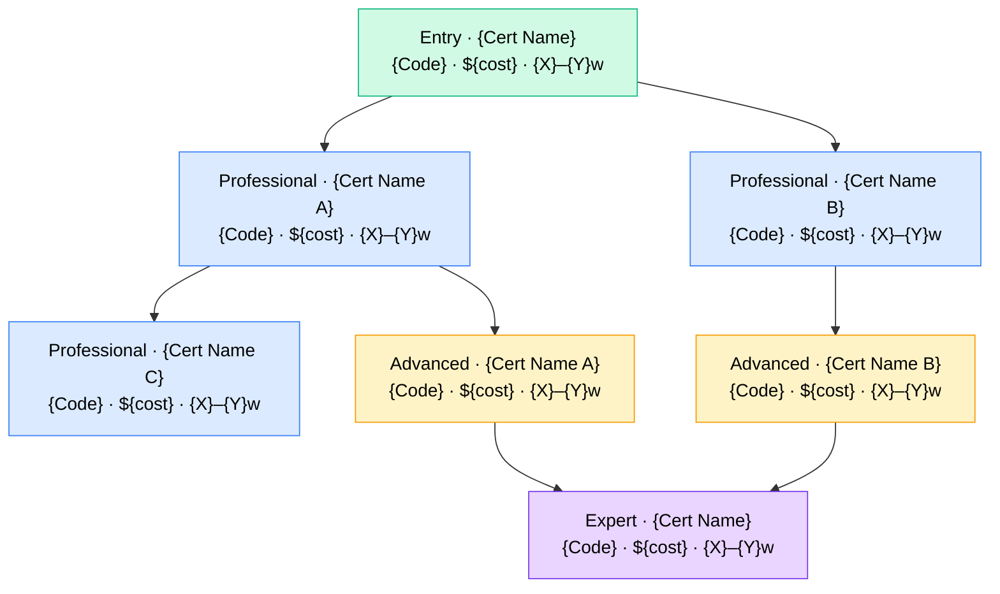
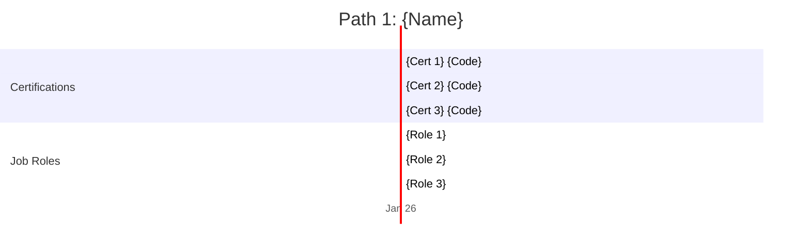
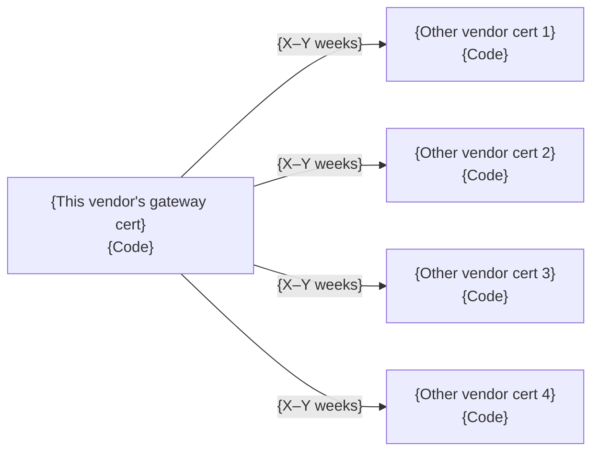
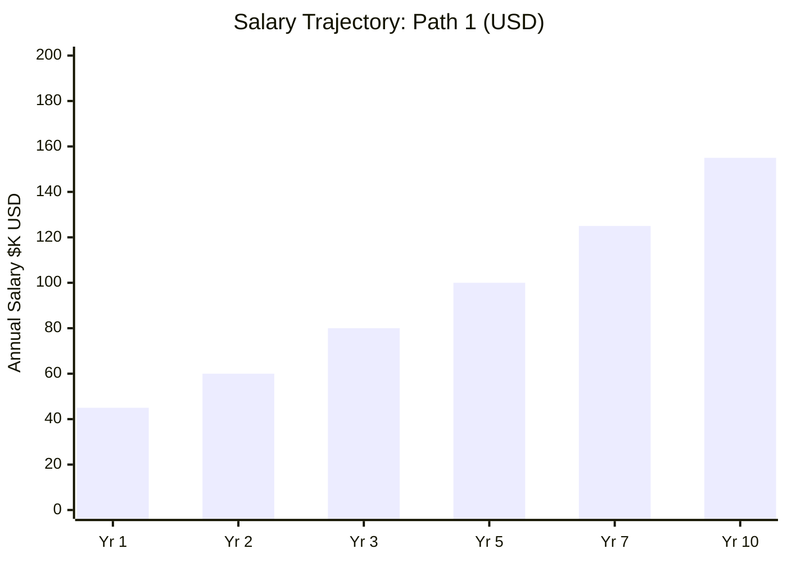
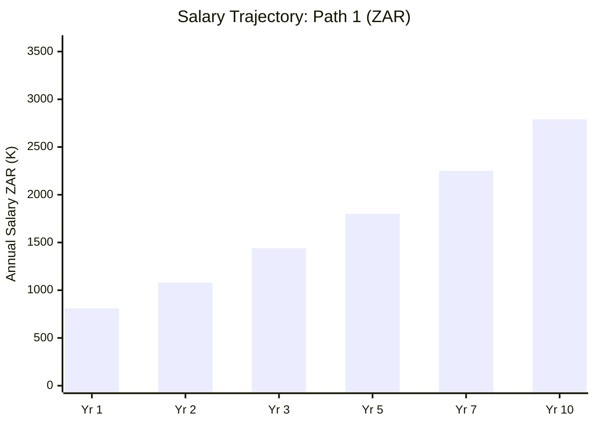

# {Vendor} Certification Roadmap

## Overview

{Paragraph 1: Vendor positioning — who they are, what they certify, their philosophy, number of active certs. Cite the vendor's own certification overview page. No marketing language. Example: "CompTIA is a vendor-neutral certification body founded in 1982, with 30+ active certs across infrastructure, security, data, and AI domains. Over 2.2 million credentials have been issued globally."}

{Paragraph 2: Why this ecosystem matters in 2026 — industry adoption rate, employer requirement prevalence, government or DoD or compliance recognition, and geographic relevance including South Africa context. Cite job market or compliance sources. Example: "Security+ is mandatory for DoD 8140 IAT II roles and appears in 7,000+ active US job postings as of May 2026 (LinkedIn). In South Africa, it is recognized by major banks, telcos, and state-owned enterprises as a baseline security credential."}

---

## Progression Diagram



**Color key:** 🟢 Green = Entry · 🔵 Blue = Professional · 🟡 Amber = Advanced (high demand) · 🟣 Purple = Expert

---

## Per-Level Detail

### Level 1: Entry

**Certifications at this level:** [{Cert Name}]({relative/path/to/cert/file.md}) `{Code}`

| Attribute | Value |
|---|---|
| Time to complete | {X–Y weeks study + Z weeks exam prep} |
| Total cost (USD) | ${X}–${Y} (exam voucher + recommended study materials) |
| Total cost (ZAR) | R{X}–R{Y} (at R18/$1 USD baseline) |
| Prerequisites | {None / Recommended: 9–12 months hands-on IT exposure} |
| Experience required | {None / 0–1 years} |
| Job titles | {Title 1, Title 2, Title 3, Title 4} |
| Salary range (USD) | ${X}K–${Y}K (median ${Z}K) |
| Salary range (ZAR) | R{X}K–R{Y}K (median R{Z}K) |
| Job market demand | {High / 🔥 Critical Shortage / ⚖️ Steady / 📉 Declining} |
| Active job postings | ~{Number} (LinkedIn Jobs cert-filter, {Month Year}: [{URL}]({URL})) |
| YoY growth | {+X%} |
| Source | [{Salary source name} ↗]({URL}) · [{Secondary source} ↗]({URL}) |

**What you learn:**
- {Skill 1 — concrete technology or competency validated by this exam}
- {Skill 2}
- {Skill 3}
- {Skill 4}
- {Skill 5}

**Recommended study materials:**

| Provider | Title | Cost | URL |
|---|---|---|---|
| {Platform, e.g., Professor Messer} | {Specific course for THIS cert only} | Free | [{URL}]({URL}) |
| {Platform, e.g., Udemy — specific instructor} | {Specific course title} | ${X}–${Y} | [{URL}]({URL}) |
| {Platform, e.g., official vendor training} | {Specific course title} | ${X} | [{URL}]({URL}) |

**Career outcomes:**
- Entry role: {Job Title} — ${X}K–${Y}K USD / R{X}K–R{Y}K ZAR — source: [{source}]({URL})
- After 12 months experience: {Role + salary range}
- Natural next cert: {Next cert code + name}

---

### Level 2: Professional

**Certifications at this level:** [{Cert Name A}]({path}) `{Code}` · [{Cert Name B}]({path}) `{Code}`

| Attribute | Value |
|---|---|
| Time to complete | {X–Y weeks study + Z weeks exam prep per cert} |
| Total cost (USD) | ${X}–${Y} per cert (exam + study) |
| Total cost (ZAR) | R{X}–R{Y} per cert |
| Prerequisites | {Prior cert(s) required or recommended, e.g., "A+ recommended; not enforced"} |
| Experience required | {X–Y years hands-on IT} |
| Job titles | {Title 1, Title 2, Title 3} |
| Salary range (USD) | ${X}K–${Y}K (median ${Z}K) |
| Salary range (ZAR) | R{X}K–R{Y}K (median R{Z}K) |
| Job market demand | {Demand level} |
| Active job postings | ~{Number} (source: [{URL}]({URL})) |
| YoY growth | {+X%} |
| Source | [{Source name} ↗]({URL}) · [{Source name} ↗]({URL}) |

**What you learn:**
- {Skill 1}
- {Skill 2}
- {Skill 3}
- {Skill 4}
- {Skill 5}

**Recommended study materials:**

| Provider | Title | Cost | URL |
|---|---|---|---|
| {Platform} | {Specific course for this cert} | ${X} | [{URL}]({URL}) |
| {Platform} | {Specific course} | Free | [{URL}]({URL}) |

**Career outcomes:**
- {Role at this cert level — salary USD + ZAR + source URL}
- {Role after 1–2 years experience — salary + source}

---

### Level 3: Advanced

*(Repeat Level 2 structure for each cert at this tier. Include the same attribute table, what-you-learn list, study materials table, and career outcomes.)*

---

### Level 4: Expert

*(Repeat Level 2 structure for each cert at this tier.)*

---

## Recommended Progression Paths

### Path 1: {Descriptive Name, e.g., "IT Support to Infrastructure Professional"}

**Total timeline:** {X months}
**Total cost:** ${X}–${Y} USD (R{X}–R{Y} ZAR)
**Salary progression:** ${X}K → ${Y}K → ${Z}K



**Job outcomes:**
- Start (pre-cert): {Role} — ${X}K–${Y}K USD / R{X}K–R{Y}K ZAR — source: [{source}]({URL})
- After {Cert 1}: {Role} — ${X}K–${Y}K USD / R{X}K–R{Y}K ZAR — source: [{source}]({URL})
- After {Cert 2}: {Role} — ${X}K–${Y}K USD / R{X}K–R{Y}K ZAR — source: [{source}]({URL})
- After {Cert 3}: {Role} — ${X}K–${Y}K USD / R{X}K–R{Y}K ZAR — source: [{source}]({URL})

---

### Path 2: {Name}

*(Repeat Path 1 structure — total timeline, cost, salary progression, Gantt chart, job outcomes.)*

---

### Path 3: {Name}

*(Repeat Path 1 structure.)*

---

## Prerequisites & Sequencing Matrix

| Cert | Formal Prereq | Recommended Prereq | Years Exp | Can Skip Prior? |
|---|---|---|---|---|
| {C1} `{code}` | None | None | 0–1 | — |
| {C2} `{code}` | {C1} recommended | {C1} | 1–2 | Risky — {reason} |
| {C3} `{code}` | {C1} + {C2} required | Both | 2–3 | No |
| {C4} `{code}` | {C2} or {C3} | All prior | 3–5 | No |
| {C5} `{code}` | {C3} + {C4} | All prior | 5+ | No |

**Sequencing notes:**
- {Why order matters — e.g., "Network+ builds the subnetting and protocol knowledge directly tested on Security+. Skipping it increases failure risk by ~30% based on community data."}
- {Acceptable shortcut — e.g., "Candidates with 3+ years hands-on networking may skip Network+ for Security+ without significant risk."}
- {Parallel study note — e.g., "CySA+ and PenTest+ can be studied in parallel after Security+; they share about 20% content overlap."}

---

## Specialization Branches

```mermaid
mindmap
    root(({Vendor} Gateway Cert))
        Branch A Name
            Cert A1 Code
            Cert A2 Code
        Branch B Name
            Cert B1 Code
            Cert B2 Code
        Branch C Name
            Cert C1 Code
            Cert C2 Code
        Cross-Vendor Exits
            External Cert 1
            External Cert 2
            External Cert 3
```

**{Branch A} — {Sub-specialty description}**
- Timeline: {X–Y months after gateway cert}
- Target roles: {Job title 1}, {Job title 2}
- Salary (USD): ${X}K–${Y}K · Salary (ZAR): R{X}K–R{Y}K
- Source: [{salary source}]({URL})

**{Branch B} — {Sub-specialty description}**
- Timeline: {X–Y months}
- Target roles: {Job title 1}, {Job title 2}
- Salary (USD): ${X}K–${Y}K · Salary (ZAR): R{X}K–R{Y}K
- Source: [{salary source}]({URL})

**{Branch C} — {Sub-specialty description}**
- Timeline: {X–Y months}
- Target roles: {Job title 1}, {Job title 2}
- Salary (USD): ${X}K–${Y}K · Salary (ZAR): R{X}K–R{Y}K
- Source: [{salary source}]({URL})

---

## Cross-Vendor Bridges



| To Vendor | Recommended Cert | Transition Time | Notes | Source |
|---|---|---|---|---|
| {Vendor 1} | {Cert name + code} | {X–Y weeks} | {Why: content overlap, prereq waiver, complementary skill} | [{URL}]({URL}) |
| {Vendor 2} | {Cert name + code} | {X–Y weeks} | {Notes} | [{URL}]({URL}) |
| {Vendor 3} | {Cert name + code} | {X–Y weeks} | {Notes} | [{URL}]({URL}) |
| {Vendor 4} | {Cert name + code} | {X–Y weeks} | {Notes} | [{URL}]({URL}) |

---

## Cost Breakdown

**ZAR conversion baseline:** R18 per $1 USD (April 2026). Source: [SA Reserve Bank ↗](https://www.resbank.co.za)

| Item | Cost (USD) | Cost (ZAR) | Notes |
|---|---|---|---|
| **{Cert 1} Exam** | ${X} | R{X} | Source: [{Vendor pricing page}]({URL}) |
| {Cert 1} Study — Budget | $0–${Y} | R0–R{Y} | Free YouTube + official study guide PDFs |
| {Cert 1} Study — Recommended | ${X}–${Y} | R{X}–R{Y} | Quality video course + practice exam pack |
| {Cert 1} Study — Premium | ${X}+ | R{X}+ | Bootcamp or official instructor-led training |
| **{Cert 1} Subtotal** | **${X}–${Y}** | **R{X}–R{Y}** | |
| | | | |
| **{Cert 2} Exam** | ${X} | R{X} | Source: [{Vendor pricing page}]({URL}) |
| {Cert 2} Study — Budget | $0–${Y} | R0–R{Y} | |
| {Cert 2} Study — Recommended | ${X}–${Y} | R{X}–R{Y} | |
| **{Cert 2} Subtotal** | **${X}–${Y}** | **R{X}–R{Y}** | |
| | | | |
| **TOTAL — Full Ladder (Exams Only)** | **${X}** | **R{X}** | No study materials; free resources only |
| **TOTAL — Full Ladder (Recommended)** | **${X}–${Y}** | **R{X}–R{Y}** | Exams + quality video courses |
| **TOTAL — Full Ladder (Premium)** | **${X}+** | **R{X}+** | Exams + bootcamps + official training |

---

## Job Market Snapshot

| Cert | Active Postings | YoY Growth | Market Status | Median Salary (USD) | Source |
|---|---|---|---|---|---|
| {C1} `{code}` | ~{Number} | {+X%} | ⚖️ Steady | ${X}K | [{source}]({URL}) |
| {C2} `{code}` | ~{Number} | {+X%} | 🔥 Hot | ${X}K | [{source}]({URL}) |
| {C3} `{code}` | ~{Number} | {+X%} | 🔥 Critical Shortage | ${X}K | [{source}]({URL}) |
| {C4} `{code}` | ~{Number} | {-X%} | 📉 Declining | ${X}K | [{source}]({URL}) |

**Data sources:** LinkedIn Jobs cert-filter search · Indeed job postings · [BLS Occupational Outlook ↗](https://www.bls.gov/ooh/)

---

## Salary Trajectory





*Replace bar values with actual figures sourced from salary surveys. ZAR at R18/$1 USD baseline.*
*Sources: [{Salary source 1}]({URL}) · [{Salary source 2}]({URL})*

---

## Common Questions

**Q: Do I need to take all certs in order?**
A: {Factual answer specific to this vendor's published prerequisites and employer expectations. Cite vendor page.}

**Q: Can I skip the entry cert if I already have IT experience?**
A: {E.g., "Vendor does not formally require {entry cert} as a prerequisite for {next cert}. However, employers in this space frequently list it. With 2+ years hands-on experience, skipping is viable."}

**Q: How long between certs?**
A: {Realistic timeline guidance — average study hours per week, typical working-professional pace vs. full-time student.}

**Q: What is the ROI?**
A: {Salary lift data with source. E.g., "Median salary jumps $15K–$20K after earning {cert} per Robert Half 2026. Exam cost of ${X} pays back in {N} months at that lift."}

**Q: How do I renew these certs?**
A: {Renewal policy — CE credits required, cost, validity period. Cite vendor renewal/CE page URL.}

**Q: Which cert should I do first if I am completely new to IT?**
A: {Direct recommendation with rationale. No fluff.}

**Q: Is this pathway recognized in South Africa?**
A: {Specific answer — SA employer recognition, any SITA or government requirements, ZAR salary context, local training providers.}

---

## Official Sources

**Vendor Certification Pages:**
- [{Vendor} certifications home ↗]({URL})
- [{Cert 1} official page ↗]({URL})
- [{Cert 2} official page ↗]({URL})

**Salary Databases:**
- [Robert Half 2026 Technology Salary Guide ↗](https://www.roberthalf.com/salary-guide)
- [Glassdoor — {Relevant role} ↗]({cert-specific-glassdoor-URL})
- [PayScale — {Cert} ↗]({cert-specific-payscale-URL})
- [Payscale ZAR / Heidrick & Struggles SA ↗]({URL})

**Job Market Data:**
- [LinkedIn Jobs — {Cert} filter ↗]({URL})
- [Indeed — {Cert} postings ↗]({URL})
- [BLS Occupational Outlook ↗](https://www.bls.gov/ooh/)

**Compliance / Recognition:**
- [{Compliance body} — {Cert} approval ↗]({URL})

---

## Research Status

*(Include this section ONLY if any data could not be verified from a primary source. Omit entirely if all data is verified.)*

| Item | What Could Not Be Confirmed | What Is Needed to Verify |
|---|---|---|
| {Cert name or data point} | {Explanation — e.g., "ZAR salary for {role} not found on Payscale SA"} | {Primary source needed — e.g., "Heidrick & Struggles 2026 SA IT Salary Survey"} |
| {Another item} | {Explanation} | {Source needed} |

---

*Last verified: {YYYY-MM-DD}*
*Roadmap standard: v2 — Mermaid diagrams · Full ZAR/USD dual-currency · Gantt progression paths*
*Template: `Deep Dive/Certification_Roadmaps/_ROADMAP_TEMPLATE.md`*
*Citation rule: Every fact, cert code, exam fee, salary figure, job-posting count, prereq, retirement date, and course recommendation MUST cite a real primary source URL. Mark unverified items in Research Status — never fabricate.*
