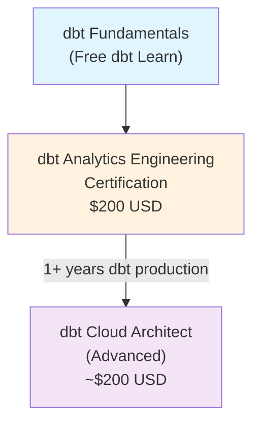
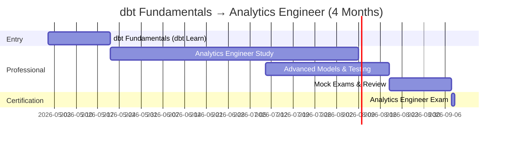
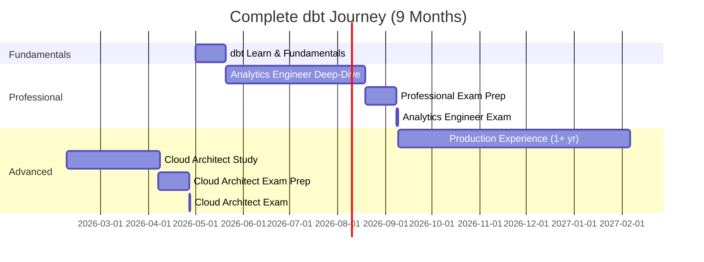
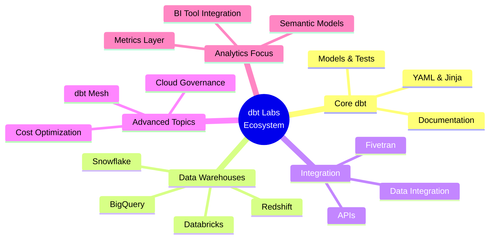
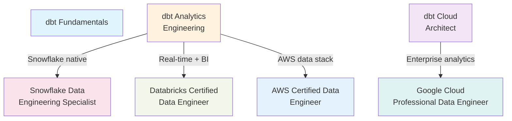

# dbt Labs Certification Roadmap

## Overview

dbt (data build tool) has revolutionised analytics engineering by bringing software engineering best practices to data transformation workflows. The dbt certification pathway—from free fundamentals through professional analytics engineering to advanced cloud architecture—validates expertise in the fastest-growing data role. Analytics engineers with dbt skills command strong salaries (median $153,929 USD, with 80%+ earning $100K+), driven by explosive demand across fintech, e-commerce, SaaS, and data-native organisations.

In 2026, dbt remains the de facto standard for analytics engineering, with over 80% of analytics teams adopting or expanding dbt usage. The three-tier certification structure (Fundamentals → Analytics Engineer → Cloud Architect) reflects the maturity of the dbt ecosystem and the evolution of analytics engineering from SQL-writing analysts to full-stack transformation platform architects. For South African data professionals, dbt certification opens pathways to high-paying remote roles and leadership positions in modern data teams.

## Progression Diagram



---

## Per-Level Detail

### Level 1: Entry — dbt Fundamentals (Free)

| Attribute | Value |
|-----------|-------|
| **Cost (USD)** | Free |
| **Cost (ZAR)** | Free |
| **Platform** | dbt Learn (online, self-paced) |
| **Duration** | 6–10 hours |
| **Certificate** | Yes (free, digital badge) |
| **Typical Salary (USD)** | $80,000–$110,000 (junior analyst) |
| **Typical Salary (ZAR)** | R1,440,000–R1,980,000 |
| **Prerequisites** | Basic SQL, understanding of databases |

#### What You Learn
- dbt core concepts: models, tests, documentation
- SQL transformation fundamentals
- YAML configuration and project structure
- Running dbt locally and in the cloud
- Debugging and testing models
- Basic data lineage and DAGs
- Version control integration (Git basics)
- Introduction to dbt Cloud

#### Study Materials
- [dbt Learn Platform](https://learn.getdbt.com/) (free, interactive)
- dbt University: https://university.getdbt.com/
- YouTube: dbt Labs official channel
- DataCamp: [dbt Certification Guide](https://www.datacamp.com/blog/dbt-certification)
- Hands-on: Set up a free dbt Cloud project and work through sample data

#### Career Outcomes
- **Immediate:** Junior analytics engineer, data analyst transitioning to analytics eng, analytics intern
- **Next step:** Pursue dbt Analytics Engineering Certification for career acceleration
- **Salary range:** $80K–$110K USD (R1.44M–R1.98M ZAR)

---

### Level 2: Professional — dbt Analytics Engineering Certification

| Attribute | Value |
|-----------|-------|
| **Cost (USD)** | $200 |
| **Cost (ZAR)** | R3,600 |
| **Duration** | 120 minutes |
| **Questions** | 65 multiple-choice |
| **Pass Rate** | 65% required (~42/65 correct) |
| **Valid For** | 2 years |
| **Typical Salary (USD)** | $130,000–$180,000 |
| **Typical Salary (ZAR)** | R2,340,000–R3,240,000 |
| **Prerequisites** | dbt Fundamentals OR 6+ months dbt hands-on experience |

#### What You Learn
- Advanced model design patterns (staging, intermediate, marts)
- Testing strategies: unit tests, integration tests, custom tests
- Documentation best practices and dbt docs site customisation
- Performance optimisation and cost control
- Advanced YAML: variables, jinja templating, macros
- dbt Cloud workflows and job orchestration
- Data governance: lineage, metadata, data quality
- SQL dialect-specific optimisations (Snowflake, BigQuery, Redshift, etc.)
- CI/CD with dbt Cloud
- Collaboration workflows in multi-person teams

#### Study Materials
- [dbt Analytics Engineer Certification Exam](https://www.getdbt.com/certifications/analytics-engineer-certification-exam)
- Official Study Guide: https://www.getdbt.com/dbt-assets/certifications/dbt-certificate-study-guide
- Coursera: [Analytics Engineering with dbt Specialization](https://www.coursera.org/specializations/analytics-engineering-with-dbt)
- Practice Exams: https://pages.talview.com/dbtlabs/certifications/
- Hands-on labs: Build a multi-model dbt project with tests and documentation
- CertLand: [2026 Study Guide](https://certland.net/blog/dbt-analytics-engineering-certification-study-guide-2026/)

#### Career Outcomes
- **Immediate:** Senior analytics engineer, dbt lead, data engineer (analytics focus)
- **Senior roles:** Analytics engineering manager, data platform architect, Head of Analytics
- **Salary trajectory:** Entry $130K USD → 3 years $160K USD → 5 years $190K USD (or ZAR equivalents)

**2026 Market Data:**
- **Job openings:** 473+ Analytics Engineer dbt roles (active), ranging $81K–$215K
- **Median salary:** $153,929 USD ($2,770,722 ZAR)
- **25th percentile:** $127,148 USD ($2,288,664 ZAR)
- **75th percentile:** $188,966 USD ($3,401,388 ZAR)

---

### Level 3: Advanced — dbt Cloud Architect (Optional)

| Attribute | Value |
|-----------|-------|
| **Cost (USD)** | ~$200 (estimated; verify dbt Labs 2026) |
| **Cost (ZAR)** | ~R3,600 |
| **Duration** | 120 minutes (estimated) |
| **Format** | Online proctored exam |
| **Valid For** | 2 years |
| **Typical Salary (USD)** | $180,000–$240,000+ |
| **Typical Salary (ZAR)** | R3,240,000–R4,320,000+ |
| **Prerequisites** | dbt Analytics Engineering Cert + 1–2 years production experience |

#### What You Learn
- Enterprise dbt Cloud governance and admin
- Multi-tenant and multi-warehouse architectures
- Advanced orchestration: job scheduling, dependencies, notifications
- API integration and custom deployments
- dbt Mesh: domain-driven data architecture
- Scaling dbt for 100+ model projects
- Cost optimisation across clouds
- Security, RBAC, and compliance (SOC 2, HIPAA)
- dbt + other tools: Fivetran, Stitch, data integration platforms
- Real-time analytics with dbt (Fivetran Transformations, etc.)

#### Study Materials
- [dbt Cloud Documentation](https://docs.getdbt.com/)
- dbt University: Advanced modules
- dbt Community Slack: #architecture, #enterprise channels
- Hands-on: Deploy and manage a multi-warehouse dbt project
- Case studies: dbt Labs blog and webinars

#### Career Outcomes
- **Immediate:** dbt Cloud architect, analytics platform lead, data ops engineer
- **Senior roles:** VP of Analytics Engineering, Chief Data Officer (analytics focus), Data Modernization Lead
- **Salary trajectory:** Entry $180K USD → 3 years $210K USD → 5 years $240K USD+

---

## Recommended Progression Paths

### Path A: Analyst-to-Engineer Fast Track (4 months)

**Target:** Data analysts or BI developers with SQL skills wanting to become analytics engineers.



**Costs:** $200 USD (R3,600)  
**Salary Jump:** $110K–$130K → $130K–$160K USD (R1.98M–R2.88M ZAR)

---

### Path B: Full Stack: Fundamentals + Professional + Advanced (9 months)

**Target:** Career-switchers or ambitious individual contributors targeting leadership or specialist architect roles.



**Costs:** $400 USD (R7,200) for both paid exams  
**Salary Progression:**
- After Fundamentals: $80K–$110K USD (R1.44M–R1.98M ZAR)
- After Analytics Engineer: $130K–$160K USD (R2.34M–R2.88M ZAR)
- After Cloud Architect: $180K–$240K USD (R3.24M–R4.32M ZAR)

---

## Prerequisites & Sequencing Matrix

| Prerequisite | Fundamentals | Analytics Eng | Cloud Architect | Notes |
|--------------|--------------|---------------|-----------------|-------|
| SQL fluency | Required | Required | Required | All dbt work is SQL-based |
| dbt experience | None | 0–6 months | 1–2 years production | Each level expects growing real-world usage |
| Data warehouse | Helpful | Required | Required | dbt runs on Snowflake, BigQuery, Redshift, Databricks, etc. |
| Git/version control | Not required | Helpful | Required | dbt Cloud integrates heavily with Git |
| Cloud platform (AWS/GCP/Azure) | Not required | Helpful | Required | Cloud Architect assumes multi-cloud knowledge |
| Business context | Not required | Helpful | Required | Higher levels demand stakeholder management |

---

## Specialisation Branches



---

## Cross-Vendor Bridges

### dbt ↔ Snowflake / Databricks / AWS / BigQuery



| Bridge | Complementary Cert | Overlap | Time to Dual Cert |
|--------|-------------------|---------|-------------------|
| **dbt + Snowflake** | Snowflake Data Engineering | Native SQL, warehouse optimization | 6–8 months |
| **dbt + BigQuery** | Google Cloud Professional Data Engineer | dbt on BigQuery, Looker integration | 7–9 months |
| **dbt + Databricks** | Databricks Data Engineer | dbt + Delta Lake, Unity Catalog | 8–10 months |
| **dbt + AWS** | AWS Certified Data Engineer | dbt + Redshift/Glue, data pipeline orchestration | 9–12 months |
| **dbt + Fivetran** | Fivetran Certified | End-to-end ELT pipelines | 4–5 months |

---

## Cost Breakdown

### USD Costs
| Item | Cost | Notes |
|------|------|-------|
| dbt Fundamentals (dbt Learn) | Free | Free digital badge & access |
| dbt Analytics Engineering Exam | $200 | 65 questions, 120 min, online proctored |
| dbt Cloud Architect Exam (est.) | ~$200 | Estimated; verify with dbt Labs 2026 |
| Study materials (Coursera, courses, etc.) | $50–$200 | One-time; many free resources available |
| **Total (Fundamentals only)** | **Free–$50** | Minimal cost, high value |
| **Total (Fundamentals + Analytics Eng)** | **$200–$250** | Includes paid exam + optional study |
| **Total (All three levels)** | **$400–$500** | Comprehensive pathway to advanced roles |

### ZAR Costs (at R18/$1 as of 2026-05-02)
| Item | Cost | Notes |
|------|------|-------|
| dbt Fundamentals | Free | Free |
| Analytics Engineer Exam | R3,600 | $200 USD × 18 |
| Cloud Architect Exam (est.) | R3,600 | ~$200 USD estimate |
| Study materials | R900–R3,600 | $50–$200 USD |
| **Total (Fundamentals only)** | **Free–R900** | Excellent ROI |
| **Total (Fundamentals + Analytics Eng)** | **R3,600–R4,500** | Strong value |
| **Total (All three levels)** | **R7,200–R9,000** | Expert-level pathway |

---

## Job Market Snapshot

**2026 Market Data:**
- **Job Openings:** 473+ Analytics Engineer dbt roles, 530+ broader dbt analytics jobs
- **Salary Range:** $81K–$215K USD (wide variation by geography, experience, company size)
- **Median Salary:** $153,929 USD (R2,770,722 ZAR)
- **Senior Range:** $180K–$240K USD (R3.24M–R4.32M ZAR)
- **80%+ earn:** $100K+ USD (R1.8M+ ZAR) in North America

**Industries:** Fintech, e-commerce, SaaS, tech startups, consulting, data platforms  
**Remote Demand:** 60%+ of dbt roles support remote work globally

**South African Context:**  
Growing adoption in fintech hubs (Cape Town, Johannesburg), e-commerce (Takealot, Superbalist), and data consultancies. Remote opportunities abound. Certified candidates command 15–25% premium salaries due to scarcity.

---

## Salary Trajectory

```mermaid
xychart-beta
    title dbt Career Salary Progression
    x-axis [Entry (Post-Fund), +1 yr, +2 yr, +3 yr, +5 yr]
    line "Fundamentals + Analytics Eng (USD)" [130000, 145000, 160000, 175000, 200000]
    line "Full Stack (Cloud Arch, USD)" [180000, 200000, 225000, 250000, 280000]
    line "Fundamentals + Analytics Eng (ZAR)" [2340000, 2610000, 2880000, 3150000, 3600000]
    line "Full Stack (Cloud Arch, ZAR)" [3240000, 3600000, 4050000, 4500000, 5040000]
```

**Notes:**
- USD salaries based on 2026 Glassdoor, ZipRecruiter, and dbt Labs data
- ZAR conversions at R18/$1 (2026-05-02 rate)
- Salaries vary by location: US > Canada > UK > APAC > South Africa
- Remote roles often pay 85–95% of US salary for global talent
- Specialisations (Cloud Architect, dbt Mesh) command +$30K–$60K premium

---

## Common Questions

### Q1: Do I need to complete Fundamentals before Analytics Engineering?
**A:** No, but it's highly recommended. If you already have 6+ months of dbt production experience, you can attempt the Analytics Engineering exam directly. Most professionals start with free Fundamentals for foundational knowledge.

### Q2: Which data warehouse should I learn first?
**A:** Start with Snowflake or BigQuery (most popular with dbt). The core dbt patterns transfer across platforms. Specialise in your company's stack afterward.

### Q3: Is dbt primarily for SQL developers?
**A:** Yes, but not strictly. Business analysts with strong SQL, data engineers, and even analysts-in-training can learn dbt. The certification assumes SQL fluency.

### Q4: How long to master dbt after Fundamentals?
**A:** Expect 3–6 months of hands-on production work to be exam-ready for Analytics Engineering. Cloud Architect requires 1–2 years of production experience managing large projects.

### Q5: Can I do dbt certification remotely?
**A:** Yes. All exams are online proctored. Study materials are entirely remote. Many practitioners complete the roadmap while working full-time.

### Q6: Is dbt Cloud Architect exam worth it?
**A:** Yes, if you're targeting architect or leadership roles (engineering manager, Head of Analytics, Data Platform Lead). For individual contributors, the Analytics Engineering cert alone is sufficient and highly valued.

### Q7: How relevant is dbt in South Africa?
**A:** Very relevant and growing. Fintech companies (Capitec, Investec), e-commerce (Takealot), and data consultancies are actively hiring dbt specialists. Remote opportunities with US/EU companies are common, often paying $150K+ USD for experts. Certified candidates are rare and command premium salaries in ZAR.

### Q8: Do certifications expire?
**A:** Yes, both paid certifications expire after 2 years. Fundamentals badge has no expiration. Renewal requires passing the exam again.

---

## Official Sources

- **dbt Certification Portal:** https://www.getdbt.com/certifications/analytics-engineer-certification-exam
- **dbt Certification Overview:** https://www.getdbt.com/dbt-certification
- **dbt Learn (Free Fundamentals):** https://learn.getdbt.com/
- **dbt University:** https://university.getdbt.com/
- **Study Guide:** https://www.getdbt.com/dbt-assets/certifications/dbt-certificate-study-guide
- **Coursera Specialization:** https://www.coursera.org/specializations/analytics-engineering-with-dbt
- **2026 Job Market:** https://www.ziprecruiter.com/Jobs/Analytics-Engineer-Dbt
- **State of Analytics Engineering 2026:** https://www.getdbt.com/resources/state-of-analytics-engineering-2026
- **DataCamp Guide:** https://www.datacamp.com/blog/dbt-certification

---

*Last verified: 2026-05-02*  
*Salary and job market data sourced from Glassdoor, ZipRecruiter, Indeed, dbt Labs, and industry salary surveys.*
