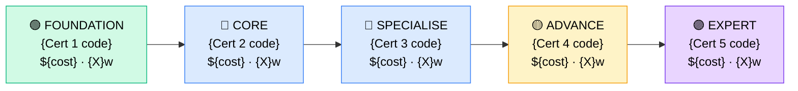

# How to Become a {Role Title}

**`{CP-ID}`** · **{Domain}** · _{Time to hire: X–Y months_ · _Entry cost: $X–$Y USD_

> **Path summary:** {One sentence: who this is for, what the destination is, and why it matters in 2026.}
> Example: "This path takes you from zero (or a support/admin background) to a hired Cloud Engineer role using AWS and Kubernetes, in 12–18 months."

---

## Role Overview

### What does a {Role Title} actually do?

{Paragraph 1: Concrete day-to-day description. What does this person sit in front of? What problems do they solve? Who do they talk to? What tools do they use daily? Avoid buzzwords — write it like you're describing it to a friend. 3–4 sentences.}

{Paragraph 2: Where do they work? (startups, enterprises, government, MSPs?) How large is the team typically? Is it remote-friendly? Is it on-call heavy? Any travel? 2–3 sentences.}

### Demand in 2026

- **Global job postings:** {X,000}+ active roles on LinkedIn as of {Month} 2026 [(source)]({URL})
- **Growth rate:** {X}% YoY / BLS projected {X}% growth to {Year} [(source)]({URL})
- **South Africa:** {Demand description — e.g. "Strong demand at major banks, telcos, and cloud-first startups. Nedbank, Standard Bank, MTN and Vodacom all listed roles in Q1 2026."}
- **Remote availability:** {High / Medium / Low — with note, e.g. "70%+ of roles are remote or hybrid globally"}

---

## Who Is This Path For?

### Ideal starting backgrounds

| Background | Readiness | What you already have |
|---|---|---|
| IT Support / Help Desk | ✅ Strong start | Troubleshooting mindset, Windows/Linux basics |
| Sysadmin / Server admin | ✅ Strong start | Infrastructure understanding, automation habits |
| Network technician | ✅ Good start | TCP/IP, routing concepts carry over |
| Recent IT graduate | 🟡 Good with gaps | Theory solid; needs hands-on lab time |
| Complete career changer | 🟡 Possible | Needs 3–6 months of foundation work first |
| Developer / Programmer | ✅ Strong start | Scripting/coding skills highly transferable |

### You're ready to start this path if you can:
- {Concrete checkpoint 1 — e.g. "Navigate a Linux terminal (ls, cd, grep, curl)"}
- {Concrete checkpoint 2 — e.g. "Explain what DNS, DHCP, and TCP/IP do"}
- {Concrete checkpoint 3 — e.g. "Set up a free AWS account and launch an EC2 instance"}
- {Concrete checkpoint 4}

> **Not ready yet?** Start with [{Foundation path name}](../Roadmaps/{R0X_file.md}) first.

---

## Certification Sequence

### Visual path

---

### Stage 1 — Foundation (Months 0–{X})

**Goal:** Prove you have the baseline IT knowledge employers expect before specialising.

| Cert | Code | Cost (USD) | Study Time | Why it matters |
|---|---|---:|---:|---|
| {Cert full name} | `{Code}` | ${X} | {X}–{Y} weeks | {One line: what this cert proves and why employers care} |
| {Cert full name} | `{Code}` | ${X} | {X}–{Y} weeks | {One line} |

**Stage 1 total:** ${X}–${Y} USD · R{X}–R{Y} ZAR · {X}–{Y} months

**Study approach:** {Concrete advice — e.g. "Pair Professor Messer (free) with Jason Dion's Udemy practice exams. Do 50 practice questions per day in the final 2 weeks. Schedule the exam when you're consistently scoring 80%+."}

**Lab requirement:** {What hands-on work should accompany this stage? E.g. "Build a home lab in VirtualBox or use AWS Free Tier. Complete at least 20 hours of hands-on time before sitting the exam."}

---

### Stage 2 — Core Specialisation (Months {X}–{Y})

**Goal:** Get the anchor certification that hiring managers look for on CVs for entry-level {role} positions.

| Cert | Code | Cost (USD) | Study Time | Why it matters |
|---|---|---:|---:|---|
| {Cert full name} | `{Code}` | ${X} | {X}–{Y} weeks | {One line} |
| {Cert full name} | `{Code}` | ${X} | {X}–{Y} weeks | {One line} |

**Stage 2 total:** ${X}–${Y} USD · R{X}–R{Y} ZAR · {X}–{Y} months

**Study approach:** {Specific courses, labs, platforms for this stage.}

**Project milestone:** {Specific project to build at this stage — e.g. "Deploy a 3-tier web application on AWS using EC2, RDS, and S3. Document it in a public GitHub repo. This becomes a portfolio piece."}

---

### Stage 3 — Advanced Specialisation (Months {Y}–{Z})

**Goal:** Differentiate yourself — move from "hireable" to "desirable" by adding depth or a second specialisation.

| Cert | Code | Cost (USD) | Study Time | Why it matters |
|---|---|---:|---:|---|
| {Cert full name} | `{Code}` | ${X} | {X}–{Y} weeks | {One line} |

**Stage 3 total:** ${X}–${Y} USD · R{X}–R{Y} ZAR · {X}–{Y} months

> **Optional at hire time:** Many people land their first {role} job after Stage 2 and complete Stage 3 certs while employed. This is valid and common.

---

### Stage 4 — Expert / Leadership (18–36 months+)

**Goal:** Senior-level or architect-track credentials. Tackle after 2–3 years of hands-on experience.

| Cert | Code | Cost (USD) | Study Time | Why it matters |
|---|---|---:|---:|---|
| {Cert full name} | `{Code}` | ${X} | {X}–{Y} weeks | {One line} |

> These certifications require real-world experience to pass — don't rush them. Experience → cert is the correct order at this stage.

---

## Timeline & Cost Summary

| Stage | Certs | Duration | Cost (USD) | Cost (ZAR) |
|---|---|---|---:|---:|
| Stage 1 — Foundation | {Cert codes} | Months 0–{X} | ${X} | R{X} |
| Stage 2 — Core | {Cert codes} | Months {X}–{Y} | ${X} | R{X} |
| Stage 3 — Advanced | {Cert codes} | Months {Y}–{Z} | ${X} | R{X} |
| **Total to hireable** | | **{X}–{Y} months** | **${X}** | **R{X}** |

**Study hours required:** ~{X}–{Y} hours total (Stage 1–2). Assumes {X} hours/week = {Y} months.

---

## Salary Progression

> All figures: median base salary, not including bonuses/equity. ZAR = USD × 18 baseline (verified {Month} 2026). Sources: Robert Half 2026, Glassdoor, PayScale, LinkedIn Salary.

| Experience Level | USD/year | ZAR/year | GBP/year | EUR/year | AUD/year |
|---|---:|---:|---:|---:|---:|
| Entry / Junior (0–2 yrs) | ${X,000} | R{X,000} | £{X,000} | €{X,000} | A${X,000} |
| Mid-level (2–5 yrs) | ${X,000} | R{X,000} | £{X,000} | €{X,000} | A${X,000} |
| Senior (5–8 yrs) | ${X,000} | R{X,000} | £{X,000} | €{X,000} | A${X,000} |
| Lead / Architect (8+ yrs) | ${X,000} | R{X,000} | £{X,000} | €{X,000} | A${X,000} |

**South Africa note:** {Specific SA salary context — e.g. "Entry-level Cloud Engineers at Johannesburg-based banks earn R35,000–R50,000/month. Remote work for international clients can push this to R60,000–R90,000/month for mid-level roles."}

**Salary accelerators:** {What pushes pay up faster? E.g. "AWS certs, Python skills, Terraform proficiency, and FinOps Foundation cert all command premiums in SA job listings as of Q1 2026."}

---

## First Job Strategy

### Month 0–3: Build the Foundation

1. **Set up your lab** — {Specific platform: AWS Free Tier / Azure sandbox / home VirtualBox lab / GNS3}. Cost: {$0 / $X/month}.
2. **Begin Cert 1** — {Name}. Use [{course name}]({URL}) + [{practice exam}]({URL}).
3. **Join the community** — {Specific Discord/Reddit/LinkedIn group relevant to this path. E.g. "r/sysadmin, NetworkChuck Discord, AWS Community Discord"}
4. **Start documenting** — Create a GitHub profile / blog / LinkedIn and post one learning update per week.

### Month 3–6: Build Your Portfolio

{3–4 specific projects this person should build that directly demonstrate the target role's skills. Each should be concrete and achievable. E.g.:
- "Project 1: Deploy a static website to S3 with CloudFront CDN and Route 53 DNS. Estimated time: 4–6 hours."
- "Project 2: Automate EC2 provisioning with Terraform. Estimated time: 8–10 hours."}

### Month 6–12: Apply and Iterate

- **CV positioning:** {How to title themselves on their CV before they're fully hired — e.g. "List as 'Cloud Engineer (AWS)' once you hold the AWS Solutions Architect Associate. Don't use 'Junior' — it anchors salary expectations."}
- **Target companies:** {What type of companies hire entry-level {role}? E.g. "MSPs and IT consulting firms hire entry-level. Cloud-native startups, Big 4 consulting firms, and banks often want 1–2 years experience. Start with MSPs."}
- **Interview prep:** {Top 5 interview topics for this role — e.g. "Be ready to discuss: 1) VPC networking concepts, 2) IAM policies, 3) a project you built, 4) cost optimisation, 5) your monitoring approach."}
- **Salary negotiation:** {Specific guidance — e.g. "Don't accept first offers. Entry-level cloud roles in SA advertise low but negotiate. Benchmark against the salary table above."}

---

## A Day in the Life

### {Role Title} at an {Company type, e.g. "enterprise bank"} — Junior Level

**08:00** — {First activity. Realistic and specific. E.g. "Review overnight CloudWatch alarms. One Lambda function timed out — triage with the on-call log."}
**09:00** — {Second activity}
**10:30** — {Third activity — e.g. standup, ticket triage}
**12:00** — Lunch
**13:00** — {Afternoon activity 1}
**15:00** — {Afternoon activity 2 — often learning time, lab work, or documentation}
**16:30** — {End of day wrap-up}

### {Role Title} at a {Different company type, e.g. "cloud-native startup"} — Mid Level

**09:00** — {Different pace, different tools. Show the contrast.}
...

---

## Related Paths & Progressions

| From here you can move to… | Why |
|---|---|
| [{Related Role 1}](CP{NN}_{slug}.md) | {One-line reason} |
| [{Related Role 2}](CP{NN}_{slug}.md) | {One-line reason} |
| [{Career Roadmap}](../Roadmaps/R0{N}_{name}.md) | {One-line reason} |

---

## South Africa Context

### Market specifics

{2–3 paragraphs covering:
1. Which SA employers hire this role (name real companies — Nedbank, MTN, Vodacom, SARS, Dimension Data, BCX, EOH, etc.)
2. Remote work availability — what % of SA roles are remote/hybrid? Can someone in Cape Town work for a UK company in this role?
3. BEE/EE considerations if relevant — e.g. certain sectors have preferential hiring for previously disadvantaged individuals, and certs help level the field.
4. Salary in ZAR — repeat key figures from the salary table with SA-specific context.}

### SA-specific resources

| Resource | URL | Note |
|---|---|---|
| {SA-specific community/group} | [{name}]({URL}) | {What it offers} |
| {SA employer job board} | [{name}]({URL}) | {What to search} |
| {SA training provider} | [{name}]({URL}) | {Relevant courses} |

---

## Frequently Asked Questions

**Q: Do I need a degree to become a {Role Title}?**
{Answer: typically no for most IT roles, but nuanced — address this specifically for this role. Cite examples.}

**Q: How long does it realistically take from zero?**
{Honest answer. Don't sugarcoat. If it takes 18 months, say 18 months.}

**Q: Which cert should I do first?**
{Specific answer for this path.}

**Q: Can I do this path while working full-time?**
{Honest answer with time estimates — e.g. "Yes. At 10 hours/week, Stage 1 takes 4 months instead of 2."}

**Q: Is {Cert X} worth it for this role?**
{Specific answer about the most-asked cert for this path.}

---

## Sources & Further Reading

| # | Source | URL | Used for |
|---|---|---|---|
| 1 | {Source name} | [{title}]({URL}) | {What data from here} |
| 2 | {Source name} | [{title}]({URL}) | {What data from here} |
| 3 | {Source name} | [{title}]({URL}) | {What data from here} |
| 4 | {Source name} | [{title}]({URL}) | {What data from here} |
| 5 | {Source name} | [{title}]({URL}) | {What data from here} |
| 6 | {Source name} | [{title}]({URL}) | {What data from here} |
| 7 | {Source name} | [{title}]({URL}) | {What data from here} |
| 8 | {Source name} | [{title}]({URL}) | {What data from here} |

---

*Template version: 2026-05-02 | Maintained by IT Career Roadmap | ZAR baseline: R18/$1 USD*
*File naming: `Career_Paths/CP{NN}_{domain}_{slug}.md`*
