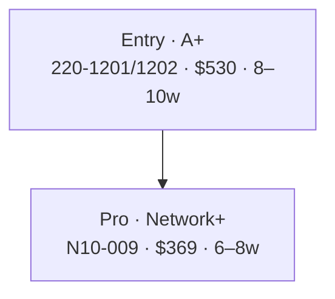

# IT Career Roadmap

[](./LICENSE)
[](./LICENSE-CONTENT.md)
[](./CONTRIBUTING.md)

A self-hostable, Docker-containerized **career-identification platform for IT professionals**. It is modelled on the [Paul Jerimy Security Roadmap](https://pauljerimy.com/security-certification-roadmap/), but extended to cover **all of IT** — not just security — with 630+ verified certifications, 76 vendor certification paths, 21 specialty roles, 13 industry verticals, and a research wiki backing every claim with primary-source citations.

It is content-first: every page on the site is generated from human-authored Markdown files in the `Deep Dive/` folder. Add or edit a `.md` file, rebuild, and the change appears across the site. There is no CMS, no admin UI for content authoring, and no JavaScript-driven content pipeline. The content **is** the data.

| | Live count |
|---|---|
| Per-cert deep-dive files | **630** across **76 vendors** |
| Vendor certification paths (with Mermaid diagrams) | **88** |
| Domain pillars | 12 |
| Vendor ecosystems | 56 |
| Industry verticals | 13 |
| Specialty role guides | 21 |
| Career-progression roadmaps (Junior → Expert) | 10 |
| Cross-cutting topics (AI impact, ZA salaries, comp negotiation, etc.) | 9 |

---

## Table of contents

- [What you can do on the site](#what-you-can-do-on-the-site)
- [Quick start (Docker)](#quick-start-docker)
- [Architecture](#architecture)
- [Tech stack](#tech-stack)
- [Project structure](#project-structure)
- [The content system](#the-content-system)
  - [Folder layout in `Deep Dive/`](#folder-layout-in-deep-dive)
  - [Per-cert files (`Certifications/`)](#per-cert-files-certifications)
  - [Vendor certification paths (`Certification_Roadmaps/`)](#vendor-certification-paths-certification_roadmaps)
  - [Domains, Ecosystems, Roadmaps, Industries, Specialty Roles](#domains-ecosystems-roadmaps-industries-specialty-roles)
- [How loaders turn Markdown into pages](#how-loaders-turn-markdown-into-pages)
- [Routes and pages](#routes-and-pages)
- [The 12 canonical domains](#the-12-canonical-domains)
- [Mermaid diagram rendering](#mermaid-diagram-rendering)
- [Cert-code auto-linking](#cert-code-auto-linking)
- [Database schema](#database-schema)
- [Engagement features](#engagement-features)
- [Admin panel](#admin-panel)
- [Search (Cmd-K palette)](#search-cmd-k-palette)
- [Citation rule (load-bearing)](#citation-rule-load-bearing)
- [Aesthetic / design system](#aesthetic--design-system)
- [Local development](#local-development)
- [Docker deployment](#docker-deployment)
- [Adding new content](#adding-new-content)
- [Audit scripts](#audit-scripts)
- [Known issues](#known-issues)
- [License](#license)

---

## What you can do on the site

- **Browse the cert matrix** at `/certs` — a Paul-Jerimy-style 12-column × 4-level grid of every cert, colored by vendor, drillable to a per-cert deep-dive page
- **Open a vendor's certification path** at `/certification-paths/[vendor]` — a single document with progression diagram, named pathways with Gantt charts, prerequisites, branches, cross-vendor bridges, costs, and salary trajectories — all rendered as interactive Mermaid diagrams
- **Drill into a specific cert** at `/cert/[vendor]/[code]` — every fact (cost, duration, passing score, validity, prep time, recommended courses, books, jobs, salary by region) sourced from the vendor's own pages
- **Read role profiles** at `/profiles` and `/wiki/specialty/[slug]` — day-in-the-life, AI-impact rating, remote-friendliness, salary range
- **Take the starting-point quiz** on the homepage — routes new joiners and career-changers to a sensible first cert
- **Engage anonymously** — star ratings, helpful votes, freeform feedback, comments — IP-hashed (no plaintext), profanity-filtered, rate-limited
- **Submit a suggestion** via the 💡 button next to the search bar — lands in the admin panel
- **Search everything** with `Cmd+K` / `Ctrl+K` — one palette covers certs, vendors, paths, roles, industries, roadmaps, blog posts

The whole site is **server-rendered**. Search engines see the full content of every page (including content inside collapsible sections). It works without JavaScript for everything except the Mermaid diagrams and Cmd-K palette.

---

## Quick start (Docker)

You need Docker Desktop (Windows/macOS) or Docker Engine (Linux). The repo also expects WSL2 on Windows.

```powershell
cd "H:\IT rodmap Blog"
copy .env.example .env
docker compose up --build -d
```

Three containers come up:

| Container | Port | Purpose |
|---|---|---|
| `it-roadmap-db` | (internal only) | Postgres 16 — likes, comments, stars, feedback, blog posts, audit log |
| `it-roadmap` | `:3000` | Public site (Next.js standalone) |
| `it-roadmap-admin` | `:3010` (loopback only) | Admin panel — moderation + blog editor |
| `it-roadmap-tunnel` | (Cloudflare egress) | Optional Cloudflare tunnel for public deployment |

Open <http://localhost:3000> for the public site, <http://localhost:3010/admin/login> for the admin panel.

Postgres data persists in the named volume `db-data` and survives `docker compose down`. To reset everything (including the database):

```powershell
docker compose down -v
```

To rebuild after editing files (code or `.md`):

```powershell
docker compose down
docker compose up --build -d
```

Typical rebuild time: **90–180 seconds**.

---

## Architecture

```
┌──────────────────────────────────────────────────────────────────┐
│                         Cloudflare Edge                          │
│                  itcareerroadmap.com (public)                    │
│                  admin.itcareerroadmap.com (admin)               │
└─────────────────────────────────┬────────────────────────────────┘
                                  │
                                  ▼
                       ┌──────────────────────┐
                       │  cloudflared (tunnel) │
                       └──────┬─────────┬──────┘
                              │         │
              ┌───────────────┘         └───────────────┐
              ▼                                         ▼
   ┌───────────────────────┐               ┌───────────────────────┐
   │    web container      │               │   admin container     │
   │  SITE_MODE=public     │               │  SITE_MODE=admin      │
   │  next/standalone:3000 │               │  bound to 127.0.0.1   │
   │                       │               │  scrypt+HMAC auth     │
   │  - reads Deep Dive/   │               │  - moderation         │
   │  - renders matrix     │               │  - blog editor        │
   │  - serves API routes  │               │  - audit log          │
   │  - API: /api/likes    │               │  - status dashboard   │
   │         /api/comments │               │                       │
   │         /api/feedback │               │                       │
   │         /api/stars    │               │                       │
   └──────────┬────────────┘               └──────────┬────────────┘
              │                                       │
              └───────────────┬───────────────────────┘
                              ▼
                     ┌────────────────┐
                     │   postgres 16  │
                     │   it-roadmap-db│
                     │   (volume:     │
                     │    db-data)    │
                     └────────────────┘

  Content source: H:\IT rodmap Blog\Deep Dive\*\*.md  (baked into image at build time)
```

Both `web` and `admin` are the **same Docker image**, with different `SITE_MODE` env vars. Middleware in `middleware.ts` returns 404 for any `/admin/*` request when `SITE_MODE=public` and 404 for any non-`/admin/*` request when `SITE_MODE=admin`. Postgres is shared.

### Why two containers?

Operational safety. The admin port is bound to `127.0.0.1:3010` so it is **unreachable from the LAN**. Only Cloudflare Tunnel (which runs inside the Docker network and can resolve the `admin` hostname directly) can reach it. So:

- A misconfigured firewall does not expose admin.
- A subnet scan does not find admin.
- Cloudflare Access can gate the admin subdomain at the edge (recommended).

---

## Tech stack

| Layer | Choice | Why |
|---|---|---|
| Framework | **Next.js 15 (App Router)** + React 19 | File-system routing maps cleanly to the content folders; Server Components query loaders directly |
| Language | **TypeScript** strict | Catches frontmatter shape changes at build time |
| Styling | **Tailwind CSS v4** (CSS-first `@theme`) | No `tailwind.config.ts`; design tokens live in `app/globals.css` |
| Database | **Postgres 16 + Prisma 6** | Engagement data (likes, stars, comments, feedback, blog, audit) — content is NOT in the DB |
| Markdown | `react-markdown` + `remark-gfm` | GFM tables, strikethrough, autolinks |
| Diagrams | `mermaid` 11 (lazy-loaded client-side) | Flowcharts, gantts, mindmaps, xy-charts in `.md` files |
| Validation | `zod` at API boundaries | Every POST body validated before DB write |
| Auth | `scrypt` + HMAC cookie | Self-contained, no third-party identity provider |
| Deployment | Multi-stage Docker → `next/standalone` on `node:22-alpine` | ~150MB image |

The site **does not** use:
- Inter / Roboto / Arial — typography is locked to Fraunces (display) + IBM Plex Sans (body) + JetBrains Mono (code/data)
- Third-party analytics or tracking scripts
- A signup/login flow on the public site (engagement is anonymous)
- A CMS — content is `.md` files in the repo

---

## Project structure

```
H:\IT rodmap Blog\
├── app/                          Next.js 15 App Router pages
│   ├── layout.tsx                Root layout — fonts, theme, sidebar mount
│   ├── globals.css               Tailwind v4 + design tokens + .wiki-prose styles
│   ├── page.tsx                  Landing — hub + starting-point quiz
│   ├── certs/                    /certs           — main matrix + Browse certs view
│   │   ├── page.tsx              Matrix grid + drawer
│   │   └── domain/[id]/page.tsx  Per-domain drilldown
│   ├── matrix/page.tsx           /matrix          — wallchart-only view
│   ├── cert/[vendor]/[code]/     /cert/...        — per-cert deep-dive page
│   ├── vendors/page.tsx          /vendors         — index of all vendor folders
│   ├── vendor/[slug]/page.tsx    /vendor/...      — per-vendor cert ladder
│   ├── certification-paths/      /certification-paths
│   │   ├── page.tsx              Index — vendor cards w/ stats + verified date
│   │   └── [vendor]/page.tsx     Per-vendor path with sticky TOC + Mermaid
│   ├── industries/page.tsx       /industries      — IND01–IND13 cards
│   ├── roadmaps/page.tsx         /roadmaps        — career-progression roadmaps
│   ├── topics/page.tsx           /topics          — Cross_Cutting deep-dives
│   ├── profiles/page.tsx         /profiles        — role profile grid
│   ├── paths/page.tsx            /paths           — career-transition cards
│   ├── changers/page.tsx         /changers        — entry guides for non-IT backgrounds
│   ├── flow/page.tsx             /flow            — interactive SVG career flow
│   ├── wiki/                     /wiki            — full-source markdown reader
│   │   ├── page.tsx              Sidebar nav across all 5 deep-dive kinds
│   │   └── [kind]/[slug]/page.tsx Renderer
│   ├── blog/                     /blog            — anonymous engagement blog
│   ├── admin/                    /admin/*         — moderation panel (separate container)
│   └── api/                      Server-side endpoints
│       ├── likes/route.ts        POST/GET — toggle like, return count
│       ├── comments/route.ts     POST/GET — post, list visible comments
│       ├── stars/route.ts        POST/GET — upsert rating, return avg + count
│       ├── feedback/route.ts     POST     — helpful_yes / helpful_no / suggestion / report
│       └── enrichment/route.ts   GET      — drawer enrichment payload
├── components/
│   ├── chrome/                   Sidebar, TopBar, SuggestionButton, SearchTrigger, CommandPalette
│   ├── certs/                    CertDrawer, CertSheet, CertRow, MatrixGrid
│   ├── certpaths/                MarkdownWithMermaid, PathSection, PathTOC
│   ├── matrix/                   Wallchart tile + level-row primitives
│   ├── admin/                    BlogPostForm, AdminNav, ModerationTable
│   └── ui/                       Pill, Drawer, Tabs, Mermaid, LikeButton,
│                                 StarRating, FeedbackForm, CommentThread
├── content/                      Type definitions + small static seed data
│   ├── certs.ts                  Cert / Domain / Ecosystem types only
│   ├── transitions.ts            Career-transition cards (still static)
│   ├── roles.ts                  Role profile cards (still static)
│   ├── changers.ts               Career-changer entry guides (still static)
│   └── quiz.ts                   Landing-quiz routing logic
├── lib/                          Loaders, helpers, auth — runs server-side
│   ├── certifications-loader.ts  Walks Deep Dive/Certifications, parses .md, caches
│   ├── cert-data.ts              Builds the matrix shape (domains × levels) from the loader
│   ├── domain-normalizer.ts      Maps 137 raw `domain:` strings → 12 canonical columns
│   ├── certification-paths-loader.ts  Loads Deep Dive/Certification_Roadmaps/*.md
│   ├── cert-link-index.ts        Builds the cert-code → URL map for auto-linking
│   ├── markdown-cert-links.ts    Pre-processes markdown to wrap cert-code mentions in links
│   ├── vendors-loader.ts         Groups certs by vendor folder for /vendor/[slug]
│   ├── industries-loader.ts      Reads Deep Dive/Industry_Verticals/*.md
│   ├── roadmaps-loader.ts        Reads Deep Dive/Roadmaps/*.md
│   ├── specialty-roles-loader.ts Reads Deep Dive/Specialty_Roles/*.md
│   ├── topics-loader.ts          Reads Deep Dive/Cross_Cutting/*.md
│   ├── deepdive-loader.ts        Generic wiki loader
│   ├── deepdive-fs.ts            Wiki sidebar grouping
│   ├── deepdive-types.ts         Shared types
│   ├── search-index.ts           Aggregates ALL content into one cmd-K index
│   ├── vendor-colors.ts          165 verified brand hexes
│   ├── vendor-colors-sources.md  Audit log of where each hex came from
│   ├── db.ts                     Prisma client singleton
│   ├── ratelimit.ts              IP-hash + sliding-window rate limit (Prisma-backed)
│   ├── profanity.ts              Comment filter
│   ├── admin-auth.ts             Scrypt password verify + HMAC cookie issue/check
│   ├── admin-targets.ts          Resolve a `target` string → readable label + URL
│   └── admin-audit.ts            Insert + prune AdminAudit rows
├── prisma/
│   ├── schema.prisma             Like, Comment, Star, Feedback, BlogPost, RateLimit, AdminAudit
│   ├── prune-audit.mjs           Deletes audit rows >90 days at container start
│   └── seed-blog.mjs             Seeds a Welcome post on first boot
├── docker/
│   └── entrypoint.sh             prisma db push → seed → audit prune → exec node server.js
├── middleware.ts                 SITE_MODE gate (public 404s /admin/*, admin 404s everything else)
├── scripts/                      Build-time + maintenance scripts
│   ├── extract-deepdive.mjs      Legacy extractor (still runs before build)
│   ├── audit-cert-folders.mjs    Walk Certifications + Certification_Roadmaps, report gaps
│   ├── audit-roadmaps.mjs        Per-file readiness audit against template fields
│   ├── verify-roadmap-structure.mjs  Strict conformance vs CompTIA reference
│   ├── hash-admin-password.mjs   Generate ADMIN_PASSWORD_HASH for .env
│   ├── extract-session.mjs       Dev tool — extract a Claude Code session JSONL
│   ├── backup-db.sh / restore-db.sh    pg_dump / pg_restore
│   ├── dedup_certs.py            Smart dedup with vendor-aware code normalization
│   ├── extract_ecosystems.py     Legacy ecosystems extractor (Pass A/v2)
│   └── enrich-ecosystems.mjs     Legacy enrichment script
├── Deep Dive/                    THE CONTENT — see "The content system" below
│   ├── _CERT_TEMPLATE.md         Per-cert template
│   ├── INDEX.md                  Manual index of the deep-dive corpus
│   ├── 00_Research_Checklist.md  Research workflow doc
│   ├── Certifications/{Vendor}/  ← per-cert .md files (single source of truth for the matrix)
│   ├── Certification_Roadmaps/   ← per-vendor visual roadmaps with Mermaid
│   ├── Domains/                  ← 12 domain pillar files (DOM01–DOM12)
│   ├── Ecosystems/               ← 56 vendor ecosystem files (D01–D5x)
│   ├── Roadmaps/                 ← 10 career-progression files (R01–R10)
│   ├── Industry_Verticals/       ← 13 sector files (IND01–IND13)
│   ├── Specialty_Roles/          ← 21 specialty role files (SR01–SR21)
│   ├── Cross_Cutting/            ← 9 overlay topic files (CC01–CC09)
│   └── Vendors/                  ← optional vendor overview files (3 of 76 written)
├── public/                       Static assets — favicon, og images, design-mock.html
├── package.json                  Next 15 + React 19 + Prisma 6 + Tailwind v4
├── tsconfig.json                 Strict TS, paths aliases (@/...)
├── next.config.ts                output: "standalone" for Docker
├── postcss.config.mjs            @tailwindcss/postcss
├── Dockerfile                    Multi-stage: deps → builder → runner (node:22-alpine)
├── docker-compose.yml            db + web + admin + cloudflared
├── .env.example                  Documented env-var reference
├── .dockerignore                 Excludes node_modules / .next / archived HTML
├── .gitignore
└── CLAUDE.md                     Brain file for Claude Code sessions (do not delete)
```

---

## The content system

Everything users see is generated from human-authored Markdown files in `Deep Dive/`. Each file has YAML frontmatter for structured fields, and Markdown body for prose. Loaders parse them at request time (cached after first read), and Server Components render them.

### Folder layout in `Deep Dive/`

| Folder | Files | Drives | One file describes |
|---|---|---|---|
| `Certifications/{Vendor}/*.md` | **630** | Matrix, vendor ladders, per-cert pages, drawer, search | One specific cert exam |
| `Certification_Roadmaps/*.md` | **88** | `/certification-paths` index + per-vendor pages | One vendor's full progression with diagrams |
| `Domains/*.md` | **12** | `/wiki/domain/...`, matrix column blurbs | One of the 12 canonical domain pillars |
| `Ecosystems/*.md` | **56** | `/wiki/ecosystem/...`, matrix vendor columns | One vendor ecosystem (AWS, Salesforce, etc.) |
| `Roadmaps/*.md` | **10** | `/roadmaps`, `/wiki/roadmap/...` | One career-progression (Junior → Mid → Senior → Expert) |
| `Industry_Verticals/*.md` | **13** | `/industries`, `/wiki/industry/...` | One sector (FinServ, Healthcare, Gov, etc.) |
| `Specialty_Roles/*.md` | **21** | `/profiles` deep dives, `/wiki/specialty/...` | One specialised role transition (Mainframe → Cloud, SOC → DFIR, etc.) |
| `Cross_Cutting/*.md` | **9** | `/topics`, `/wiki/cross-cutting/...` | One overlay topic (AI impact, ZA salaries, comp negotiation, etc.) |
| `Vendors/*.md` | 3 of 76 | `/vendor/[slug]` overview blurb | Optional — a vendor-wide narrative |

### Per-cert files (`Certifications/`)

These are the **single source of truth for the cert matrix**. Path shape:

```
Deep Dive/Certifications/{VendorFolder}/{Vendor}_{Code}_{ShortName}.md
```

Example: `Deep Dive/Certifications/CompTIA/CompTIA_Security+_SY0-701.md`

Frontmatter (full template at `Deep Dive/_CERT_TEMPLATE.md`):

```yaml
---
cert_name: "CompTIA Security+"
cert_code: "SY0-701"
vendor: "CompTIA"
status: "Active"           # Active | New | Retiring | Retired | Beta | Gated | Requires Verification
level: "Entry"             # Entry | Associate | Professional | Expert
domain: "Security"         # Free-form; normalised by lib/domain-normalizer.ts
ecosystem: "CompTIA Vendor-Neutral"
last_verified: "2026-05-01"
aliases: ["Security Plus", "SY0-601"]   # old codes / common misspellings → resolves at /cert lookup
---
```

Body sections the loader extracts (all optional, but the more present, the richer the per-cert page):

- `## Exam facts` — 2-column key/value table → fills the drawer's stat strip + per-cert hero
- `## About` — first paragraph becomes the rationale shown in the drawer
- `**Vendor source —** [...](URL)` line → drawer "Vendor page" link
- `**Official exam guide —** [...](URL)` → drawer "Exam guide" link
- `**Exam objectives —** [...](URL)` → drawer "Objectives" link
- `## Topics covered` — bulleted list → drawer + per-cert page
- `## Skills validated` — bulleted list
- `## Recommended courses` — `Provider | Title | Cost | URL` table
- `## Practice exams` — same shape
- `## Books` — `Title | Author | Publisher | Year | ISBN | URL` table
- `## Typical job titles` — sentence with names separated by `·`
- `## Salary` — `Region | Range | Source` table
- `## Related certifications` — bullets

The loader is permissive — files do not have to fill every section.

### Vendor certification paths (`Certification_Roadmaps/`)

Each file is one vendor's complete progression document with embedded **Mermaid diagrams**. These render at `/certification-paths/[vendor]`. Template at `Deep Dive/Certification_Roadmaps/_ROADMAP_TEMPLATE.md`. CompTIA is the canonical reference — see `CompTIA_Roadmap.md`.

Frontmatter:

```yaml
---
vendor: "CompTIA"
ecosystem: "CompTIA Vendor-Neutral IT, Cybersecurity, Data & AI"
total_certifications: 15
entry_point_cert: "Tech+ FC0-U71 (pre-entry) or A+ 220-1201/1202 (entry)"
time_to_expert: "24–36 months (A+ to SecurityX, including experience)"
cost_estimate_usd: "$1,303–$2,620 (core trifecta to full cybersecurity ladder)"
cost_estimate_zar: "R23,454–R47,160 (core trifecta to full cybersecurity ladder)"
last_verified: "2026-05-01"
sources:
  - "https://www.comptia.org/certifications"
  - "https://www.roberthalf.com/salary-guide"
---
```

Body sections rendered as page sections (in this order, all `## ` h2 headings):

1. **`## Overview`** — always-open. 2 paragraphs of vendor positioning.
2. **`## Progression Diagram`** — always-open. A Mermaid `flowchart TD` showing the L1→L4 ladder with cost/duration on each node.
3. **`## Per-Level Detail`** — collapsible. `### Level N:` subsections, each with attribute table + skills + study materials + outcomes.
4. **`## Recommended Progression Paths`** — collapsible. `### Path N:` named tracks, each with Gantt chart + total timeline + cost + salary progression.
5. **`## Prerequisites & Sequencing Matrix`** — collapsible. Cross-cert dependency table.
6. **`## Specialization Branches`** — collapsible. Mindmap + per-branch detail.
7. **`## Cross-Vendor Bridges`** — collapsible. Flowchart of "if you have this vendor's cert, here's the next-vendor cert worth pursuing."
8. **`## Cost Breakdown`** — collapsible. Full USD + ZAR table.
9. **`## Job Market Snapshot`** — collapsible. Active postings, YoY growth, demand status.
10. **`## Salary Trajectory`** — collapsible. Mermaid `xychart-beta` for USD and ZAR.
11. **`## Common Questions`** — collapsible. Q&A.
12. **`## Official Sources`** — collapsible. Bulleted citation list.
13. **`## Research Status`** — collapsible. Only included when something could not be verified.

The page renders Overview + Progression Diagram in an always-open block (page hero), and the rest as native `<details>` elements (server-rendered, search-indexable, no-JS friendly). A sticky right-rail TOC tracks scroll position.

### Domains, Ecosystems, Roadmaps, Industries, Specialty Roles

These are the long-form research documents that informed the cert matrix. They live at `/wiki/[kind]/[slug]` and provide the explanatory prose, salary tables, and citations that the matrix tile labels alone cannot carry. Each file has a frontmatter `title:` / `kind:` / `slug:` plus the body. They are loaded by `lib/deepdive-loader.ts` and grouped in the wiki sidebar by `lib/deepdive-fs.ts`.

---

## How loaders turn Markdown into pages

```
Deep Dive/Certifications/CompTIA/CompTIA_Security+_SY0-701.md
                                  │
                                  ▼
              lib/certifications-loader.ts (gray-matter)
                                  │
       parses frontmatter + body, extracts Exam facts
       table, About paragraph, Topics covered list,
       Recommended courses table, Books table, etc.
                                  │
                                  ▼
                    Returns CertificationFile[]
                    (cached in memory after first read)
                                  │
              ┌───────────────────┼───────────────────┬──────────────────┐
              ▼                   ▼                   ▼                  ▼
   lib/cert-data.ts    lib/vendors-loader.ts   /cert/[v]/[c]/page  lib/search-index.ts
   builds matrix       groups by vendor folder for       per-cert page    indexes for cmd-K
   shape (domain ×     /vendors and /vendor/[slug]
   level), maps domain
   strings to canonical
   columns
              │
              ▼
   /certs page          /vendors page           /cert/[v]/[c]      cmd-K palette
   /matrix page         /vendor/[slug] page
   /certs/domain/[id]
```

Each loader is a single file with a `loadX(): Promise<X[]>` async function and a process-wide cache. First request triggers a full disk walk (~100ms for the 630 cert files). Subsequent requests hit the cache. Loaders never write — content edits only happen by editing files on disk and rebuilding.

The matrix builder (`lib/cert-data.ts`):

1. Reads every cert file via `loadAllCertifications()`.
2. For each cert, normalises the `domain:` frontmatter through `lib/domain-normalizer.ts` — 137 distinct raw strings (e.g. `Security/Networking`, `Data / AI / ML`) collapse to 12 canonical IDs (`security`, `data`, etc.).
3. Cross-lists the cert into a vendor ecosystem column (Salesforce, SAP, Splunk, Palo Alto, etc.) when the vendor has one.
4. Sorts each column alphabetically within each level for stable rendering.

Result: one cert can appear in **two** matrix columns (its primary domain + its vendor ecosystem) — same cert, two contexts, same cert ID for engagement (likes, stars, comments).

---

## Routes and pages

| Route | Source | What it shows |
|---|---|---|
| `/` | `app/page.tsx` + `content/quiz.ts` | Landing — feature grid + starting-point quiz |
| `/certs` | `lib/cert-data.ts` | Main matrix view (12 domains + ecosystems) |
| `/certs/domain/[id]` | `lib/cert-data.ts` | Drilldown into one domain — 4-level tables |
| `/matrix` | `lib/cert-data.ts` | Wallchart-only view (no surrounding chrome) |
| `/cert/[vendor]/[code]` | `lib/certifications-loader.ts` | Per-cert deep-dive — full markdown body + engagement |
| `/vendors` | `lib/vendors-loader.ts` | All 76 vendors as cards |
| `/vendor/[slug]` | `lib/vendors-loader.ts` + `lib/certification-paths-loader.ts` | Per-vendor cert ladder + link to cert path |
| `/certification-paths` | `lib/certification-paths-loader.ts` | Index of all 88 vendor paths |
| `/certification-paths/[vendor]` | same | Full per-vendor path with Mermaid diagrams |
| `/profiles` | `content/roles.ts` + `lib/specialty-roles-loader.ts` | Role profile grid |
| `/paths` | `content/transitions.ts` | Career transitions (~64 paths) |
| `/changers` | `content/changers.ts` | Entry guides for non-IT backgrounds |
| `/flow` | `content/nodes.ts` + `content/edges.ts` | Interactive SVG career flow |
| `/industries` | `lib/industries-loader.ts` | 13 industry verticals |
| `/roadmaps` | `lib/roadmaps-loader.ts` | 10 career progression docs |
| `/topics` | `lib/topics-loader.ts` | 9 cross-cutting topics |
| `/wiki` | `lib/deepdive-fs.ts` | Sidebar nav over the whole research corpus |
| `/wiki/[kind]/[slug]` | `lib/deepdive-loader.ts` | Long-form markdown reader (any deep-dive file) |
| `/blog` | Prisma | Blog index |
| `/blog/[slug]` | Prisma | Blog post + likes + comments |
| `/admin/*` | Prisma + `lib/admin-auth.ts` | Admin panel (separate container — see below) |
| `/api/likes` | Prisma | POST toggle, GET count. 60/min rate-limited |
| `/api/comments` | Prisma | POST add (profanity-filtered), GET visible. 5/min |
| `/api/stars` | Prisma | POST upsert rating, GET avg + count. 30/min |
| `/api/feedback` | Prisma | POST helpful_yes / helpful_no / suggestion / report |
| `/api/enrichment` | `lib/certifications-loader.ts` | GET drawer payload for a cert |

---

## The 12 canonical domains

Defined in `lib/domain-normalizer.ts`:

| Id | Display | Color | Examples |
|---|---|---|---|
| `foundation` | Foundation / IT Support | Mint | A+, ITF+, Tech+ |
| `networking` | Networking | Cyan | Network+, CCNA, JNCIA, MTCNA |
| `systems` | Systems / OS | Amber | Linux+, RHCSA, MCSA Server |
| `cloud` | Cloud | Sky | AWS SAA, AZ-104, Google Cloud Associate |
| `devops` | DevOps / Automation | Violet | Terraform Associate, GitLab Cert, Docker |
| `security` | Security | Red | Security+, CISSP, CEH, OSCP |
| `identity` | Identity & Endpoint | Indigo | SailPoint, Okta, CyberArk |
| `data` | Data / AI | Pink | DA-100, DP-203, AWS DAS, Databricks |
| `architecture` | Architecture | Slate | TOGAF, AZ-305, AWS SAP |
| `itmgmt` | IT Mgmt / Governance | Olive | ITIL, PMP, PSM, COBIT, CISM |
| `software` | Software Eng | Blue | Java SE, Salesforce Dev, GitHub certs |
| `businessapps` | Business Apps (SaaS) | Teal | Salesforce Admin, Workday Pro, ServiceNow CSA |

The `VENDOR_TO_ECOSYSTEM` map (same file) gives certs from specific vendors a SECOND home in a vendor-ecosystem column (Salesforce, SAP, Workday, Splunk, Palo Alto, etc.) so users browsing by vendor see the full ladder in one place.

---

## Mermaid diagram rendering

`components/ui/Mermaid.tsx` is a client component that lazily imports the mermaid package (~800 KB) on first mount, then renders each diagram into an inline SVG. Theme colors follow the page's light/dark mode.

`components/certpaths/MarkdownWithMermaid.tsx` wraps `react-markdown` so that a fenced code block tagged `mermaid` swaps to the `<Mermaid />` component instead of rendering as a `<pre><code>`.

```` markdown

````

Supported diagram types (verified rendering across the corpus): `flowchart`, `gantt`, `mindmap`, `xychart-beta`. Across the 88 vendor cert paths there are currently ~283 diagrams.

If a Mermaid block has a syntax error, the page does NOT crash — the error renders inline with the source code in a collapsible `<details>` block.

---

## Cert-code auto-linking

`lib/markdown-cert-links.ts` pre-processes every cert path's markdown body before rendering. It walks the source string, skipping fenced code blocks, inline code, and existing `[text](url)` markdown links, then wraps every standalone cert-code mention (e.g. `SY0-701`, `AZ-104`, `220-1201/1202`) in a markdown link pointing at `/cert/[vendor]/[code]`.

The cert-code index is built once per process by `lib/cert-link-index.ts` from `loadAllCertifications()`. It only includes codes that satisfy:

- length ≥ 5 characters
- contains at least one digit
- contains at least one hyphen
- is not a placeholder (`TBD`, `N/A`, em-dash)

This excludes ambiguous abbreviations like `CC`, `A+`, `PMP`, `CISSP` from auto-linking. The CompTIA path renders ~28 internal `/cert/` links from this; AWS renders ~88. Existing citation URLs and Mermaid diagrams are untouched.

---

## Database schema

All in `prisma/schema.prisma`. Engagement only — no content lives in the DB.

| Model | Purpose | Key fields |
|---|---|---|
| `Like` | One like per (target, ipHash) | `target`, `ipHash` |
| `Comment` | Anonymous comment thread | `target`, `body`, `author?`, `ipHash`, `status` |
| `Star` | 1–5 rating, upsert per visitor | `target`, `rating`, `ipHash` |
| `Feedback` | Helpful vote / suggestion / report | `target?`, `kind`, `body?`, `ipHash`, `status` |
| `BlogPost` | Long-form posts (admin-authored) | `slug`, `title`, `excerpt`, `body`, `publishedAt`, `draft` |
| `RateLimit` | Sliding-window IP rate-limiter state | `key`, `count`, `windowEnd` |
| `AdminAudit` | Every admin action — 90-day retention | `actor`, `action`, `target?`, `ipHash`, `meta` |

`target` is a freeform string (`cert:aws-saa-c03`, `wiki:domain/cloud`, `path:sysadmin-to-cloud`, `vendor:salesforce`, `blog:my-first-post`, `general` for site-wide suggestions). The shape is intentionally permissive so engagement primitives can attach to any page.

IP addresses are never stored. Visitors are tracked by `ipHash = scrypt(IP, IP_HASH_SALT)`.

---

## Engagement features

Every content destination on the public site has the same engagement primitives at the bottom:

- **Star rating** (1–5, change anytime, hover preview, average + count) — `components/ui/StarRating.tsx`
- **Helpful?** form with optional free-text suggestion — `components/ui/FeedbackForm.tsx`
- **Like** (toggle) — `components/ui/LikeButton.tsx`
- **Comments** thread — `components/ui/CommentThread.tsx`

Plus a site-wide **💡 Suggest** button in the TopBar (between the search bar and the theme toggle) that POSTs to `/api/feedback` with `kind: "suggestion"` — appears in the admin panel for review.

All anonymous, IP-hashed, profanity-filtered (`lib/profanity.ts`), rate-limited (`lib/ratelimit.ts`).

---

## Admin panel

Lives in the **separate `it-roadmap-admin` container** at <http://localhost:3010/admin>. Bound to `127.0.0.1` only — see Architecture above.

Auth: scrypt-hashed password + HMAC-signed HttpOnly cookie. Generate the password hash with:

```powershell
node scripts/hash-admin-password.mjs
```

Then paste the output into `.env` as `ADMIN_PASSWORD_HASH`. Generate `SESSION_SECRET` similarly (any 32+ char random string).

Pages:

| Route | What it does |
|---|---|
| `/admin/login` | Username + password form, rate-limited 3/5min |
| `/admin` | Dashboard — engagement counts + container health summary |
| `/admin/comments` | Hide / unhide / delete public comments |
| `/admin/feedback` | View suggestions + helpful votes (purple badge for `suggestion` kind) |
| `/admin/stars` | View all star ratings |
| `/admin/likes` | View all like rows |
| `/admin/blog` | Blog post CRUD |
| `/admin/blog/new` | New post — Edit / Preview / Split tabs |
| `/admin/blog/[slug]/edit` | Edit existing post |
| `/admin/audit` | Read-only audit log (90-day retention) |
| `/admin/unverified` | Surfaces every cert file with `status: Requires Verification` or unrecognised status string |
| `/admin/status` | Operational health — DB connection, table sizes, container uptime, cert file count |

Every moderation action records an `AdminAudit` row with `actor`, `action`, `target`, `ipHash`, and a JSON `meta` blob.

---

## Search (Cmd-K palette)

`lib/search-index.ts` aggregates ALL content into one in-memory index at request time:

```typescript
type SearchHit = {
  kind: "cert" | "role" | "transition" | "changer" | "page"
      | "vendor" | "industry" | "roadmap" | "topic"
      | "specialty" | "certpath";
  label: string;
  meta?: string;
  href: string;
};
```

The TopBar passes the index as a prop to the `<CommandPalette />` client component. Cmd+K (or Ctrl+K on Windows/Linux) opens it. Search hits route directly to the per-cert page, vendor page, wiki page, etc. — never to a non-existent `#anchor`.

---

## Citation rule (load-bearing)

> If a fact, cert code, book, URL, salary figure, or claim cannot be cited to a real publisher / vendor / author / standards body / survey, **it does not go on the site or in the wiki**. No fabrication. No "probably." No "best guess."

This is the entire credibility argument for the platform. Every:

- Cert chip on the matrix points at the issuing vendor's own credentials page
- Book in `wiki/11_books_compendium.md` has Author / Publisher / Year / URL
- Salary figure in `Deep Dive/Roadmaps/*.md` cites a real source (Robert Half, Glassdoor, levels.fyi, BLS, PMI, Heidrick & Struggles, IAPP)
- Vendor color in `lib/vendor-colors.ts` traces to the vendor's brand guidelines (audit log at `lib/vendor-colors-sources.md`)

Where research could not be confirmed, the file declares `status: "Requires Verification"` in frontmatter. The site renders these as amber "Unverified" pills and surfaces them in `/admin/unverified` for follow-up — never silently fabricated.

---

## Aesthetic / design system

Locked direction: **technical-document / docs-shell**.

- **Layout**: 3-column shell — left sticky sidebar (nav + counts), main column, right sticky TOC where relevant
- **Cert rows**: dense, mono cell type, 4-pixel vendor-color accent on the left edge of each row (no flat color blocks; they read as overwhelming)
- **Typography**:
  - **Fraunces** (variable serif) — display headings
  - **IBM Plex Sans** — body
  - **JetBrains Mono** — codes, dates, status pills, table headers
  - Inter / Roboto / Arial / system-default are **forbidden** by the design skill
- **Palette**: warm-cream paper (`#f4ede1`) ↔ deep-ink navy (`#0d1b2a`); accents prussian-blueprint, cyan-trace, amber-mark, emerald-stamp, rust-flag, indigo-beta. Dark mode mirrors via `prefers-color-scheme`.
- **Frames**: 1px lines, 90° corners, no rounded blobs, no shadows. The blueprint corner-tick decorations were dropped — they fought the docs-shell.
- **Status pills**: explicit color semantics — `active` (emerald) · `retiring` (amber, dashed) · `new` (sky) · `beta` (purple) · `retired` (slate) · `unverified` (amber).
- **Touchscreen target**: `.tap-target` class enforces ≥48px hit areas everywhere.
- **Motion**: minimal — line-drawing animations on the flow diagram, no bounce, no parallax.

The mock at `public/design-mock.html` is the spec — every change to the surrounding chrome must check against it.

---

## Local development

```powershell
cd "H:\IT rodmap Blog"
npm install
copy .env.example .env

# One-time DB setup against a local Postgres (or Docker postgres)
npx prisma db push

npm run dev
```

App on <http://localhost:3000>. Hot-reload on file changes. The `.md` files are read at request time — adding a new cert file is visible after a refresh, no rebuild needed in dev mode.

Other useful scripts:

```powershell
npm run typecheck       # tsc --noEmit
npm run lint            # next lint
npm run extract         # rerun the legacy ecosystems extractor
npm run db:studio       # Prisma Studio at http://localhost:5555
```

---

## Docker deployment

```powershell
cd "H:\IT rodmap Blog"
docker compose up --build -d
```

The image is multi-stage:

1. **deps** — installs production dependencies
2. **builder** — runs `npm run build` (= `extract-deepdive` → `prisma generate` → `next build`). Walks `Deep Dive/`, generates the standalone Next.js output.
3. **runner** — `node:22-alpine` with the standalone server + Prisma client + the `Deep Dive/` content folder copied in. Final image is ~150 MB.

Container start sequence (`docker/entrypoint.sh`):

1. `prisma db push` — applies any schema changes
2. `seed-blog.mjs` — creates a Welcome post if `BlogPost` table is empty
3. `prune-audit.mjs` — deletes `AdminAudit` rows >90 days
4. `exec node server.js` — Next.js standalone server

Backups:

```bash
./scripts/backup-db.sh      # writes ./backups/it-roadmap-YYYY-MM-DD.sql.gz
./scripts/restore-db.sh ./backups/it-roadmap-2026-05-01.sql.gz
```

For production deployment, set these env vars in `.env`:

```bash
POSTGRES_USER=it_roadmap
POSTGRES_PASSWORD=<long random>
POSTGRES_DB=it_roadmap
IP_HASH_SALT=<long random>
ADMIN_PASSWORD_HASH=<output of scripts/hash-admin-password.mjs>
SESSION_SECRET=<32+ char random>
PUBLIC_SITE_URL=https://itcareerroadmap.com
CLOUDFLARE_TUNNEL_TOKEN=<from Cloudflare Zero Trust dashboard>
```

---

## Adding new content

### Add a new cert

1. Pick the right vendor folder under `Deep Dive/Certifications/`. Create one if it doesn't exist.
2. Copy `Deep Dive/_CERT_TEMPLATE.md` into `{Vendor}/{Vendor}_{Code}_{ShortName}.md`.
3. Replace every `{...}` placeholder with verified data. Cite every URL.
4. Set frontmatter `domain:` to one of the 12 canonical domain strings (or any synonym — the normaliser handles 137 variants).
5. Set `level:` to `Entry` / `Associate` / `Professional` / `Expert`.
6. Rebuild: `docker compose down && docker compose up --build -d`.

The cert appears in:
- The matrix at `/certs` (in its domain column + any vendor ecosystem column)
- The vendor's `/vendor/[slug]` cert ladder
- A new per-cert page at `/cert/[vendorSlug]/[codeSlug]`
- The Cmd-K search index
- The auto-linker (so any roadmap mentioning this code now links to the new page)

### Add a new vendor certification path

1. Copy `Deep Dive/Certification_Roadmaps/_ROADMAP_TEMPLATE.md` to `{Vendor}_Roadmap.md`.
2. Fill in the YAML frontmatter (vendor, ecosystem, total_certifications, etc.).
3. Author the body sections in the order the template specifies. Use Mermaid for every diagram.
4. Cite every salary figure. Include both USD and ZAR.
5. Rebuild.

The page appears at `/certification-paths/[vendor]` and as a card on the index. The `/vendor/[slug]` page automatically shows a "View {Vendor} certification path →" button when the file is detected.

### Add a new domain / ecosystem / industry / specialty role / topic

Same pattern — drop a frontmatter-prefixed `.md` into the relevant folder, rebuild. The matching loader picks it up.

---

## Audit scripts

Read-only diagnostic tools in `scripts/`:

| Script | What it checks |
|---|---|
| `node scripts/audit-cert-folders.mjs` | Walks Certifications + Certification_Roadmaps. Reports skipped files (missing frontmatter), code collisions, files without vendor source URL. |
| `node scripts/audit-roadmaps.mjs` | Per-file readiness audit on every cert path file — hero-stat frontmatter, required sections, mermaid blocks, duplicate sections. |
| `node scripts/verify-roadmap-structure.mjs` | Strict conformance vs `CompTIA_Roadmap.md` — frontmatter keys, section names + order, level/path subsection patterns. Flags critical / major / minor issues per file. |

All three are zero-dep (no `npm install` required) — they run with just Node ≥ 22.

---

## Known issues

| | Where | Impact |
|---|---|---|
| 4 cert-path files authored to a pre-v2 format (Mimecast, Proofpoint, Sophos, Trend Micro) | `Deep Dive/Certification_Roadmaps/` | Hidden by the loader. Need re-authoring to template. |
| ~23 cert-code collisions (same vendor + same code in two files) | `Deep Dive/Certifications/` | Per-cert page route only renders one file's content; others are dead URLs until merged. |
| ~10 cert files lack a Vendor source URL in body | `Deep Dive/Certifications/` | Drawer/per-cert page renders without an outbound vendor link. |
| 31 of 76 cert-path files use flat `## Level N:` headings instead of nested `### Level N:` under `## Per-Level Detail` | `Deep Dive/Certification_Roadmaps/` | Renders correctly but the TOC is busier than reference (CompTIA). |
| Citation audit on the 14 wiki research files is incomplete | `wiki/01_*.md` etc. | Several percent claims and YoY-surge stats need source URLs. |
| `Vendors/` folder only has 3 of 76 vendor overviews | `Deep Dive/Vendors/` | `/vendor/[slug]` falls back to the auto-generated cert ladder. |

Run the audit scripts above for a current view.

---

## Contributing

Contributions are welcome — cert corrections, new vendor cert paths, code fixes, accessibility improvements. **Anyone can read or fork the repo, but nobody can push directly to it.** All changes go through the fork-and-pull-request workflow:

1. Fork the repo on GitHub
2. Create a feature branch on your fork
3. Open a PR back to this repo for review

Full guide with the citation rule, content templates, and local setup: see [**CONTRIBUTING.md**](./CONTRIBUTING.md).

By participating, you agree to the [Code of Conduct](./CODE_OF_CONDUCT.md). To report a security issue privately, see [SECURITY.md](./SECURITY.md).

## License

This repo uses two licenses on different parts of the codebase:

| What | License | Why |
|---|---|---|
| **Application code** (`app/`, `components/`, `content/`, `lib/`, `prisma/`, `scripts/`, `docker/`, config files) | [**MIT**](./LICENSE) | Use it, modify it, ship your own roadmap site — credit the original |
| **Research content** (`Deep Dive/`, `wiki/`) | [**CC BY-NC-SA 4.0**](./LICENSE-CONTENT.md) | Free for personal / educational / non-commercial use with attribution. Cannot be repackaged commercially. |

Why dual-license? The code is general-purpose infrastructure that anyone should be able to reuse. The research content represents months of citation-checked work; CC BY-NC-SA keeps it open for learners and forks while preventing third parties from scraping it and reselling it as a paid product.

Want to use the content commercially? [Open an issue](https://github.com/impie0/itcareerroadmap/issues/new) to discuss licensing.

---

Built with [Next.js](https://nextjs.org/), [Prisma](https://www.prisma.io/), [Tailwind CSS](https://tailwindcss.com/), [Mermaid](https://mermaid.js.org/), and a lot of `.md` files.
